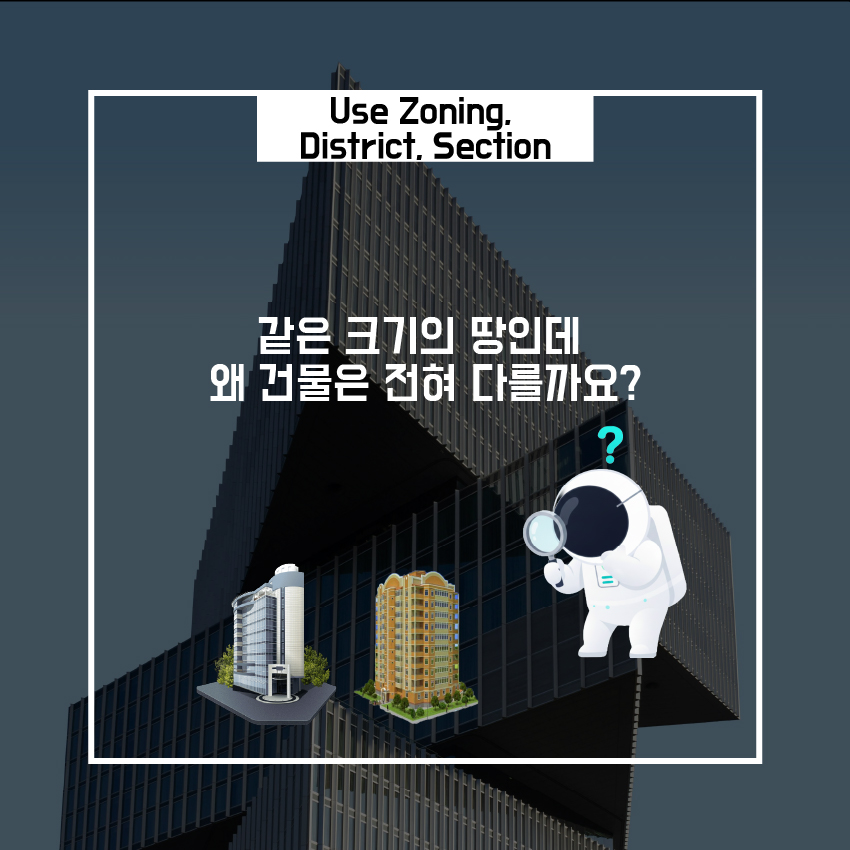

# 4. 용도지역,지구,구역, 왜 이렇게 복잡할까?

도시를 걷다 보면 **비슷한 크기의 땅인데도 전혀 다른 건물**이 들어서 있는 모습을 자주 보게 됩니다.

어떤 곳에는 아파트가, 어떤 곳에는 상가가, 또 어떤 곳에는 공장이 자리 잡고 있습니다.

이 차이는 우연이나 개인의 선택 때문이 아닙니다.

👉 **땅마다 미리 정해진 ‘사용 목적’이 다르기 때문**입니다.

도시는 무작위로 성장하지 않습니다.

만약 주거 공간, 상업 시설, 산업 시설이 아무 기준 없이 섞인다면 다음과 같은 문제가 발생합니다.

- 주거지 옆 공장으로 인한 **소음·안전 문제**
- 상업 시설 과밀로 인한 **교통 혼잡**
- 생활 환경의 **질적 저하**

이를 방지하기 위해 도시는

👉 **땅의 사용 목적을 미리 구분해 관리**합니다.

이 제도가 바로 **용도지역 제도의 출발점**입니다.

---

## 용도지역이란 무엇인가?

- **용도지역**은
    
    👉 “이 땅에는 어떤 성격의 건축물이 어울리는가?”를 정해 놓은 기준입니다.
    

대표적인 구분은 다음과 같습니다.

- **주거지역**
- **상업지역**
- **공업지역**

각 지역마다 **허용되는 건축물의 종류, 규모, 밀도**가 다르게 설정되어 있습니다.

---

## 지역별 차이는 어떻게 나타날까?

### 주거지역

- 주거 환경 보호가 우선
- 건물 높이, 용적률이 **상대적으로 엄격**
- 조용하고 안정적인 생활 공간 유지가 목적

### 상업지역

- 경제 활동 중심
- **높은 밀도의 건축 허용**
- 사람과 기능의 집중을 전제로 계획됨

👉 즉, **같은 면적의 땅이라도 용도지역에 따라 전혀 다른 건축이 가능**해집니다.

---

## 그렇다면 ‘지구’와 ‘구역’은 무엇일까?

여기에 **지구**와 **구역**이라는 개념이 추가됩니다.

이는 용도지역만으로는 관리가 부족할 때 적용되는

👉 **보다 세부적인 관리 장치**입니다.

### 지구·구역의 역할

- 역사적 경관 보호
- 개발 제한 또는 유도
- 특정 기능 강화 (상업, 관광, 보행 등)

즉,

- **용도지역** → 큰 틀의 성격 결정
- **지구·구역** → 세밀한 조건 추가

---

도시는 단순한 땅의 집합이 아니라

👉 **사람의 생활, 안전, 기억이 겹쳐진 공간**이기 때문입니다.

그래서 한 번에 규정하지 않고,

- 1차로 용도지역을 나누고
- 필요하면 지구·구역으로 다시 조정합니다.

---

## 정리하면

- 건축은
    
    **“이 땅에 무엇을 지을 수 있는가?”**라는 질문에서 시작합니다.
    
- 이 질문의 답은
    
    설계자의 의지나 건축주의 욕심이 아니라
    
    👉 **땅에 미리 부여된 용도**가 결정합니다.
    

**용도지역·지구·구역을 이해하는 순간**,

같은 땅에서 왜 전혀 다른 건물이 만들어지는지

자연스럽게 설명할 수 있게 됩니다.

---

