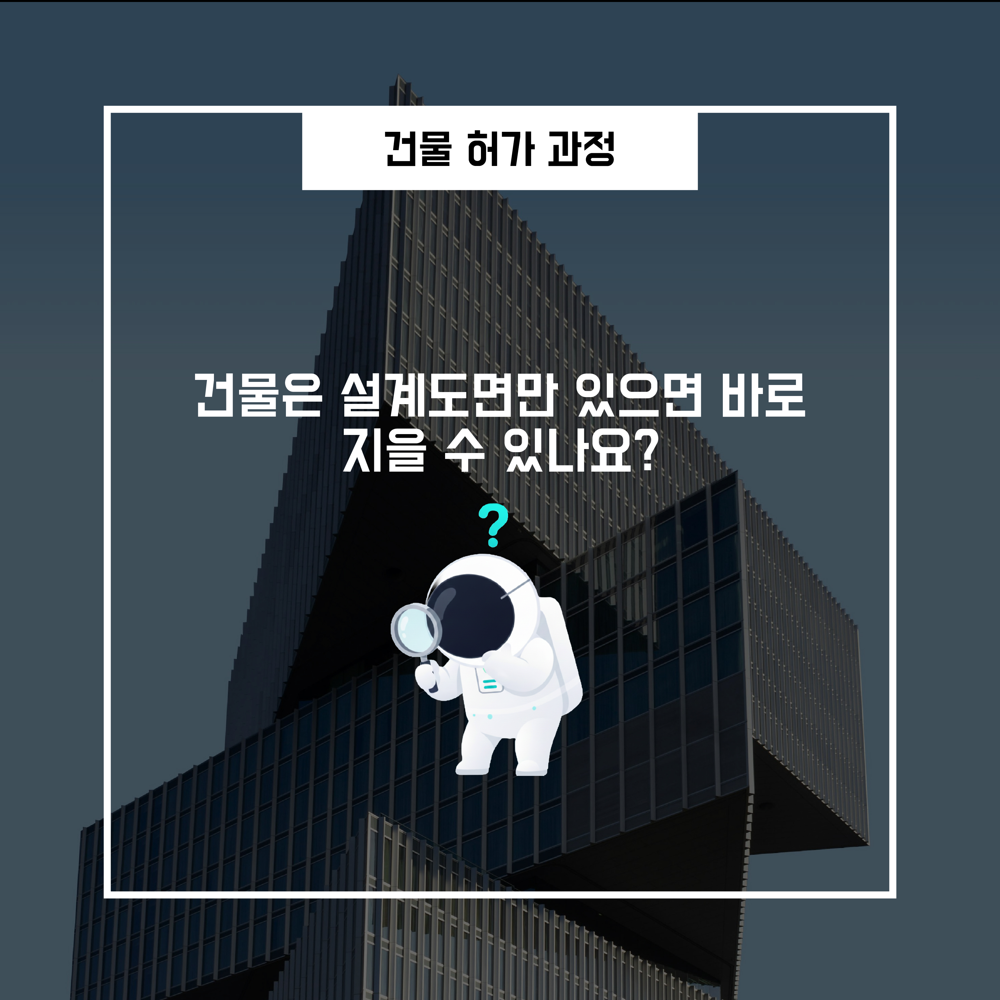
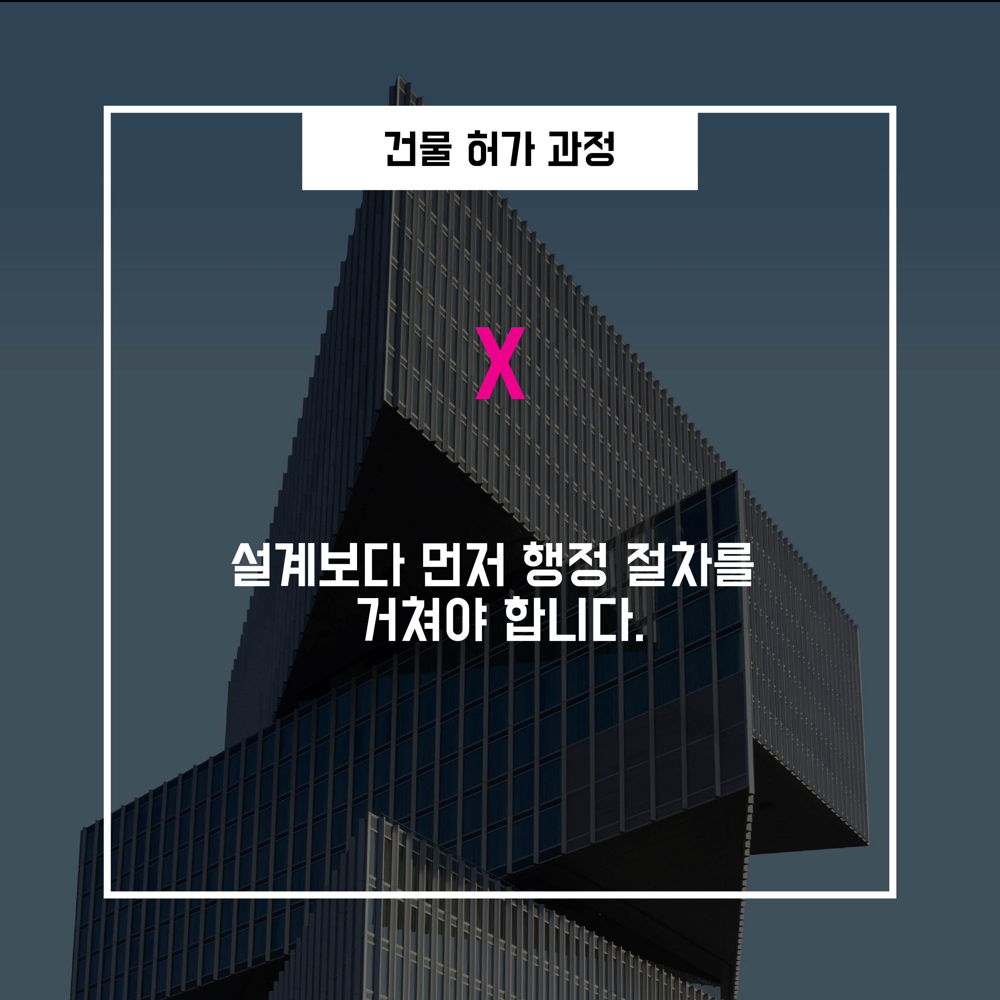
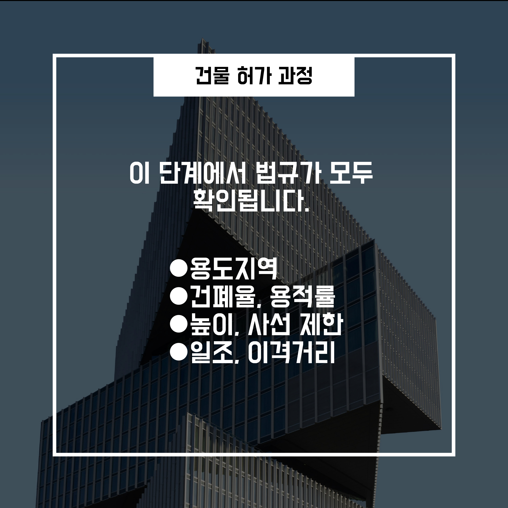
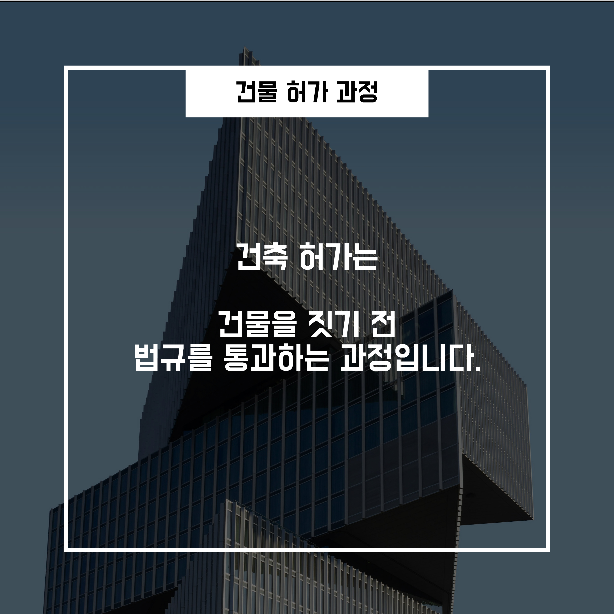

# 05.The building permit process actually goes like this

## 5-0왜 설계가 끝나도 바로 공사를 못 할까?

건축은 설계도면만 완성되면 곧바로 공사를 시작할 수 있을 것처럼 보입니다.

하지만 실제로는 **대부분의 건축 행위가 공사 전에 반드시 행정 절차를 거쳐야** 합니다.

이 과정을 통틀어 일반적으로

👉 **‘건축 허가 과정’**이라고 부릅니다.

---

## 5-1 건축 허가는 단순한 형식일까?

많은 사람들이 건축 허가를

**“서류 몇 장 내고 도장받는 절차”** 정도로 생각합니다.

하지만 허가는

👉 **건축 법규가 실제로 적용되고 검토되는 가장 중요한 단계**입니다.

앞서 살펴본 다음 기준들이

모두 이 단계에서 한 번에 확인됩니다.

- 용도지역·지구·구역
- 건폐율과 용적률
- 건물 높이와 층수
- 이격거리
- 일조·채광 기준

즉,

**설계가 법적으로 성립하는지 최종 검증하는 단계**입니다.

---

## 5-2 건축 허가 과정의 기본 흐름

건축 허가 과정은 대체로 다음과 같은 순서를 따릅니다.

1. **건축 계획 및 설계**
2. **관련 법규 충족 여부 검토**
3. **허가 또는 신고**
4. **공사 착수**
5. **공사 완료**
6. **사용승인**
7. **건물 사용 가능**

👉 이 흐름을 거치지 않으면

건물은 완성되더라도 **법적으로 사용할 수 없습니다.**

---

## 5-3 ‘허가’와 ‘신고’는 무엇이 다를까?

허가 과정에서 가장 자주 등장하는 개념이

👉 **‘허가’와 ‘신고’의 차이**입니다.

### 허가

- 행정기관이 **사전에 설계 내용을 심사**
- 법규 적합 여부를 검토한 뒤 **승인**
- 비교적 규모가 크거나 영향이 큰 건축물에 적용

### 신고

- 법에서 정한 기준을 **명확히 충족하는 경우**
- **서류 제출만으로 절차 진행**
- 상대적으로 단순한 건축에 적용

👉 **건물의 규모, 용도, 위치**에 따라

어떤 방식이 적용되는지가 달라집니다.

---

## 5-4 왜 허가 과정에서 설계가 자주 바뀔까?

허가 과정 중 설계 변경이 발생하는 경우는 매우 흔합니다.

이는 설계가 잘못되었기 때문이 아닙니다.

- 법규 검토 결과
- 주변 환경과의 관계
- 행정적 판단

등을 통해

👉 **조정이 필요하다는 판단이 내려지기 때문**입니다.

이 단계에서 문제를 수정하지 않으면,

- 공사 중단
- 허가 취소
- 사용승인 거부

와 같은 **더 큰 문제**로 이어질 수 있습니다.

---

## 5-5 정리하면

- 건축 허가는
    
    단순한 행정 절차가 아닙니다.
    
- **건물이 법적으로 지어질 수 있는지 확인하는 과정**입니다.
- 개인의 설계와 계획은
    
    이 과정을 통해 **도시와 사회의 규칙 안으로 들어옵니다.**
    

👉 그래서 건축 허가를 이해하는 것은

**건축 법규 전체를 이해하는 가장 중요한 출발점**이 됩니다.
