# About Architecture

Simply put, it refers to the process of planning, designing, and constructing a building or other structure and its outcome. However, architecture is not just referring to this physical construction process, but **comprehensive art** that contains people's convenience and safety, the culture and history of the time, etc.

Architecture is intertwined with many other issues such as culture, engineering, art, industry, technology, environment, economy, life, leisure, traditions, communities, laws and institutions, and publicity. To see the world wider and understand our lives, we need to get to know architecture.

Before we get into a full-scale story, I'd like to look at the terms that are basically used in architecture and the general flow of architecture to modern times.

---

# Design Process

The design work and construction process are performed in the following order.

1. **Pre-design / Programming**: Plan design tasks required by the owner in advance because they are necessary for building design orders such as size review, field survey, and design guidelines. 
2. **Schematic Design(SD)**: The plan is approved after reviewing the design concept and basic system of related fields.
3. **Design Development(DD)**: Various reviews are conducted to minimize the possibility of changes in the CD and to specify the contents of the SD. The plan is approved by the owner at this stage.
4. **Construction Documents(CD)**: Create plans (including specifications) with construction in mind.
5. **Construction**  
6. **Post-Occupancy Evaluation(POE)**: This is the stage of evaluating the complecated building after using it.

---

# Building Line

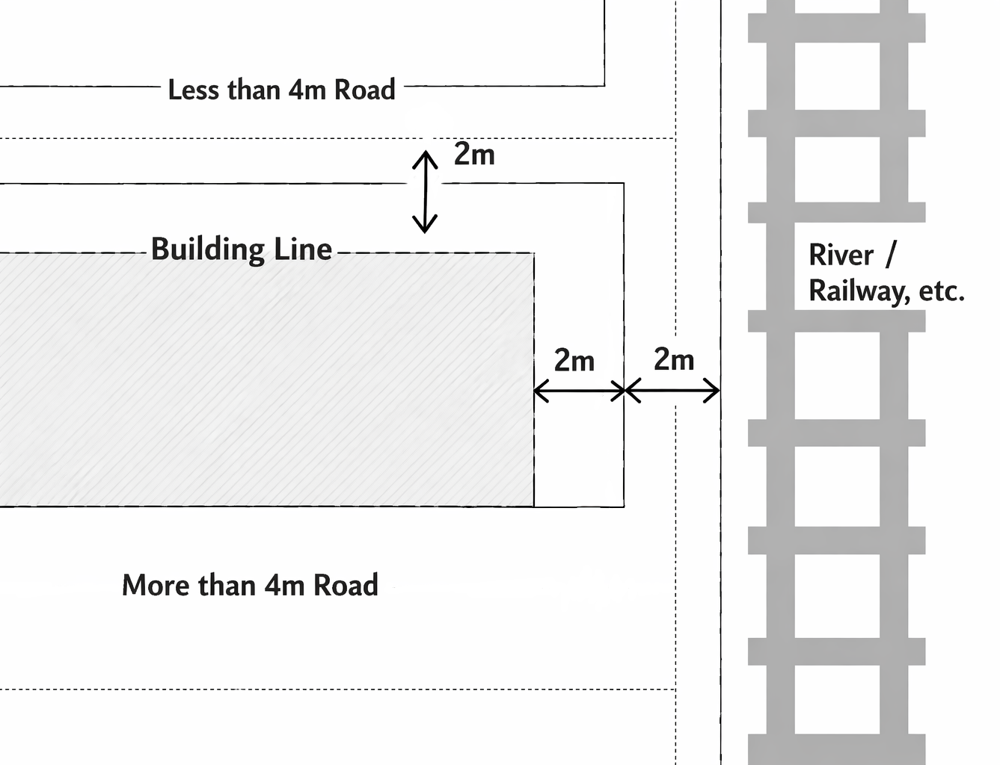

An building line refers to the road boundaries that can be built.
In the case of a wide road, the boundary line between the land and the road becomes the building line, but in the case of a narrow width of the road, the line with 1/2 of the required width (usually 4M) from the centerline of the road becomes the building line.

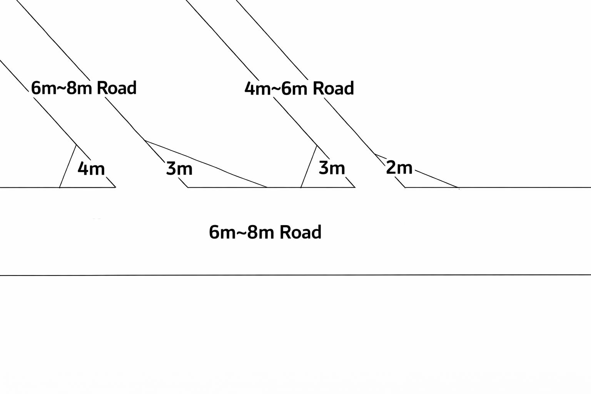

Land located at the corner of the road less than 8 m wide also designates building lines at the corner of the road.
In the corner, a certain distance is retreated to both sides according to the prescribed distance for each width of the road, and the line connecting the two points is designated as the building line.

---

# Area terminology

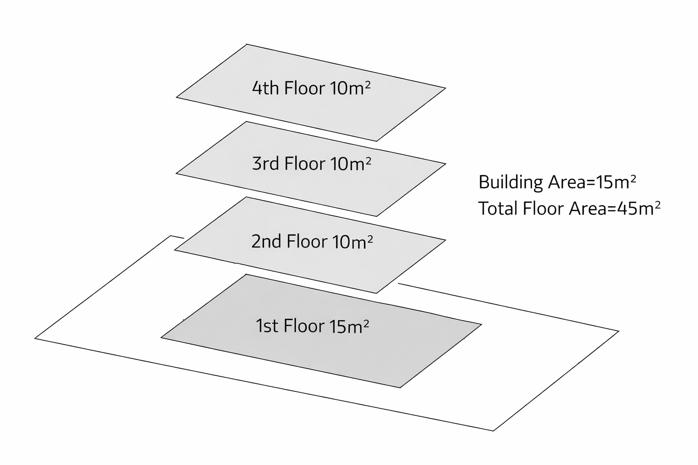

## Building area
Building area refers to the area that covers the floor when you look at a building built on the ground from above.

## Gross Floor Area (GFA)
The total floor area of the building on the site is GFA. Literally, it is calculated by combining all floor areas, and this floor area is a measure of real estate value when a building is purchased or built.
However, since the GFA is calculated with the shared part (steps or corridors) and part of the wall together, it is necessary to match the plans to calculate the more detailed area.

## Site Area
Site area refers to the site that can be built. Site area can be equal to or smaller than the site area because it only refers to the area indicated on the building register.

---

# Ratio terminology

## 건폐율

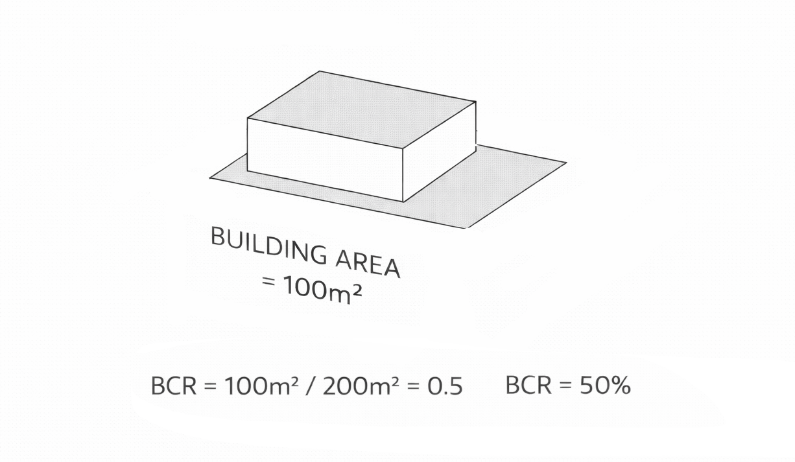

건축면적이 대지에 대해 차지하는 비율입니다.  
- (건축면적 / 대지면적 × 100)

건폐율은 지역에 따라 건축법규로 미리 정해져 있으며, 건물을 지을 때 전체 면적을 결정 짓는 매우 중요한 요소입니다. 같은 면적의 토지이더라도 건축 면적이 달라지는 이유가 바로 이 건폐율 때문입니다.

## 용적률

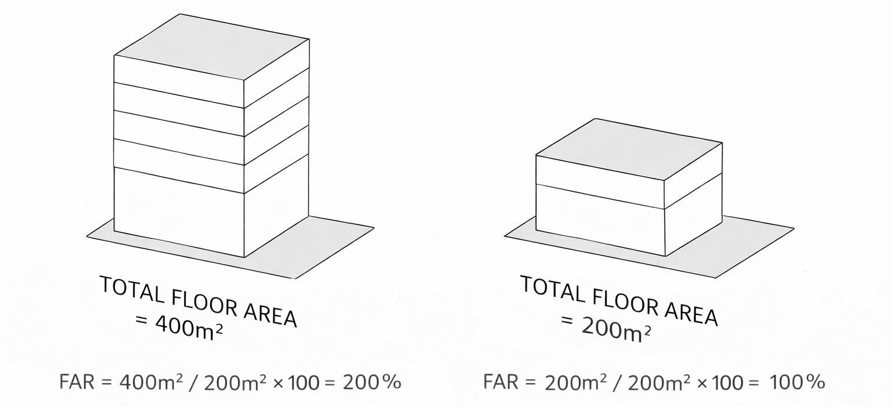

건축물이 들어선 대지의 면적에 대한 연면적의 비율입니다.  
- (연면적 / 대지면적 × 100)

대지에 들어선 건축물의 부피 개념으로 볼 수 있습니다. 도심지 같이 고층 건물이 들어선 곳은 용적률이 높은 곳이며, 임야나 농어촌 지역에서는 용적률이 낮습니다.

건폐율, 용적률 둘 다 지역의 용도에 따라 정해진 기준이 달라지며, 대지의 용도는 건축 법규로 정해져 있습니다. 건축법은 건폐율과 용적률의 상한선을 그 지역적인 특성을 고려하여 반영함으로 건축물의 과밀화를 제한하기도 하고 환경적인 배려를 꾀하기도 합니다.

---

# 구조 및 문서 용어

## 내력벽
건물의 지붕이나 위층의 하중을 지탱하여 아래층으로 전달하는 구조적으로 중요한 벽으로, 건물의 뼈대를 이루는 핵심 요소입니다. 보통 콘크리트나 블록으로 만들어지며, 기둥과 함께 건물의 안정성을 확보하는 역할을 하므로 임의로 철거해서는 안 되며, 건축법상 주요 구조부에 해당합니다.

## 설계도서
건축물의 건축 등에 관한 공사용 도면과 구조계산서 및 시방서 기타 관계서류 등을 말합니다.  
설계도면과 헷갈릴 수 있으나 **설계도서는 도면을 포괄하는 큰 개념**, **설계도면은 설계도서의 종류 중 하나**로 각각 다른 개념입니다.

## 공사시방서
설계도면에 구체적으로 표기할 수 없는 재료의 성능 및 재질 등에 관한 사항이 표기되어 있습니다.  
뿐만 아니라 시공 방법, 자재의 성능규격 및 공법, 품질시험 및 검사 등 품질관리, 안전관리, 환경관리 등에 대한 내용을 기술합니다.

## 설계도서 작성 우선순위
각 설계도서의 내용이나 법령해석, 감리자의 지시 등이 일치하지 않을 경우 보통 다음의 순서를 우선시해서 공사를 진행하게 됩니다.

1. 공사시방서  
2. 설계도면  
3. 전문시방서  
4. 표준시방서  
5. 산출내역서  
6. 승인된 상세시공도면  
7. 관계법령의 해석  
8. 감리자의 지시사항  

---

# 건축의 역사

건축은 선사 시대부터 인류가 삶의 공간을 만들고자 움집 등의 구조물에서부터 시작해 오랜 세대에 걸쳐 많은 변화를 보였습니다. 이런 시대들을 겪으며 건축은 그 사회의 기술과 문화, 사회 변화를 반영하며 함께 성장해왔습니다.

건축의 역사는 각 시대의 기술, 예술, 사회, 문화, 종교, 정치를 담고 있는 거울로, 인류 문명의 발달 과정을 이해하는 중요한 열쇠입니다.

건축에 대해 알기 위해서는 이러한 건축의 흐름을 간단하게 알아보며 무엇이, 어떻게, 왜 바뀌었는지에 대한 사전 지식이 필요합니다.

---

## 고대: 메소포타미아, 이집트

메소포타미아와 이집트는 세계 5대 고대 건축 문화로 꼽히는 지역들 중 일부입니다.  
메소포타미아는 흙을 사용한 중정(집 안 건물과 건물 사이에 위치한 외부 노출 공간) 중심의 건축이 주로, 신전 등의 종교 건축물이 발달했습니다.
반면 이집트는 분묘 건축으로, 흙과 석재를 사용한 간단한 구조로 거대한 건축물을 만들어냈습니다. 특히 피라미드처럼 아래쪽의 변이 크고 올라갈수록 좁아지는 경사 형식이 일반적인 형태로 꼽힙니다.

메소포타미아와 이집트의 가장 대표적인 건축은 지구라트와 피라미드입니다. 두 건축물은 여러 방면에서 큰 차이점을 가지고 있습니다.

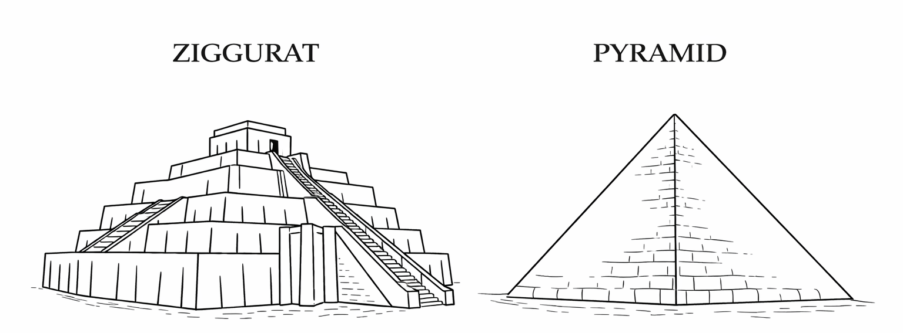

| 구분 | 지구라트 | 피라미드 |
| --- | --- | --- |
| 내부 | 밀적체 | 묘실 |
| 기능 | 관측소, 제단 | 분묘 |
| 방향 | 모서리가 동서남북 | 면이 동서남북 |
| 재료 | 흙 벽돌 | 돌 |

---

## 고전: 그리스

그리스 건축은 서양 건축의 근본이 되는 건축입니다. 이들은 완벽한 비례에 집착하며 조화와 균형, 이상적인 미의 추구에 힘썼습니다. 신전은 기둥과 보로 이루어진 가구식 구조 형태로, 개방적인 시민 생활의 일부로 설계되었습니다. 가장 대표적인 건축물로는 파르테논 신전을 들 수 있습니다.

그리스에서는 고전 건축의 핵심 구성원리인 주범(order, 현재의 기둥과 비슷한 개념) 양식이 사용되었습니다. 이 주범이 본질적으로 구조적인 역할을 담당했기 때문에 그리스에서는 아치의 사용이 굉장히 드물었음을 확인할 수 있습니다.

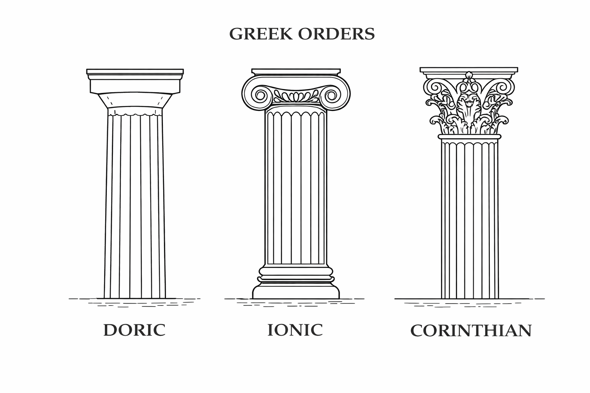

---

## 고전: 로마

로마 건축은 그리스 건축의 의장과, 아치를 사용하는 에트루리아 건축의 구조를 흡수한 것이 특징입니다. 건물은 규모가 크고 화려하며, 도시를 이루는 시설들이 다양해졌습니다. 또한 화산재, 석회와 자갈을 혼합해 콘크리트를 만들어 사용하기도 했습니다. 
로마의 대표적 건축물에는 판테온 신전이 있습니다.

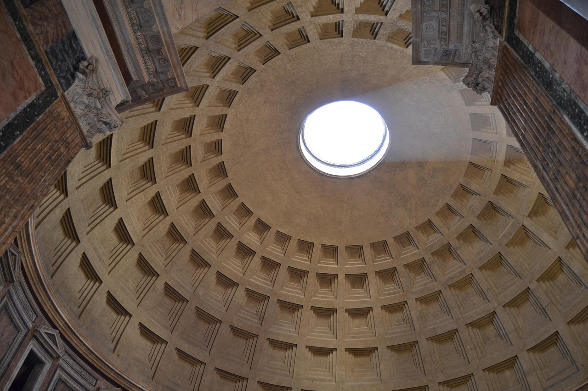

로마에서는 그리스의 3주범을 변화시키고 2주범을 추가하여 5주범을 사용했습니다. 또한 아치와 볼트가 실질적인 구조 요소로 작용하고 있어 주범은 장식적인 요소로 이용되었습니다.  

---

## 중세: 초기기독교

중세부터는 건축이 교회 중심으로 돌아가기 시작합니다. 
건축 활동은 로마 건축의 계속으로, 교회 건축은 왕성하였으나 일반 건축은 부진하였고 구조와 양식에 새 수법은 없었습니다.

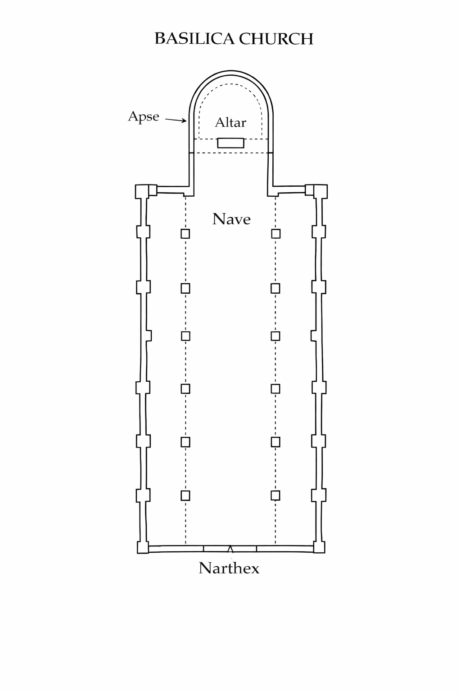

초기기독교의 대표적인 양식은 바실리카식 교회입니다. 이는 로마의 재판소였던 바실리카의 형식에 따라 건축된 교회당으로, 그리스도교의 이념에 따라 계속 발전되어 추후 고딕양식을 형성하는 기초가 되었습니다.  
구 성 베드로 성당, 성 로렌조 성당, 산타마리아 마지오레 성당 등이 대표적인 예시입니다.

---

## 중세: 비잔틴

비잔틴 건축은 그리스 문화를 흡수한 로마 건축을 바탕으로, 페르시아 건축과 동양적 요소가 가미되어 통합되었습니다. 대표적인 건축물로는 성 소피아 성당이 있습니다.

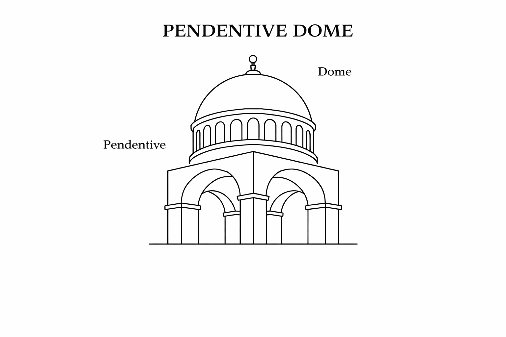

비잔틴에서는 펜던티브(4각 평면 위에 인접기둥과 반원아치 구성 후 생긴 아치 사이의 삼각 곡면)를 사용해 중앙에 돔을 축조하는 구조법을 발전시켰습니다.  
기둥은 구조적으로 아치를 지지하며, 이때 지지하는 받침으로 부주두(2중 주두 중 상부의 것, 아치를 지지하는 베이스 역할)를 사용했습니다.

---

## 중세: 로마네스크

로마네스크란 로마 건축기법에 게르만적 요소가 반영된 건축입니다. 고딕 양식이 정착하기 전 과도기적 모습을 보이고 있습니다.

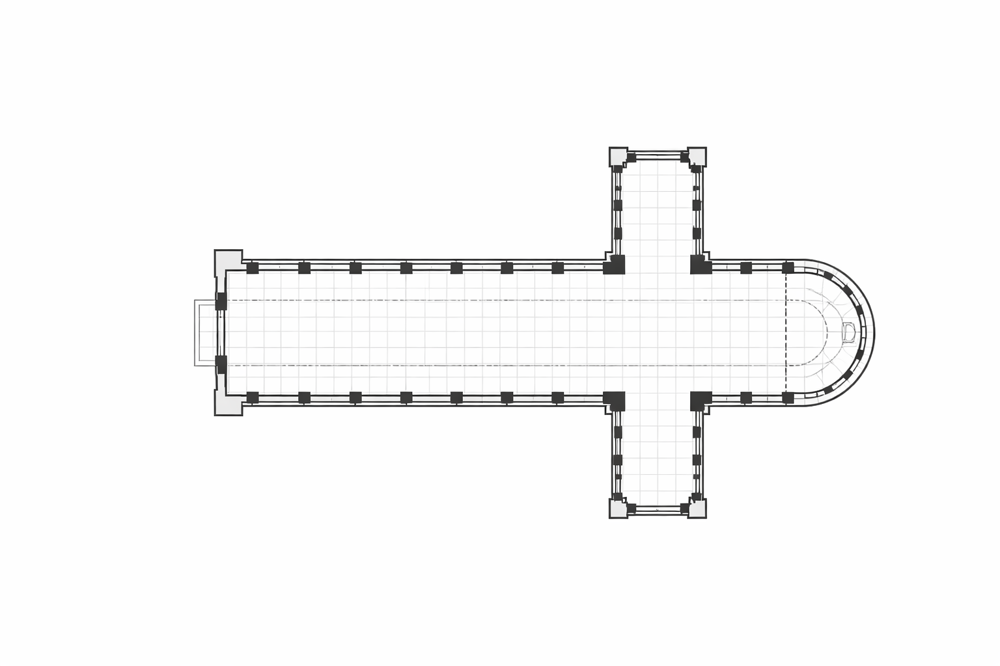

로마네스크에선 바실리카식 평면의 발전으로 라틴 크로스 평면이 나타났습니다. 구조는 반원 아치를, 그리고 아치의 발달로 교차 볼트를 사용했습니다. 성당 하면 가장 대표적으로 떠오르는 스테인드 글라스가 이 시대에 창안되었으며 벽화가 많이 사용되었습니다.

---

## 중세: 고딕

고딕 건축은 로마네스크 양식을 더욱 엄격히 다뤄 건축적 완벽성을 지향함으로서 종교적 신념과 사상을 건축에 옮겼습니다. 고딕은 구조가 합리적으로 구축되도록 발달된 석공 기술을 이용해 석재를 자유로이 사용했다는 장점이 있습니다. 우리나라의 명동 성당 역시 고딕 양식의 성당입니다.

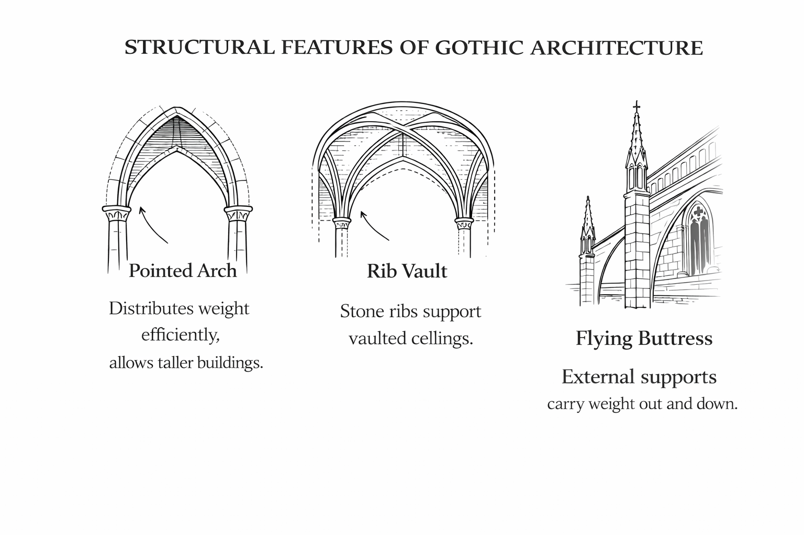

고딕 건축에서는 첨두아치와 리브볼트, 첨탑과 블라잉 버트레스가 특징입니다. 수직선을 의장의 주 요소로 하늘을 지향하는 종교적 신념과 그 사상을 합리적으로 반영했습니다. (수평적 분절 억제, 수직적 분절 강조) 이런 수직선이 고딕시대의 교회 건축과 일반 건축의 의장을 결정짓는 중요한 요소입니다. 또한 이런 건축적 특징으로 주벽의 개구부가 확장되면서 화려한 장미창이 사용되었습니다.

---

## 근세: 르네상스

르네상스는 플로렌스 성당 돔 증축에서 시작되었습니다. 르네상스의 의미는 ‘부활’로, 고대 그리스·로마의 고전 형식미를 다시 추구했습니다. 이들은 로마 양식을 기초로 하여 돔, 주범 등 고전적 요소를 창의적으로 자유롭게 구사한 새로운 양식을 형성했습니다. 게다가 비례, 조화의 개념과 법칙을 추구하며, 고딕과 달리 인간의 사회성과 세속적 성격을 강조하는 수평선을 강조합니다.

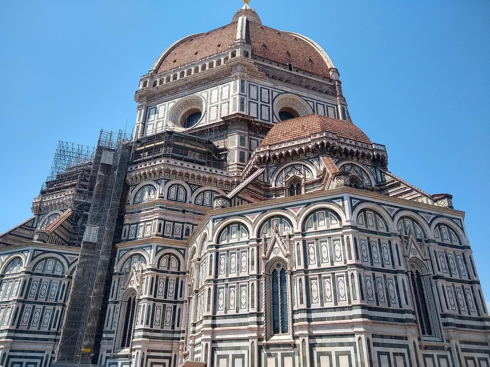

르네상스의 돔 구조법은 비잔틴 양식에서 이어진 것으로, 드럼을 높게 하여 창을 추어 채광 효과를 주는 것이 특징입니다. 외벽이 중층일 때는 매 층마다 돌림띠로 수평을 강조했고, 평면 계획과 외관 구성에 있어서 비례, 대칭성 등을 중시했습니다.

---

## 근세: 바로크

바로크는 변질 또는 기이란 뜻으로, 르네상스 양식이 쇠퇴하고 변화하며 나타난 양식입니다. 바로크는 종교, 권력 등 공공적 생활 위주의 건축으로, 규모가 장대하고 굉장히 장식적이며 감각적이라는 특징을 가지고 있습니다.

바로크는 회화, 조각, 공예 등이 건축과 결합하여 종합 예술적 효과를 도모했습니다. 이 때문에 곡선의 도입, 파동치는 벽, 타원 벽면의 선호, 현란한 장식요소 등이 사용되었고 공간과 매스, 움직임과 정지, 빛과 음영, 돌출과 후퇴, 큰 것과 작은 것 등의 대조성이 종합되었습니다. 또한 과장된 투시도적 효과가 나타났고 수평 수직적 요소 간 상호 영향이 있었습니다.

---

## 근세: 로코코

로코코란 조개껍질에서 볼 수 있는 곡면, 곡선을 노출시킨 것으로 프랑스 장식에서 유래됐습니다. 로코코는 개인이 차지하는 내부공간을 아담하고 아름답게 꾸민 실내공간 위주의 양식입니다. 구조적 특징 없이 장식적 측면이 발달했고, 개인의 프라이버시를 중요시한다는 특징이 있습니다.

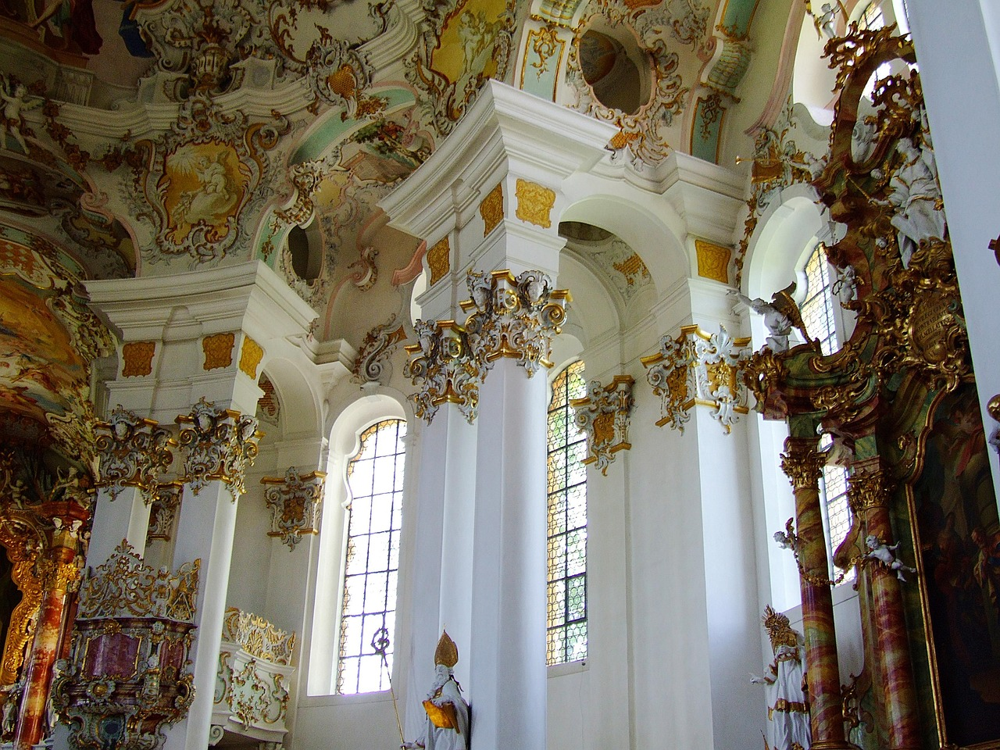

---

## 과도기: 신고전주의

18세기 전반 고전(그리스, 로마) 건축을 정확하게 재현하려는 움직임으로 생긴 건축양식입니다. 화려한 로코코에 대한 반발로 신고전주의에서는 장식이 최소화되고, 기둥이 높아졌다는 특징이 있습니다.

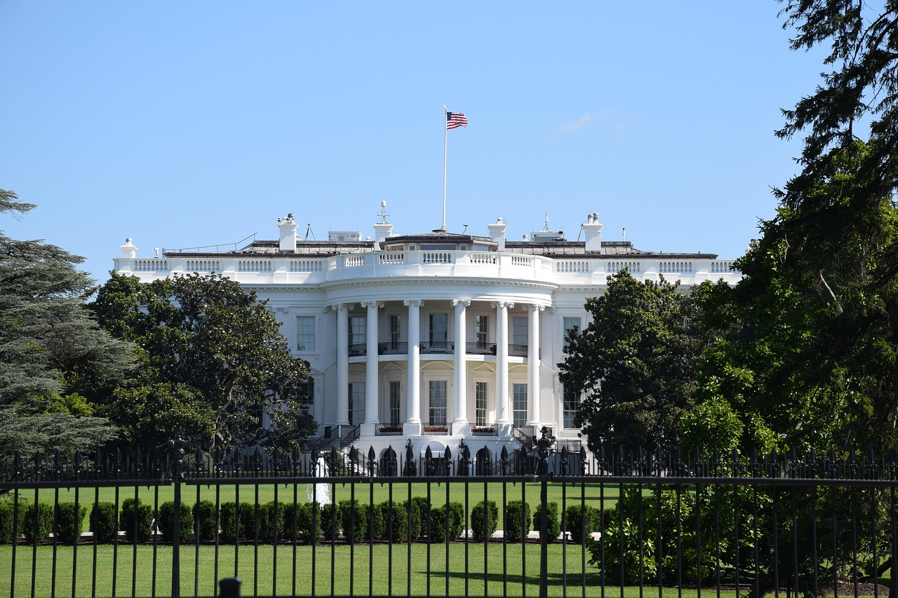

---

## 과도기: 낭만주의

낭만주의는 신고전주의에 반발해 영국에서 출발한 건축 양식입니다. 향토주의, 평민주의, 중세주의를 내포하고 있으며, 고딕 양식에 의해 새로운 시대의 과제를 해결하고자 하는 건축 양식입니다.

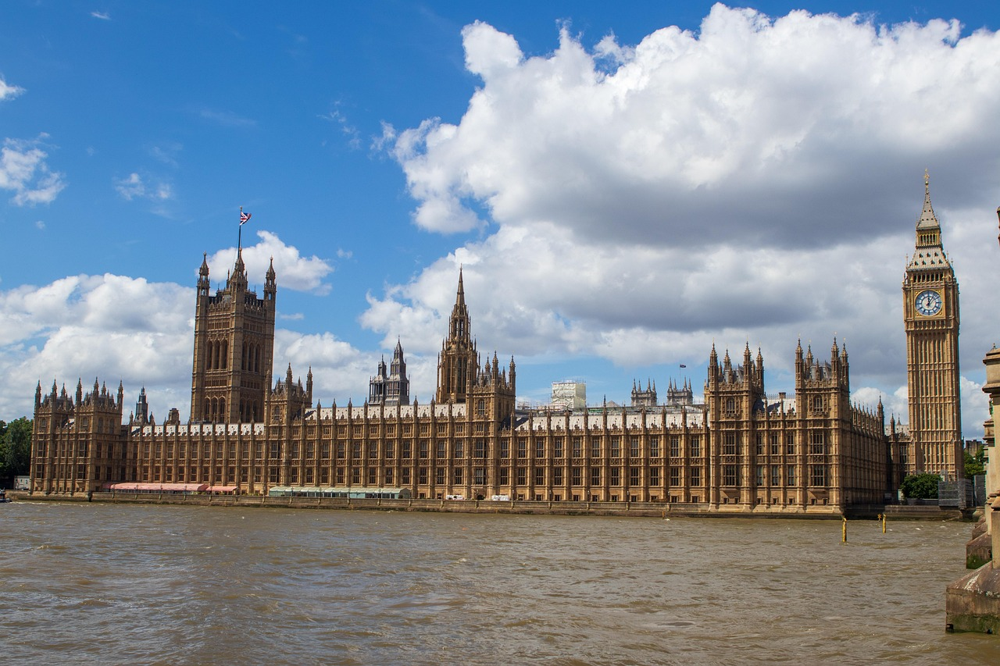

---

## 과도기: 절충주의

신고전주의와 낭만주의를 절충한 방식이라 절충주의라고 불립니다. 이들은 일정한 양식에 매이지 않고 자유롭게 예술가의 창조성을 우선시했습니다. 이러한 절충주의에서는 르네상스, 바로크, 로코코 등 자유로운 양식 선택으로 여러 종류의 건축 양식이 발생하였습니다.

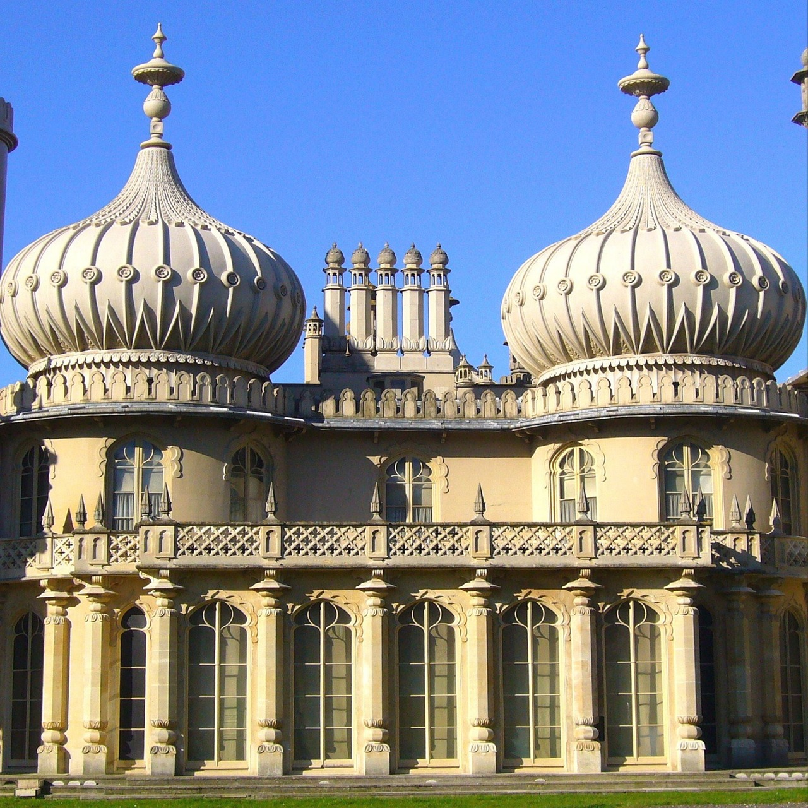

---

# 근현대: 건축운동

19세기 말에서 20세기 초에는 산업혁명과 시민사회 발전에 따라 전통적 형식주의를 비판하고, 기술(철근 콘크리트 등), 기능주의, 합리성을 중시한 건축 사조가 보이며 많은 건축운동이 일어났습니다. 다음은 그 중 대표적인 건축운동 몇 가지입니다.

1. **수공예 운동**: 기계 생산을 거부하고 수공업으로의 복귀를 주장한 운동입니다. 간결한 형태와 꾸밈 없는 선형의 사용으로 모더니즘의 전조를 보였습니다. 수공예 운동의 창시자인 윌리엄 모리스의 레드하우스가 가장 대표적인 수공예 운동 건축물의 예시입니다.  
2. **아르누보**: 19세기 말에 등장한 아르누보는 ‘새로운 예술’이라는 뜻을 가진 건축 양식입니다. 가장 큰 특징은 자연에서 영감을 받은 유기적 곡선의 사용입니다. 아르누보 건축가들은 철과 유리 같은 새로운 재료를 적극적으로 활용해 기존의 딱딱하고 직선적인 건축에서 벗어나 부드럽고 유연한 형태를 만들어냈습니다. 가우디의 카사 밀라가 대표적인 건축물입니다.  
3. **시카고파**: 기존의 석조와 목조건축들이 불타버린 1871년 시카고 대화재 후 도시재건을 보다 신속하게 건설하기 위해 철골, 고층빌딩, 엘리베이터를 이용한 오피스사무소의 전형적인 건축형식을 완성하였습니다. 프랭크 로이드 라이트의 구겐하임 미술관이 시카고파 건축물의 대표적인 예시입니다.  
4. **바우하우스**: 1919년 월터 그로피우스가 바이마르에 만든 미술학교와 공예학교를 합병하여 국립 바우하우스라고 명명, 근대건축 확산에 이바지하였습니다.  
5. **CIAM**: 현대건축운동의 핵심적인 추진단체로 각국 건축가의 자유롭고 활발한 교류를 자극하여 국제적인 성격이 강한 기능주의, 합리주의 건축을 보급했으나 제 10차 회의가 끝날 무렵 급진론자에 의해 해체되었습니다.  

---

# 현대

현대의 건축에는 여러 가지 경향이 나타나고 있습니다. 여기에서는 그 중 주요하게 나타나는 몇 가지 경향만 소개합니다.

1. **모더니즘 건축**: ‘형태는 기능을 따른다’는 원칙을 가지고 있습니다. 건물의 모양은 그 건물의 용도에 맞게 설계되어야 한다는 뜻으로, 모더니즘 건축가들은 불필요한 장식을 모두 제거하고 단순하고 기하학적인 형태를 추구했습니다. 특히 철근 콘크리트와 유리를 적극적으로 사용해 더 높고, 더 넓은 공간을 만들 수 있게 되었습니다. 한국의 63빌딩이나 코엑스몰도 모더니즘의 영향을 받은 건축물입니다.  
2. **포스트모더니즘 건축**: 포스트모더니즘은 모더니즘에 대한 반발로 등장했습니다. 이 양식의 특징은 역사적 요소와 현대적 요소를 절충한다는 점입니다.  
3. **레이트모더니즘 건축**: 포스트모더니즘과 반대로 근대적인 건축개념은 종료되지 아니하고, 계속 이어지고 발전된다는 개념입니다.  
4. **지역주의**: 지역별로 변화하는 지역의 특정한 풍토, 기후, 기술, 문화, 자원 등에 대응하려 그 지역환경에 적합한 건축을 지향하는 건축사조입니다.  
5. **하이테크 건축**: 하이테크 건축은 첨단 기술과 공학적 요소를 드러냅니다. 주로 금속과 유리를 사용하며, 건물의 구조와 설비 시스템을 그대로 노출시킵니다.  
6. **해체주의**: 포스트모던 건축의 한 흐름으로, 기존 건축의 조화, 대칭, 균형, 기능성 등 전통적 질서를 거부하고 의도적으로 파편화, 비정형, 비대칭적인 형태를 통해 긴장감과 역동성을 표현하는 양식입니다.  

---

# 현대: 친환경 건축

최근에는 환경 문제가 중요한 이슈로 떠오르면서 친환경 건축이 주목받고 있습니다. 이 사조는 에너지 효율성과 지속 가능성을 가장 중요하게 여깁니다.

친환경 건축에서 보이는 경향은 다음과 같습니다.

- 자연 채광과 자연 환기 시스템 활용  
- 재생 가능한 재료 사용  
- 옥상 정원이나 벽면 녹화 등 녹색 공간 조성  
- 태양광 패널, 지열 시스템 등 신재생 에너지 활용  

이런 친환경 건축이 주로 떠오르며 점차 녹색 건축 인증제도도 만들어지는 추세입니다.

- **LEED**: US GBC 주도하에 개발된 신축 및 기존 빌딩의 등급평가입니다.  
- **G-SEED**: 한국의 녹색건축 인증등급으로, 국토교통부장관과 환경부잔관이 공동으로 정하여 고시하는 인증기준에 따라 4등급으로 구분합니다.  

---

# 참고 자료 출처

- 김형돈, 2026 킴아카 건축계획(학), 킴아카출판사
- Winand W. Klassen(심우갑, 조우철 옮김), 서양건축사, 대우출판사
- ISOVER 건축용어사전, https://www.isover.co.kr/geonchugyongeosajeon
- 마루건축, 서양건축, https://mahru.co.kr/index.php?mid=Archi&category=26858
- 건축의 역사: 서양건축(고대, 중세, 현대), https://hoibin.tistory.com/entry/%EA%B1%B4%EC%B6%95%EC%9D%98-%EC%97%AD%EC%82%AC-%EC%84%9C%EC%96%91%EA%B1%B4%EC%B6%95-%EA%B3%A0%EB%8C%80%EC%A4%91%EC%84%B8%ED%98%84%EB%8C%80
