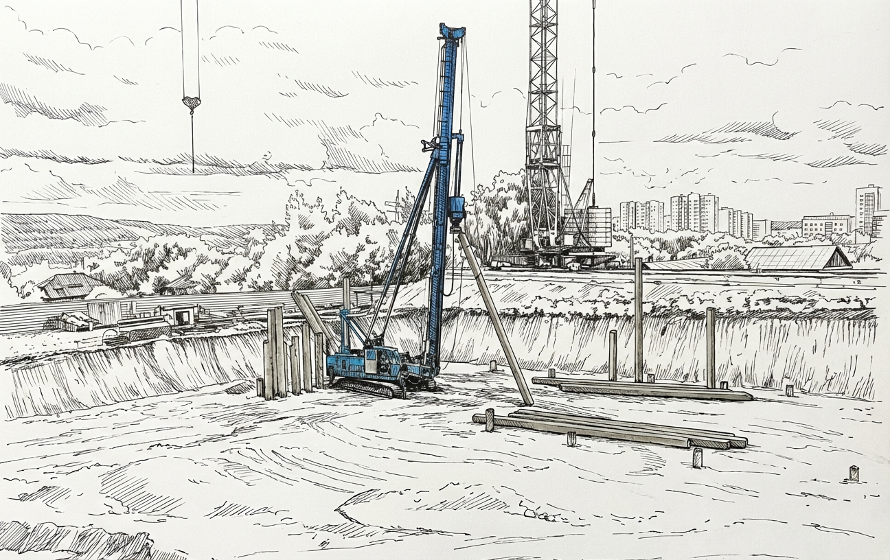
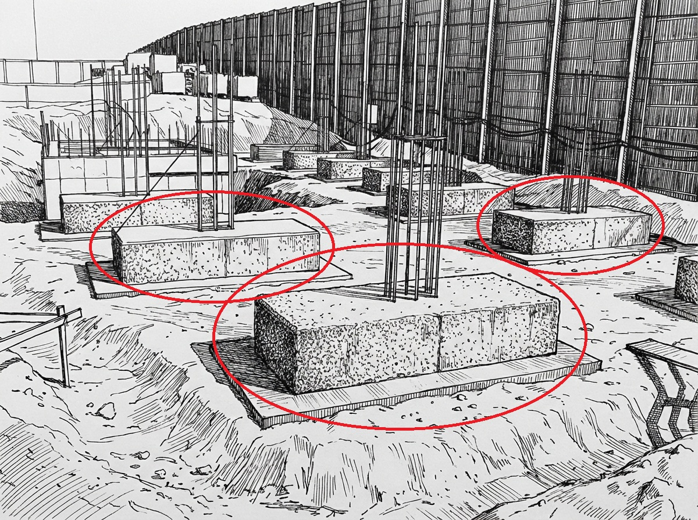
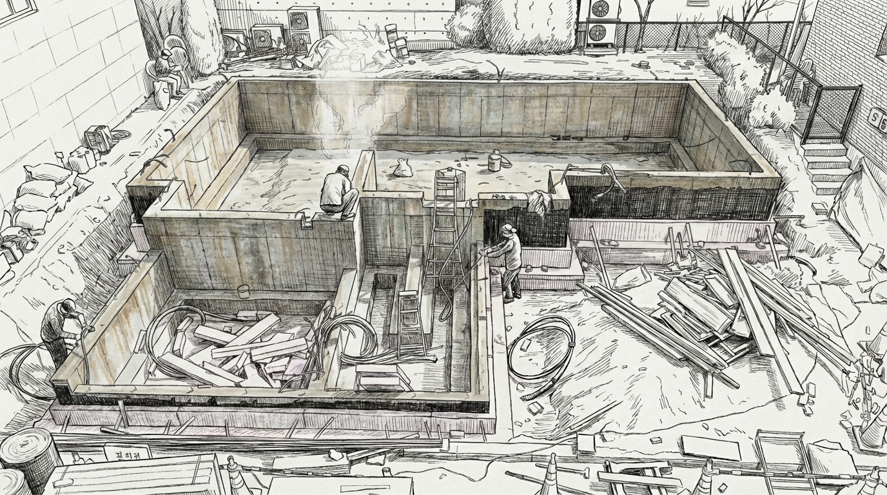
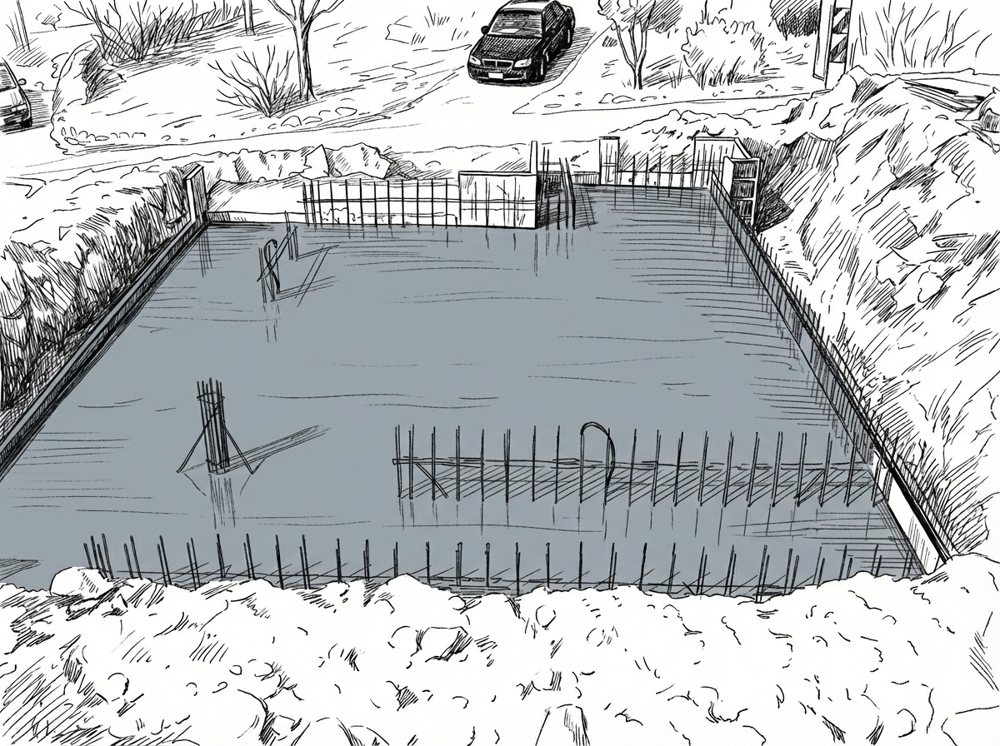
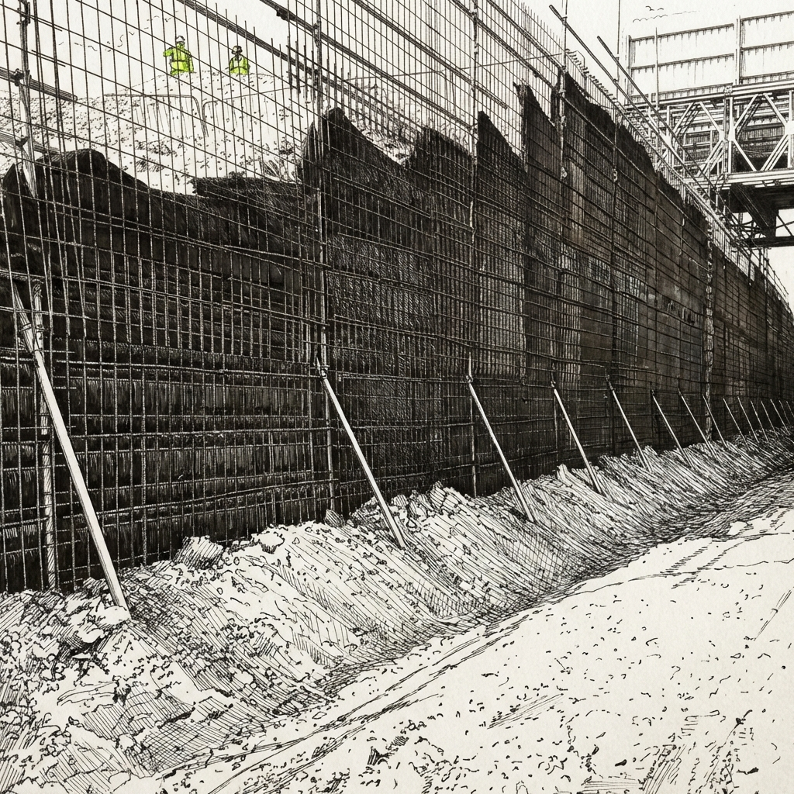

# 🏗 What Is Foundation Work?

Foundation work is not about placing a building **on top of the ground**, but rather **'anchoring' it to the ground**.

No matter how sturdy a building may look,

if the ground is weak, it can tilt, crack, or in severe cases, even collapse.

That is why structural design always begins with this question:

> "Can this ground support this building?"
>

The answer to this question is **foundation work**.

---

# 1️⃣ Types of Foundations

## ① Pile Foundation

### ✔ Concept

When the surface ground is weak, **long piles are driven down to a solid bearing layer to transfer the load**.

The building's weight is transferred not to the surface ground,

but to a deep, solid layer underground (the bearing stratum).

### ✔ When Is It Used?

- Soft ground conditions
- High-rise buildings
- Large-scale structures

### ✔ Characteristics

- Longer construction period and higher cost
- Highly dependent on geotechnical survey results
- May generate noise and vibration

> Simply put, the concept is: "We don't trust the shallow soil, so we drive down to the deep ground."
>

---

## ② Spread Footing (Independent Footing)

### ✔ Concept

A **wide concrete pad is installed individually under each column**.

Each footing supports a single column.

### ✔ When Is It Used?

- Low-rise buildings
- Relatively good ground conditions
- Small-scale structures

### ✔ Characteristics

- Relatively simple construction
- Economical
- More advantageous when column spacing is wider

---

## ③ Strip Footing

### ✔ Concept

A **continuous strip-shaped footing that runs along beneath walls**.

It is mainly used in **wall-bearing structures**.

### ✔ When Is It Used?

- Low-rise houses
- Structures where walls bear the load

### ✔ Characteristics

- Distributes loads continuously
- Better structural integrity than spread footings

---

## ④ Mat Foundation (Raft Foundation)

### ✔ Concept

The entire bottom of the building is **covered with one large concrete slab**.

The entire building sits on top of one large slab.

### ✔ When Is It Used?

- Weak ground conditions
- Heavy-load buildings
- Buildings with basement levels

### ✔ Characteristics

- Distributes settlement evenly
- Requires heavy equipment
- Very large volume of concrete

---

# 📌 Summary at a Glance

| Type | Usage Conditions | Advantages | Disadvantages |
| --- | --- | --- | --- |
| Pile Foundation | Soft ground, high-rise | Utilizes deep bearing layer | High cost, long duration |
| Spread Footing | Low-rise, good ground | Economical | Concentrated load |
| Strip Footing | Wall-bearing structures | Continuous support | Not suitable for large buildings |
| Mat Foundation | Weak ground, large buildings | Even settlement distribution | Large concrete volume |

---

# 2️⃣ Why Does Excavation Take So Long?

On the surface, it seems simple.

> "Can't you just dig with an excavator?"
>

But reality is completely different.

---

## ① Geotechnical Survey Verification

Before building, a **geotechnical survey (Boring Test)** must be conducted.

Soil type, groundwater level, and bedrock depth must be verified.

Based on this data:

- Excavation depth is determined
- Earth retaining wall is designed
- Drainage plan is established

In other words, it's not just random digging—

it is a **precisely planned excavation to a designated depth**.

---

## ② Earth Retaining Work

If there are basement levels,

**the surrounding soil must be held in place to prevent collapse while excavating.**

This work takes a significant amount of time.

- Earth retaining wall installation
- Strut installation
    
    To prevent the wall from collapsing inward,
    
    **the supporting structure installed from the inside is called a strut**.
    
- Staged excavation

You cannot dig everything at once—

the work proceeds in a cycle of **dig a little → reinforce → dig again**.

---

## ③ Groundwater Management

If groundwater is encountered, construction is halted.

- Drainage pump installation
    
    The most basic method is **pumping out the water**.
    
    - Install a sump pit (water collection point) at the excavation floor
    - Continuously drain using a submersible pump
    - Discharge through an external drainage pipe
    
    However, this method is only effective when "water seeps in gradually."
    
    If the groundwater level itself is high, pumping alone has its limitations.
    
- Well Point Method
    
    This literally means **creating multiple small wells**.
    
    Thin pipes (Well Points) are densely driven around the planned excavation area,
    
    and **groundwater is pumped out through these pipes to lower the water table**.
    
- Water Barrier Construction
    
    At some sites, simple drainage alone cannot solve the problem.
    
    Especially near rivers, coastlines, or areas with heavy groundwater inflow,
    
    water keeps flowing in.
    
    In such cases, **watertight walls are constructed to block infiltration**.
    

Sites with significant groundwater

inevitably experience much slower excavation progress.

---

## ④ Safety Management

Excavation is **one of the most accident-prone processes**.

- Collapse risk
- Impact on adjacent buildings
- Road subsidence
- Interference with gas lines and water/sewer pipes

Therefore, at every stage:

- Instrumentation
- Displacement measurement
- Safety inspections

are repeated.

This is the real reason it takes so long.

I experienced this during my field training as well. It is very common for construction schedules to be delayed by a day due to unannounced safety inspections.

---

# Summary

Foundation work is not simply a stage of pouring concrete.

✔ Structural decisions to safely transfer building loads to the ground

✔ Engineering judgment to interpret ground conditions

✔ Safety processes to prevent collapse during excavation

✔ An urban activity that considers the surrounding environment
