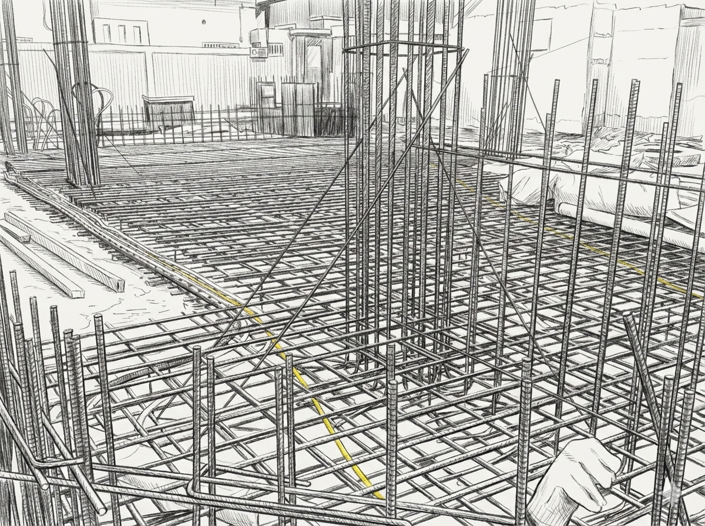
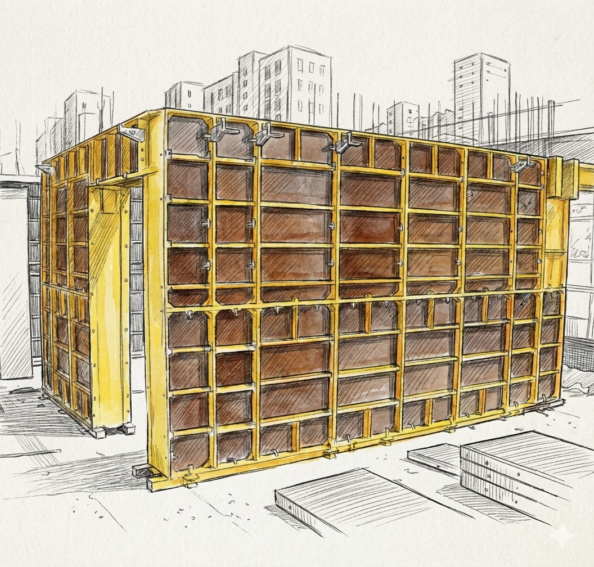
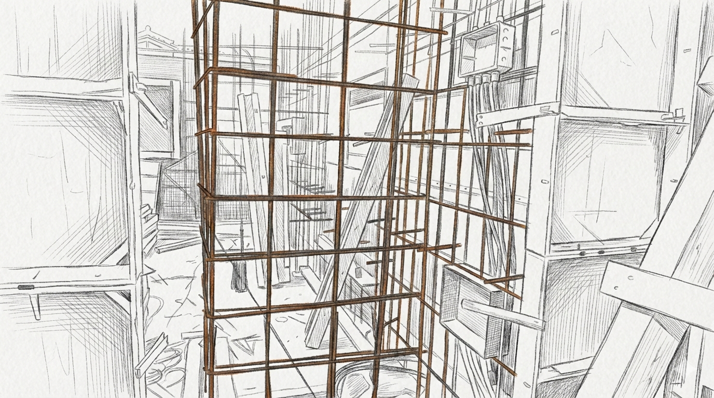
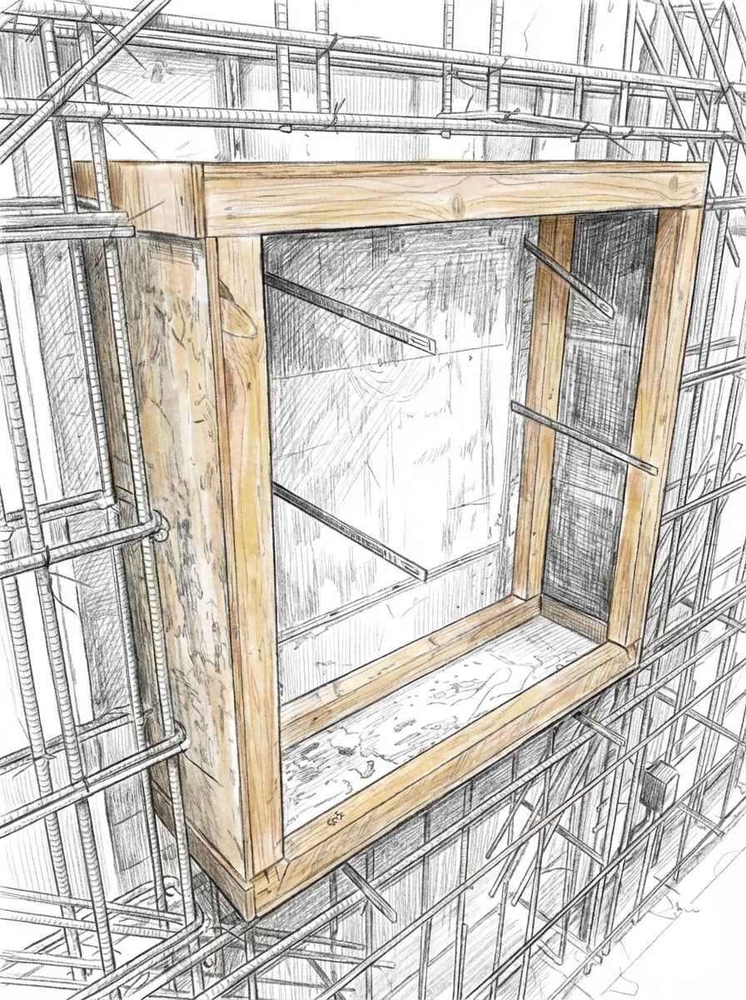

# 🧱 What Is Structural Framework Construction?

Structural framework construction is the work of **building the skeleton of a building**.

It is the process of creating structural elements such as columns, walls, floors, and stairs using rebar and concrete.  
This is the most critical stage for a building to stand safely, and it accounts for approximately 30–40% of the total construction period.

The basic process is as follows:

1. Surveying and layout marking  
2. Rebar placement  
3. Formwork fabrication  
4. Concrete placement  
5. Formwork removal  

This process is repeated each time a new floor is added to the building.  
In other words, structural framework construction is the process of physically shaping the building.

---

# 1️⃣ Foundation Floor Work

A building cannot be built directly on bare ground.  
The **ground must be prepared** first.

> For detailed explanations on foundation work,  
> please refer to the `202_What is foundation work.eng` file.

---

## 1-1. Lean Concrete Placement

Before creating the foundation structure,  
a thin layer of concrete is poured first.

This is called **lean concrete placement** on site.

It serves two purposes:

- To level the ground surface  
- To enable accurate position marking (layout lines)  

This allows much more precise construction than working on bare soil.

---

## 1-2. Layout Marking

Once the lean concrete hardens,  
the building's exact layout is marked on its surface.

Using chalk lines or snap lines,  
the positions of columns, walls, and beams are marked.

If these lines are off,  
the entire building will be off.

This is the starting point and the most important step of structural framework construction.

---

## 1-3. Rebar Placement

Rebar is arranged along the layout lines.

It is typically placed in a grid pattern,  
and the spacing is precisely determined according to the design drawings.

- Generally spaced about 10 cm apart  
- Seismically designed buildings have tighter spacing  

Rebar is secured using tie wire.

Additionally, a consistent gap must be maintained between the rebar and the formwork.  
The accessory material used for this is the **spacer**.

> A spacer is a material used to maintain a consistent gap (concrete cover) between the rebar and the formwork.

### 📌 What Is Concrete Cover?

Concrete cover refers to the thickness of the concrete that surrounds the rebar.  
If this thickness is insufficient, the rebar can be exposed to air and moisture, leading to corrosion.

In other words, spacers are a critical accessory that helps preserve the rebar's lifespan.

---

## 1-4. Foundation Formwork Fabrication

The mold into which concrete will be poured is fabricated.  
This is called **formwork**.

Since foundations have low height, they are relatively simple to fabricate.  
However, formwork must withstand significant pressure until the concrete hardens,  
so it must be assembled accurately and firmly.

---

## 1-5. Concrete Placement

Once the rebar and formwork are ready, concrete is poured.

The key step here is **compaction**.

If air remains inside the concrete, it weakens the strength,  
so a vibrator is used to remove internal air bubbles.

### 📌 Why Is Curing Important?

Concrete gains strength over time.  
It is typically designed to reach its design strength at 28 days.

Management during the initial 3–7 days is especially critical,  
and the process of keeping the concrete from drying out during this period is called **curing**.

If curing is not done properly,  
the concrete may fail to reach its design strength.

---

## 1-6. Formwork Removal

Once the concrete has achieved sufficient strength,  
the formwork is removed.

Reusable materials are organized,  
and preparation for the next floor begins.

---

# 2️⃣ Wall and Column Construction

Once the foundation is complete,  
the structure is built upward.

---

## 2-1. Layout Marking Again

The positions of walls and columns are marked again on the foundation.  
The vertical alignment must be accurate to prevent the building from tilting.

---

## 2-2. Erecting Rebar

This time, rebar is placed vertically.

This is because columns and walls are vertical structures.  
Rebar is placed more densely in areas where loads are concentrated.

---

## 2-3. Wall Formwork Fabrication

Since concrete is placed vertically for walls,  
the weight of the concrete from above concentrates at the bottom.

This creates significant **lateral pressure (sideways pushing force)**.

Therefore, wall formwork must be secured very firmly.

- Ties (fixing rods)  
- Braces (supports)  
- Walers  

are used to reinforce the formwork and prevent it from spreading or tilting.

Checking vertical alignment is also very important.

---

## 2-4. Openings (Windows, Doors)

Spaces must be reserved in advance  
where windows or doors will be installed.

Separate forms are created  
to prevent concrete from filling those areas.

Since concrete pressure is strong,  
the forms must be sufficiently sturdy.

---

## 2-5. Wall Concrete Placement

Concrete is poured into the walls.

It should not be concentrated in one spot—  
it must be poured evenly across multiple sections.

Air bubble removal is also performed in the same manner.

After placement, a sufficient curing period must be observed  
to achieve the design strength.

---

## 2-6. Formwork Removal

Once curing is complete, the formwork is removed.

Working at height near slab edges  
carries a fall risk, so extra caution is required.

---

# 3️⃣ Second Floor Slab Construction

A slab is the floor structure between stories.

## Basic Process

1. Shoring (support) installation  
2. Temporary beam installation  
3. Plywood laying  
4. Rebar placement  
5. Piping and electrical conduit embedding  
6. Concrete placement  

Since slabs require a very large and heavy volume of concrete,  
the supports are extremely important.

These are called **shores**.

### 📌 Why Is MEP Embedding Important?

Before slab placement, electrical and mechanical piping must be embedded in advance.  
Since modifications are nearly impossible after the concrete is poured,  
collaboration and review at this stage are critically important.

---

# 4️⃣ Staircase Construction

Staircases are also reinforced concrete structures.

Rebar is placed along the inclined surface,  
and stair-shaped formwork is fabricated.

The standard dimensions are as follows:

- Riser height: 160–180 mm  
- Tread depth: 270 mm or more  

These dimensions are based on ergonomic standards for comfortable ascent and descent,  
and building codes also enforce these requirements for safety.

---

# 📌 Key Summary of Structural Framework Construction

✔ Progresses in order: Foundation → Walls → Floors → Stairs  
✔ Repeated for each floor added  
✔ Rebar provides tensile reinforcement  
✔ Formwork maintains concrete shape  
✔ Curing after placement determines quality  
✔ **Structural framework quality determines finishing quality and building lifespan**
