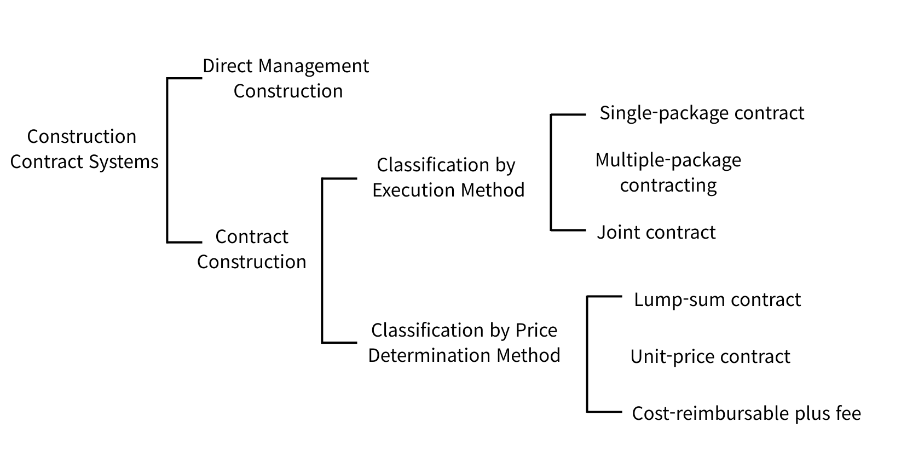

# What Is Building Construction?

Building construction refers to all activities involved in turning a building into reality—within an appropriate cost (construction cost) and an appropriate timeframe (construction duration)—while satisfying the three core requirements a building must meet: function, structure, and aesthetics. Understanding the fundamentals of construction helps even non-specialists better grasp common issues that arise during a project—such as cost increases (change/additional work), schedule delays (time extensions), quality/safety issues, and confusion over scope of responsibility—and make more rational decisions.

In particular, knowing the basics of construction is helpful in the following ways:

- Budget and schedule: Helps you understand structurally why costs increase and why schedules slip.
- Quality and responsibility: Clarifies the differences among the roles of design, construction, and supervision, reducing unnecessary disputes.
- Choosing contract types: Helps you anticipate risks depending on contract types (direct management vs. subcontracted work; lump-sum vs. unit-price, etc.).
- Communication efficiency: Enables clear communication in the same language among the owner, designer, contractor, and supervisor.

---

# Project Stakeholders in Building Construction

Construction projects involve multiple parties working together. Because each role is different, the first step in understanding a project is knowing who is responsible for what.

## Owner (Client)

The owner is the person (or organization) that initiates the project. The owner commissions the work, sets the budget, goals, and requirements, and enters into contracts. In a direct-management approach, the owner may also act as the central operator of the project.

## Designer (Architect / Design Office)

The designer prepares the design documents (drawings, specifications, descriptions, etc.) based on the owner’s requirements, and provides explanations and advisory support on design intent. Put simply, the designer documents what to build and how it should be built. During construction, the designer also helps interpret design intent and coordinate necessary adjustments.

## Supervisor (Construction Supervision / Inspector)

The supervisor’s role is to verify that construction is being executed correctly according to the design. They inspect and oversee whether the completed building, building services, and works conform to the design documents. Supervision generally provides objective confirmation of quality and compliance with standards, serving as an important safety and quality-control mechanism during construction. In Korea, supervision may take forms such as responsible supervision (construction management), full-time on-site supervision, or part-time/periodic supervision.

## Site Manager (Field Manager, etc.)

ite managers are employed by either the owner or the contractor (construction company) to handle construction-related tasks. They manage on-site operations in practice, including schedule (time), cost, quality, safety, and materials. On site, management capability has a major impact on final quality and adherence to the planned schedule.

---

# Construction Contract Systems in Building Projects

In building projects, a contract is not just paperwork—it is an operating system that determines how money (construction cost), time (schedule), quality (performance/finishes), and responsibility (defects/disputes) will be managed. In other words, even for the same building, project outcomes can differ greatly depending on which contract method is selected (direct management vs. contracting, single-package vs. multiple packages, lump sum vs. unit price vs. cost reimbursement, etc.). That is why understanding construction contract systems helps reduce cost increases, schedule delays, and quality disputes, and enables more stable decision-making.

---

# Direct Management Construction

This is a method in which the owner carries out the work directly, or the owner serves as the central operator for construction management and control. The owner may split the work among multiple contractors and manage them directly, and may also lead procurement of materials and labor.
Its advantages include simplified contracting/procurement procedures, the ability to make quality-centered decisions, and flexible response to site variables. However, disadvantages include the risk of cost increases and schedule extensions, increased operational risks such as material waste or surplus, and the potential for reduced quality and safety if management capability is insufficient.

Direct management construction is advantageous in situations such as:

- When the owner has sufficient on-site management capability
- When the work is relatively simple or the process is not highly complex
- When the owner can secure materials and labor on favorable terms
- When unit pricing is difficult or the work is highly variable (e.g., R&D/experimental nature)
- When completion is not extremely urgent (i.e., there is room to respond to variables)

---

# Contract Construction

## What Is Contracting?

Contracting refers to a contract method in which the contractor completes the work and is paid for the result. The owner enters into a contract with the contractor, and the contractor performs the work under the contract conditions and receives payment.

- Prime contractor (main contractor): A contractor that signs the contract directly with the owner.
- Recontracting: The prime contractor sublets all of the contracted work to another contractor independently of the owner.
- Subcontractor: A specialized contractor that performs a portion of the work under a subcontract.

Recontracting, re-subcontracting, and all-in-one subcontracting are prohibited under Korea’s Framework Act on the Construction Industry.

## Classification by Execution Method

1) Single-package contract (General/whole contract)

A single company takes responsibility for the entire project and performs all construction tasks. Advantages include clearer total construction cost and easier overall management. With a single point of contact, contracting and supervision tasks are simplified, and duplication of temporary works can be reduced, potentially lowering cost. However, there is a risk that the owner’s intent or the design documents may not be fully reflected, and poor workmanship can occur due to subcontracting practices.

2) Multiple-package contracting (Separated contracts)

Work is divided by trade, and multiple specialized contractors are engaged. Because specialists perform the work, quality may improve, and competition among contractors can enable lower-cost construction. Communication with the owner can be easier and the design intent can be reflected more accurately. However, coordination between trades becomes more complex, supervision and management workload increases, and if the management system is weak, conflicts or delays between trades may occur.

Multiple-package contracting may also be subdivided as follows:

- By specialty trade: For example, separating MEP works from architectural works so they are procured independently. This can improve efficiency through stronger capital, technology, and specialization among MEP contractors.
- By construction phase: Dividing the contract by phase can be convenient for budget allocation and allows partial/sequential procurement. However, it can be difficult to replace contractors midstream, and there is a risk of delaying subsequent phases.
- By site section (lots/segments): In large projects, work is divided by geographic sections, and each section operates under a single-package model. This can provide more equal opportunities for contractors, improve construction techniques, and lead to higher performance, but requires strong coordination.

3) Joint contract (Consortium)

단독으로 맡기에는 규모가 크거나 혹은 특수 공사일 때 여러 회사가 임시로 결합하여 공동으로 책임을 지고 공사를 수행하는 방식입니다. 공사 이행의 확실성이 보장되고 위험이 분산되며, 자본력과 신용도가 증대합니다. 또한 도급 경쟁이 완화되고 기술향상과 경험의 확충이 기대된다는 장점이 있습니다. 반면 공동도급은 단일회사의 도급보다 경비가 증가하며, 이해충돌 및 책임회피의 우려도 있습니다. 또한 여러 회사가 결합한 만큼 경영방식 차이에서 오히려 능률 저하를 부르기도 하며, 사무 및 현장관리에 혼란이 우려되기도 합니다.

## Classification by Price Determination Method

1) Lump-sum contract (Fixed-price)

A contract method in which the total construction price is fixed. Advantages include potential for lower bids in competitive tendering and simplified management. However, contract value may increase with changes, tendering can require significant time, and there is a risk of poor workmanship driven by profit pressures.

2) Unit-price contract

A contract method in which unit prices are agreed for work items (materials, labor, area, volume, etc.), and final payment is settled later based on measured quantities. It is used when required quantities are not clearly defined, such as in urgent works. Advantages include faster commencement, easier quantity calculation for design changes, and simpler contracting. However, it is difficult to predict the total cost, and incentives to reduce quantities weaken. As a result, costs can rise, so it is more suitable for single-scope or relatively simple works.

3) Cost-reimbursable plus fee

A method in which actual costs are reimbursed and a fee is added. In theory, it is an ideal system that combines the advantages of direct management and contracting. It may be used when design documents are unclear, cost estimation is difficult, or when the owner expects very high quality. It can serve as a basis for trust-based contracting and encourages conscientious, high-quality construction. However, the schedule may extend and there is risk of cost increases.

## Contracting Methods by Scope of Services

1) Turnkey contracting (Design–Build / Single-source delivery)

A comprehensive contracting method in which the contractor delivers all elements. The contractor procures and delivers everything—from business planning, financing, and land acquisition to design, construction, equipment installation, commissioning, and start-up guidance—handing over the completed facility to the client.

2) CM

A Construction Management (CM) organization integrates and manages design and construction through a group of professionals. Under the CM method, this organization provides integrated management services to the owner throughout the full project lifecycle, based on a contract with the client.

- CM for Fee (Agency CM / advisory): The CM (Construction Manager) manages and advises on behalf of the owner, but does not take direct responsibility for construction cost or final construction outcomes. It can be understood as hiring experts to support the owner’s decisions.
- CM at Risk (Guaranteed maximum price / risk-bearing CM): Beyond advisory services, the CM takes responsibility for cost guarantees and construction outcomes. In other words, the CM both manages the project and bears responsibility for money and results.

3) PM

Project Management (PM) is a discipline that comprehensively manages what is needed to plan, control, and manage all activities from the planning stage through final delivery.

4) Partnering

A delivery approach in which the owner directly participates in design and construction, and project participants form a team based on mutual trust, executing and managing the project with shared goals of project success and mutual benefit.

5) Private Investment Projects (PPP)

- BTO (Build–Transfer–Operate): The private sector builds the facility, transfers ownership to the government (central/local) upon completion, and in return operates it for a set period to recover investment through operating revenue (e.g., user fees).
- BOT (Build–Operate–Transfer): The private sector builds and owns/operates the facility for a set period, then transfers ownership to the government at the end of the concession.
- BOO (Build–Own–Operate): The private sector builds and continues to own and operate the facility; transfer of ownership to the government at contract end is not assumed.
- BTL (Build–Transfer–Lease): The private sector builds the facility, transfers ownership to the government, and the government leases it back, allowing the private sector to recover investment through lease payments (government payments).

---

# Reference

- 한규대, 김형중, 이명철, 건축시공, 한솔아카데미
- 국토교통부, 건설산업기본법
- 국토교통부, 건설기술 진흥법
- 재정경제부, 시사경제용어사전-민간투자사업