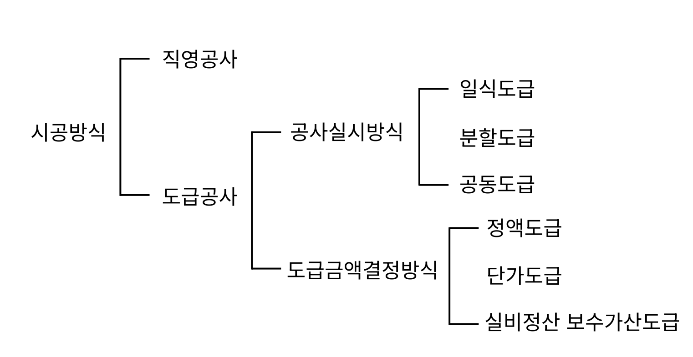

# 건축시공이란?

건축시공은 건축물이 갖춰야 할 세 가지 핵심 요소인 기능, 구조, 미를 만족시키면서, 적정한 비용(공비)과 적정한 기간(공기) 안에 건물을 현실로 구현하는 모든 활동을 말합니다. 따라서 건축시공의 기본 개념을 이해하면, 비전공자라도 프로젝트 진행 중에 자주 발생하는 비용 증가(추가 공사비), 일정 지연(공기 연장), 품질/안전 이슈, 책임 범위 혼선을 더 쉽게 이해하고 합리적으로 의사결정할 수 있습니다.
특히 건축시공을 알아두면 다음과 같은 부분에서 도움이 됩니다.

- 예산과 일정: 왜 공사비가 늘었는지, 왜 일정이 밀리는지를 구조적으로 이해할 수 있습니다.
- 품질과 책임: 설계·시공·감리의 역할 차이를 알아 불필요한 분쟁을 줄일 수 있습니다.
- 계약 방식 선택: 직영/도급, 총액/단가 등 계약 방식에 따른 리스크를 예측할 수 있습니다.
- 커뮤니케이션 효율: 건축주·설계자·시공사·감리자 간 같은 언어로 소통 가능합니다.

---

# 건축공사 관계자

건축공사는 여러 주체가 함께 움직이는 프로젝트입니다. 각 역할이 다르기 때문에, 프로젝트를 이해하려면 누가 무엇을 책임지는지를 먼저 알아야 합니다.

## 건축주(발주자)

건축주는 공사를 시작하게 하는 사람(또는 기관)입니다. 공사를 발주하고, 예산·목표·요구사항을 정하며, 계약을 체결하는 주체입니다. 직영공사 방식에서는 건축주가 공사의 운영 중심이 되는 경우도 있습니다.

## 설계자(건축사/설계사무소)

설계자는 건축주의 요구를 바탕으로 설계도서(도면·설명서·사양서 등)를 작성하고, 설계 의도를 설명·자문하는 역할을 합니다. 어떤 건물을 어떻게 지을지 문서로 구체화하는 사람이라고 생각하면 쉽습니다. 공사 중에는 설계 의도를 해설하고 조정하는 역할도 합니다.

## 감리자

감리자는 설계대로 제대로 지어지고 있는지를 확인하는 역할입니다. 시공된 건축물, 설비, 공작물이 설계도서 기준에 맞는지를 점검하고 감독합니다. 감리는 일반적으로 품질과 기준 준수를 객관적으로 확인하며, 공사 과정에서 중요한 안전장치 역할을 합니다. 국내에서는 책임감리(건설사업관리)/상주감리(현장 상주)/비상주감리(비정기 방문) 등의 유형이 있습니다.

## 관리자(현장관리자 등)

관리자는 건축주 또는 도급자(시공사)에 고용되어 공사 관련 업무를 담당합니다. 관리자는 공정(시간), 원가(비용), 품질, 안전, 자재 관리 등 현장 운영을 실제로 돌리게 됩니다. 현장에서는 이 관리 역량이 결과 품질과 공기 준수에 큰 영향을 미칩니다.

---

# 건축시공계약제도

건축 프로젝트에서 계약은 단순한 서류가 아니라, 돈(공사비)·시간(공기)·품질(성능/마감)·책임(하자/분쟁)을 어떤 방식으로 관리할지 결정하는 운영 시스템입니다. 즉, 같은 건물을 짓더라도 어떤 계약 방식(직영/도급, 일괄/분할, 총액/단가/실비청산 등)을 선택하느냐에 따라 프로젝트의 결과가 크게 달라질 수 있습니다. 그렇기 때문에 건축시공계약제도를 알고 있다면 비용 증가와 일정 지연, 품질 분쟁을 줄이고 의사결정을 훨씬 안정적으로 할 수 있습니다.

---

# 직영공사

발주자가 공사를 직접 수행하거나, 공사 운영·관리의 중심을 발주자가 하는 방식입니다. 시공을 맡길 업체를 쪼개서 직접 관리할 수도 있고, 자재·노무를 발주자가 주도할 수도 있습니다. 계약/발주 절차가 단순화되고, 품질 중심의 의사결정이 가능하며, 현장 변수에 유연하게 대응할 수 있다는 것이 장점으로 꼽힙니다. 하지만 공사비 증가·공기 연장의 위험성이 있고, 자재 낭비나 잉여 발생 등 운영 리스크가 증가하며, 관리 역량이 부족할 시 품질/안전 저하의 가능성도 존재한다는 단점도 있습니다.

직영공사는 다음과 같은 상황에서 수행하는 것이 유리합니다.

- 발주자가 현장 관리 역량을 어느 정도 갖춘 경우
- 공사가 비교적 단순하거나 공정이 복잡하지 않은 경우
- 자재·노무를 발주자가 유리하게 확보할 수 있는 경우
- 단가 산정이 어렵거나 연구·실험 성격이 있어 변동이 큰 경우
- 준공이 매우 시급하지 않은 경우(변수 대응 여지가 있을 때)

---

# 도급공사

## 도급이란?

도급은 공사를 완성하고 그 결과에 대해 보수를 지급받는 계약 방식을 말합니다. 발주자가 시공사(도급자)와 계약을 맺고, 시공사는 계약 조건에 따라 공사를 수행하고 대가를 받습니다.

- 원도급자(원청): 건축주와 직접 도급 계약을 한 시공업자.
- 재도급: 원도급업자가 도급공사의 전부를 건축주와 관계없이 다른 시공자에게 도급주어 시행하는 것.
- 하도급자(하청): 도급공사를 부분적으로 분할받아 전문적으로 수행하는 업체. 

재도급/재하도급/일괄하도급은 건설산업기본법상 금지되어 있습니다.

## 공사실시방식에 따른 분류

1) 일식도급(일괄도급)

공사 전체를 한 업체가 맡아 시공업무 일체를 수행하는 방식입니다. 공사비 총액이 명확해지고, 공사관리가 용이하다는 게 장점입니다. 관리 창구가 단일화되어 계약, 감독업무 역시 단순해지며 가설재 중복이 줄어 공비 절감 효과 또한 생깁니다. 다만 건축주의 의도나 설계도서의 의도가 충분히 반영되지 않을 위험이 있고, 하도급 관행으로 공사부실의 우려가 존재합니다.

2) 분할도급

공사 유형(공종)별로 여러 전문업체에 나누어 맡기는 방식입니다. 전문업체가 맡기 때문에 품질이 좋아질 수 있고, 업자 간 경쟁으로 저액시공이 가능합니다. 건축주와 의사소통이 편하고 설계도서의 취지가 잘 반영됩니다. 하지만 공종 간의 조정이 복잡해지고, 감독 및 관리 업무가 증가하며 관리 체계 부족 시 공정 충돌 혹은 지연이 발생할 수 있다는 단점이 있습니다.

분할도급은 다시 다음처럼 나뉘기도 합니다.

- 전문공종별 분할도급: 공사 중 설비공사를 건축공사와 분리 발주하는 분할도급입니다. 설비업자의 자본, 기술강화, 전문화로 능률을 향상할 수 있습니다.
- 공정별 분할도급: 공정 과정별로 나누어 도급을 주는 방식입니다. 예산배정상 구분할 때 편리하며, 부분 또는 분할발주가 가능합니다. 하지만 도급자 교체가 어렵고 후속 공정이 지연될 리스크가 있습니다.
- 공구별 분할도급: 대규모 공사에서 지역별로 나누어 발주하는 방식으로 각 공구마다 일식도급 체제의 운영을 합니다. 도급업자의 기회가 균등하고 시공 기술이 향상되며, 높은 성과를 기대할 수 있습니다.

3) 공동도급(컨소시엄)

단독으로 맡기에는 규모가 크거나 혹은 특수 공사일 때 여러 회사가 임시로 결합하여 공동으로 책임을 지고 공사를 수행하는 방식입니다. 공사 이행의 확실성이 보장되고 위험이 분산되며, 자본력과 신용도가 증대합니다. 또한 도급 경쟁이 완화되고 기술향상과 경험의 확충이 기대된다는 장점이 있습니다. 반면 공동도급은 단일회사의 도급보다 경비가 증가하며, 이해충돌 및 책임회피의 우려도 있습니다. 또한 여러 회사가 결합한 만큼 경영방식 차이에서 오히려 능률 저하를 부르기도 하며, 사무 및 현장관리에 혼란이 우려되기도 합니다.

## 금액결정방법에 따른 분류

1) 정액도급

공사비 총액을 확정하고 계약하는 방식입니다. 경쟁입찰 시 공사비가 저액이 될 수 있고, 관리 업무가 간편하다는 장점이 있습니다. 하지만 공사변경 시 도급금액이 증가하고, 입찰까지 상당한 기간이 필요하며 이윤 관계로 부실 공사의 우려가 있습니다.

2) 단가도급

재료, 노임, 면적, 체적 등 단위공사 부분의 단가만을 계약하고 실시수량 확정에 따라 차후 정산하는 방식입니다. 긴급공사 등 필요 수량이 명확하지 않을 때 채용합니다. 공사의 신속한 착공이 가능하고 설계변경 시 수량계산이 용이하며 간단히 계약할 수 있습니다. 하지만 총공사비 예측이 어렵고, 공사량을 절감하려는 노력이 없어집니다. 이 때문에 공사비가 높아지므로, 단일공사나 단순작업일 때 채용하는 것이 유리합니다.

3) 실비청산보수 가산도급

실제 비용을 정산하고 보수를 가산하는 방식입니다. 이론상으로는 직영과 도급제도의 장점만을 가져온 이상적인 제도입니다. 설계도서가 명확치 않고, 공사비 산출이 곤란한 공사나 발주자가 아주 양질의 공사를 기대할 때 채용될 수 있습니다. 신용계약의 기초가 되며, 양심시공과 우수한 시공을 기대할 수 있습니다. 하지만 공사기간이 연장될 수 있고, 공사비 증가의 우려가 있습니다.

## 업무범위에 따른 계약방식

1) 턴키도급(일괄수주방식)

모든 요소를 포괄한 도급계약 방식으로 건설업자는 대상계획의 기업, 금융, 토지조달, 설계, 시공, 기계기구설치, 시운전 및 조업지도까지 모든 것을 조달하여 주문자에게 인도하는 방식입니다.

2) CM 방식

전문가 집단에 의한 설계와 시공을 통합관리하는 조직을 CM조직이라고 합니다. 이 CM 조직이 건설업 전과정에서 사업 수행을 효율적, 경제적으로 수행하기 위해 각 부분 전문가 집단의 통합관리기술을 건축주에서 서비스하는 것이 CM 방식으로, 발주처와의 계약으로 수행됩니다. 

- CM for Fee(자문형): CM(Construction Manager, 건설사업관리자)가 발주자를 대신해 공사를 관리·자문하지만, 공사비와 시공 결과에 대한 직접적인 책임은 지지 않는 방식입니다. 건설 전문가를 고용해 옆에서 도와주는 형식이라고 생각하면 이해하기 쉽습니다.
- CM at Risk(책임형): CM이 단순 자문을 넘어, 공사비 보증과 시공 결과에 대한 책임을 지는 방식입니다. 관리도 하고, 돈과 결과에 대한 책임까지 지는 형태입니다.

3) PM 방식

사업의 기획단계에서 결과물 인도까지의 모든 활동의 계획, 통제, 관리에 필요한 사항을 종합적으로 관리하는 기술입니다.

4) 파트너링 방식

발주자가 직접 설계, 시공에 참여하고 프로젝트 관련자들이 상호신뢰를 바탕으로 팀을 구성해 프로젝트의 성공과 상호 이익확보를 공동목표로 하여 프로젝트를 집행, 관리하는 수행방식입니다.

5) 민간투자사업

- BTO (Build–Transfer–Operate): 민간이 시설을 건설(Build)한 뒤, 준공과 동시에 소유권을 정부(국가/지자체)에 이전(Transfer)하고, 대신 민간이 일정 기간 운영(Operate)·관리운영권을 받아 운영수익(사용료 등)으로 투자비를 회수하는 방식입니다.
- BOT (Build–Operate–Transfer): 민간이 시설을 건설하고 일정 기간 소유·운영(Operate)한 뒤, 계약기간 종료 시 소유권을 정부에 이전(Transfer)하는 방식입니다.
- BOO (Build–Own–Operate): 민간이 시설을 건설(Build)하고, 소유(Own)한 상태로 계속 운영(Operate)하는 방식입니다. 즉, 계약 종료 시 정부로 소유권 이전이 전제되지 않습니다.
- BTL (Build–Transfer–Lease): 민간이 시설을 건설(Build)한 뒤 소유권을 정부에 이전(Transfer)하고, 정부(주무관청)가 해당 시설을 민간으로부터 임차(Lease)하여 임대료(정부지급금) 형태로 민간이 투자비를 회수하는 방식입니다.

---

# 참고 자료

- 한규대, 김형중, 이명철, 건축시공, 한솔아카데미
- 국토교통부, 건설산업기본법
- 국토교통부, 건설기술 진흥법
- 재정경제부, 시사경제용어사전-민간투자사업