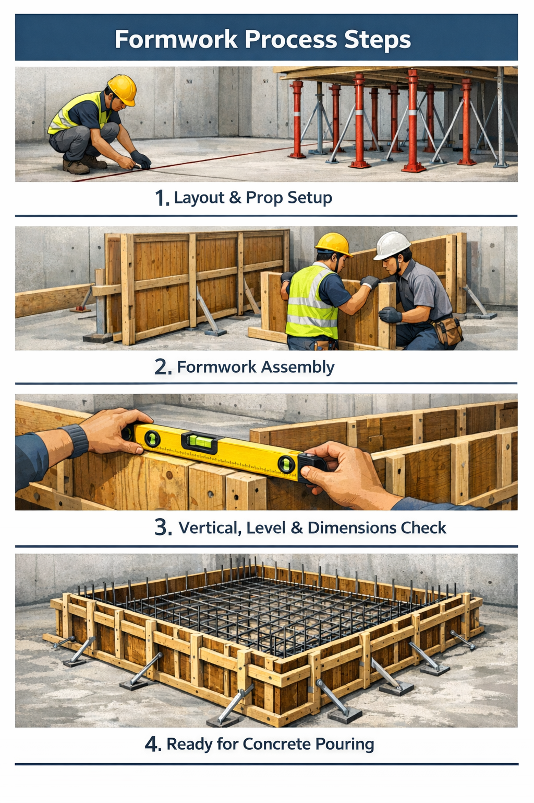
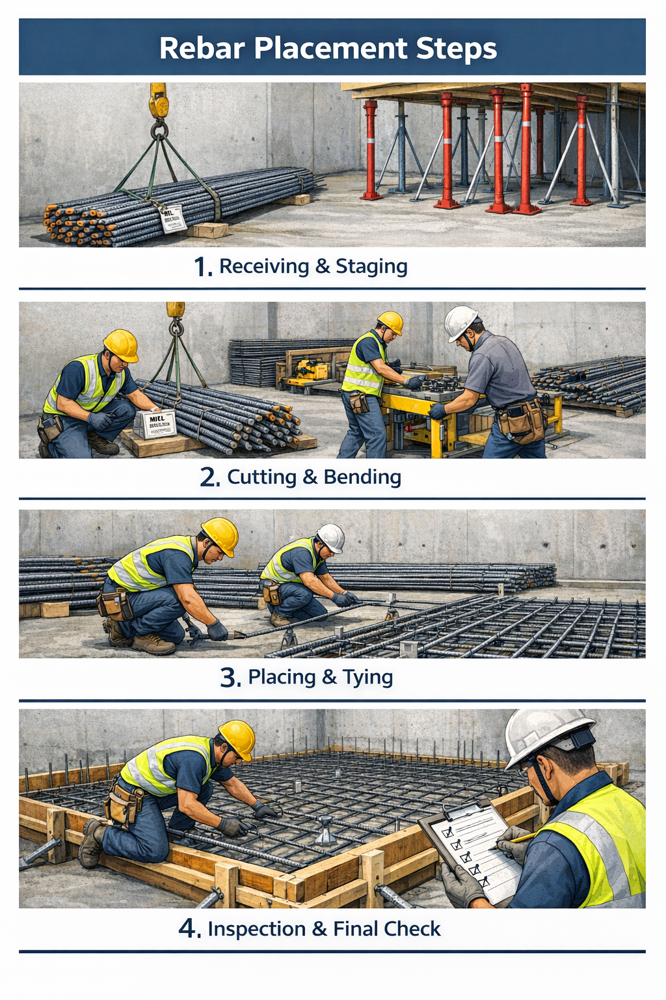
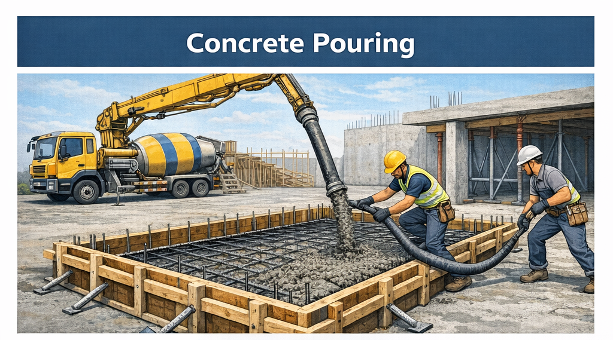
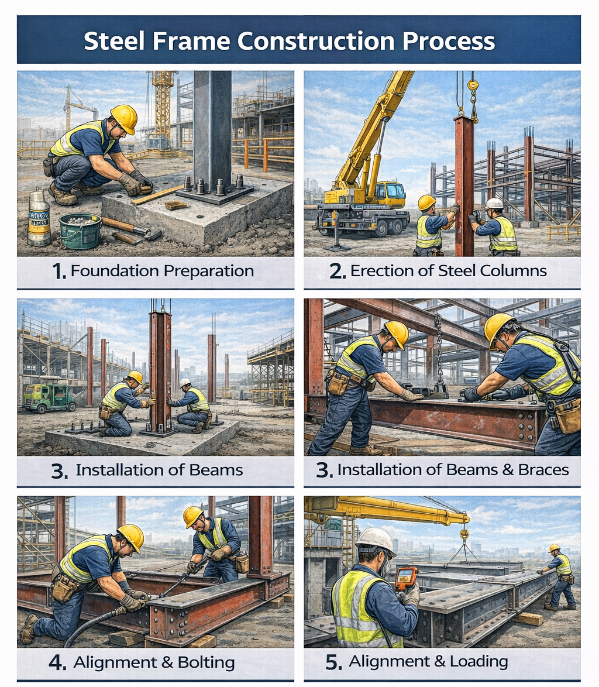
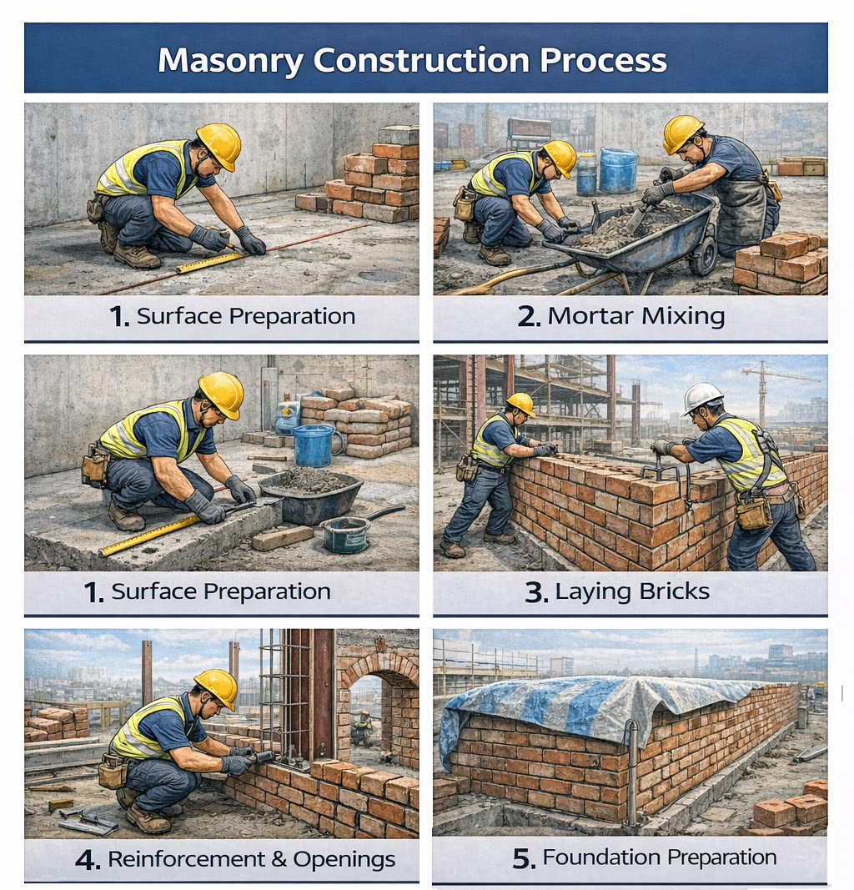
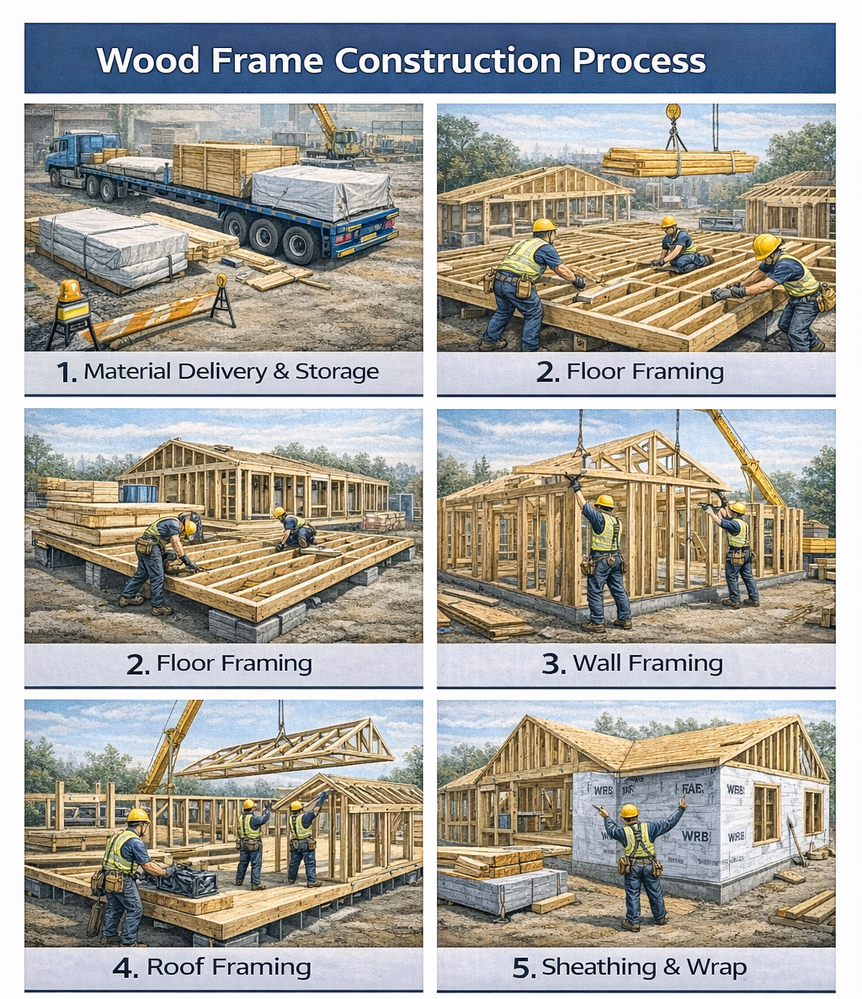

# Flow of Building Construction

Building construction may look like it progresses naturally from one step to the next, but in reality each phase is tightly interconnected. A mistake at one point can easily lead to cost increases, schedule delays, and defects (such as leaks, cracks, or warping).
For that reason, understanding the overall workflow (the big sequence) and the key characteristics of major structural methods (reinforced concrete, steel, masonry, and wood) makes it much clearer what must be decided in meetings, and which risks are increasing.

This document focuses on two main topics:

- Overall construction workflow: planning → pre-construction preparation → structure → waterproofing/envelope → finishes

- Differences by construction method: RC (cast-in-place) / steel (factory fabrication + site assembly) / masonry (stacking/laying) / wood (dry construction + connection quality)

---

# Construction Sequence

## Construction Planning

Construction planning is not simply making a schedule—it is the operational design for executing the work safely and efficiently. In the planning stage, the following items are typically reviewed and established. Items that are missed at this stage often return later as rework/changes/additional cost on site.

- Project scale (basis for labor, equipment, and space planning)
- Required construction precision (tolerances, quality targets, inspection items)
- Site conditions (access roads, storage/staging areas, neighboring complaints, weather conditions, etc.)
- Quantities/material takeoffs (affect procurement, transport, storage, and installation sequence)
- Specifications and contracts (quality standards, scope of responsibility, change and payment/settlement methods, etc.)

## Typical Steps to Develop a Construction Plan

While it varies by site, in practice construction planning is commonly detailed in the following order:

1) Establish the site organization: assign the person in charge, trade leaders, safety/quality leads, etc.
2) Develop the master schedule: confirm overall sequencing and dependencies between activities
3) Prepare and control the execution budget: define how the budget will be used and controlled
4) Select subcontractors/suppliers: choose trade partners and define roles/scope
5) Plan material delivery and equipment installation: ordering timing, delivery routes, staging, installation sequence
6) Plan labor supply and mobilization: link required workforce and timing to the schedule
7) Establish accident-prevention measures: finalize safety plans focused on high-risk work (working at height, lifting, concrete placing, etc.)

## Typical On-Site Construction Flow

A representative flow for a typical building project is as follows:

1) Pre-construction preparation: preparation before temporary works (site office, access roads, safety facilities, benchmarks/control points, etc.)
Temporary works: temporary facilities used during construction (site fencing, temporary power/water, scaffolding, etc.)
2) Earthwork: excavation and backfilling
3) Substructure and foundations: construction of foundations that carry building loads
4) Structural frame (superstructure): construction of the building skeleton (RC, steel, etc.)
5) Waterproofing and damp-proofing: a critical process for blocking water and moisture
6) Roofing and gutters: including the rainwater drainage system
7) Exterior walls and enclosure works: forming the building envelope (protecting from rain, wind, and heat)
8) Windows/curtain wall: directly tied to watertightness, airtightness, and insulation performance
9) Interior finishes: walls, floors, ceilings, painting, and finish installation

It can be tempting to think “the project is half done” once the structure is complete, but that is not true. In many cases, the stages that most strongly determine real usability—and defects (leaks, condensation, cracking, etc.)—are the waterproofing/envelope/window/finishing phases.

---

# Method-Specific Characteristics and Site Processes

From the outside, construction looks broadly similar: build foundations, erect the frame, install exterior walls and windows, and finish the interior. But in practice, project success often hinges on differences in the structural method—the building system and how it is constructed.

Even for buildings of the same scale, whether the structure is reinforced concrete (RC), steel, masonry, or wood changes things such as:

- Nature of the workflow: wet work built and cured on site vs. dry/prefabricated work fabricated in a factory and assembled on site
- Where schedules become unstable: time-driven factors such as weather/curing/placing vs. logistics-driven factors such as fabrication/delivery/hoisting (cranes)
- Quality-defining points: concrete consolidation/curing vs. connection quality (bolts/welds) vs. jointing and moisture control vs. connectors/airtightness/vapor control
- Typical defect patterns: cracking/honeycombing/level errors; connection issues/fireproofing damage; efflorescence/leaks/cracks; warping/condensation/mold, etc.
- Decision timing on site: some methods become extremely expensive to change late if details are not fixed early, while others allow relatively more adjustment during construction

In other words, understanding construction methods is not just knowing types of structures—it is the ability to read how a project will move and where risks are likely to arise. This matters because the biggest losses of time and money in construction often start not from major mistakes, but from small omissions. For example, in RC work, late changes to embedded items (sleeves/inserts) can drive up costs due to coring and repairs. In steel work, once shop drawings are finalized, changes can affect fabrication, transport, and erection. In masonry, inadequate joint filling and moisture-blocking details can lead to efflorescence and leaks. In wood construction, poor storage/moisture control and missing connectors can reduce long-term performance.

---

# Summary of Characteristics by Construction Method

If we simplify the nature of each structural method, it can be summarized as follows:

- RC (reinforced concrete): Build formwork on site, place rebar, pour concrete, and cure (wet work; curing-driven)
- Steel (S): Fabricate members in a factory and erect/connect them on site with cranes (fabrication + assembly; connection-driven)
- Masonry: Repetitive work stacking units with mortar (precision + moisture management driven)
- Wood: Dry assembly using lightweight members, panels, and connectors to secure performance (moisture, connections, and envelope driven)

Knowing these differences makes it easy to understand that even within structural frame work, what matters most can change completely depending on the method.

Below is a concise comparison table summarizing the characteristics of each method:

| Category       | Reinforced Concrete (RC)                                                        | Steel (S)                                                                        | Masonry                                                                                     | Wood                                                                                     |
| -------------- | ------------------------------------------------------------------------------- | -------------------------------------------------------------------------------- | ------------------------------------------------------------------------------------------- | ---------------------------------------------------------------------------------------- |
| Strengths      | Structural continuity/integrity; fire & sound performance; high shaping freedom | Shorter schedule (factory fabrication); precise construction; long spans         | Simple, repetitive construction; favorable for finishes/fire/sound (depending on use)       | Lightweight; good constructability; dry process; easy repair/renovation                  |
| Weaknesses     | Sensitive to curing/weather; quality depends on formwork/placing                | Sensitive to connection quality (bolts/welds); requires fireproofing             | Sensitive to jointing/verticality/cracking; vulnerable to absorption/freezing/waterproofing | Sensitive to moisture and deformation (shrinkage/creep); needs fire & sound enhancements |
| Process nature | Wet, site-made (ready-mix + placing)                                            | Factory fabrication + site assembly                                              | Wet (mortar) + repetitive work                                                              | Dry (panels/members) + connection quality                                                |
| Key controls   | Rebar placement/cover; placing & consolidation; curing                          | Shop drawings & factory inspection; erection accuracy; connections (bolts/welds) | Substrate & plumb; joints; reinforcement/anchors; curing & waterproofing                    | Moisture content; connectors; bracing & shear; airtightness & vapor control              |

From here, we will look in more detail at each construction method and its specific characteristics.

---

# 1. Reinforced Concrete Construction (RC)

Reinforced concrete (RC) is a construction method in which formwork is built on site, reinforcement is placed, and then concrete is poured and allowed to harden. It is one of the most commonly used structural frame systems.

In reinforced concrete, rebar resists tension (pulling) while concrete resists compression (pushing), so the two materials complement each other’s weaknesses. In addition, steel and concrete bond well and therefore act together structurally. Concrete’s alkaline environment also helps inhibit corrosion of the steel reinforcement—provided adequate cover is maintained.

## RC On-Site Process

### 1.  **Preparation / Pour Planning**

- Plan which areas will be poured, by floor/zone, and in what sequence.
- Check embedded items in advance (electrical boxes, sleeves, inserts).
- Set up the ready-mix design, pour segments, equipment (pump/vibrators), manpower, and contingency plans.

If this stage goes off track, there is a high likelihood that costs and schedule will be significantly affected later due to coring and rework.

### 2.  **Formwork (Building the Molds)**

In reinforced concrete (RC) construction, formwork is a temporary mold built before placing concrete so that the concrete can harden into the intended shape. Because concrete cannot hold its shape before it sets, formwork must be installed accurately for the dimensions, plumb/level, and surface quality to match the design—affecting even the quality of later finishes.

In practice, formwork accounts for a large portion of both cost and schedule. For that reason, it is managed not as a simple supporting task, but as a major activity that determines frame quality and workflow efficiency. Roughly, it can represent over 10% of total building construction cost, more than one-third of structural frame cost, and about 25% of the overall construction duration.

On site, installation typically follows this sequence:
layout marking → shoring/props installation → formwork assembly → verification of plumb/level/dimensions, and serves the following functions:

- Maintain shape and dimensions: accurately form the designed size and geometry of columns, beams, slabs, and walls
- Prevent leakage: prevent loss of the water and cement paste needed during setting (severe leakage can lead to rough surfaces or defects such as honeycombing/voids)
- Protect the curing environment: reduce the effects of wind, direct sun, rain, etc., to help concrete set steadily

Formwork must also safely resist the load and lateral pressure of fresh concrete during placement while maintaining accuracy. Key performance requirements on site include:

- Watertightness: prevent leakage of paste or water through gaps
- Safety: structurally stable against external forces and concrete lateral pressure
- Stiffness/precision: maintain sufficient rigidity and accurate dimensions (plumbness, level)
- Constructability: easy to assemble/disassemble and move
- Economy: reusable and easy to maintain

Removing formwork too early—before the concrete has gained enough strength—can cause edge spalling, sagging, and deformation. Therefore, stripping timing is typically determined based on the design/specification requirements, site curing conditions (temperature/humidity), and strength confirmation (e.g., test specimens), as needed.

To improve repetitive-work efficiency, safety, and schedule, system formwork is commonly used. Below are representative types.

**Wall-only system formwork**

1) Sliding form: A method in which the formwork is continuously raised at a steady rate while construction proceeds. It is close to continuous placing and may be used for tall walls and vertical structures.
2) Gang form: Instead of assembling/disassembling small components each time, large integrated panel units are installed and removed as a whole. It is advantageous for repetitive wall work, improving speed and quality consistency.

**Slab (floor plate) formwork**

1) Flying form: Joists, stringers, and supports are unitized and moved by crane to repeat slab pours. It circulates efficiently in buildings with many repeated floors.
2) Waffle form: Uses special box-shaped modular forms to create a two-way ribbed slab system. It is used to balance economy and performance depending on structural and spatial requirements.

**Wall + slab integrated / large-scale systems**

1) Tunnel form: A large formwork system designed to cast walls and slabs monolithically. One bay is configured like a tunnel, and it is used for projects with high repetition.
2) Traveling form: A large unitized formwork system (joists/stringers/shoring, etc.) that is moved horizontally; in some cases, configurations allow casting walls and slabs simultaneously. It improves repetitive-work efficiency by moving large units.

### 3. **Rebar Placement**

This stage secures structural performance by placing and tying reinforcement according to drawings, and verifying splice locations and lengths (lap splices, mechanical splices, etc.). If rebar position, splices, spacing, and cover are not properly controlled here, it becomes difficult to correct after concrete is placed—directly affecting structural performance, durability, and defects (cracking, corrosion, etc.).

Rebar work generally follows this sequence:

- Shop drawing preparation: develop constructible reinforcement details based on design drawings (bar arrangement, bends, splice locations, etc.)
- Delivery → storage: store reinforcement on site by specification
- Material inspection/testing: verify standards and markings; check quality documents such as mill sheets
- Fabrication: cutting and bending
- Assembly (placement): place and tie bars on site (typically, reinforcement is installed in the order: foundation → columns → walls → beams → slabs → stairs)
- Rebar inspection (verification): final check against drawings and specifications

A particularly critical item in rebar placement is **concrete cover** (the distance between reinforcement and the concrete surface). Spacers and chairs are used to ensure bars do not sit too close to the slab or formwork.

Cover is provided to:

- Maintain fire resistance: delay direct exposure of reinforcement to high temperatures during a fire
- Ensure durability: act as a protective layer against reinforcement corrosion
- Secure concrete quality: provide space for coarse aggregate to pass and fill, reducing the risk of voids/honeycombing
- Maintain bond: ensure reinforcement and concrete act together through adequate bond performance

Because reinforcement lengths are limited, splicing is required to achieve the necessary structural length. Verification is essential, based on the splice location and length specified in the drawings.

**Common splice methods**

- Lap splice: overlap bars for a specified length and transfer forces through bond
- Welded splice: connect bars by welding (site standards and QA/QC are critical)
- Gas pressure welding splice: heat and apply pressure to butt-join bar ends
- Mechanical splice (couplers, etc.): join bars using connectors such as couplers

Finally, bar spacing affects whether concrete can flow between bars and be properly consolidated during placing. If spacing is too tight, concrete may be blocked, leading to segregation, voids, and honeycombing.

For a single bar, spacing should satisfy at least the largest of the following:

1) Not less than the nominal bar diameter
2) Not less than 25 mm
3) Not less than 4/3 of the maximum size of coarse aggregate

### 4. **Concrete Placement + Consolidation**

In RC construction, concrete placement begins when ready-mix concrete arrives on site and is pumped (or otherwise placed) into the formwork. Consolidation is the process of removing trapped air and voids so that concrete is densely packed and fills around reinforcement.

A commonly described placement flow on site is:
ready-mix arrival → pumping/placing → vibration consolidation → surface finishing → start initial curing

This process is critical because improper placing and consolidation can cause internal defects that are not visible, leading to reduced strength, leaks, honeycombing, cracks, and level irregularities. Once concrete has hardened, correction is extremely difficult, so placement is managed as a key moment that determines frame quality.

Concrete is primarily composed of **cement + water + aggregates (sand and gravel)**.

1) Aggregates (sand and gravel): the “skeleton” of concrete. Aggregates make up most of the concrete volume and strongly affect quality. In general, good aggregates have the following characteristics:

- sufficiently strong and abrasion-resistant
- appropriate gradation (particle size distribution) for good compaction and minimal voids
- low content of impurities such as soil or organic matter
- not excessively high in specific mineral components (e.g., mica) that could harm quality
- satisfy project/site requirements (e.g., packing density)

2) Cement: the binder that hardens concrete. Cement reacts with water (hydration) to harden concrete. Depending on cement type, strength development rate and heat generation characteristics vary.

- Ordinary Portland cement (OPC): the most commonly used standard type, made by burning a mixture of limestone and clay to produce clinker, then grinding with gypsum.
- Rapid-hardening Portland cement: develops strength quickly (can be advantageous for fast schedules).
- Moderate-heat Portland cement: slower early strength but can be favorable for long-term strength and heat control in some cases.
- White Portland cement: low iron oxide content to achieve white color; used for color/finish purposes.

On site, concrete is generally placed from lower locations upward, following structural flow. Typically, after the foundation is cast, the sequence repeats by floor: columns/walls → stairs → beams/slabs. For beams and walls, placement may proceed from both sides toward the center to fill evenly. Drop height is also controlled as low as possible to reduce segregation (separation of sand/gravel).

After placement, consolidation is performed. Consolidation removes voids to densify the concrete, achieve required strength and watertightness, and prevent segregation and honeycombing. Methods include hand tamping, vibration, tapping the formwork, pressure consolidation, centrifugal consolidation, and vacuum consolidation.

### 5. **Curing + Stripping + Defect Repair**

Curing is the process of controlling moisture, temperature, and time so that concrete can develop sufficient strength. Premature stripping can cause edge damage and deformation, so stripping is performed according to specified strength and procedures. During curing, exposed surfaces are protected from direct sunlight, wind and rain, and frost, and harmful impacts or loads are avoided until adequate hardening is achieved. In addition, sufficient temperature is maintained, rapid drying is prevented, and a moist condition is maintained so hydration can proceed adequately.

---

# 2. Steel Construction (S)

A steel structure is built by fabricating steel members in a factory and assembling them on site using cranes, which makes it advantageous for shorter schedules, precision construction, and long spans. Because members are produced accurately in the factory and then erected and connected on site, steel-frame work is typically defined by two core priorities: (1) finalizing details through shop drawings to minimize errors, and (2) managing connection quality (bolting/welding) to meet standards.

## Steel Construction Process

### 1. Finalize Shop Drawings + Factory Fabrication

In steel work, the first step is to finalize shop drawings so that fabrication and erection can be carried out in practice. These drawings include connection details, member dimensions, allowable tolerances, and the scope of coating/fireproofing. Once the shop drawings are approved, the factory fabricates members through cutting, machining, assembly, and welding.

Because steel members are already manufactured before arriving on site, changes after shop drawings are finalized are likely to lead to re-fabrication, delivery delays, and additional costs. For that reason, how accurately details are confirmed at the shop-drawing stage is critical to the project.

A typical fabrication sequence is:

- Prepare full-size templates → tracing/marking → straightening/flattening deformation → marking-out
- Cutting/machining → drilling holes → trial assembly (temporary fit-up)
- (If required) riveting/welding and other connection work → inspection → anti-corrosion primer (rust-proof coating) → preparation for transport

### 2. Delivery / Staging (Stockpiling)

Fabricated members are delivered to the site with identification numbers (labels) attached. On site, staging is planned so members can be retrieved in the installation sequence. Because members are long and heavy, damage during delivery or improper staging can cause warping or deformation. Also, poor label control can waste time during erection and easily disrupt the workflow.

### 3. Erection

Members are lifted and installed—typically columns first, then beams—using a crane. Temporary braces are installed to prevent overturning, and after checks are completed, final tightening is carried out. Erection is the phase with the highest safety risk in steel work. Because it involves hoisting heavy members at height, even small issues with lifting radius, site circulation, signaling, or temporary fixing can greatly increase risk.

**Typical erection flow**

1) Verify control points / anchor bolts
2) Establish the crane plan (working radius, equipment position, travel paths, signal system)
3) Snap chalk lines for column centerlines → adjust base-plate elevation (liner plates, etc.)
4) Stand columns → grout the base area
5) Secure stability with temporary bracing/turnbuckles → inspect → final tightening

**Equipment used for steel erection**

- Guy derrick: In theory, one of the most typical erection methods.
- Stiff-leg derrick: More advantageous for horizontal movement than a guy derrick; used for low-rise projects with long floor plates.
- Truck crane: A crane mounted on a truck. Common due to mobility, self-supporting capability, and frequent use on large sites.
- Tower crane: A large fixed crane used on high-rise sites to lift materials to great heights and move them horizontally.

* While guy derricks are often introduced as a typical theoretical method, since the 2020s, more mobile and efficient equipment such as truck cranes and tower cranes has been used more frequently in practice.

### 4. Connections (Bolting or Welding)

To make erected members act as one structural system, they are connected by bolting or welding. In steel construction, connections are the critical zones where forces are transferred, so connection quality governs overall structural performance. Poor connections are not merely defects—they can directly affect structural safety.

**Connection methods**

- High-strength bolted connection (slip-critical/friction-type): Uses high-strength bolts. The nuts are tightened to generate large clamping force (pretension), pressing members together to develop the connection.
- Welded connection: Uses heat to fuse steel members so they become metallurgically continuous—effectively behaving like a single piece of metal.
- Riveted connection: Inserts rivets (metal pins with heads) into holes and deforms the tail end to form a second head, fastening members together. It is now rarely used in new construction.

### 5. Alignment Adjustment (Plumb/Level) + Fireproofing/Coating

After connections are completed, alignment is adjusted and verified—plumbness, level, elevations, and deflections—to confirm the frame meets the designed position and tolerances. Because steel is relatively vulnerable to fire, fireproofing and coating (anti-corrosion/finish) are then applied as required. Finally, inspection records and as-built documentation are compiled for handover.
If alignment is off, clashes and rework increase in subsequent work (façade, windows, finishes), which can ultimately raise both cost and schedule risk.

**Fireproofing methods**

Steel fireproofing can be broadly understood as: coating type, wet-applied type, dry-applied type, and composite type.

1) Coating method (intumescent fireproof paint): The coating expands in a fire to form an insulating layer.
2) Wet-applied methods
    - Encasement (cast) method: cast (including lightweight) concrete around the steel
    - Masonry encasement: wrap with blocks or bricks
    - Plastering method: apply mortar-type material over wire mesh
    - Spray-applied fireproofing: spray fireproof material (fast application, relatively small impact on section size)
3) Dry-applied methods
    - Board encasement: enclose with boards such as ALC panels or gypsum boards
    - Wrap method: wrap the member with fireproof materials
    - Ceramic wool insulation: apply fiber blanket-type insulation
4) Composite method: secure fireproofing performance together with finishes such as ceiling panels, PC panels, or ALC panels

---

# 3. Masonry Work (Masonry)

Masonry work is the process of building walls by stacking bricks or blocks layer by layer. Although it may look like a simple repetitive task, actual quality depends heavily on control of lines and levels (plumb/level), joints (the gaps between units), and moisture management (absorption, curing, and waterproofing details). Most common masonry problems—such as cracking, leakage, efflorescence, and uneven surfaces—are usually not caused by a single major mistake, but by small omissions that accumulate over time.

Typical issues include:

- Walls appearing curved because control lines become unclear (plumb/level control)
- Leaks and aesthetic defects from inconsistent joints or poorly filled joints
- Units absorbing water (absorption) and being damaged by freezing in winter (freeze–thaw)
- Cracks caused by insufficient reinforcement around door and window openings

## Masonry Process

### 1. Substrate Preparation

The first step is to level the base and set accurate control lines (chalk lines). If this baseline is off, the wall can look bowed and surfaces may become uneven no matter how carefully the units are laid afterward. The typical flow is: level check → line setting (layout marking) → cleaning the base surface.
For absorptive materials, the moisture condition of the substrate must be managed appropriately. It is also important to confirm the locations of embedded/pre-installed items such as door/window frames, electrical boxes, and pipe sleeves.

### 2. Mortar and Brick Preparation

Mortar is the material that bonds bricks/blocks together, typically made by mixing cement + sand + water. Quality is strongly influenced by mix proportions and working-time control. If mortar that has begun to set is forced into use, bond strength decreases, joints weaken, and defects such as cracking or debonding can occur.

Key workflow:

1) Check the condition of bricks/blocks (damage, dimensional defects)
2) Mix mortar and manage working time (comply with project standards)

**Types of bricks/blocks**

- Cement brick: molded using a mix of cement and aggregates.
- Red brick (clay brick): widely used for general masonry walls.
- Fire brick (refractory brick): designed to withstand high temperatures.
- CHB (Concrete Hollow Block): hollow-core concrete block.
- Lightweight concrete block: uses lightweight aggregate (expanded clay, perlite, etc.) instead of normal aggregate.
- Cement block: relatively dense block made from cement and sand.
- ALC (Autoclaved Lightweight Concrete): lightweight aerated concrete block cured with high-temperature, high-pressure steam (autoclave).

### 3. Laying (Stacking)

In the laying stage, corners are set first with accuracy, and a line is pulled to guide each course. This repetition is why masonry appears simple, but quality can drift over repeated work—so consistent verification is essential. Key checks include: maintaining plumb and level, keeping joints uniform and fully filled (no voids), and ensuring corners do not shift.

Typical flow:

1) Set corners and guide lines → maintain level/plumb course by course
2) Secure joint thickness and filling rate (fully packed, no hollow joints)
3) Install structural reinforcement elements
    - reinforcing bars/wires/ties (metal connectors)
    - reinforcement around openings (lintels, bars, etc.)
    - joint planning (control/expansion joints to reduce shrinkage/thermal cracking)

### 4. Reinforcement + Opening Treatment (Around Doors/Windows)

Openings (doors/windows) are structurally vulnerable points in masonry walls. Reinforcement is therefore installed above openings to prevent sagging and cracking, and connections to other structural elements (columns/slabs, etc.) must be executed correctly.

Because cracks most commonly occur at the top of openings, reinforcement details such as lintels and bars should be applied according to drawings. Wall-to-structure connections should also be secured with ties/connectors so separation does not occur. Where MEP penetrations exist, joint filling, sealing, and waterproofing details around the penetration should be considered together.

### 5. Curing / Protection / Inspection

In masonry, it is important not only how units are laid, but also whether mortar cures stably afterward and whether the work is protected from the external environment. Since typical masonry issues include unfilled joints (leaks/aesthetic defects), insufficient opening reinforcement (cracks), and moisture intrusion (efflorescence/freeze damage), inspections should focus on these items.

---

# 4. Wood Construction (Wood)

Wood construction is a method of forming the building frame by assembling timber members. Compared with reinforced concrete (which requires placing and curing), it generally involves less waiting time; and compared with steel, it may rely less on heavy-member fabrication and large-scale hoisting. As a result, wood framing often progresses relatively quickly and is typically a dry (assembled/prefabricated) process.

However, wood is sensitive to moisture, and structural performance depends heavily not only on the members themselves but also on the quality of connections—such as nails, screws, and bolts. For that reason, the following three items are usually considered critical in wood construction:

- Moisture content (MC) and storage condition of materials
- Installation quality of connectors (nails, screws, bolts, plates, etc.)
- Continuity of bracing and shear systems (the “resisting” system in walls/floors/roofs)

## Wood Construction Process

### 1. Delivery and Storage

For wood construction, the first step is proper material storage. Wet timber can warp over time and develop mold, so materials should be protected from rain and moisture immediately upon delivery (covers, water barriers), kept ventilated, and stacked off the ground.

**Wood preservation treatment methods**

- Soaking (immersion): immerse in preservative solution or water to block oxygen supply.
- Injection (impregnation): inject preservative into the timber (varies by normal pressure vs. pressure treatment).
- Surface charring: char the surface to create a carbonized protective layer (traditional/special uses).
- Coating: apply preservatives or finishes (varnish/oil-based paint, etc.) to protect the surface.

### 2. Framing Erection (Assembly Sequence)

Wood framing is typically assembled in the following order:

- Floor joists (or slab anchors) → wall studs/headers/openings (doors/windows) → roof trusses/rafters

On site, temporary bracing is installed to prevent overturning, and plumbness and squareness are checked continuously.

### 3. Shear and Bracing System Installation

Structural performance in wood construction is not achieved by members alone—wall, floor, and roof planes must work like diaphragms. To achieve this, structural plywood/OSB is fastened in specified patterns, and tension components (hold-downs, anchors, straps, etc.) are installed.

### 4. Envelope (Waterproofing / Vapor Control / Airtightness)

Because wood is sensitive to moisture, continuity of the envelope layers is extremely important. In wood buildings, leaks and condensation can lead to loss of structural performance and durability problems (mold/rot), making them especially critical.

- Ensure continuity of the WRB (Weather-Resistive Barrier)
- Install flashing (details to direct/block rainwater)
- Where required, ensure continuity of an air barrier (to prevent air leakage)
- Closely manage high-risk condensation points (corners, around windows, penetrations)

### 5. Inspection and Handover

After installation, inspections focus on connections and envelope details:

- Connections: nail length/spacing/count; presence of connectors (straps/hold-downs, etc.)
- Condition of structural panel joints; plumbness and surface alignment
- Signs of moisture intrusion (staining, discoloration, mold odor, etc.)
- Evidence of leakage and quality of penetration sealing/finishes

---

# Reference

- 한규대, 김형중, 이명철, 건축시공, 한솔아카데미
- 국가건설기준센터, 국내 KDS/KCS
- 국가건설기준센터, KDS/KCS 콘크리트
- 국토교통부, 강구조공사 KCS 개정 고시
- American Concrete Institute, ACI 301(Structural Concrete Specifications)
- American Concrete Institute, ACI 318(Structural Concrete Code)
- CRSI, Field Inspection
- AISC, Code of Standard Practice for Steel Buildings and Bridges
- TMS,  TMS 402/602
- AWC, AWC NDS 2024
- AWC, Wood Frame Construction Manual (WFCM) 2024