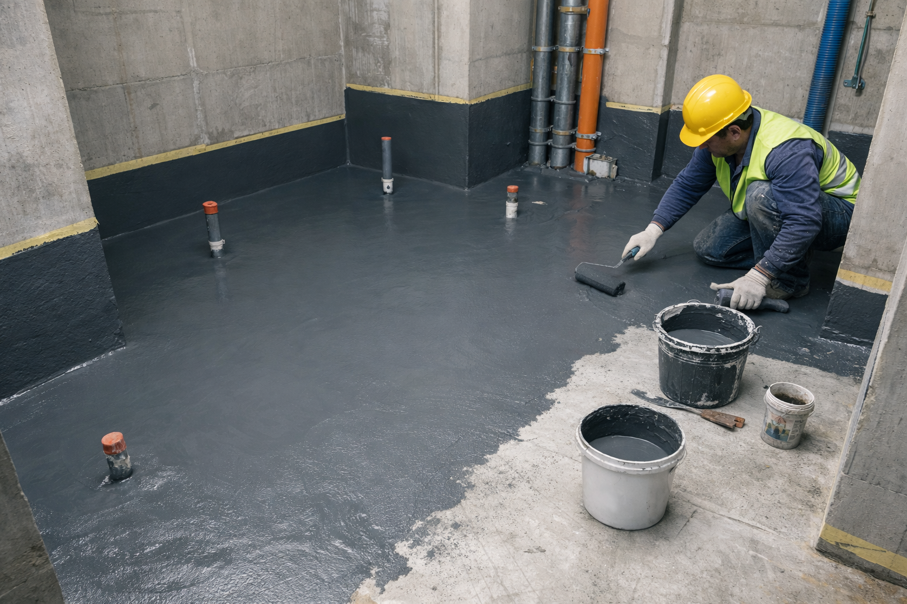
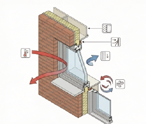
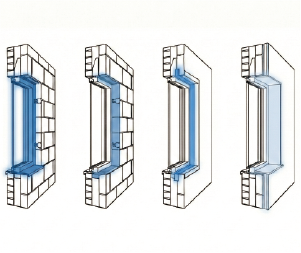

# 🧱 Finishing Process Logic (마감 공정 로직)

> **Document Info**
> * **분류 (Category):** 건축 / 시공 공정 (Architecture / Construction Process)
> * **타겟 시스템 (Target System):** 시공 계획, 품질 관리(QA/QC), 공정 시뮬레이션
> * **최종 업데이트 (Last Updated):** 2026-02-03
> * **핵심 키워드 (Keywords):** `Construction Sequence`, `Layering`, `Thickness`, `Tolerance`

---

# 보이지 않는 것에서 보이는 것으로

### 보이지 않는 레이어 [마감공사]

---

 

건축물은 단순히 콘크리트 덩어리가 아닙니다. 수많은 기능적 레이어(Layer)가 엄격한 종속 관계를 가지고 적층된 정밀한 시스템입니다. 특히 골조 이후 진행되는 마감 공사는 건물의 <strong>물리적 성능(단열, 기밀, 방수)</strong>과 <strong>사용자 인터페이스(시각적 마감)</strong>를 결정짓는 핵심 단계입니다.

---

## 1. Process Flow: 시공의 종속성과 순서

마감 공사는 <strong>기능적 필수 레이어</strong>에서 시작하여 <strong>시각적 표면 레이어</strong>로 끝나는 흐름을 갖습니다. 이 순서는 뒤집을 수 없으며, 앞 단계의 품질이 뒷 단계의 데이터 정합성에 결정적인 영향을 미칩니다.

### Phase 1. 방수 (Waterproofing): The Invisible Shield
가장 먼저 시공되지만, 결국엔 보이지 않게 되는 <strong>숨겨진 레이어</strong>입니다. 물이라는 유체가 구조체 내부로 침투하지 못하도록 차단하는 건물의 기저(Base) 로직을 형성합니다.

* <strong>[위치]</strong> 화장실, 발코니, 옥상 등 '물'을 사용하는 모든 공간의 바닥과 벽체 하부.
* <strong>[순서]</strong> 골조 공사 직후, 설비 배관이 자리를 잡은 뒤 가장 먼저 수행.
* <strong>[특징]</strong> 틈새 없는 연속성(Continuity)이 생명입니다. 미세한 크랙(Crack) 하나가 전체 시스템의 실패(Leakage)로 이어집니다.

> <strong>액체 방수(Liquid Waterproofing):</strong> 시멘트와 방수액을 섞어 바르는 방식. 복잡한 형상에도 시공이 용이하여 실내 화장실 등에 주로 사용됨.   <strong>도막 방수(Membrane Waterproofing):</strong> 우레탄이나 아크릴 등을 도포하여 고무판 같은 막을 형성하는 방식. 탄성이 좋아 균열에 강함.

  

### Phase 2. 조적 (Masonry): The Partition
텅 빈 공간에 물리적인 <strong>구획(Boundary)</strong>을 설정하는 단계입니다. 벽돌이나 블록을 쌓아 공간을 나누고, 소리와 열을 차단하는 1차적인 물리적 장벽을 세웁니다.

* <strong>[위치]</strong> 세대 간 경계벽, 실내 칸막이벽, 파이프가 지나가는 통로(PD/AD) 등.
* <strong>[순서]</strong> 방수층이 보호된 상태에서 바닥의 먹메김(Marking) 라인을 따라 수직으로 적층.
* <strong>[특징]</strong> 공간의 XY 좌표를 확정 짓는 단계입니다. 이후 붙는 모든 마감재의 기준면이 되므로 수직/수평의 정밀도가 필수적입니다.

> <strong>조적조(Masonry Construction):</strong> 벽돌, 블록 등을 모르타르로 접착하여 쌓아 올리는 건축 양식. 현대 건축에서는 주로 하중을 받지 않는 비내력벽(칸막이) 용도로 사용됨.

### Phase 3. 창호 (Fenestration): The Envelope Interface
내부와 외부를 연결하는 <strong>개구부(Opening)</strong>를 정의합니다. 단순한 구멍이 아니라, 열 관류율(Heat Transmission)과 기밀성(Airtightness) 같은 환경 성능 값이 결정되는 단계입니다.

  <strong>[위치]</strong> 외벽의 개구부, 발코니 출입구 등 내/외부의 경계면

  

    
  

  

    
  

  <strong>[순서]</strong> 조적 벽체가 선 후 개구부에 맞춰 프레임을 끼움 (또는 창호 프레임 선행 후 조적)

  

    
  

  

    
  

* <strong>[특징]</strong> 벽체와 창틀 사이의 틈새(Gap)를 얼마나 밀실하게 채우느냐가 건물의 단열 성능을 좌우합니다.

> <strong>열관류율(U-value):</strong> 열이 물체를 통과하는 정도를 나타내는 수치. 값이 낮을수록 단열 성능이 우수함을 의미함.   <strong>사춤(Grouting):</strong> 창호 틀과 벽체 사이의 빈 공간을 모르타르나 단열재로 꼼꼼하게 메워 넣는 작업.

### Phase 4. 내장 (Interior): The Visual Surface
사용자가 눈으로 보고 손으로 만지는 <strong>최종 마감면(Finish Face)</strong>입니다. 앞선 단계들의 오차를 최종적으로 보정하고, 심미적인 텍스처(Texture)를 입힙니다.

* <strong>[위치]</strong> 천장, 벽, 바닥 등 우리 눈에 보이는 모든 면.
* <strong>[순서]</strong> 모든 설비/전기 배선이 끝나고 창호가 닫혀 비바람이 차단된 상태에서 진행.
* <strong>[특징]</strong> 목공, 도장, 도배, 타일 등이 포함됩니다. 0.1mm 단위의 디테일과 재료의 물성(Materiality)이 공간의 분위기를 결정합니다.

> <strong>바탕면(Substrate):</strong> 최종 마감재(페인트, 벽지 등)를 붙이기 위해 평활도를 잡아주는 하지 작업면. 석고보드나 미장면이 이에 해당함.

---

## 2. Logic of Thickness: 데이터로서의 두께

건축 도면상의 선(Line)은 실제 현장에서 두께(Thickness)를 가진 부피(Volume)로 치환됩니다. 이 '마감 두께'를 고려하지 않으면 실제 공간은 설계보다 좁아지거나 낮아집니다. 실무적으로 고려해야 할 표준적인 <strong>오프셋(Offset) 값</strong>은 다음과 같습니다.

### 벽체 (Wall Build-up)
구조체 콘크리트 면에서 최종 마감면까지 튀어나오는 두께입니다.

| 구분 | 두께 (Approx.) | 구성 요소 |
| :--- | :--- | :--- |
| <strong>미장 마감</strong> | <strong>15 ~ 20mm</strong> | 시멘트 모르타르 두께 |
| <strong>석고보드 가벽</strong> | <strong>약 19mm + @</strong> | 9.5mm 보드 2겹 (+ 하지틀 30~65mm) |
| <strong>타일 마감</strong> | <strong>25 ~ 30mm</strong> | 타일 두께 + 접착 모르타르 두께 |

* <strong>Insight:</strong> 벽체 마감이 두꺼워질수록 유효 바닥 면적(Net Area)은 줄어듭니다.

### 바닥 (Floor Build-up)
구조체 슬라브(Slab) 위로 올라오는 바닥 마감의 총 두께입니다. 이 높이 안에 난방 배관과 단열재가 숨겨집니다.

* <strong>일반 주거 온돌마감: 약 100~110mm</strong>
    * 구성: 기포 콘크리트(차음/단열) + 방통 모르타르(난방코일 매립) + 바닥재(마루/장판)
* <strong>일반 상업 공간 (타일): 약 30~50mm</strong>
    * 구성: 수평 몰탈(Self-leveling) + 접착제 + 타일

> <strong>방통(Screed):</strong> '방바닥 통미장'의 줄임말. 온수 파이프를 덮고 바닥을 평평하게 만드는 미장 작업. 열을 축적하고 방출하는 축열체 역할을 함.

---

## 3. Conclusion: 오차와 허용 범위

모든 공정은 수학적인 0(Zero)이 아닌, <strong>허용 오차(Tolerance)</strong> 범위를 가집니다.

* 골조는 <strong>cm 단위</strong>의 오차를 가질 수 있지만,
* 창호는 <strong>mm 단위</strong>,
* 가구와 내장은 <strong>0.5mm 단위</strong>의 정밀도를 요구합니다.

마감 공사는 이처럼 거친 구조체의 오차를 단계별로 줄여나가며, 최종적으로 인간의 스케일에 맞는 정밀한 환경을 구축하는 과정입니다. 각 레이어의 <strong>물성(Properties)</strong>과 <strong>두께(Dimension)</strong>를 정확히 이해하는 것은 건물을 단순한 형상이 아닌, 정보가 담긴 객체로 바라보는 첫걸음입니다.
