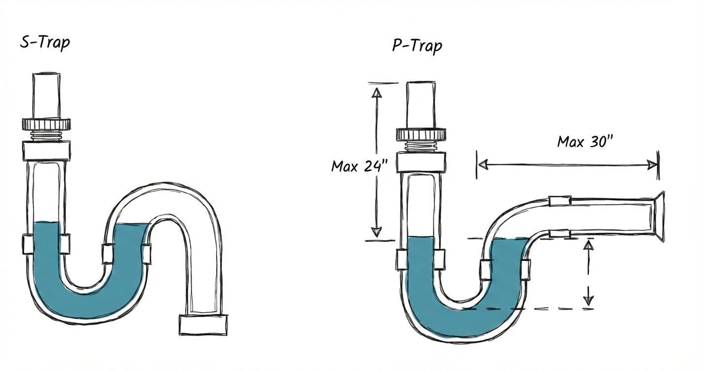
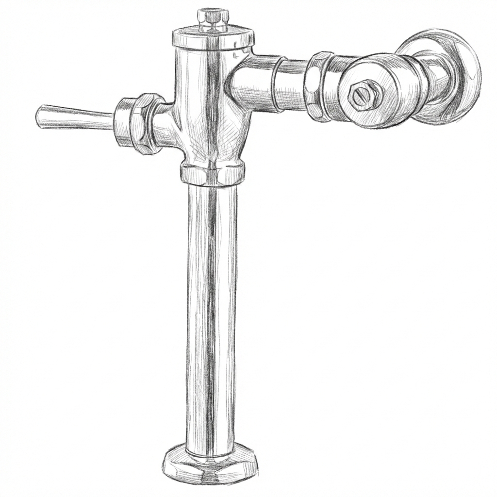
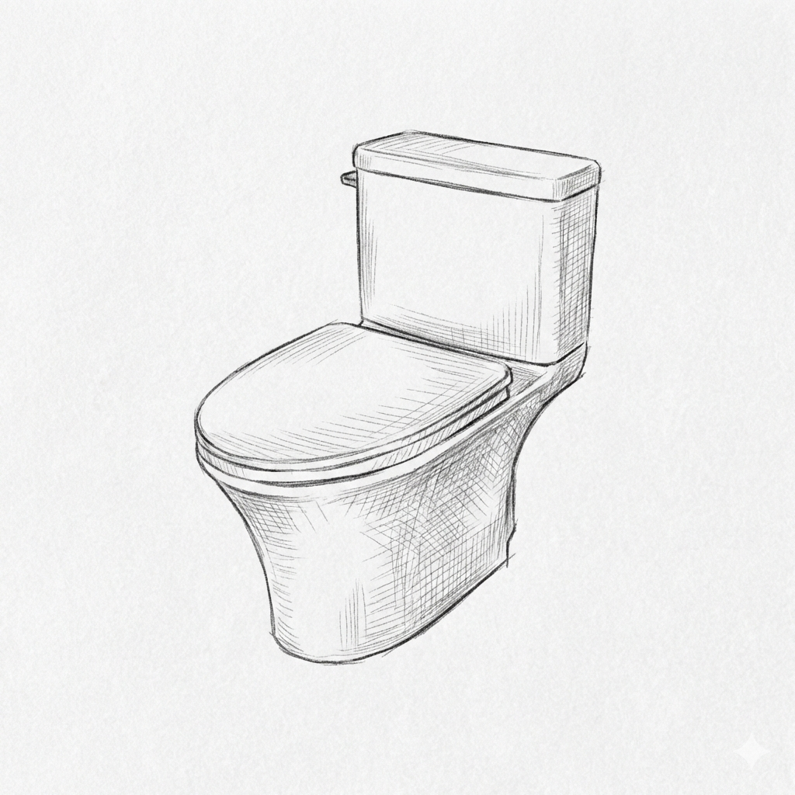
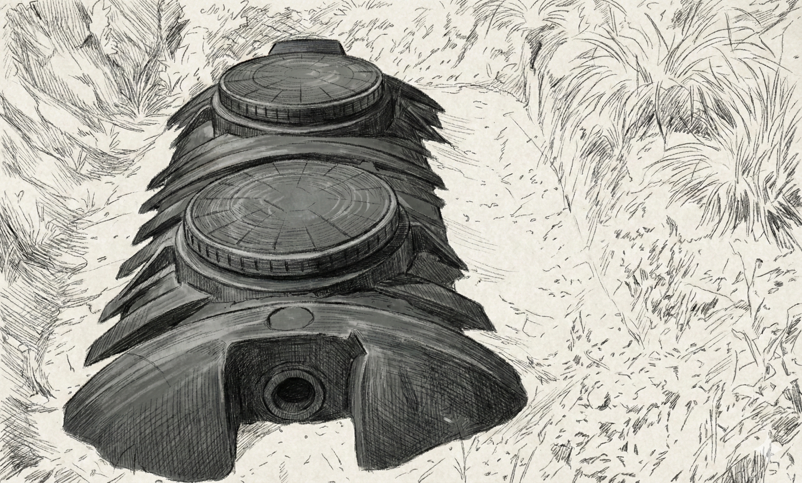

# 배관 및 위생 설비 (Plumbing and Sanitation System)

## 1. 급수설비 💧

**급수설비란?**

상수도에서 물을 받아 건물 각 층·세대로 전달하는 시스템입니다.

방식은 크게 세 가지입니다.

- **직결식** — 수도관 압력을 그대로 이용해 물을 공급하는 방식입니다.
별도 탱크 없이 상수도와 건물 배관을 직접 연결합니다.
→ 저층 건물(3~5층 이하)에 적합하고, 위생적입니다.
- **고가탱크식** — 건물 옥상에 물탱크를 설치하고, 거기서 중력으로 물을 내려보내는 방식입니다.
→ 수압이 일정하고 단수 시에도 탱크에 남은 물을 사용할 수 있습니다.
중·고층 아파트에서 오래 사용해온 방식입니다.
- **압력탱크식** — 밀폐된 탱크 안에 공기압을 이용해 물을 밀어내는 방식입니다.
→ 옥상 탱크가 없어 미관이 좋고, 중소형 건물에 많이 사용합니다.

> 🔎 고층 건물일수록 아래층은 수압이 너무 강하고 위층은 약해지는 문제가 생깁니다. 이를 해결하기 위해 층별로 구역을 나눠 수압을 조절하는 **조닝(Zoning)** 기법을 사용합니다.

---

## 2. 급탕설비(온수공급설비) 🔥

**급탕설비란?**

온수(따뜻한 물)를 각 공간에 공급하는 시스템입니다.
냉수 배관과 달리 온도를 유지해야 하기 때문에 설계가 더 까다롭습니다.

---

**📍 급탕 방식 1 — 개별식 vs 중앙식**

- **개별식** — 각 세대·공간마다 보일러나 온수기를 따로 설치하는 방식입니다.
→ 내가 쓸 때만 가동하므로 에너지 낭비가 적습니다.
일반 가정집, 소규모 건물에 적합합니다.
- **중앙식** — 건물 전체가 하나의 대형 열원(보일러실)을 공유하는 방식입니다.
→ 대형 호텔·오피스·병원처럼 온수를 24시간 대량으로 사용해야 하는 곳에 유리합니다.
관리는 편하지만, 배관이 길어질수록 열손실이 생기는 단점이 있습니다.

---

**📍 급탕 방식 2 — 순간식 vs 저탕식**

- **순간식** — 온수가 필요한 순간에 물을 빠르게 가열해 바로 공급하는 방식입니다.
→ 별도 저장 탱크가 없어 공간을 적게 차지합니다.
수요가 갑자기 몰리면 온수가 부족해질 수 있습니다.
- **저탕식** — 대용량 탱크에 온수를 미리 데워서 저장해두는 방식입니다.
→ 한꺼번에 많은 양의 온수를 사용할 수 있습니다.
탱크 안의 물이 식지 않도록 에너지를 계속 사용해야 하는 단점이 있습니다.
호텔·목욕탕처럼 온수 사용량이 많고 피크 시간이 있는 곳에 적합합니다.

---

**📍 보일러설비**

- 난방(바닥 난방, 라디에이터)과 온수 공급을 동시에 담당합니다.
- **콘덴싱 보일러** — 연소 후 버려지는 뜨거운 배기가스의 열까지 회수해 효율을 높인 보일러입니다.
일반 보일러보다 연료비가 약 10~15% 절감됩니다.
- 배관 내 공기 빼기(에어빼기)를 주기적으로 해야 난방 효율이 유지됩니다.
→ 공기가 배관에 차면 온수 흐름이 막혀 특정 구역이 따뜻해지지 않습니다.

---

**📍 친환경 급탕 방식 — 요즘 주목받는 트렌드**

가스 보일러 외에도 에너지를 절약하는 친환경 급탕 방식이 점점 많이 사용되고 있습니다.

- **태양열 급탕** — 지붕에 설치한 태양열 집열판으로 햇빛의 열을 모아 물을 데우는 방식입니다.
→ 연료비가 거의 들지 않습니다. 흐린 날이나 야간에는 보조 열원(보일러)과 함께 사용합니다.
단독주택, 펜션, 공공건물 등에서 많이 도입하고 있습니다.
- **열펌프(히트펌프) 급탕** — 에어컨과 반대 원리로, 외부 공기나 지하수의 열을 끌어와 물을 데우는 방식입니다.
→ 전기를 사용하지만, 소비한 전력보다 **2~4배 많은 열에너지**를 만들어낼 수 있어 매우 효율적입니다.
→ 탄소 배출이 적어 친환경 건축·제로에너지 건물에서 핵심 설비로 자리잡고 있습니다.

> 🔎 정부는 신축 건물에 신재생에너지 설비(태양열·열펌프 등) 일정 비율 적용을 의무화하고 있어, 앞으로 더 보편화될 기술입니다.

---

## 3. 배수·통기 설비 🚿

**배수설비란?**

사용한 물과 오수를 외부 하수관으로 빼내는 시스템입니다.

---

**📍 트랩(Trap)**

- **트랩(Trap)** 을 설치해 하수구 냄새가 역류하지 않도록 합니다.

🔎 **트랩이란?** 세면대·변기 아래 배관이 U자형으로 꺾여 있는 부분입니다.
이 U자 안에 물이 항상 고여 있어서, 하수관에서 올라오는 악취와 해충을 물로 막아주는 역할을 합니다.
오랫동안 물을 쓰지 않으면 트랩의 물이 증발해 냄새가 올라오는 것도 이 때문입니다!

- 통기관을 함께 설치해 배수가 원활하게 흐르도록 합니다.

---

**📍 배수의 종류 — 오수·잡배수·우수**

건물에서 나오는 물은 한 종류가 아닙니다. 성질에 따라 배관을 따로 분리해서 처리합니다.

- **오수** — 변기에서 나오는 물(대소변이 섞인 물)입니다.
오염도가 높아 반드시 하수처리장으로 보내야 합니다.
- **잡배수** — 세면대, 욕조, 주방 싱크대에서 나오는 생활하수입니다.
오수보다는 오염도가 낮지만, 역시 하수관으로 배출합니다.
- **우수** — 지붕이나 외부 바닥으로 떨어지는 빗물입니다.
오염도가 낮아 별도 배관으로 모아 하천으로 방류하거나, 조경·화장실 용수로 **재활용**할 수 있습니다.

> 🔎 오수와 빗물을 같은 배관에 섞으면 폭우 시 하수처리장이 과부하가 걸립니다. 그래서 현대 건물은 **분류식 배수**로 오수·잡배수와 우수를 반드시 분리합니다.

---

## 4. 위생기구설비 🚽

**위생기구설비란?**

물을 직접 사용하는 기구(세면대, 변기, 욕조 등)와 그 주변 설비를 총칭합니다.
급수·급탕·배수 배관이 만나는 최종 접점이 바로 위생기구입니다.

---

**📍 위생기구의 종류**

- **대변기** — 세정 방식에 따라 세정 밸브식(공공화장실), 로탱크식(일반 가정)으로 나뉩니다.
최근에는 절수형 변기(1회 세정 6L 이하)가 의무화되는 추세입니다.

세정 밸브식

로탱크식 양변기

> 💡 **핵심 포인트:** 절수형 양변기는 **일반 양변기(약 12~13L)보다 적은 6L 이하의 물로 오물을 배출하도록 설계된 환경친화적 제품**입니다.

- **소변기** — 주로 공공·상업 건물 남성 화장실에 설치합니다.
센서 자동 세정 방식이 일반화되어 있습니다.
- **세면기·세면대** — 손 세척 및 세면 용도입니다.
벽걸이형, 페데스탈형, 언더카운터형 등 설치 방식이 다양합니다.
- **욕조·샤워기** — 주거·숙박 시설에 설치합니다.
욕조는 배수 트랩과 함께 설치해 역류 냄새를 차단합니다.
- **주방 싱크대** — 조리 공간의 급수·배수 기구입니다.
음식물 찌꺼기로 인한 배수관 막힘에 주의가 필요합니다.

> 🔎 위생기구는 단순한 인테리어 요소가 아닙니다. 수압, 배수 기울기, 트랩 위치 등 설비 계획과 함께 설계해야 올바르게 작동합니다.

> 💡 **핵심 포인트:** 위생기구는 급수·배수·통기 세 설비가 모두 연결되는 지점입니다. 어느 하나라도 설계가 잘못되면 냄새·역류·막힘 문제가 생깁니다.

---

## 5. 오수정화시설 ♻️

**오수정화시설이란?**

하수도가 연결되지 않은 지역에서 건물의 오수(대소변·생활하수)를 자체적으로 처리해 방류하는 시설입니다.
도심 건물은 공공 하수도에 연결하지만, 농촌·산간·외딴 지역은 별도의 정화시설이 필요합니다.

---

**📍 오수처리 방식**

- **정화조(부패탱크식)** — 오수를 탱크에 모아 미생물로 분해·침전시키는 방식입니다.
구조가 단순하고 비용이 낮지만 처리 효율이 낮아 오래된 방식입니다.

- **오수처리시설(고도처리)** — 생물학적 처리(폭기조, 침전조, 소독조) 과정을 거쳐 오수를 정화하는 방식입니다.
처리 후 방류수 기준(BOD, SS 등)을 만족해야 합니다.
→ 펜션, 휴양시설, 소규모 공장 등 하수도 미연결 건물에 설치합니다.

> 🔎 **BOD(생물화학적 산소요구량)** 란 물속 유기물을 분해하는 데 필요한 산소의 양입니다. 수치가 낮을수록 깨끗한 물입니다.

> 💡 **핵심 포인트:** 오수를 정화하지 않고 그대로 방류하면 수질오염과 법적 처벌로 이어집니다. 정화시설은 정기적인 청소가 필수입니다.

---

