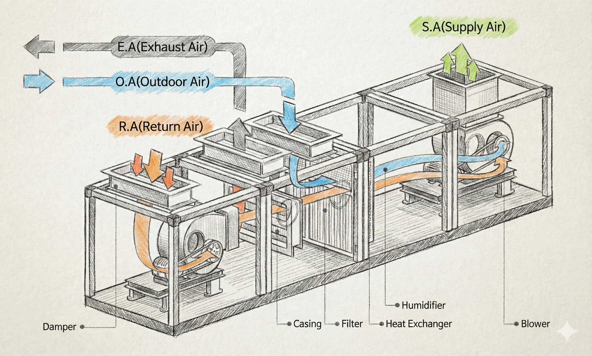
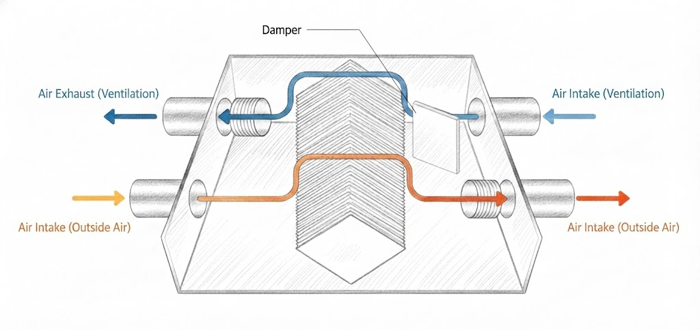

## 1. What Is a Duct System? - The Building's Air Lifeline

**A duct** is a pathway that moves air.
It is a core part of HVAC (heating, ventilation, and air conditioning) systems. Ducts are usually hidden above ceilings or inside walls, but they play a critical role in controlling airflow throughout a building.

Simply put, just as blood vessels carry blood through the body, **ducts deliver conditioned air to every part of a building**.

**What ducts do**

- Supply cooled or heated air to each room.
- Exhaust contaminated indoor air to the outside.
- Bring fresh outdoor air indoors.
- Remove fine dust and pollutants through filters.

> A well-designed duct system improves HVAC efficiency, comfort, and indoor air quality. Because ducts take up significant space, they should be planned from the early architectural design stage.

---

## 2. AHU (Air Handling Unit) - The "Heart" That Prepares Air for Ducts

To move air through ducts, you first need **equipment that conditions the air**. That equipment is the **AHU (Air Handling Unit)**.

**What an AHU does**

- **Filtering**: Removes dust and contaminants from incoming outdoor air.
- **Cooling/Heating**: Uses coils (chilled-water or hot-water piping) to control air temperature.
- **Humidification/Dehumidification**: Maintains humidity at an appropriate level.
- **Air delivery**: Uses a fan to push conditioned air into ducts.

> AHUs are commonly installed in mechanical rooms, on rooftops, or in ceiling spaces. In large buildings, multiple AHUs are often divided by floor or zone.

> Key idea: Think of the AHU as a factory, ducts as roads, and room diffusers/grilles as destinations. Air prepared by the AHU is delivered through ducts to each occupied space.

---

**AHU Variants by Purpose - Smaller or Specialized Air Units**

If a standard AHU is a large plant serving the whole building, there are also smaller or specialized units depending on function and scale.

- **PAU (Pre-cooling Air Handling Unit)**: Pre-treats outdoor air (cooling/heating/dehumidification) before supplying it indoors.
  - Often used with FCU systems. Since FCUs mainly recirculate indoor air, PAUs separately provide pre-treated fresh air.
  - Suitable for large hotels or commercial centers where outdoor air intake is important.
- **MAU (Make-up Air Unit)**: Supplies fresh air equal to the exhausted air volume.
  - Used in cleanrooms, semiconductor plants, operating rooms, and other spaces requiring strict temperature/humidity control.
  - Similar to PAU, but often offers more precise constant temperature/humidity control.
- **RCU (Recycled Air Handling Unit)**: Controls temperature/humidity by recirculating indoor air without introducing new outdoor air.
  - Used where outdoor air is unnecessary or limited (basement mechanical spaces, warehouses, some industrial facilities).

| Equipment | Role | Typical Applications |
| --- | --- | --- |
| AHU | Integrated outdoor/return air treatment for whole-building HVAC | Medium-to-large offices, commercial buildings |
| PAU | Pre-treat outdoor air and supply to FCU systems | Large hotels, commercial centers |
| MAU | Make-up air with precise temperature/humidity control | Cleanrooms, operating rooms, semiconductor plants |
| RCU | Indoor-air recirculation only | Basement spaces, warehouses, industrial facilities |
| FCU | Room-by-room cooling/heating | Hotel rooms, hospital wards |

> In many large projects, systems are combined rather than used alone (for example, AHU + PAU + FCU). The optimal mix depends on building use and indoor environmental requirements.

---

## 3. Duct Air Supply Methods

The way AHU-conditioned air is distributed to each space determines the system type.
The right choice depends on building use, size, and budget.

---

**Single-Duct System**

- The most basic system: one duct stream supplies either cool or warm air.
- Simple structure and relatively low installation cost.
- Limitation: because one supply condition serves many areas, **individual zone temperature control is difficult**.
- Best for spaces with simple usage patterns and limited need for individual control (classrooms, factories, warehouses).

> Adding a **reheat coil** at each room can provide partial zone-level temperature control, but this increases energy use.

---

**Dual-Duct System**

- Uses separate cold-air and hot-air ducts in parallel.
- Air is mixed at each zone inlet to achieve the desired local temperature.
- High comfort because each zone can set temperature independently.
- Drawbacks: requires two duct networks, more ceiling space, and higher cost.
- Common in premium office buildings and research facilities with diverse room functions.

> The mixing device is called a **mixing box**. It works with zone thermostats to automatically adjust cold/hot air mixing ratios.

---

**VAV (Variable Air Volume) System**

- VAV stands for **Variable Air Volume**.
- A VAV terminal unit in each zone automatically adjusts supply airflow according to room temperature.
- Delivers strong energy savings because airflow is supplied only as needed.
- Well suited to large offices, department stores, and airports where load varies by zone.

> VAV systems can also control AHU fan speed. During low-load periods (night or weekends), fan speed is reduced to significantly cut electricity consumption. This is often implemented with **inverter control**.

---

**FCU (Fan Coil Unit) System**

- FCU stands for **Fan Coil Unit**. Small terminal units are installed in each room.
- Each unit contains a fan and coil (chilled/hot water piping), recirculates room air, conditions it, and supplies it back.
- Because each room operates independently, **individual control flexibility is very high**.
- Common in hotels, hospital wards, and officetels where usage patterns differ by room.

> FCU systems reduce ceiling duct space because water piping, not full duct runs, is distributed to rooms. However, FCU filters must be cleaned regularly to maintain air quality.

> Key idea: For balanced comfort and energy efficiency, VAV is often advantageous. If priority is strict room-by-room control, FCU is usually the better fit.

---

## 4. Total Heat Exchanger - Ventilate While Saving Energy

When we ventilate, do we lose all cooling/heating energy?
A **total heat exchanger** is designed to solve this problem.

- While exhausting polluted indoor air, the unit transfers its **temperature and humidity** to incoming fresh outdoor air.
- In simple terms, it recovers energy from exhaust air to preheat or precool incoming air.
- With a heat recovery efficiency around 70-80%, it can greatly reduce ventilation-related energy loss.

**How it works**

- **Winter**: Warm indoor air (25 degC) is exhausted and transfers heat to cold outdoor air (0 degC) -> incoming air may be preheated to about 18-20 degC.
- **Summer**: Cool indoor air (26 degC) is exhausted and absorbs part of the heat from hot outdoor air (35 degC) -> incoming air is partially precooled.

> Many new apartments use ceiling-mounted ventilation units in bathrooms and kitchens that include total heat exchange. This allows fresh-air ventilation while maintaining HVAC efficiency even with windows closed.

> On heavy fine-dust days, these units can also provide cleaner outdoor air through high-performance filters such as **HEPA** filters. Filter replacement must be done regularly to maintain performance.

---

## 5. Recommended Duct Systems by Building Type

If you are unsure which method fits your building, use the table below.

| Building Type | Recommended Method | Reason |
| --- | --- | --- |
| Schools, factories, warehouses | Single-duct | Simple spaces, limited need for individual control, low cost |
| Premium offices, research labs | Dual-duct | Different room functions require independent temperature control |
| Large offices, department stores, airports | VAV | Large floor areas, varying zone loads, energy savings are critical |
| Hotels, hospitals, officetels | FCU | Full independent control required per room |
| New apartments, small offices | Total heat exchanger + single-duct | Meets ventilation requirements while saving energy |

> Key idea: You do not need to stick to one method only. In real projects, hybrid designs are common (for example, VAV + FCU, or single-duct + total heat exchanger). Matching the combination to use case and budget is the core of good design.

---
