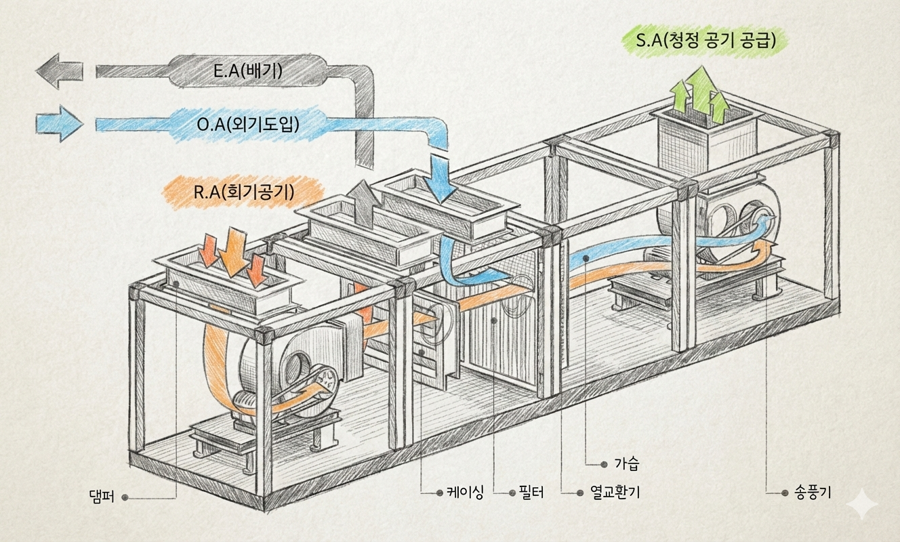
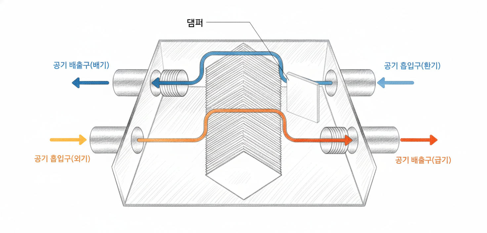

## 1. 덕트설비란? — 건물의 공기 핏줄

**덕트(Duct)란?** 공기를 이동시키는 통로입니다.
냉난방과 환기를 담당하는 공조(空調) 시스템의 핵심 인프라로, 천장 속이나 벽 안에 숨겨져 있어 평소엔 보이지 않지만 건물 내 공기 흐름을 좌우하는 핵심 설비입니다.

쉽게 말해, 혈관이 혈액을 온몸으로 운반하듯 **덕트는 조절된 공기를 건물 구석구석으로 전달**합니다.

**덕트가 하는 일**

- 냉방·난방된 공기를 각 실로 공급합니다.
- 오염된 실내 공기를 외부로 배출합니다.
- 신선한 외부 공기를 실내로 끌어들입니다.
- 필터를 통해 미세먼지·오염물질을 걸러냅니다.

> 🔎 덕트 시스템이 잘 설계되어야 냉난방 효율, 쾌적성, 실내공기질이 모두 좋아집니다. 설비 중에서도 특히 **공간을 많이 차지**하기 때문에 건축 초기 단계부터 함께 설계해야 합니다.
> 

---

## 2. 공기조화기(AHU) — 덕트에 공기를 만들어 넣는 심장부

덕트를 통해 공기를 보내려면, 먼저 **공기를 만드는 장치**가 필요합니다. 그것이 바로 **공기조화기(AHU, Air Handling Unit)** 입니다.

**AHU가 하는 일**

- **필터링** — 외부에서 들어오는 공기의 먼지·오염물질을 제거합니다.
- **냉각·가열** — 코일(냉수 또는 온수 배관)을 통해 공기 온도를 조절합니다.
- **가습·제습** — 공기의 습도를 적정 수준으로 유지합니다.
- **송풍** — 팬(Fan)으로 처리된 공기를 덕트에 밀어 넣습니다.

> 🔎 AHU는 주로 기계실, 옥상, 또는 각 층 천장 공간에 설치합니다. 대형 빌딩일수록 AHU도 대형화되고, 층별·구역별로 여러 대를 나눠 운용합니다.
> 

> 💡 **핵심 포인트:** AHU는 공장, 덕트는 도로, 각 실의 취출구는 목적지라고 생각하면 됩니다. AHU에서 만들어진 공기가 덕트를 타고 각 공간으로 배달됩니다!
> 

---

**📍 AHU의 형제들 — 목적별 소형·특수 공기조화기**

AHU가 건물 전체를 담당하는 '대형 공장'이라면, 용도와 규모에 따라 더 작고 특화된 장치들도 있습니다.

- **PAU(Pre-cooling Air handling Unit, 예냉식 공기조화기)** — 외부의 신선한 공기를 실내로 들여보내기 전에 미리 냉각·가열·제습 처리하는 장치입니다.
→ 주로 FCU 방식과 함께 사용합니다. FCU는 실내 공기를 순환시키는 역할만 하기 때문에, PAU가 신선한 외기를 전처리해서 별도로 공급해주는 역할을 담당합니다.
→ 대형 호텔, 상업센터처럼 외기 도입이 중요한 건물에 적합합니다.
- **MAU(Make-up Air Unit, 보충 공기 장치)** — 실내에서 배출된 공기량만큼 신선한 외기를 보충해주는 장치입니다.
→ 일정한 온도·습도 유지가 필요한 클린룸, 반도체 공장, 병원 수술실 등에서 사용합니다.
PAU와 비슷하지만 항온항습 기능을 더 정밀하게 제어할 수 있습니다.
- **RCU(Recycled air handling Unit, 순환식 공기조화기)** — 외기를 새로 들여오지 않고 실내 공기만 계속 순환시키며 온도·습도를 조절하는 장치입니다.
→ 외기 도입이 불필요하거나 제한적인 공간(지하 기계실, 창고, 일부 산업 시설)에 사용합니다.

| 장치 | 역할 | 주요 사용처 |
| --- | --- | --- |
| AHU | 외기+환기 통합 처리, 건물 전체 공조 | 중대형 오피스·상업시설 |
| PAU | 외기 전처리 후 FCU에 공급 | 대형 호텔·상업센터 |
| MAU | 배출 공기 보충, 정밀 항온항습 | 클린룸·병원 수술실·반도체 공장 |
| RCU | 실내 공기 순환만 담당 | 지하공간·창고·산업시설 |
| FCU | 각 실 개별 냉난방 | 호텔 객실·병원 병실 |

> 🔎 실제 대형 건물에서는 AHU 하나만 쓰는 게 아니라, AHU + PAU + FCU처럼 여러 장치를 조합해서 운용하는 경우가 많습니다. 건물의 용도와 실내 환경 기준에 따라 최적의 조합이 달라집니다.
> 

---

## 3. 덕트 공급 방식 🌬️

AHU에서 만들어진 공기를 각 공간에 어떻게 배분하느냐에 따라 방식이 나뉩니다.
건물의 용도, 규모, 예산에 따라 적합한 방식이 달라집니다.

---

**📍 단일 덕트 방식**

- 하나의 덕트로 냉풍 또는 온풍을 공급하는 가장 기본적인 방식입니다.
- 구조가 단순하고 시공 비용이 낮습니다.
- 단, 하나의 온도로 전체 공간에 공급하기 때문에 **구역별 온도 개별 조절이 어렵습니다.**
- → 학교 교실, 공장, 창고처럼 공간이 단순하고 개별 제어가 크게 필요 없는 곳에 적합합니다.

> 🔎 단일 덕트 방식에서도 각 실에 **재열 코일(Reheat Coil)** 을 추가하면 어느 정도 개별 온도 조절이 가능합니다. 다만 에너지 소비가 늘어나는 단점이 있습니다.
> 

---

**📍 이중 덕트 방식**

- 냉풍 덕트와 온풍 덕트를 **두 개로 나란히 설치**하고, 각 실 입구에서 두 공기를 혼합해 원하는 온도로 공급하는 방식입니다.
- 각 공간마다 온도를 따로 설정할 수 있어 쾌적도가 높습니다.
- 단, 덕트를 두 개 설치해야 해서 천장 공간을 많이 차지하고 **비용이 높습니다.**
- → 고급 오피스 빌딩, 연구소처럼 각 실의 용도가 다양하고 쾌적성이 중요한 건물에 사용합니다.

> 🔎 이중 덕트의 혼합 장치를 **혼합 박스(Mixing Box)** 라고 합니다. 각 실의 온도 조절기(Thermostat)와 연동되어 냉풍·온풍의 혼합 비율을 자동으로 조절합니다.
> 

---

**📍 변풍량(VAV) 방식**

- VAV는 **Variable Air Volume(가변 풍량)** 의 약자입니다.
- 각 공간에 VAV 유닛을 설치해, 실내 온도에 따라 **공급되는 공기의 양을 자동으로 조절**합니다.
- 필요한 만큼만 공기를 보내기 때문에 에너지 절약 효과가 뛰어납니다.
- → 대형 오피스, 백화점, 공항처럼 공간이 넓고 구역별 부하 차이가 큰 건물에 적합합니다.

> 🔎 VAV 방식은 AHU의 팬 속도도 함께 조절합니다. 냉방 수요가 적은 야간이나 주말에는 팬을 천천히 돌려 전기 소비를 크게 줄일 수 있습니다. 이를 **인버터 제어**라고 합니다.
> 

---

**📍 팬코일유닛(FCU) 방식**

- FCU는 **Fan Coil Unit** 의 약자로, 각 실마다 소형 공조 유닛을 설치하는 방식입니다.
- 유닛 안에 팬(선풍기)과 코일(냉온수 배관)이 들어 있어, 실내 공기를 빨아들여 차갑거나 따뜻하게 만든 후 다시 내보냅니다.
- 각 실에서 독립적으로 작동하므로 **개별 제어가 매우 자유롭습니다.**
- → 호텔 객실, 병원 병실, 오피스텔처럼 각 공간의 사용 패턴이 완전히 다른 곳에 많이 사용합니다.

> 🔎 FCU 방식은 덕트 없이 냉·온수 배관만 각 실로 연결하므로 **천장 공간을 적게 차지**합니다. 다만 각 실의 FCU 필터를 주기적으로 청소하지 않으면 공기질이 나빠질 수 있습니다.
> 

> 💡 **핵심 포인트:** 쾌적함과 에너지 효율을 동시에 잡으려면 VAV 방식이 유리합니다. 개별 제어가 최우선이라면 FCU 방식이 가장 적합합니다!
> 

---

## 4. 전열교환기 — 환기하면서 에너지를 아끼는 장치

환기를 하면 냉난방 에너지가 바깥으로 다 빠져나가지 않을까요?
이 문제를 해결하는 장치가 바로 **전열교환기**입니다.

- 실내의 오염된 공기를 내보내면서, 그 공기가 가진 **온도와 습도를 바깥에서 들어오는 신선한 공기에 전달**합니다.
- 쉽게 말해, 버리는 공기의 열을 회수해서 새 공기를 미리 데우거나 식혀주는 방식입니다.
- 열 회수율이 약 70~80%에 달해 환기로 인한 에너지 손실을 크게 줄일 수 있습니다.

**전열교환기의 작동 원리**

- **겨울** — 따뜻한 실내 공기(25°C)를 배출하면서 차가운 외기(0°C)에 열을 전달 → 실내로 들어오는 공기가 약 18~20°C로 예열된 채 유입됩니다.
- **여름** — 시원한 실내 공기(26°C)를 배출하면서 뜨거운 외기(35°C)의 열을 미리 흡수 → 들어오는 공기가 어느 정도 냉각된 채 유입됩니다.

> 🔎 요즘 신축 아파트 화장실·주방 천장에 설치된 환기 유닛이 바로 전열교환기입니다. 창문을 닫아도 신선한 공기를 공급하면서 냉난방 효율을 유지할 수 있습니다.
> 

> 🔎 미세먼지가 심한 날에도 전열교환기는 **헤파(HEPA) 필터** 등을 통해 외부 공기를 정화한 뒤 공급하므로, 창문을 열지 않고도 깨끗한 공기로 환기가 가능합니다. 단, 필터는 정기적으로 교체해야 효과가 유지됩니다.
> 

---

## 5. 건물 용도별 덕트 방식

어떤 방식이 건물에 맞는지 헷갈린다면, 아래 표를 참고해 보세요.

| 건물 용도 | 추천 방식 | 이유 |
| --- | --- | --- |
| 학교·공장·창고 | 단일 덕트 | 공간 단순, 개별 제어 불필요, 저비용 |
| 고급 오피스·연구소 | 이중 덕트 | 실마다 용도가 달라 개별 온도 조절 필요 |
| 대형 오피스·백화점·공항 | VAV | 넓은 공간, 구역별 부하 차이 큼, 에너지 절약 중요 |
| 호텔·병원·오피스텔 | FCU | 객실마다 완전 독립 제어 필요 |
| 신축 아파트·소형 오피스 | 전열교환기 + 단일 덕트 | 환기 의무화 + 에너지 절약 동시 달성 |

> 💡 **핵심 포인트:** 하나의 방식만 고집하지 않아도 됩니다. 실제 건물에서는 VAV + FCU, 단일 덕트 + 전열교환기처럼 **두 가지 방식을 혼합**해 사용하는 경우도 많습니다. 용도와 예산에 맞게 조합하는 것이 핵심입니다!
> 

---