# 건축설비란?

건축설비는 건물의 보이지 않는 성능을 결정하는 핵심 요소이며, 실내 환경(온도·습도·공기질)과 위생·안전, 그리고 에너지 비용에 직접적인 영향을 미칩니다. 특히 최근 건물은 고단열·고기밀화가 일반화되면서, 실내 쾌적성은 향상되는 반면 열·수분·공기 흐름을 적절히 관리하지 못할 경우 결로, 곰팡이, 냄새, 과도한 에너지 사용 등 다양한 문제가 발생할 가능성도 함께 증가하였습니다. 모든 설비 시스템은 건물 외피와 실내 조건의 영향을 받으며, 열 손실·열 획득 및 수분 거동을 정확히 이해하지 못하면 설비 용량이 과대·과소 산정되거나(비용·쾌적성 저하), 결로와 같은 하자가 반복될 수 있습니다. 따라서 건물 성능의 기본 원리(열·수분·공기·압력)를 이해하는 것은 설비 계획을 문제 예방과 성능 확보 관점에서 바라보기 위해 이해해야 하는 분야입니다. 

본문에서는 냉난방부하 및 단열(열관류율/열관류저항/열전도율/열전달률), 열교, 결로를 먼저 다루고, 배관설비, 통기설비, 공조설비, 환기설비를 설명하며 건물 내에서 물·공기·열이 어떻게 이동하고 제어되는지를 단계적으로 다룹니다. 

---

# 냉난방부하

냉난방부하(Heating/Cooling Load)란, 건물의 실내 환경(온도·습도 등)을 목표 조건으로 유지하기 위해 설비가 제거(냉방) 또는 공급(난방)해야 하는 열량(열에너지 요구량)을 의미합니다. 즉, 냉난방부하는 설비 용량 산정의 기준이 되는 요구 열량이며, 설비 용량(capacity)은 해당 요구량을 충족하기 위해 장비가 제공할 수 있는 능력을 의미합니다.

---

## 열부하의 주요 구성

| 구분   | 유형    | 세부분하                              | 냉방(현열) | 냉방(잠열) | 난방(현열) | 난방(잠열) |
| ---- | ----- | --------------------------------- | :----: | :----: | :----: | :----: |
| 실내부하 | 외부(면) | 유리면 투과일사                          |    ○   |        |        |        |
| 실내부하 | 외부(면) | 외기 접한 구조체 및 유리의 전도열               |    ○   |        |    ○   |        |
| 실내부하 | 외부(면) | 침입공기(창문, 문, 개구부 및 틈새)             |    ○   |    ○   |    ○   |    ○   |
| 실내부하 | 내부    | 조명발열                              |    ○   |        |        |        |
| 실내부하 | 내부    | 인체발열                              |    ○   |    ○   |        |        |
| 외부부하 | 외기온습도 | 외기를 실내 상태와 같게 하는데 필요로 하는 열량(도입외기) |    ○   |    ○   |    ○   |    ○   |

- 유리면 투과일사 → 햇빛(일사)이 유리를 통해 들어오면 실내의 온도 상승을 유발합니다. 난방 시에는 부하가 아니라 오히려 가열을 돕는 열획득이 될 수 있습니다.

- 외기 접한 구조체 및 유리의 전도열 → 벽·지붕·창 등을 통해 열이 전도·관류로 들어오거나 나갑니다. (여름: 외부 열이 들어와 냉방 필요, 겨울: 실내 열이 빠져나가 난방 필요.)

- 침입공기(틈새/개구부) → 침입공기는 외기가 실내로 들어오며 생기는 부하로, 외기는 온도 차(현열)뿐 아니라 습기 차(잠열)도 함께 가지고 들어옵니다. (여름: 덥고 습한 공기 유입, 겨울: 차고 건조한 공기 유입)

- 조명발열 → 조명은 전기에너지가 대부분 열로 전환되어 실내 온도를 올리게 됩니다.난방 시에는 내부 발열이 난방 부담을 줄이는 방향이 될 수 있습니다.

- 인체발열 → 사람은 체온으로 인해 현열을 방출하고, 호흡·발한으로 수증기(잠열)도 방출합니다. 역시 난방 시에는 인체발열이 난방 요구량을 줄이는 방향이 될 수 있습니다.

- 도입외기(환기 외기) → 도입외기는 의도된 공기 교환입니다. 외기를 실내 조건(온도·습도)로 맞추는 데 에너지가 필요합니다.

---

## 단열 관련 주요 용어

1) 열관류율(U-value)

열관류율은 공기층–벽체–공기층으로 구성된 외피를 기준으로, 실내외 공기 온도 차가 1℃일 때 1㎡의 면적을 통해 단위 시간당 전달되는 열량을 의미합니다. 열관류율이 클수록 열이 쉽게 통과하므로 단열 성능은 저하됩니다. 또한 벽체 내·외부 공기층에서 대류(공기 이동)가 증가할 경우 열전달이 촉진되어 열관류율이 증가하고 열손실이 커질 수 있습니다.

2) 열관류저항(R-value)

열관류저항은 열관류율의 역수에 해당하는 개념으로, 열이 통과하는 것을 저지하는 정도를 의미합니다. 열관류저항이 클수록 단열 성능은 우수한 것으로 해석합니다.

3)  열전도율(k 또는 λ)

열전도율은 재료 자체의 물성으로서, 재료 양쪽 표면의 온도차가 1℃일 때 단위 시간 동안 1㎡ 면적을 통해 1m 두께를 통과하는 열량입니다.
열전도율이 낮은 재료일수록 열이 잘 전달되지 않으므로, 단열재는 일반적으로 열전도율이 낮은 재료로 구성됩니다.

4) 열전달률(대류 열전달 계수, h)

열전달률은 유체(공기·물)와 고체(벽체·열교환기 표면 등) 사이에서 열이 이동하는 정도입니다. 이는 공기 유동(풍속), 표면 상태 등에 영향을 받으며, 표면과 주변 유체 간 열교환 성능을 좌우합니다.

---

## 단열재의 등급 분류

다음은 단열재의 열전도율 범위에 따라 분류된 단열재의 등급입니다.

| 등급 | 열전도율 범위 (W/m·K) *(20±5℃ 시험조건: KS L 9016, KS L ISO 8301 또는 8302)* | 관련 표준                                                  | 단열재 종류                                                                                                                                                                                                                                                                                                                                       |
| -- | ---------------------------------------------------------------: | ------------------------------------------------------ | -------------------------------------------------------------------------------------------------------------------------------------------------------------------------------------------------------------------------------------------------------------------------------------------------------------------------------------------- |
| 가  |                                                         0.034 이하 | KS M ISO 4898 KS L 9102 KS M 3871-1 KS F 5660 | - 압출법보온판 Ⅰ종 (A-1, A-2), Ⅱ종 (A, B-1, B-2), Ⅲ종 (A, B-2, C) - 비드법보온판 Ⅰ종 A-1, Ⅱ종 A-1, Ⅲ종 (A-1, A-2, B) - 경질우레탄폼보온판 Ⅰ종 (A, B, C, D, E), Ⅱ종 (A, B, C), Ⅲ종 (A, B, C) - 페놀 폼 Ⅰ종 (A, C, D), Ⅱ종 A - 그라스울 보온판 48K, 64K, 80K, 96K, 120K - 분무식 중밀도 폴리우레탄 폼 1종(A, B), 2종(A, B) - 폴리에스테르 흡음 단열재 1급 - 기타 단열재로서 열전도율이 0.034 W/m·K 이하인 경우 |
| 나  |                                                    0.035 ~ 0.040 | KS M ISO 4898 KS L 9102 KS M 3871-1 KS F 5660 | - 비드법보온판 Ⅰ종 A-2, Ⅱ종 (A-2, B), Ⅲ종 C - 페놀 폼 Ⅰ종 B, Ⅱ종 B, Ⅲ종 A - 미네랄울 보온판 1호, 2호, 3호 - 그라스울 보온판 24K, 32K, 40K - 분무식 중밀도 폴리우레탄 폼 1종(C) - 폴리에스테르 흡음 단열재 2급 - 기타 단열재로서 열전도율이 0.035~0.040 W/m·K 이하인 경우                                                                                                                             |
| 다  |                                                    0.041 ~ 0.046 | KS M ISO 4898 KS F 5660                             | - 비드법보온판 Ⅰ종 (B, C) - 폴리에스테르 흡음 단열재 3급 - 기타 단열재로서 열전도율이 0.041~0.046 W/m·K 이하인 경우                                                                                                                                                                                                                                                        |
| 라  |                                                    0.047 ~ 0.051 | (해당 없음 / 기타 단열재)                                       | - 기타 단열재로서 열전도율이 0.047~0.051 W/m·K 이하인 경우                                                                                                                                                                                                                                                                                                    |

---

## 단열 설계 위치에 따른 분류

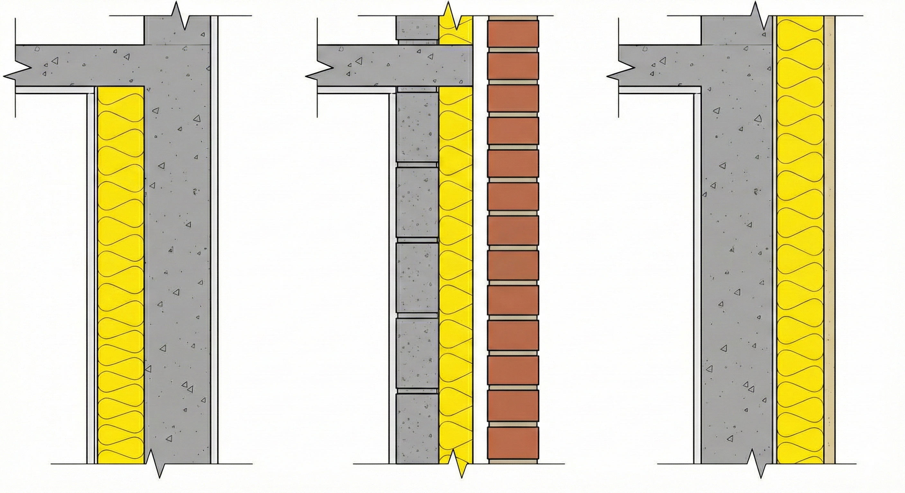

1) 내단열(실내측 단열)

내단열은 단열재를 실내측에 배치하는 방식입니다. 구조체의 열용량(열관성)이 상대적으로 낮게 작용하여 실내 온도 변화에 대한 응답이 빠르며, 간헐 난방 조건에서 유리한 특성을 갖습니다. 다만 실내측 수증기가 벽체 내부로 이동할 경우 내부 결로 위험이 증가할 수 있어, 외단열 대비 결로 방지 측면에서 불리합니다. 또한 구조적 단차나 부재 접합부에서 단열 연속 확보가 어려워 열교 발생 가능성이 상대적으로 높습니다.

2) 중단열(벽체 중간 단열)

중단열은 단열재를 벽체 내부 또는 중간층에 배치하는 방식입니다. 단열재 외측 벽체가 저온 상태가 되기 쉬워 내부 결로 발생 우려가 존재하며, 일반적으로 고온측(실내측)에 방습막 설치를 권장합니다.

3) 외단열(실외측 단열)

외단열은 단열재를 실외측에 연속적으로 배치하는 방식으로, 구조체가 실내측에 위치하여 열관성이 커지고 실내 온도 변동이 완만해지는 경향이 있습니다. 연속난방에 유리하며, 건물 전체 구조체 보온 및 열교 저감에 유리하여 내부 결로 위험을 낮출 수 있다는 장점이 있습니다. 다만 단열재가 외부 환경에 노출되므로 내구성, 외부 충격 및 마감 품질이 요구되며 열화·표면 손상 우려가 있고, 공사비가 상대적으로 높습니다.

## 단열 관련 현상

1) 열교(Heat Bridge) 현상

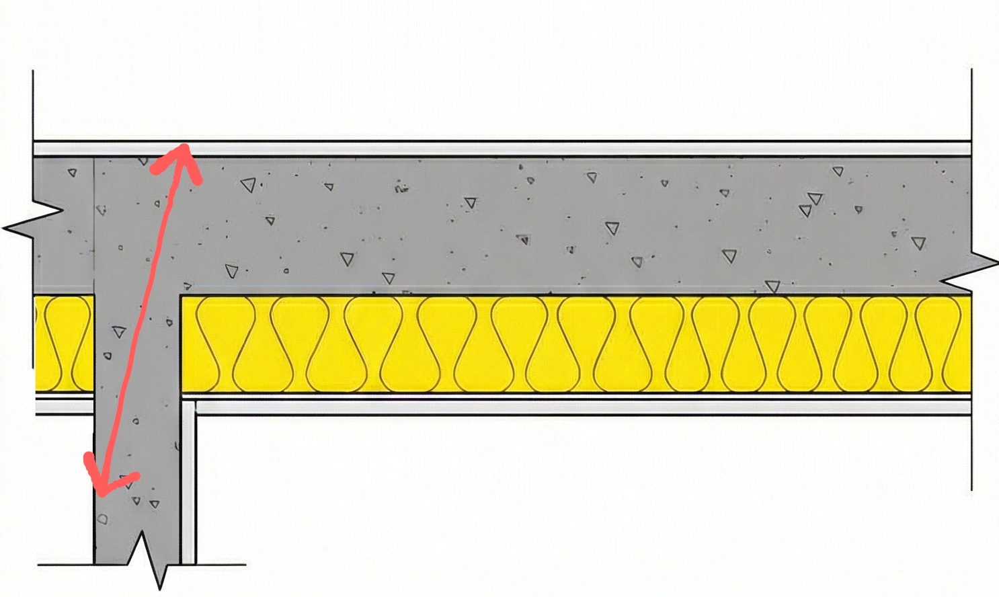

열교란 단열이 연속되지 않거나 단열 성능이 급격히 저하되는 열적 취약 부위를 의미합니다. 열교가 발생하면 해당 부위에서 열이 우회적으로 전달되어 구조체 전체 단열 성능이 저하될 수 있으며, 표면온도 저하로 인해 결로 및 곰팡이 발생 위험이 증가합니다. 일반적으로 내단열 적용 시 열교 취약부가 빈번하게 발생할 수 있습니다.

2) 결로(Condensation) 현상

결로는 실내 공기 중 수증기가 벽체 또는 창호 표면에서 응결하여 물방울 형태로 맺히는 현상을 의미합니다. 결로는 통상 다음 조건에서 발생 가능성이 증가합니다.

- 벽체 열관류율이 큰 경우: 열이 쉽게 빠져나가 표면온도가 낮아지고 노점온도 이하로 떨어질 가능성이 커집니다.
- 건물 기밀성이 높은 경우: 틈새가 작아 실내 발생 수증기가 외부로 배출되기 어렵고, 실내 습도가 상승하여 결로 위험이 증가합니다.

---

# 배관설비

배관은 급수·급탕·난방(또는 냉방) 등 다양한 설비 기능의 운반 체계이며, 건물의 위생과 운영 안정성을 좌우합니다. 배관의 기본 원리(유량·압력·손실)를 이해하면, 누수·소음·수압 불량 같은 문제를 원인 구조로 해석할 수 있게 됩니다.

---

## 배관의 기본 원리

- 유량(Q): 얼마나 많이 보내는지 (L/min, m³/h)
- 압력(ΔP): 얼마나 밀어주는 힘이 필요한지 (kPa, bar)
- 품질: 물이면 수질/온도, 냉난방이면 부식·스케일·동파, 가스면 누설 안전 등

배관 설계에서 가장 흔한 오해가 관이 크면 무조건 좋다고 생각하는 것입니다. 관이 너무 크면 재료비가 증가하는 것은 물론, 체류수가 증가해 위생적인 문제가 생기고, 온도 유지에도 불리해집니다. 반대로 관이 너무 작아도 압력손실, 소음, 유속이 커지며 들어가는 에너지도 늘어납니다. 따라서 관경은 경험값과 유속·압력손실을 기준으로 잡는 것이 안전합니다.

압력손실은 크게 두 종류로 구분됩니다.

- 마찰손실(직관): 관, 벽 마찰
- 국부손실(부속류): 엘보, 티, 밸브, 감압밸브, 스트레이너 등

긴 배관은 직관 손실이 지배적이고, 기계실/샤프트처럼 부속이 많으면 국부손실이 지배적인 경우가 많습니다. 때문에 같은 길이여도 밸브·엘보를 많이 쓰면 펌프가 더 필요해집니다.
또한 유속이 증가하면 손실은 급격히 증가하는 경향이 있습니다. 그래서 관을 조금 키우는 것이 펌프 용량/에너지 비용을 크게 줄이기도 합니다.

## 밸브 유형

배관설비는 물·증기·가스 등 유체를 운반하는 시스템이며, 밸브는 해당 시스템에서 유량과 흐름 방향을 제어하고 유지관리·안전·운전 안정성을 확보하는 핵심 부품입니다.
그렇기에 동일한 밸브라도 내부 구조에 따라 다음과 같은 성능 차이가 발생합니다.

- 압력손실(관내 마찰저항): 밸브가 흐름을 얼마나 방해하는지
- 차단 목적/조절 목적: 완전히 열고 닫는 용도인지, 중간 조절이 가능한지
- 역류 방지: 흐름 방향을 한쪽으로만 제한하는지
- 공기 배출·수위 제어: 배관 내 공기, 탱크 수위 등 운전 문제를 자동으로 관리하는지

따라서 밸브의 종류는 설비 시스템의 성능(에너지·소음·수격)과 안전(역류·오염·파손), 유지관리성(점검·수리)을 좌우할 수 있습니다.

### 1. 게이트 밸브(슬루스 밸브)

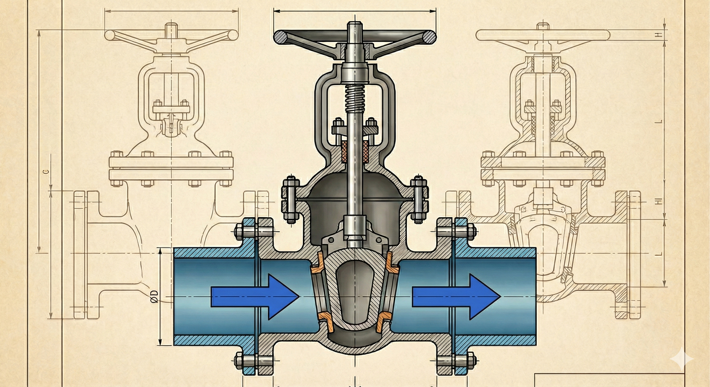

주요 목적: 차단용(ON/OFF)
특징: 밸브가 완전히 열렸을 때 유로가 비교적 직선에 가까워 압력손실(마찰저항)이 작습니다.

완전 개방 시 손실이 적은 차단 밸브로, 물·증기 배관에 널리 사용됩니다. 증기배관 수평관에서 응축수(드레인) 고임을 최소화하는 배관 구성과 함께 고려되는 경우가 있습니다.

### 2. 글로브 밸브

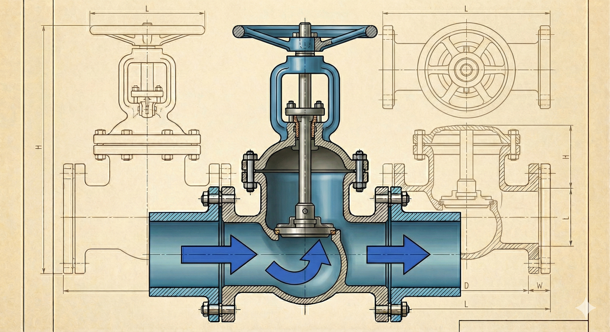

주요 목적: 조절용(유량 제어)
특징: 유로가 굴절되어 압력손실이 큰 편이며, 설치·운전 조건에 따라 내부에 기체가 체류할 가능성이 제기되기도 합니다(배관 내 공기 관리와 함께 검토 필요).

조절은 잘 되지만 손실이 큰 밸브로, 유량을 세밀하게 조정해야 하는 구간에 사용합니다.

### 3. 체크 밸브(역지밸브)

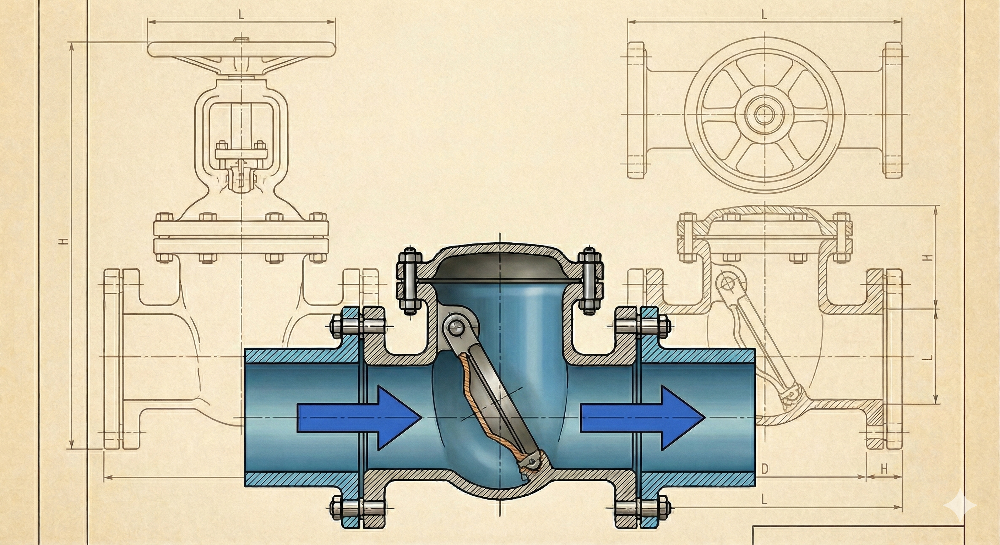

주요 목적: 역류 방지
특징: 유체가 한 방향으로 흐를 때는 열리고, 반대로 흐르려 하면 닫혀 역류를 차단합니다.

펌프 정지 시 역류, 오염 역류를 막는 안전장치 성격의 밸브입니다.

### 4. 플러시 밸브

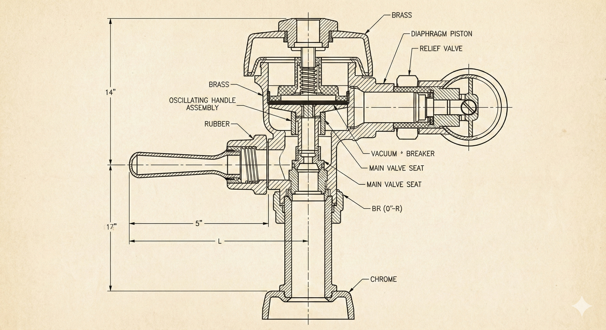

주요 목적: 누름 동작에 의한 급수 후 자동 폐쇄
특징: 일정량 급수 후 자동으로 닫히는 구조입니다.

자동 폐쇄 + 역류(진공) 방지 장치와 세트로 보는 밸브입니다. 위생·역류오염 방지를 위해 진공방지기 또는 역류방지기가 필요합니다.

### 5. 콕 밸브(Plug Cock)

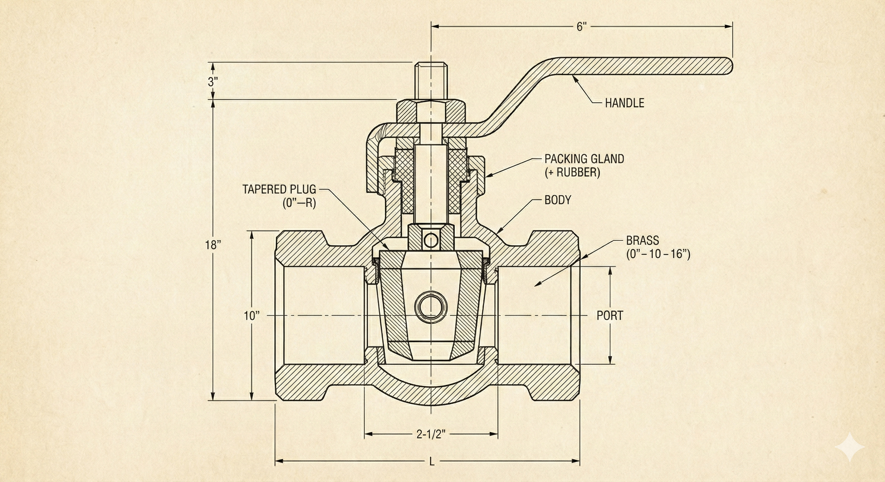

주요 목적: 차단(간단 개폐)
특징: 구조가 단순하고 가스 배관 등에 사용합니다.

원추형 몸체에 구멍이 있으며 약 90° 회전으로 개폐하는 구조를 가진 밸브입니다.

### 6. 버터플라이 밸브

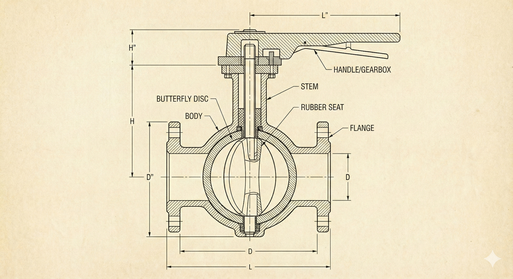

주요 목적: 차단 및 간단 조절
특징: 회전각으로 개폐가 빠르며, 구경이 큰 배관에서 사용되는 경우가 많습니다.

배관 내부의 원판(디스크)이 회전하며 개폐되는 구조의 밸브입니다.

### 7. 플로트 밸브

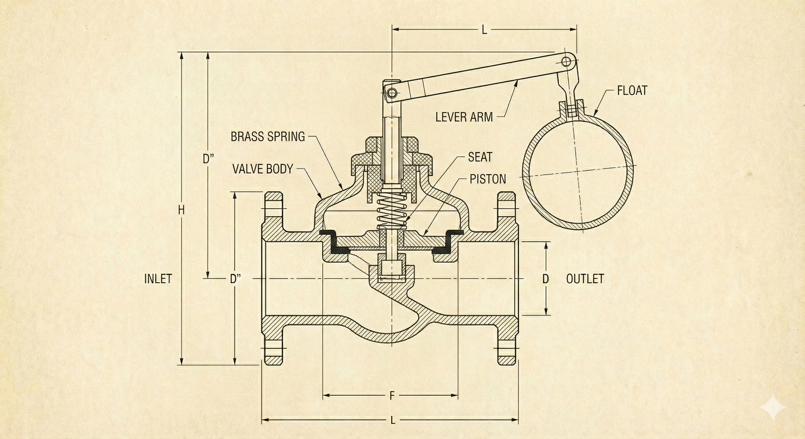

주요 목적: 수위 자동 제어
특징: 부력을 이용하여 수위 변화에 따라 자동 개폐합니다.

물탱크·저수조 등 수위 유지가 필요한 설비에 사용하는 밸브입니다.

---

## 배관 청소구(Cleanout)

배수 배관은 운전 중 이물, 침전물 등으로 막힘이 발생할 수 있으므로, 유지관리(점검·세정)를 위한 접근 지점(청소구) 확보가 필요합니다.

- 설치 간격

    배수관 호칭지름 DN100 이하: 15m 이내마다 청소구 설치
    배수관 호칭지름 DN125 이상: 30m 이내마다 청소구 설치

- 대표 설치 위치

    수평배수관의 최상단부
    수직배수관의 최상단부 및 최하단부
    배관이 45° 이상 굽어지는 경우(방향 전환부)

---

## 배관 색채 기호(KS A 0503)

배관 색채 기호는 배관 내 유체 종류(예: 급수, 급탕, 난방, 냉수, 증기, 가스, 소화 등)를 현장에서 즉시 식별하기 위한 표준 체계입니다.

| 종류    | 식별색            |
| ----- | -------------- |
| 물     | 파랑(청색)         |
| 증기    | 어두운 빨강(진한 적색)  |
| 공기    | 하양(백색)         |
| 가스    | 연한노랑(황색)       |
| 산·알칼리 | 회보라            |
| 기름    | 어두운 주황(진한 황적색) |
| 전기    | 연한주황(엷은 황적색)   |

---

# 통기설비

통기설비의 핵심 목적은 배수 배관 내부의 압력을 안정화하여, 배수 과정에서 발생하는 압력 변동이 위생·운전 문제로 이어지는 것을 예방하는 데 있습니다. 구체적으로 통기관(vent pipe)은 다음 기능을 수행합니다.

- 트랩 봉수(물막이) 보호: 배수 시 배관 내 음압·양압이 반복되면 트랩의 봉수가 빨려 나가거나(봉수 파괴), 밀려 올라오는 현상이 발생할 수 있습니다. 봉수가 사라지면 하수 악취·해충·유해가스가 실내로 유입될 수 있으므로, 통기관은 압력 변동을 완화하여 봉수를 보호합니다.
- 배관 내 공기 유통(신선 공기 공급 및 가스 배출 경로 확보)
배수관 내부에 공기 흐름이 확보되면 배관 내부의 기체 정체가 완화되고, 배수 흐름이 안정적으로 유지됩니다.
- 배수 흐름의 원활화(배수 성능 유지)
통기가 부족하면 공기 저항으로 인해 배수 불량, 소음, 역류 위험 등이 증가할 수 있습니다.

---

## 통기 배관법

1) 1관식 배관법(단관식 통기)

1관식은 별도의 통기관을 독립적으로 설치하지 않고, 배수 수직주관의 상부를 옥상까지 연장하여 개구함으로써 통기 기능을 겸하게 하는 방식입니다. 이때 배수 수직관 상부 연장부를 신정통기관(배수통기관)으로 지칭합니다. 구성은 단순하나, 건물 규모·기구 수·배수 부하가 커질수록 압력 안정화 성능에 한계가 있습니다.

2) 2관식 배관법(복관식 통기)

2관식은 배수관과 별도로 전용 통기관(통기수직관 등)을 독립 배관하여 통기를 확보하는 방식입니다. 압력 안정화 및 봉수 보호 성능이 상대적으로 우수하며, 기구가 많고 높이가 큰 건물(특히 고층)에서 널리 적용됩니다.

3) 특수통기(통기·배수 겸용 또는 대체 방식)

특수통기는 배관 형상 또는 부속장치 등을 통해 통기 성능을 확보하거나 통기관의 필요성을 줄이기 위한 방식을 의미합니다. 일부 방식은 통기와 배수를 겸하는 구간(습식 통기 개념)을 포함합니다.

---

## 통기관의 종류

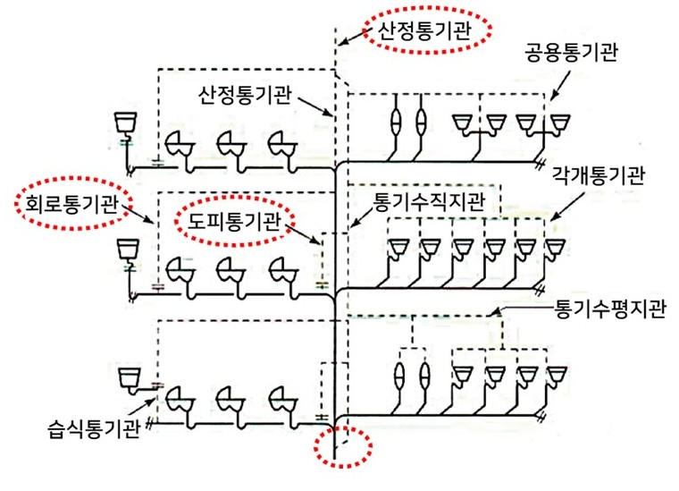

(푸른기술, https://bluetechnology.co.kr/61/?bmode=view&idx=12843588)

1) 각개통기관

    각 기구(위생기구) 또는 기구의 트랩 단위로 설치되는 통기관입니다. 각개통기관은 통기수평지관을 통해 통기수직관으로 연결되는 방식에 사용되며, 각 기구마다 통기가 되므로 성능이 우수하다는 장점이 있습니다. 그러나 배관의 양이 늘어나기 때문에 시공이 어려워진다는 단점 역시 존재합니다.

2) 루프(회로·환상) 통기관

    하나의 통기관으로 2개 이상의 기구 트랩을 보호하는 방식입니다. 각개통기관에 비해 배관이 적게 등고 시공이 용이합니다. 보호 기구의 수는 최대 8대 이하로 하고, 배관의 관경은 32mm 이상, 통기수직관과 최상류 기구까지의 길이는 7.5m 이내로 합니다.

3) 도피통기관

    루프통기에서 통기 효율을 높이기 위해, 최하류 측에서 루프통기관(또는 통기주관)으로 직접 접속하여 공기 흐름을 보강하는 배관입니다. 수직관 및 회로통기관에서 가장 먼 하류 기구의 기구배수관과의 관계를 고려하여 배수 수평지관에 연결합니다.

4) 습식통기관

    루프통기관의 최상류에 위치한 배관으로 통기와 배수를 겸하는 구간입니다. 즉, 통기관이 건식(공기만)이 아니라 일시적으로 물이 흐를 수 있는 조건을 포함한다는 점이 특징입니다.

5) 신정통기관(1관식 통기관)

    배수 수직관 상부를 그대로 연장하여 옥상 등에서 개구하는 통기관입니다. 배수수직관 상부를 연장하여 설치하며, 관경은 배수수직관 관경 이상으로 합니다.

6) 결합통기관

    고층 건물에서 오배수 수직관과 수직통기관 사이를 일정 간격마다 연결하는 통기관입니다. 고층 건물에서는 오배수 수직관이 길어질수록 연결되는 기구수가 많아지고, 낙차도 크므로 관내 기압의 변동성이 커지게 됩니다. 이때 최상층부터 일정 간격마다 배수수직관과 통기수직관 사이에 설치하여 관내 압력 변동성을 줄이는 것이 결합통기관입니다.

7) 반송통기관

    창이 있는 벽에 설치되는 세면기, 거실 가운데 설치되는 싱크대, 실험 싱크대, 또는 벽면에서 멀리 이격된 기구 등에 사용되는 통기관으로서, 입상통기관을 설치하기 곤란한 경우 기구 위에서 U자로 올렸다가 구부려 설치하는 통기관입니다.

8) 통기헤더

    신정통기관과 통기주관을 연결하는 수평 연결관(헤더 구간)입니다.

---

## 특수통기 방식

1) 섹스티아 접속: 배수수직관에서 섹스티아 이음쇠에 섹스티아 벤드관을 설치하여 선회력을 발생시키고, 이를 통해 가운데 쪽으로 공기 코어를 형성해 배수와 통기를 겸하는 방식입니다. 별도 통기관이 불필요합니다.

3) 소벤트(Sovent) 방식: 배수 수직관에 층별로 기포 주입 장치를 설치하여 배수에 공기를 주입하고, 이를 통해 유속을 감소시키는 방식입니다. 역시 별도 통기관이 불필요합니다.

---

# 공조설비

공조설비(HVAC 중 Air Conditioning)는 실내의 온도·습도·기류·청정도를 목표 수준으로 유지하기 위해, 공기와 열원을 이용해 열(현열)과 수분(잠열)을 동시에 제어하는 시스템입니다. 따라서 공조 방식의 선택은 단순 냉난방 가능 여부가 아니라 다음과 같은 요소에 직접적인 영향을 미치게 됩니다.

- 쾌적성: 온도 균일성, 기류 분포, 습도 안정성
- 위생·공기질: 외기 도입, 필터링, 오염실 적용 가능 여부
- 건축 계획: 덕트 샤프트/천장 공간, 기계실 면적, 실 유효면적
- 에너지/운영비: 부분부하 대응, 열회수 가능성, 외기냉방 적용성
- 유지관리성: 장치 분산/집중, 접근성, 내구성

---

## 열수송에 따른 대표 공조 방식

### 전공기 방식(All-Air System)

냉난방 및 습도 제어를 공기로 수행하며, 공조기(AHU)에서 처리된 공기를 덕트로 각 실에 공급하는 방식입니다. 온·습도 제어가 상대적으로 용이하고 실내 기류 분포가 양호하며, 실내에 기기가 없어 실 유효면적 확보에 유리합니다. 외기냉방 및 열회수(Heat Recovery) 적용이 비교적 쉽다는 장점도 있습니다. 하지만 덕트 공간이 커지고, 천장 내 샤프트/플리넘 요구가 증가하며 공조기계실 등 설비 공간이 크게 필요하다는 것이 단점입니다.

전공기 방식에는 CAV, VAV, 이중덕트, 멀티존 유닛, 각 층 유닛 방식이 있습니다.

1) 단일덕트 정풍량 방식(CAV: Constant Air Volume)

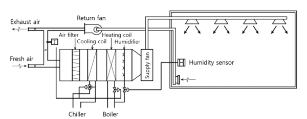

덕트에서 풍량을 일정하게 공급하며, 실 부하 변화에 따라 온도와 습도를 조절하는 방식입니다. 시스템이 단순하여 설비비가 비교적 낮습니다. 일정 풍량 또는 대풍량이 필요한 경우 적합하며, 부하 조절이 어려워 부하가 작은 공간에서 불쾌감을(과냉/과열 등) 유발할 수 있습니다.

2) 단일덕트 변풍량 방식(VAV: Variable Air Volume)

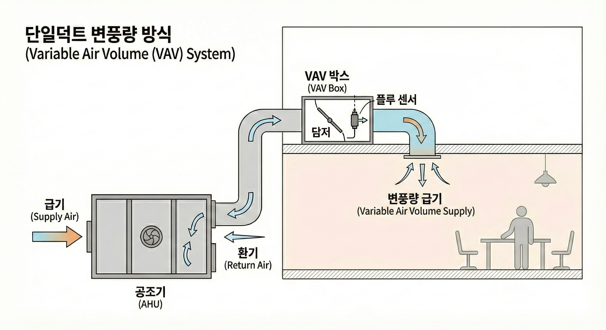

실 부하 변화에 따라 공급하는 풍량을 변화시켜 제어하는 방식으로, 부분부하 대응에 유리합니다. 정풍량 대비 기기 용량의 축소가 가능하고 에너지 절약에 유리하나, 설비비가 증가하며 대풍량·정풍량이 필요한 청정도 중심 요구에는 부적합할 수 있습니다.

3) 이중덕트 방식(Double Duct)

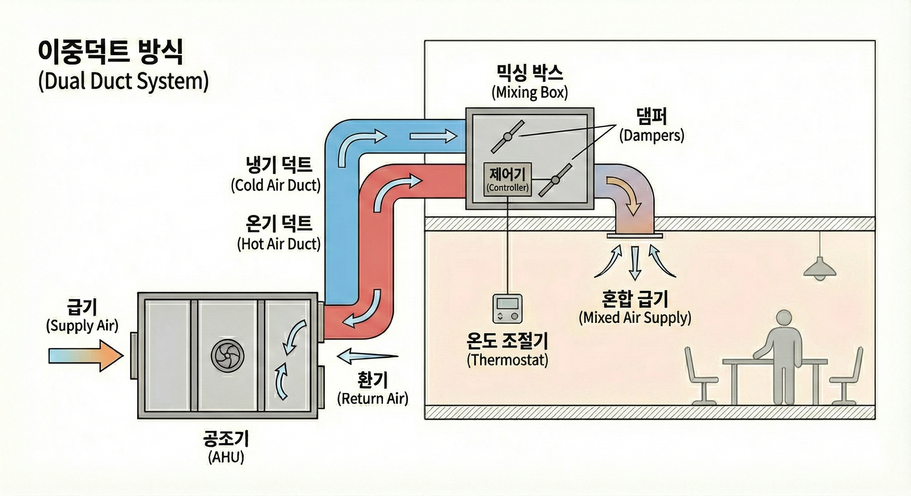

중앙공조기에서 냉풍과 온풍을 별도 덕트로 공급하고, 실별로 혼합하여 송풍하는 방식입니다. 실별로 냉난방 부하가 동시에 발생하는 경우 유리하며, 교체 밸브가 필요 없습니다. 하지만 에너지 소비가 크며 덕트의 종류가 2가지이기 때문에 설비비가 고가입니다.

4) 각층 유닛 방식(Floor-by-Floor Unit)

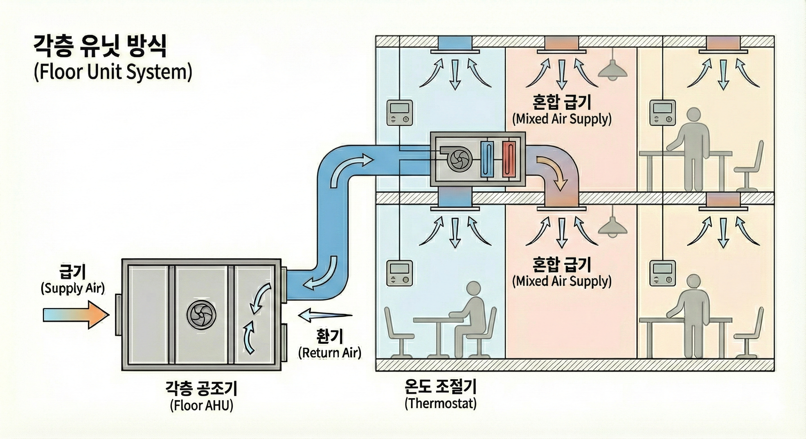

공조 계통을 세분화하여 각 층마다 공조기를 배치하는 방식입니다. 기계실을 크게 두지 않고 천장 내부 등 분산 배치로 구성되며, 이 때문에 층별 운영·관리 단위를 명확히 할 수 있습니다. 대신 천장 내부 공간·점검 접근성 등 건축 계획과의 조율이 필요합니다.

5) 멀티존 유닛 방식(Multi-Zone Unit)

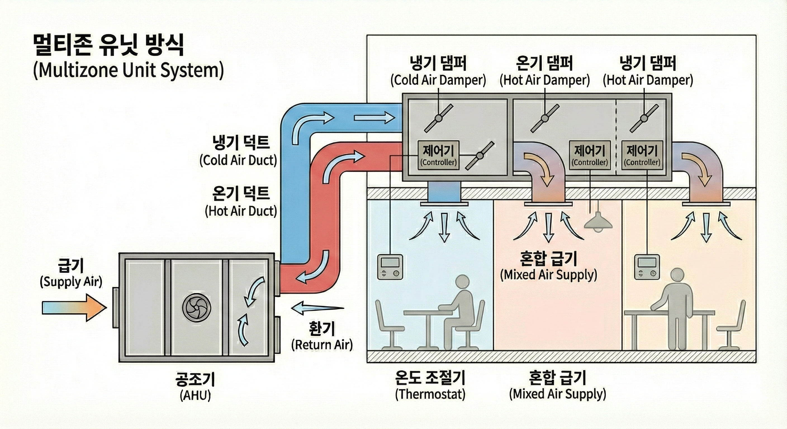

이중덕트의 변형으로, 중앙 냉난방 장치의 조절 밸브 등을 사용해 냉난방 비율을 조정한 뒤 구역별 덕트로 공급하는 방식입니다. 하나의 유닛으로 여러 지역(존)을 조절할 수 있으며, 배관·조절장치의 집중 배치가 가능합니다. (설비 집중화)

### 수공기 방식(Air-Water System)

냉난방에 필요한 열을 물(냉수·온수)과 공기(급기)가 분담하여 공급하는 공조 방식입니다. 덕트 공간의 절감이 가능하고 실별 제어가 유리해지며, 공기질의 관리가 용이해지나 설비가 이중으로 존재해 비용이 늘어난다는 단점도 있습니다. 또한 결로 관리가 필요하며 제어 복잡도가 증가합니다.

수공기 방식에는 유인유닛 방식, 덕트를 병용한 FCU 방식, 복사 냉난방 방식이 있습니다.

1) 유인 유닛 방식(Induction Unit)

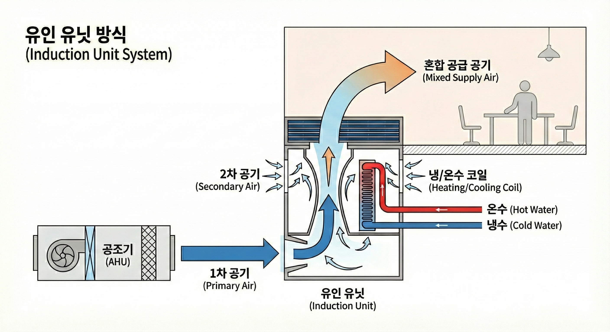

유인 작용으로 실내공기를 끌어들여 혼합·순환시키는 방식입니다. 공조기에 의해 공급되는 공기를 분출하고, 그 주위의 공기를 유인해서 혼합, 분출하게 됩니다. 덕트 규모가 작고 전기가 불필요하지만 발생하는 소음이 큽니다.

### 전수 방식(팬코일유닛, FCU) (All-Water)

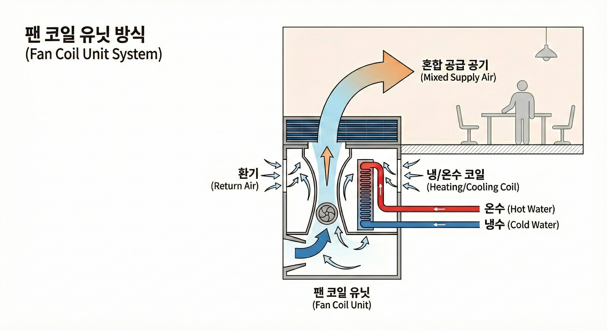

전수 방식은 물을 이용한 공조 방식입니다. FCU 방식이 전수 방식으로, 실내에 FCU를 설치해 냉온수를 공급하여 실내에서 열교환(냉난방)을 수행합니다. 이 때 외기 처리는 별도 또는 제한적으로 수행합니다. 실별 부하 조절이 가능하다는 장점이 있으나 공기질의 관리가 어려워 오염실에는 부적합합니다. 내구성과 유지관리에서 문제가 생길 수 있으며, 전기배선이 필요합니다.

### 냉매 방식(Direct Expansion)

냉매 방식은 냉동사이클의 냉매를 실내측 열교환기(증발기)까지 직접 보내 공기(또는 물)를 냉각·제습하거나, 히트펌프 운전 시 난방까지 수행하는 공조 방식입니다. 부분운전이 가능하고 에너지를 절약할 수 있으나 외기냉방이 어렵고 타 기종에 비해 수명이 짧습니다.

대표적인 방식으로는 패키지 유닛 방식, 룸쿨러 방식 등이 있습니다.

- 냉동사이클(냉동기/히트펌프)

냉매는 장치 내부를 순환하면서 상태(기체/액체)를 변화시켜 열 이동을 가능하게 하는데, 이렇게 냉매가 상태를 바꾸며 열을 운반하는 순환 과정을 냉동사이클이라고 합니다.

냉동사이클의 순서는 압축 → 응축 → 팽창 → 증발이며, 이 네 단계가 반복되며 열을 이동시킵니다.

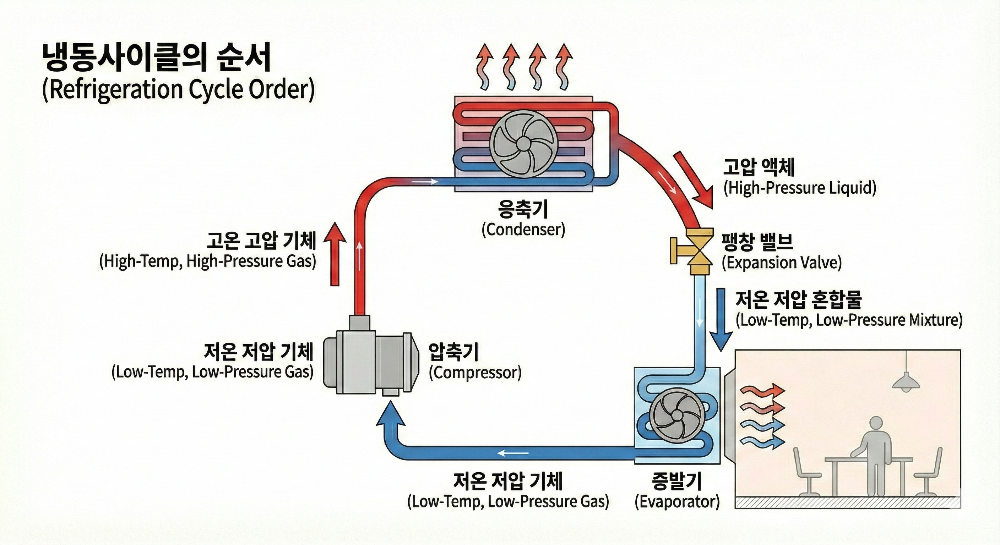

1) 압축(Compressor): 냉매가 실외로 열을 버릴 수 있도록(응축이 가능하도록) 압력과 온도를 높입니다. 실외기 내부에 설치된 압축기에서 이루어집니다. 전력 소비가 발생하는 핵심 구간이며, 시스템 효율과 소음·진동 특성과도 연관됩니다.

    상태 변화: 저압·저온 기체 → 고압·고온 기체

2) 응축(Condenser): 실내에서 빼낸 열(+압축 과정에서 더해진 열)을 실외로 방출합니다. 이 때 기체가 열을 방출하며 액체로 응축됩니다. 역시 실외기에 포함된 응축기에서 이루어집니다. 외기 온도가 높을수록 열을 버리기 어려워져 냉방 능력과 효율이 저하될 수 있습니다.

    상태 변화: 고압·고온 기체 → 고압 액체(응축)

3) 팽창(Expansion Valve): 다음 단계(증발)에서 실내 열을 흡수할 수 있도록 냉매의 압력을 떨어뜨려 저온·저압 상태로 만듭니다. 이 과정이 이루어지는 팽창 밸브는 시스템에 따라 실외기 또는 실내기 측에 배치될 수 있으며, VRF/VRV는 분기·실내기별 제어 구조가 추가됩니다.

    상태 변화: 고압 액체 → 저압 액체/혼합(압력 강하로 온도도 낮아짐)

4) 증발(Evaporator): 저온의 냉매가 실내 공기(또는 열교환 대상)에서 열을 흡수해 기체로 바뀌면서 실내를 냉각합니다. 실내기의 코일(증발기)에서 이루어집니다. 이 과정에서 코일 표면온도가 노점온도 이하로 내려가면 수증기가 응축되어 물이 생기며, 이것이 제습(잠열 처리)입니다. 따라서 DX 시스템은 냉방과 동시에 응축수 배수(드레인) 및 결로 관리가 필수적입니다.

    상태 변화: 저압·저온 액체/혼합 → 저압 기체(증발)

냉매 방식(DX)은 이 사이클을 실외기(압축·응축 중심) + 실내기(증발 중심)로 나누어 구현합니다.

---

## 공조 에너지 절약 방식

1) 조닝(Zoning): 조닝이 상세할수록(구역을 잘게 나눌수록) 필요 구역에만 냉난방을 제공하기 쉬워 에너지 절약 효과가 개선될 수 있습니다. 다만, 구역이 늘어나면 제어 장치·배관·덕트 및 센서 등이 증가하여 설비비 및 복잡도가 상승합니다.

2) VAV 시스템: VAV는 실의 부하 조건에 따라 공급 풍량을 조정하기 때문에 부분부하를 효율적으로 대응하는 에너지 절약형 공조 방식으로 꼽힙니다. 단, 최소 환기량(외기량)을 확보해야 합니다.

3) 외기냉방(Free Cooling): 외기 조건(온도·습도)이 실내 목표 조건보다 유리할 때, 외기를 도입하여 실내로 송풍하면 냉동기를 운전하지 않고도 냉방이 가능한 구간이 생깁니다. 이렇게 외기 조건을 활용해서 에너지를 절약할 수 있습니다.

4) 열회수(Heat Recovery): 배출 공기 또는 버려지는 열을 회수하여 재사용할 수 있도록 고안된 열회수장치를 적용하면, 외기 처리(가열·냉각·제습/가습)에 필요한 에너지를 절감할 수 있습니다.

---

## AHU(공조기: Air Handling Unit)

AHU는 공조설비에서 실내에 공급되는 공기를 만들어(처리) 보내는 장치로서, 전공기 방식은 물론 외기처리(환기)와 연계되는 대부분의 공조 시스템에서 핵심 설비로 취급됩니다. 실내 환경 품질은 상당 부분 AHU의 처리 능력과 운전 로직에 의해 좌우되며, 에너지 사용량의 주요한 발생 지점이기도 합니다. 대략적으로 AHU에서는 외기/리턴 공기를 섞고 → 먼지를 걸러내고 → 온도·습도를 맞춘 뒤 → 팬으로 보내는 과정을 걸칩니다.

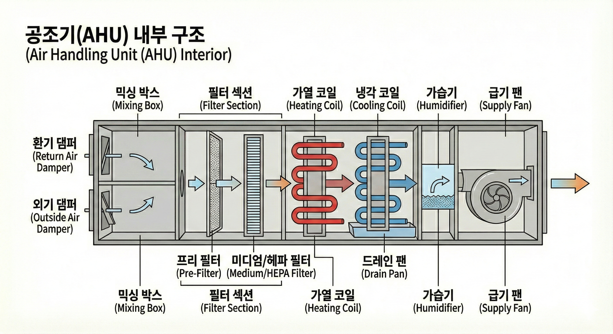

AHU는 각 제품마다 구성은 다르나, 기본적으로는 다음과 같이 이해하면 됩니다.

- OA: 외기 댐퍼. 실내에 배기가 있거나 실내 공기가 탁할 때 조절하는 장치.
- RA: 환기 댐퍼. 실내공기가 유입되는 통로이며 공기량을 조절하는 장치.
- SA: 급기 댐퍼. 실내로 보내지는 급기연결 통로.
- 혼합부(Mixing Section): 외기(OA)와 환기회수공기(RA)를 혼합하는 공간.
- 필터(Filter): 외기 및 환기를 통해 유입되는 먼지·입자 제거(공기질).
- 증발기(Evaporator, DX 또는 냉각 코일): 공기를 냉각하고, 필요 시 제습.
- 가열기(Heater, 전기식 또는 스팀 분사식): 공기 가열.
- 가습기(Humidifier, 필요 시): 겨울철 등 건조 시 가습.
- 팬(Fan): 공기를 덕트로 보내는 이송 장치. (팬동력 = 에너지 사용)
- 열회수장치(필요 시): 배기 공기의 열을 회수해 외기 처리 에너지 절감

---

# 환기설비

기밀이 높은 건물은 에너지 측면에서 유리하나, 환기 계획이 부족하면 실내 오염물질과 수분이 축적되어 공기질 저하 및 결로 위험이 커질 수 있습니다. 환기는 쾌적성과 건강을 위한 기본 조건이며, 동시에 냉난방부하와 에너지 사용량에도 영향을 주므로 좋은 공기와 합리적 에너지를 함께 달성하기 위한 필수 개념입니다.

환기설비는 실내 공기를 외기와 교환하여 실내 공기질(IAQ)을 유지하고, 수증기·오염물질·냄새·유해가스 등을 적절히 배출하는 것을 목적으로 합니다. 특히 고기밀 건물에서는 자연적인 틈새 환기가 감소하므로, 환기설비의 역할이 다음과 같아집니다.

- 건강·쾌적성 확보: CO₂, 휘발성유기화합물(VOC), 미세먼지, 냄새 등 축적 방지
- 습기 관리: 실내 수증기 축적 억제로 결로·곰팡이 위험 저감
- 오염 확산 방지: 오염원이 발생하는 공간과 청결이 요구되는 공간을 압력 차로 분리
- 에너지 관점의 최적화: 외기 도입은 필수이지만, 외기 처리(가열·냉각·제습/가습) 에너지가 증가하므로 회수/제어가 필요

---

## 환기설비 관련 주요 장치

1) 전열교환기(Heat/Energy Recovery Ventilator)

전열교환기는 배기되는 공기와 외부로부터 도입되는 외기 사이에서 현열 및 잠열을 교환하여, 배출되는 공기의 에너지를 회수하는 장치입니다. 이를 통해 외기 도입에 필요한 냉난방·제습/가습 부담을 줄여 에너지 절약 효과를 얻습니다.

2) 드래프트 챔버(발생원 국소 배기 장치)

드래프트 챔버는 화학 실험 등에서 발생하는 열·수증기 및 유해가스가 실내로 확산되거나 실외로 무분별하게 유출되지 않도록 발생원을 둘러싸고 국소적으로 포집·배기하는 장치입니다.

3) 에어커튼(Air Curtain)

에어커튼은 출입구 등 개방부에서 공기 흐름의 장벽을 형성하여 실내·외 공기 혼합을 억제하는 장치입니다. 열손실을 저감하고, 냄새·먼지·곤충 등 유입을 막습니다.

---

## 환기방식의 분류

환기방식(1종~4종)은 일반적으로 급기/배기의 조합과 실내 압력 상태(양압/음압)에 따라 정리됩니다.

### 1종 환기(병용: 급기+배기)

급기와 배기를 모두 기계적으로 수행하는 방식으로, 공기 교환을 안정적으로 제어할 수 있습니다. 수술실, 일반공조, 전기·기계실 등의 공간에 사용하는 중립적인 환기설비입니다.

### 2종 환기(압입식)

기계급기, 자연배기로 실내를 양압(실내 압력 > 주변)으로 유지함으로써, 외부 오염원이 실내로 유입되는 것을 억제하는 방식입니다. 클린룸, 청결 실험실, 청결 수술실 등 오염원이 들어오면 안 되는 공간에 이용합니다.

* 양압: 공기가 바깥으로 나가려는 경향이 생겨 외부 오염이 실내로 들어오기 어렵습니다.

### 3종 환기(흡출식)

자연급기, 기계배기로 실내를 음압(실내 압력 < 주변)으로 유지함으로써, 실내 오염원이 외부로 확산되는 것을 억제하는 방식입니다. 냄새·가스 발생 공간, 화장실 등 오염실에서의 공기가 외부로 확산되면 안 되는 공간에 이용합니다.

* 음압: 공기가 실내로 들어오려는 경향이 생겨, 오염이 밖으로 새기 어렵습니다.

### 4종 환기(자연 환기)

기계 팬을 사용하지 않고 온도차·압력차 등 자연력에 의해 환기하는 방식입니다. 설비 의존도가 낮으나, 외기 조건 및 바람 등 환경 변수에 따라 환기 성능이 크게 변동할 수 있습니다.

---

# 참조 자료

- 김형돈, 2026 킴아카 건축계획(학), 킴아카출판사
- 국토교통부, 건축물의 에너지절약설계기준
- 건축설계 사무소, 알기쉬운건축법-배관설비 (https://m.blog.naver.com/grisimgroup/221000764411)
- 냉동공조저널, 공조설비의 기초 강좌(1) (https://www.hvacrj.co.kr/news/articleView.html?idxno=20436)
- 일시블, 통기관의 목적, 종류 (https://1sible.tistory.com/entry/%ED%86%B5%EA%B8%B0%EA%B4%80%EC%9D%98-%EB%AA%A9%EC%A0%81-%EC%A2%85%EB%A5%98-%EA%B0%81%EA%B0%9C-%EB%8F%84%ED%94%BC-%EA%B2%B0%ED%95%A9-%EB%A3%A8%ED%94%84-%EC%8B%A0%EC%A0%95-%EC%8A%B5%EC%9C%A4-%EB%B0%98%EC%86%A1-%ED%8A%B9%EC%88%98)
- 덕우산업, 냉동 공조 시스템 (http://www.duckwooind.com/2_4.php)
- 한섬종합건축사사무소, 건축설비기준 (http://hannsum.com/sub/sub03_02.php?boardid=pds&mode=view&idx=14&sk=&sw=&offset=20&category=&goPage=)
