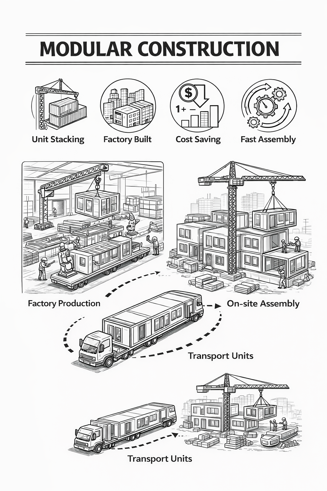
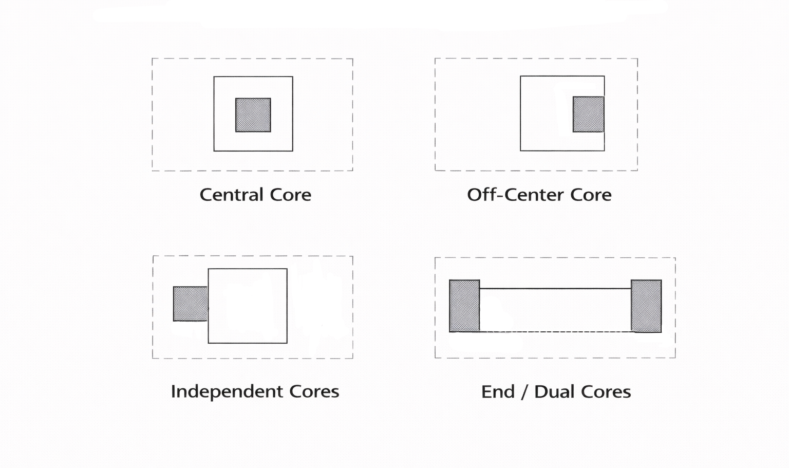

# 건축계획이란?

건축 계획(Architectural Planning)이란 건축물을 짓기 전, 땅과 주변 환경, 사용자의 요구 등을 종합적으로 분석하여 건물의 목표, 규모, 기능, 형태 등을 설정하고 구체화하는 초기 단계의 총체적인 기획 및 분석 활동을 의미합니다. 이는 설계·시공·운영 전 과정의 기본 방향을 제시하며, 기능·미관·안전·효율성 등을 종합적으로 고려해 목적에 부합하는 형태를 만들기 위해 반드시 이해해야 하는 분야이기도 합니다.

---

# 건축의 요소 및 구성원리

건축을 이루는 세 가지 요소에 대해서는 여러 주장이 나왔지만, 현재는 무엇을 위해(기능), 안전하게(구조), 아름답게(미)를 동시에 만족시키는 쪽으로 정리됩니다.

1. 기능: 입지, 배치, 평면 등에서 발생하는 복합적인 사용 요구를 정리하고 운영 가능한 구조로 공간을 구성합니다.
2. 구조: 최우선으로 안전성을 확보하되, 안정성에 기초해 기능과 미가 충돌하지 않도록 균형과 조화를 맞춥니다.
3. 미: 점·선·면 같은 디자인 요소를 기반으로 조화·대비·비례 등의 디자인 원리를 적용하여 형태와 공간의 완성도를 만듭니다.

## 핵심 요소

1. 색의 3요소: 색상, 명도, 채도
2. 동선의 3요소: 하중, 빈도, 속도
3. 동선 주체: 사람, 물질(물류), 차량, 정보

# 평면계획 기본 프로세스 

평면계획의 프로세스는 보통 법규처럼 딱 정해진 한 문서가 있는 게 아니라, 실무/교육에서 공통으로 쓰이는 공간계획(space planning) 방법론+모듈/그리드(치수 조정)+코어/동선 효율+환경(채광·환기) 전략으로 이루어집니다. 실무에서는 보통 아래 순서로 정리하면 안정적인 평면을 계획할 수 있습니다.

## 1. 조닝(Zoning)

평면계획의 출발점은 공간의 성격을 분류하고 관계를 정리하는 것입니다. 먼저 공간을 공용/전용, 대외/대내, 소음/정숙, 청결/오염(서비스)처럼 성격별로 나눈 뒤, 서로 가까워야 하는 공간과 떨어져야 하는 공간을 결정합니다. 이 단계가 탄탄하면 동선 충돌이 줄고, 이후 코어 위치나 출입구 계획도 훨씬 빠르게 정리됩니다.

## 2. 버블 다이어그램

요구 공간과 면적이 확정되지 않은 상태에서 바로 평면을 그리면, 조건이 바뀔 때 수정 범위가 커질 수 있습니다. 그래서 먼저 버블 다이어그램으로 공간 관계(연결/분리/흐름)를 잡고, 다음 단계에서 블록 플랜으로 면적과 형태를 얹어 평면으로 계획합니다.

## 3. 코어(Core) 계획

코어(계단·승강기·샤프트·화장실 등)는 단순한 설비 묶음이 아니라, 건물의 운영 효율과 안전(피난)을 좌우하는 계획의 중심입니다. 코어 위치가 바뀌면 평면의 동선, 유효면적(임대 효율), 구조 그리드, 설비 샤프트 경로까지 연쇄적으로 변합니다. 따라서 코어 계획은 초기에 결정해 전체 계획을 안정화하는 기준점으로 두는 것이 좋습니다.

## 4. 그리드(Grid) · 베이(Bay) 계획

구조 그리드(기준선)와 베이 폭은 평면의 자유도뿐 아니라 창호 모듈, 주차 모듈, 설비 배치, 가구 레이아웃까지 영향을 줍니다. 계획 단계에서 먼저 반복 단위를 제안하고 공종 간 합의를 만들면 이후 조정 비용이 줄어듭니다.

## 5. 패시브 디자인(Passive Design) 기본 개념

에너지 성능은 계획 단계에서의 결정(배치·향·창면적·차양·공간 깊이)에서 큰 비중이 결정됩니다. 패시브 디자인은 자연채광, 자연환기, 일사 조절(차양), 단열·기밀 같은 전략을 통해 기본 성능을 먼저 확보하는 접근입니다. 계획 단계에서 패시브 전략을 함께 검토하면 기능·미·구조뿐 아니라 효율까지 설계 논리 안에 자연스럽게 포함시킬 수 있습니다.

---

# 모듈러

## 모듈이란?

모듈(Module)이란 인간의 생활과 동작을 토대로, 건물의 설계·구조 계획·시공에서 기준이 되는 일반적인 기준 단위를 말합니다. 모듈을 도입하면 치수 체계가 정리되어 도면의 일관성이 높아지고, 자재 규격과 시공 방식까지 연결되기 때문에 계획의 안정성과 효율을 동시에 확보할 수 있습니다.
모듈의 개념 창시자는 르 꼬르뷔지에로, 그가 만든 모듈러(Le Modulor)라는 인간이 다리를 뻗거나 팔을 벌렸을 때 불편함이 없는 기초 치수들을 규정해 건축물을 설계하는 방법론에서 현재의 모듈러 건축이 파생되었습니다. 르 꼬르뷔지에는 인간의 신체 척도와 비율을 기초로 황금분할을 찾아내 건축적으로 수치화시켰고, 실제로 그가 아파트 등 대형 집합주거공간을 설계할 때 적용시켰습니다.

- Flickr user eager licensed under CC BY-ND 2.0

아래는 르 꼬르뷔지에가 기준으로 삼은 모듈러의 4가지 치수입니다.
- A: 기본치수 113cm(배꼽 높이)
- B: A의 2배 226cm(팔 올린 높이)
- C: 183cm(키)
- D: 86cm(손 짚은 높이)

## 모듈러 공법

오늘날 '모듈러'는 르 꼬르뷔지에의 인체 치수 이론보다는, 실무에서 주로 건축 공법의 하나로 더 많이 사용됩니다. 모듈러 공법은 박스 형태의 모듈 유닛을 기본으로, 골조 등 주요 구조부의 전부 또는 일부를 공장에서 제작·조립한 뒤 현장에서 설치해 건축물을 완성하는 방식으로, 프리패브(pre-fab) 공법의 한 형태입니다.

공장 제작 비중이 높기 때문에 외부 환경(날씨 등)의 영향을 덜 받고, 현장 작업량과 투입 인력을 줄일 수 있다는 장점이 있습니다. 또한 공장에서 모듈을 제작하는 동안 현장에서는 기초·인프라 등 다른 공정을 병행할 수 있어, 전체 공사 기간을 단축하는 효과도 기대할 수 있습니다. 이처럼 모듈러 건축은 생산성과 품질 관리 측면에서 강점이 있어 스마트 건설 흐름과 맞물려 다양한 분야에서 연구와 적용이 확대되고 있습니다.

모듈은 설계에서 사용하는 치수의 기준 체계이고, 모듈러 공법은 공장 제작과 현장 조립을 기반으로 한 시공 방식(생산 시스템)을 뜻합니다. 두 개념은 서로 연결될 수 있지만 반드시 같은 의미는 아니므로, 실무에서는 치수 기준을 모듈화했는지, 모듈러 공법을 적용하는지를 구분해 설명하는 것이 혼선을 줄이는 데 도움이 됩니다.

---

# 코어

## 코어란?

코어(core)는 건물의 가운데(또는 한쪽)에 모여 있는 수직 동선 + 설비 수직계통 + 공용 서비스 공간의 묶음을 말합니다.
보통 다음과 같은 공간들이 코어에 포함됩니다.

- 수직 동선: 계단, 승강기(엘리베이터), 에스컬레이터
- 설비 수직 샤프트: EPS(전기 파이프), PD(파이프 덕트), AD(에어 덕트), TPS(통신배관실), AV(스프링클러 배관통로)
- 공용 서비스: 화장실, 청소도구실, 전기실/기계실 일부, 방재 관련 공간 등(건물/용도에 따라)

승강기 + 계단실 + 화장실은 가능한 근접시키며, 승강기 홀은 가급적 중앙에, 코어 내 공간은 각층마다 같은 위치에 둘 수 있도록 합니다.

## 코어의 역할

- 평면적: 유효 면적 증대(통로공간 감소)
- 구조적: 안전성 증진(내진벽의 합리적 배치)
- 설비적: 설비 배관 집중(경제성)

## 코어의 유형

- 중앙 코어형: 코어가 중심에 위치한 유형입니다. 바닥면적이 클 경우 적합하며, 특히 고층, 초고층에 적합합니다. 유효율이 높고 분할임대 빌딩으로서 가장 경제적인 계획이 가능합니다.
- 편심 코어형: 코어를 한쪽으로 밀어 조망/채광/가변 평면 확보에 유리하게 만든 유형입니다. 기준층 바닥 면적이 적은 경우에 적합하며, 바닥 면적이 커진다면 코어 이외에도 피난시설, 설비 샤프트 등이 필요합니다.
- 독립 코어형: 코어가 건물과 분리되어 있는 유형입니다. 공간을 코어와 관계없이 제공 가능하지만 각종 덕트, 배관 등의 길이가 길어지며 방재상 불리해진다는 단점이 있습니다. 바닥 면적이 커지면 피난 시설을 포함한 서브 코어가 필요합니다.
- 양단 코어형: 코어가 건물 양쪽으로 분리되어 있는 유형입니다. 한 개의 대공간을 필요로 하는 전용 사무실에 적합하며, 2방향 피난에 이상적입니다.

---

# 승강기 배치

승강기는 이용자의 이동 경험과 대기시간, 코어 면적, 층별 운영 방식에 직접 영향을 주기 때문에, 코어 계획을 구체화하는 단계에서 가장 먼저 검토해야 하는 요소 중 하나입니다. 따라서 다음에서는 코어 구성 요소 중 승강기 배치계획에 관해 간단히 알아보도록 하겠습니다.

승강기 배치의 경우 직선 배치는 4대 이하로 합니다. 5~8대는 알코브 배치를 하고, 그 이상으로 넘어갈 경우 군별로 분할합니다. 
다음 표는 승강기의 배치 유형입니다.

| 유형구분     | 뱅크당 개수 | 대면거리 | 특징 |
| ------ | :----: | :--: | :--: |
| 일렬형 |    4대   |  -  |  일렬배치  |
| 알코브형  |   4~6대  |  3.5~4.5m |  통과동선 없음  |
| 대면형     |  4~8대  |  3.5~4.5m  |  통과동선  | 
| 대면복합형  |  4~8대  |  6m 이상 |  저층용, 고층용 대면배치 |

# 참고 자료

- 김형돈, 2026 킴아카 건축계획(학), 킴아카출판사
- 코리아빌드, 모듈러 건축의 모든 것, https://koreabuild.co.kr/kintex/2021/03/05/modularconstruction/
- A+ PLATFORM, 모듈러 주택과 모듈러 이론, https://a-platform.co.kr/architect/home/story/index.php?mNum=&sNum=4&boardid=story&mode=view&idx=873