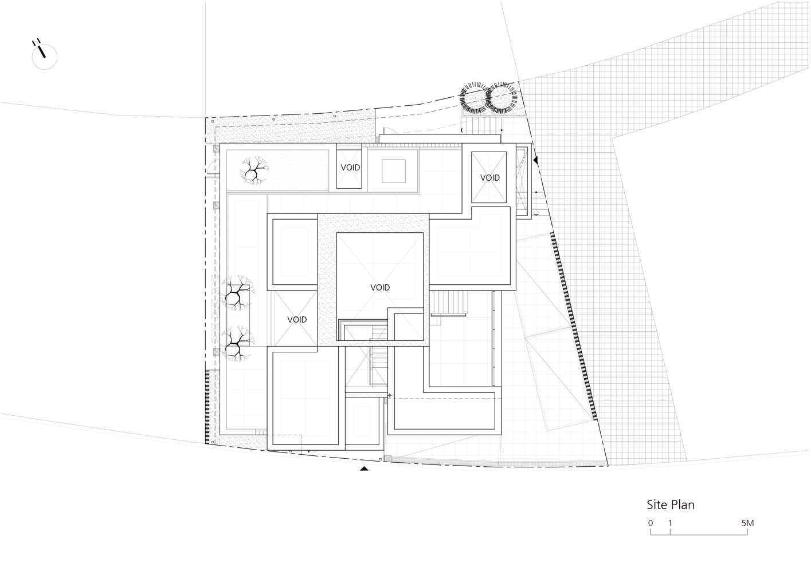
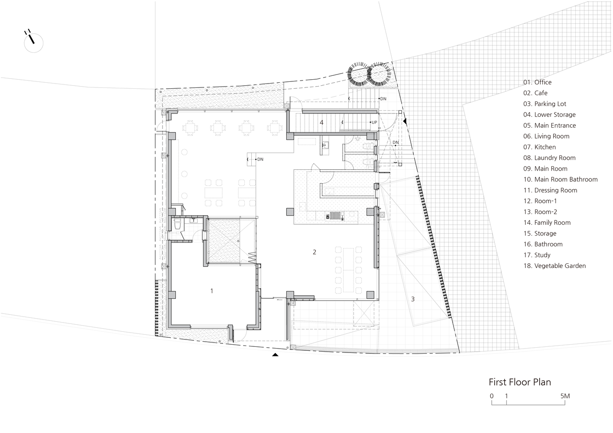
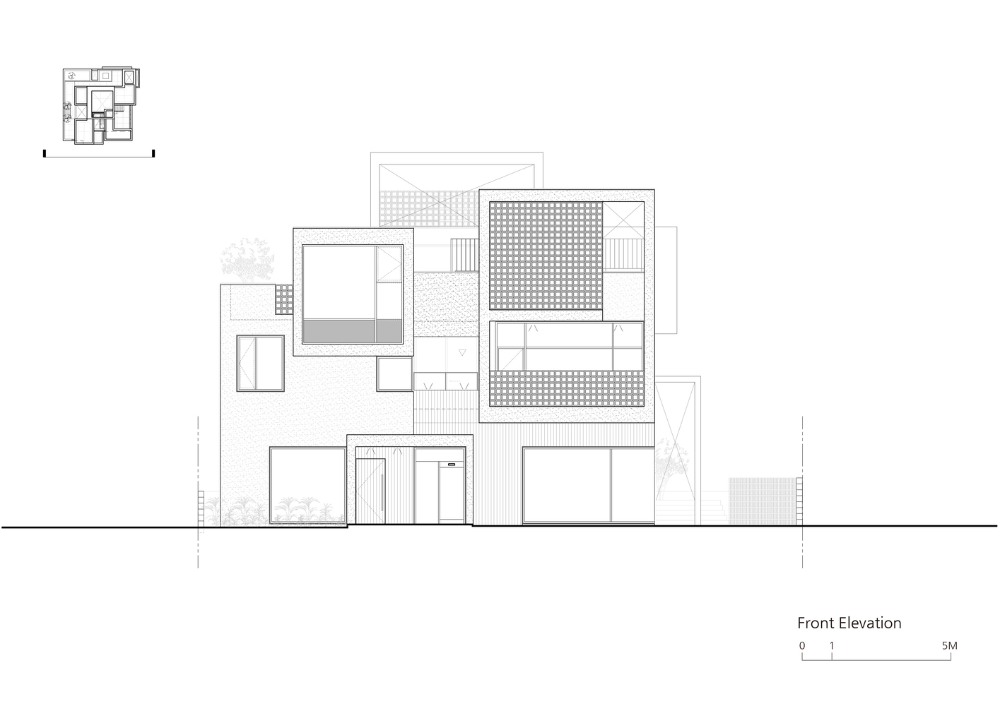
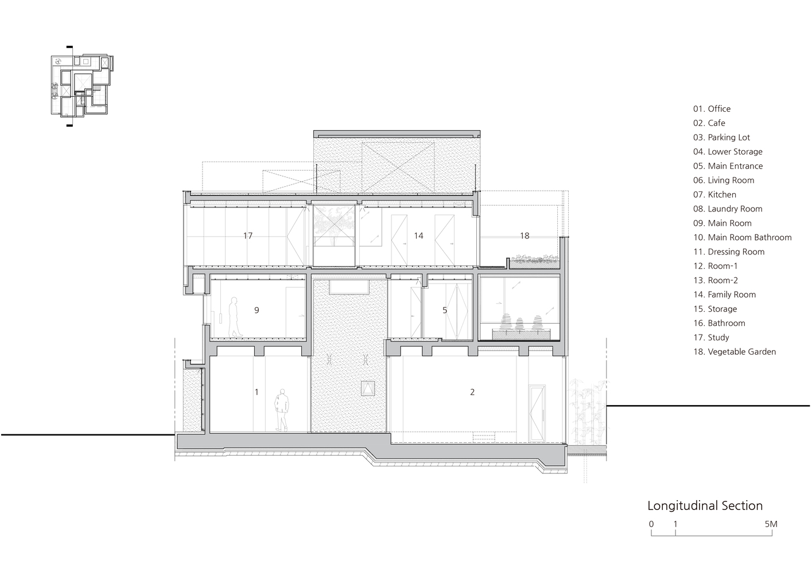
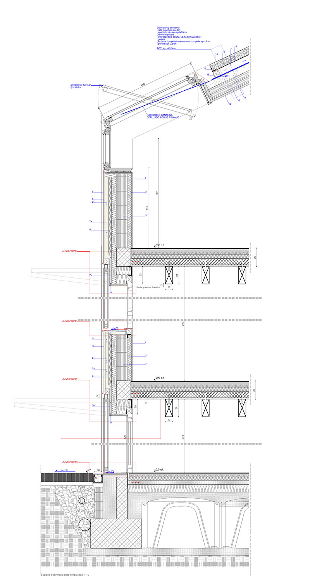
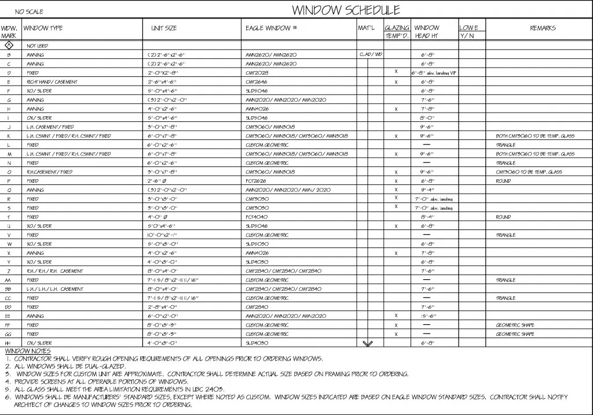

# 건축 도면

건축 도면은 설계 의도와 시공 기준을 팀 전체가 같은 언어로 공유하기 위한 기술 문서입니다. 따라서 도면을 읽을 때는 각 도면이 무엇을 보여주고, 어떤 판단에 쓰이는지(배치/평면/입면/단면/상세/스케줄)를 먼저 이해하는 것이 중요합니다. 이 장에서는 도면의 기본 종류를 정리한 뒤, CAD 도면에서 선 굵기와 색상을 어떻게 해석하는지, 그리고 도면에서 자주 등장하는 약어를 간단히 소개합니다.

---

# 도면의 종류

## 배치도(Site Plan)

(ArchDaily, White Brick House/PLAN Architects office, https://www.archdaily.com/1037251/white-brick-house-plan-architects-office)

배치도는 대지 경계, 도로, 진입, 주차 동선, 레벨(외부 GL), 조경/토목의 범위와 경계 등을 담는 도면입니다. 건물 자체의 내부 구성보다 건물과 주변 환경의 관계(접근·동선·외부 공간 계획)를 보여주는 성격이 강합니다.
실무에서는 진입이 자연스러운지, 차량 동선이 충돌하지 않는지, 대지 레벨 기준이 명확한지 등의 핵심 조건을 배치도에서 먼저 확인합니다.

## 평면도(Floor Plan)

(ArchDaily, White Brick House/PLAN Architects office, https://www.archdaily.com/1037251/white-brick-house-plan-architects-office)

평면도는 건축 도면이라고 했을 때 가장 먼저 떠올리기 쉬운 도면입니다. 공간 구성, 동선, 치수, 벽체/문/창, 코어 구성(계단·승강기·화장실·샤프트) 등이 표시되며, 설계 과정에서도 가장 먼저 본격적으로 작업이 시작되는 도면입니다.
평면도가 확정되지 않으면 입면·단면·상세도도 안정적으로 확정되기 어렵기 때문에, 프로젝트 전반의 기준 도면 역할을 합니다.

## 입면도(Elevation)

(ArchDaily, White Brick House/PLAN Architects office, https://www.archdaily.com/1037251/white-brick-house-plan-architects-office)

입면도는 외부에서 보았을 때 건물이 어떻게 보일지 확인하는 도면입니다. 외장 구성, 창호 비례, 입면 레벨(층선) 등을 확인할 수 있으며, 재료의 분절과 반복, 개구부(창) 비례처럼 건물의 인상을 결정하는 요소가 정리됩니다.
실무에서는 층선 정리, 창호 기준선, 재료 경계 일관성을 중심으로 검토합니다.

## 단면도(Section)

(ArchDaily, White Brick House/PLAN Architects office, https://www.archdaily.com/1037251/white-brick-house-plan-architects-office)

단면도는 건물을 특정 방향으로 절단했을 때의 단면을 표현한 도면입니다. 층고·천장고, 바닥/슬래브 두께, 설비 공간(덕트/배관), 구조 깊이 등을 확인할 수 있습니다. 평면에서는 보이지 않는 수직 방향의 여유(특히 천장 속 설비 공간)가 단면에서 드러나므로, 간섭 검토나 층고 결정에 핵심적인 도면입니다.

## 상세도(Detail) / 부분상세(Blow-up)

(metalocus, ALVARO LAMAS Gaviones de piedra para unas viviendas adosadas por Gino Guarnieri y Roberto Mascazzini, 
https://www.metalocus.es/es/noticias/gaviones-de-piedra-para-unas-viviendas-adosadas-por-gino-guarnieri-y-roberto-mascazzini)

상세도는 외벽-슬래브 접합, 창호 주변, 옥상 방수/파라펫, 화장실 방수, 바닥 단차/문턱 등 전체 도면에서는 확인이 어려운 부분을 확대하여, 특정 부위의 시공 디테일을 보여주는 도면입니다. 실무에서는 하자와 직결되는 부위(방수·단열·기밀·열교 등)가 상세도에서 결정되므로 어떻게 시공되는지를 설명할 수 있는 수준으로 정리하는 것이 중요합니다.

## 표(스케줄) 도면

(M.T.COPELAND TECHNOLOGIES, https://mtcopeland.com/blog/what-are-window-and-door-schedules-in-blueprints/)

스케줄 도면은 창호표/문표/마감표/철물표/실명표 등, 사용 재료나 문·창호의 종류를 리스트 형태로 정리한 도면입니다. 도면의 기호(태그)와 표의 코드가 정확히 연결되어야 물량·견적·발주에서 혼선이 줄어들기 때문에, 실무에서는 누락/중복 여부를 특히 주의해서 확인합니다.

---

# CAD 도면 확인하기

도면을 작성할 때에는 선의 용도(단면선, 입면선, 중심선 등)에 따라 선 굵기를 달리합니다. 이는 도면을 읽는 사람에게 정보의 우선순위와 의미를 전달하기 위한 약속(표준 규칙)입니다. CAD 프로그램으로 도면을 작성할 때도 동일한 원리가 적용되며, 일반적으로는 선의 색상을 다르게 지정해 구분하고, 출력(Plot) 시 색상별로 선 굵기 값을 대응시킵니다.

아래는 CAD 파일 작성 시 자주 사용하는 선 색상 기준표 예시입니다. 숫자가 작을수록 가는 선, 숫자가 클수록 굵은 선을 의미하며, 중요한 요소일수록 더 굵게 표현하여 한눈에 구분되도록 합니다.

|  색상번호 | 굵기호칭 | 출력물 색상 | 화면색상          | 용도                                     |
| ----: | :--: | :----: | :------------ | -------------------------------------- |
|     1 |  1호  |   검정   | 빨강색 (Red)     | 가는선, 중심선                               |
|     2 |  5호  |   검정   | 노랑색 (Yellow)  | 구조체, 주요단면선 경계선과 같이 중요한 부분           |
|     3 |  4호  |   검정   | 초록색 (Green)   | 각종 문자, 각종 기호, 비내력벽(조적)              |
|     4 |  2호  |   검정   | 하늘색 (Cyan)    | 마감선, 입면선, 가구 조립식벽 엘리베이터, 위생기, 설비 |
|     5 |  1호  |   검정   | 파랑색 (Blue)    | 예비                                     |
|     6 |  1호  |   검정   | 보라색 (Magenta) | 예비                                     |
|     7 |  3호  |   검정   | 하얀색 (White)   | 창호(프레임포함) 치수선, 지시선 개정조사(구름표시)    |
|     8 |  1호  |   검정   | 진회색 (Gray)    | 해칭, 배치관련 도로, 주차, 사람, 조경, 자동차        |
|     9 |  1호  |   검정   | 연회색 (Gray)    | 예비                                     |
| 10 이상 |   -  |  검정/칼라 | -             | 예비                                     |

# 도면 약어

도면을 확인하다 보면 영어 약어가 반복적으로 등장합니다. 약어는 도면을 간결하게 만들고 정보 전달을 빠르게 하기 위한 표기이지만, 기준이 합의되지 않으면 오히려 혼선을 만들기도 합니다. 특히 레벨(Level), 기준선/그리드(Grid), 치수(Dimension) 관련 약어는 공종 간 조정에 직접 영향을 주기 때문에, 프로젝트 초기에 의미를 명확히 하고 동일한 기준으로 사용해야 합니다.

아래는 건축 도면에서 가장 기본적이고 자주 등장하는 약어를 범주별로 정리한 내용입니다.

## 레벨(Level) 관련 약어

레벨은 어디를 기준으로 높이를 말하는지를 정하는 핵심 정보입니다. 같은 5층이라도 기준이 다르면 층고·천장고·설비 여유가 달라지므로, 레벨 약어는 반드시 정확히 이해해야 합니다.

- EL (Elevation Level)

평균해수면을 기준으로 한 표고(절대 높이) 개념입니다. 대지나 주변 인프라와의 관계, 외부 레벨 검토에서 자주 사용됩니다.

- GL (Ground Level)

지반 레벨입니다. 프로젝트에서 외부 기준 높이로 쓰이며, 시설물별로 기준이 정해질 수 있습니다. 배치도/외부 동선에서 GL 기준이 모호하면 경사·배수·진입 계획이 흔들립니다.

- FL (Finish Level)

마감 레벨입니다. 실내 바닥 마감이 완료된 기준 높이를 의미하며, 도면에서 층 레벨을 표기할 때 FL을 기준으로 삼는 경우가 많습니다. 실무에서는 문턱 단차, 마감 두께, 장애인 경사로 등의 판단과 연결됩니다.

- SL (Slab Level)

구조 레벨입니다. 슬래브 상단 기준으로 층을 정의할 때 사용합니다. FL과 SL의 차이가 곧 마감 두께와 바닥 시스템의 여유가 되므로, 설비 간섭 검토에서 매우 중요합니다.

## 그리드(Grid) / 기준선 관련 약어

구조·건축·설비가 함께 도면을 맞출 때 가장 먼저 보는 것이 그리드입니다.

GRID / G (Grid Line)

구조/평면 기준선입니다. 보통 숫자(1,2,3…)와 문자(X, Y…)로 표기하며, 기둥 위치와 주요 벽체의 기준이 됩니다.

CL (Center Line)

중심선입니다. 벽체 중심, 기둥 중심, 장비 중심 등 기준이 되는 중심을 표시합니다. 치수 기준이 면 기준인지 중심 기준인지에 따라 오차가 크게 나므로 표기 의도를 함께 확인합니다.

## 치수(Dimension) 및 형상 표기 약어

DIM (Dimension)

치수 표기 자체를 의미하거나 치수 관련 주기를 가리킬 때 사용합니다.

Ø / DIA (Diameter)

원형 부재의 직경 표기입니다(예: Ø150). 배관/덕트뿐 아니라 난간, 원형 기둥 등에서도 사용됩니다.

R (Radius)

반지름 표기입니다(예: R50). 곡면, 라운딩, 곡선 벽 등에 쓰입니다.

TYP (Typical)

동일 반복이라는 의미입니다. 반복되는 조건을 한 번만 그리고 TYP로 처리해 도면을 간결하게 합니다. 단, 예외가 있으면 반드시 따로 표기해야 합니다.

## 창호부호

도면에는 창호와 관련된 다양한 기호가 사용되며, 이를 통해 재질과 용도(창/문/방화문/셔터 등)를 간단한 코드로 표기합니다. 이런 표기 체계를 이해하면 평면도나 입면도에서 창호를 빠르게 구분할 수 있고, 창호표(스케줄)·마감표·견적서와의 연결도 훨씬 수월해집니다. 본 문서에서는 창호부호에 사용되는 기호를 KSF 1502 기준에 따라 정리합니다.

| 재질     | 재질별 기호 | 창(W) | 문(D) | 방화문(FD) | 셔터(S) | 방화셔터(FS) | 그릴(G) | 공틀(F) |
| ------ | :----: | :--: | :--: | :-----: | :---: | :------: | :---: | :---: |
| 알루미늄합금 |    A   |  AW  |  AD  |    -    |   AS  |     -    |   AG  |   AF  |
| 합성수지   |    P   |  PW  |  PD  |    -    |   -   |     -    |   -   |   PF  |
| 강철     |    S   |  SW  |  SD  |   FSD   |   SS  |    FSS   |   SG  |   SF  |
| 스테인리스  |   SS   |  SSW |  SSD |   FSSD  |  SSS  |     -    |  SSG  |  SSF  |
| 목재     |    W   |  WW  |  WD  |    -    |   -   |     -    |   WG  |   WF  |

## 그 외 도면에서 자주 보이는 표기 관례

NTS (Not To Scale)

“축척이 아님”을 의미합니다. 상세/개념도에서 실제 치수를 반드시 치수선으로 확인해야 합니다.

REV (Revision)

개정(변경) 표기입니다. 구름 표시(Cloud)나 리비전 마크와 함께 등장하며, 변경 범위를 빠르게 확인할 때 사용합니다.

---

## 참고 자료

- 한국건축사협회, 건축도면 공동표준지침 1.1
- 한국건축사협회, 건축도면 공동표준지침 부속서 8 건축 도면약어목록 1.1