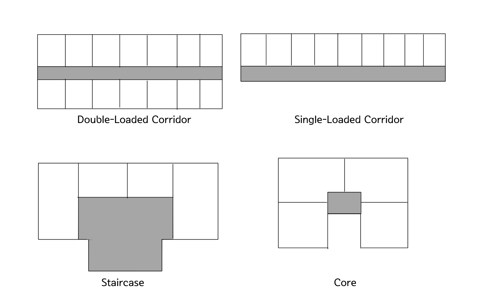

# 용도별 계획

용도별 계획은 건물을 단순히 어떤 모습으로 배치할 것인지만을 따지는 게 아닌, 그 시설이 어떻게 운영되는지를 공간으로 풀어내는 과정입니다. 같은 면적이라도 용도에 따라 요구되는 기능과 비중(예: 병원의 부문별 면적, 도서관의 열람/서고 비율), 동선 체계(이용자·서비스·물류의 분리), 환경 조건(채광·통풍·소음), 그리고 성능(에너지·설비 요구)이 달라집니다. 따라서 용도별 설계에서는 형태 비교만 하는 것이 아니라 분류 기준, 장단점, 계획 포인트를 함께 비교해야 올바른 계획을 세울 수 있습니다. 이 장에서는 여러 용도의 건물 중 흔하게 보이는 종류를 주로, 용도별로 자주 쓰이는 유형(평면/입단면/배치/순로/레이아웃)과 운영 기준(면적 구성, 시스템, 설비 조건)을 정리합니다.

---

# 공동주택

공동주택이란 자연발생적으로 이루어진 주거군이 아니고 의도적으로 주택을 집합화 함으로써 토지이용의 효율을 높인 주거군을 말합니다. 공동주택은 여러 세대가 하나의 건물과 공용공간을 공유하므로, 평면 유형을 비교할 때 채광·통풍·프라이버시와 공용면적의 균형이 핵심입니다. 아래에서는 집합 형식, 평면 형식, 입단면 유형을 기준으로 장단점을 정리합니다.

## 집합 형식에 의한 분류

1) 아파트: 주택 5개 층 이상의 공동주택을 말합니다.
2) 연립주택: 연면적 660㎡를 초과하고, 4개 층 이하의 주택을 말합니다.
    - 좁은 대지의 효율적인 개발이 가능하나, 세대별 환경(채광·통풍 등)이 불균등해질 수 있습니다.
    - 프라이버시 침해, 채광·통풍 불량, 단조로운 옥외공간 등의 단점이 있습니다.
3) 다세대주택: 연면적이 660㎡ 이하이고, 4개 층 이하의 주택을 말합니다.
    - 좁은 토지의 효율적인 이용이 가능하나, 세대별 환경 불균등 및 프라이버시·채광·통풍 불량 등의 문제가 발생할 수 있습니다.

## 평면 형식에 의한 분류

| 구분 | 채광, 일조 | 통풍, 환기 | 소음방지, 프라이버시 유지 | 고층화, 경제성 | 
| ------ | :----: | :--: | :--: | :--: |
| 중복도형 |  불리  |  불리  |  불리  |  유리  |
| 편복도형(발코니형)   |  불리(복도 폐쇄 시)  | 불리(복도 폐쇄 시)  |  불리  |   유리   |
| 계단실형   |   유리  |  유리  |  유리  |   불리   |
| 집중형  |   다소 불리   |  다소 불리 |  다소 불리 |  유리  |

## 입단면 유형에 의한 분류

1) 플랫형: 한 세대(주거단위)가 한 개 층(동일층) 안에서만 구성되는 단층형 단위주거를 말합니다. 보통 각 층에 복도나 엘리베이터 접근이 계획됩니다. 구조·설비가 비교적 단순하고 소규모 설계에 유리하며, 피난 측면에서도 유리합니다. 다만 복도가 있는 경우, 단위주거 규모가 커지면 복도가 길어져 공용면적이 증가하고 프라이버시 측면에서 불리해질 수 있습니다.
2) 메조넷형: 하나의 세대(주거단위)가 2개 층 이상에 걸쳐 구성되는 복층형 단위주거를 말합니다. 전용 층수에 따라 듀플렉스(2층, duplex)/트리플렉스(3층, triplex)로 구분됩니다. 공용면적 비율이 줄고 전용면적 비율이 증가하는 장점이 있으며, 공용홀 없이 구성되는 경우 환경 조건이 우수할 수 있습니다. 반면 구조·설비가 복잡하고 피난에 불리하며, 소규모 주택(50㎡ 이하)에는 불리한 경향이 있습니다.
3) 스킵플로어형: 복도와 연결되는 엘리베이터가 2~3층에 하나씩 배치되고, 세대는 반 층씩 레벨 차이를 두어 상하층이 계단으로 연결되는 형식입니다. 공용면적이 감소하고 전용면적이 증가하는 장점이 있으나, 비상 대피 측면에서는 불리할 수 있습니다.

---

# 단독주택

단독주택은 거주자의 생활 방식과 대지 조건이 계획을 직접 좌우합니다. 따라서 방위·일조·통풍 같은 외부 조건과, 실내의 생활 동선(현관·계단·주방 작업 동선)을 중심으로 기본 기준을 정리합니다.

## 1인당 주거면적 기준

한국 기준으로 1인당 점유바닥면적은 최소 10㎡/인, 표준 16.5㎡/인으로 정해져 있습니다.
또 다르게는 숑바르 드 르보가 제시한 기준이 있습니다. 이 기준에서는 병리(신체적, 정신적 건강에 나쁜 영향을 주는 수준) 8㎡, 한계(개인 및 가족 생활에 제한이 따르는 수준) 14㎡, 표준 16㎡로 정해집니다.

## 배치계획

단독주택의 배치계획은 방위·일조·통풍이 기본이며, 대지 형상과 진입 조건에 따라 합리적인 형태를 결정합니다.

일반적으로는 동서로 긴 직사각형 대지가 많은 편이며, 형태는 정사각형 또는 남향으로 약간 긴 형태가 유리합니다. 흔히 알고 있듯 방위는 남향이 좋으나 사실 동쪽으로 18도, 서쪽으로 16도 이내가 최적의 방위각으로 제시되며 일조와 통풍이 양호하고 전망이 좋은 곳이 이상적입니다.

또한 실내 계획에서는 주요 공간들의 배치 관계가 생활 편의와 직결됩니다.

현관: 깊이 0.9m 이상, 폭 1.2m 이상
계단: 현관·거실·식당·욕실·화장실과 근접 배치
부엌 작업 삼각형: 냉장고–개수대–가열대가 작업 삼각형을 이루도록 계획하고, 동선이 꼬이지 않도록 조리대·배선대 등을 함께 정리합니다.

## 주택의 분류

1) 단층형: 1층 건물입니다.
2) 중층형: 2층 이상의 건물입니다.
3) 스킵 플로어형: 경사지의 대지에서 실의 바닥 높이가 단면상 반계단 정도로 구붅하여 계단실과 마주 대하는 실의 단면 층고가 어긋나게 되어, 전면은 중층, 후면은 단층이 되는 형식을 말합니다.
4) 취발형: 한 건물 내에서 일부는 중층, 일부는 단층이 되는 형식으로 보통 거실은 층고를 높이기 위해 2개층 정도를 관통하고, 나머지 실은 1개층 높이로 유지하는 경우가 이에 해당합니다.
5) 필로티형: 1층은 기둥 또는 일부 벽체로 지지되어 개방성을 확보하고, 2층 이상에 실을 설치하는 형식입니다.

# 사무소

사무소는 업무 방식과 조직 구조에 따라 공간 효율과 쾌적성이 크게 달라집니다. 아래에서는 사무실 유형을 비교하고, 코어·층고·외피 등 계획 요소가 에너지 성능과 어떻게 연결되는지 함께 정리합니다.

## 사무소 유형

1) 개실형: 사무공간을 칸막이로 구분하는 방식입니다. 공사비가 비교적 높지만 실별 환경 조절이 가능하다는 장점이 있습니다. 다만 창에서의 거리(실 깊이)에 따라 채광·환경 조건이 균일하지 않을 수 있습니다.
2) 개방형: 칸막이 없이 하나의 공간으로 제공하는 방식입니다. 전체 면적을 유용하게 활용할 수 있고 공사비가 비교적 저렴하지만 독립성이 낮습니다. 자연채광이 불리한 구역이 생길 수 있어 인공조명 계획이 함께 필요하며, 공간 깊이/형태를 조절해 환경을 개선할 수 있습니다.
3) 오피스 랜드스케이핑: 개방형의 변형으로, 고정 칸막이 대신 플랜트 박스, 식물 등을 이용해 영역을 구분합니다. 규칙적인 모듈 배치보다는 유연하고 불규칙한 평면이 가능하며 의사소통과 공간 절약에 유리하지만, 프라이버시 확보는 어려울 수 있습니다.

## 사무소 에너지 절감 계획

- 가능한 체적 대비 외피면적 비, 또는 연면적 대비 외피면적 비를 작게 계획합니다.
- 같은 연면적이라면 층수가 낮은 건물이 일반적으로 열 성능 측면에서 유리합니다.
- 코어는 양단 코어/편심 코어형이 중심 코어보다 유리한 경우가 있습니다.
- 천장고가 높으면 냉난방 범위가 커져 에너지 낭비로 이어질 수 있으므로, 큰 면적의 실도 가능한 범위 내에서 합리적으로 조정하는 것이 좋습니다.

# 학교

학교는 교실 환경의 균등성과 안전한 이동이 중요한 시설입니다. 배치 유형에 따라 일조·통풍과 비상 시 분산/피난 조건이 달라지므로, 대표적인 배치 형식의 특징을 비교합니다.

1) 폐쇄형: 운동장을 남쪽에 확보하고 부지 북쪽부터 건축을 시작해 ㄴ자형에서 ㅁ자형으로 완결되는 일반적인 형태입니다. 부지 이용 효율은 좋지만 화재·비상 시 불리하며, 일조·통풍 등 환경 조건이 불균등해질 수 있습니다.
2) 분산 병렬형: 핑거 플랜(finger plan, 일조/통풍/환경 조건이 균등하고 구조 계획이 간단하며 한 곳에서 여러 동으로 분기하는 형식의 병렬형 배치 설계 방법)의 한 형태로, 교실의 일조·통풍 등 환경 조건이 비교적 균등합니다. 구조 계획이 간단하고 규격형 적용이 편리하나, 넓은 부지가 필요합니다.

# 도서관

도서관은 열람·서고·대출·업무 등 기능이 명확히 분리되며, 자료의 흐름과 이용자의 동선이 운영 효율을 좌우합니다. 아래에서는 공간 비율의 기본 틀과 출납 시스템별 특징을 정리합니다.

## 규모 계획(면적 구성 비율)

- 열람 및 참고실: 약 50%
- 서고: 20%
- 대출실: 10%
- 관장, 사무실: 8%
- 서비스, 복도 및 계단 기타: 12%

## 출납시스템

1) 반개가식: 이용자가 책을 선택해 신청하면 사서가 책을 가져와서 열람하는 방식입니다. 책의 손상이나 분실의 염려가 적으나 사서의 검열이 있고 수속이 복잡하다는 단점이 있습니다.
2) 폐가식: 목록카드에 의해 자료를 찾고, 사서의 수속을 받은 다음 책을 열람하는 방식입니다. 역시 책의 손상·분실 우려는 적지만 목록 확인이 번거롭고 처리 시간이 길어질 수 있으며 대출·반납 작업 또한 길어질 수 있습니다.
3) 자유개가식: 이용자가 검열 없이 자유롭게 열람이 가능한 방식입니다. 이용이 편하고 업무가 줄어드나 손실·분실 우려가 있습니다.
4) 안전개가식: 이용자가 서고에서 책을 선택한 후, 사서의 검열을 받고 열람하는 방식입니다. 책 내용을 보고 선택할 수 있으나 자유개가식보다 절차가 복잡합니다.

# 전시

전시 시설은 관람 경험을 만드는 시설로, 관람 동선(순로)과 채광 방식이 계획의 핵심이 됩니다. 아래에서는 전시관 유형, 순로 형식, 채광 방식을 중심으로 정리합니다.

## 박물관유형

1) 중정형: 중점을 중심으로 둘레를 에워싸고 있는 배치 형식입니다.
2) 분동형: 몇 개의 전시관들이 광장을 중심으로 건물군을 형성하는 형식입니다. 관객의 집합과 분산이 용이합니다.
3) 집약형: 단일건물 내 대소전시공간을 집약시킨 형식으로, 전시장의 중심이 되는 주요공간인 대공간과 그 대공간을 둘러싸고 있는 중소전시실인 개별전시공간으로 구성됩니다.
4) 개방형: 한 공간으로 이루어진 형식으로, 공간의 구획 없이 필요에 따라 칸막이를 구획할 수 있습니다.

## 순로형식

전시 동선은 전후좌우가 시각적으로 연결되고, 흐름이 막히지 않도록 유도하는 것이 중요합니다.

1) 연속 순로형식: 소규모 전시실에 적합합니다. 단순하며 공간 절약이 가능하나, 하나의 실이 닫히면 전체 동선이 막힐 수 있습니다.
2) 갤러리/코리더 형식: 각 실에 개별 진입이 가능하며 필요 시 독립 폐쇄가 가능합니다. 복도를 전시 공간으로 활용할 수도 있습니다.
3) 중앙홀 형식: 중앙에 큰 홀을 두고 주위에 전시실을 배치합니다. 대지 이용률이 높은 곳에 적합하며, 중앙 홀이 충분히 크면 동선의 혼란이 적지만 확장은 제한될 수 있습니다.

## 채광방식

1) 정광창 형식: 천장의 중앙에 천창을 계획하는 방법입니다. 조도가 균등하나 조망/통풍/차열에는 불리할 수 있어 루버 또는 이중 설치로 직광을 제어합니다.
2) 측광창 형식: 측면 창에서 채광하는 방법입ㅁ니다. 전시실에는 불리한 채광 방식이므로 확산·광량 조정·열 차단 설비 병용이 필요합니다.
3) 고측광창 형식: 천장에 가까운 측면에서 채광(정광+측광 절충)하는 방식입니다.
4) 정측광창 형식: 관람자 상부 천창을 불투명 처리하고 측벽 가까이 채광창을 설치합니다. 관람자 위치는 어둡고 벽면 조도가 밝아 이상적일 수 있으나 천장이 높아 빛이 약해질 우려가 있습니다.
5) 특수 채광 형식: 상부에서 경사 방향으로 빛을 도입해 벽면을 주로 비추는 방식입니다.

# 극장

극장은 무대와 객석의 관계가 공간을 결정하며, 시청각 조건이 성능을 좌우하는 대표 시설입니다. 아래에서는 극장 설비와 평면 형식, 음향·가시거리 등 기본 계획 기준을 정리합니다.

## 극장 설비

1) 활주이동무대: 무대를 차바퀴가 달린 웨곤의 위에 놓고 무대 바닥에 설치된 궤도 위를 활주 이동시켜 무대를 전환시키는 장치입니다.
2) 회전무대: 회전무대는 무대의 바닥 빝에 위치하여 무대를 회전시켜 특수한 연출상의 효과를 얻기 위한 장치입니다.
3) 플로어 트랩: 무대의 임의 장소에서 연기자의 등장과 퇴장이 이루어질 수 있도록 무대와 트랩 룸 사이를 계단이나 사다리로 오르내릴 수 있게 한 장치입니다.
4) 승강무대: 무대바닥의 일부 또는 전부를 오르내리게 하여 연기자의 출입, 배경의 이동이나 무대장치의 입체적인 구성 등에 이용되는 장치입니다.
5) 프로시니엄 아치: 관객의 눈을 무대에 쏠리게 하며 관객의 시선에서 공연무대나 무대 배경을 제외한 다른 부분을 가리는 역할을 합니다.
그리드아이언: 무대의 천장 밑에 철골을 깔아 바닥을 이루게 한 것입니다. 배경/조명/음향 반사판 등이 매달리며, 천장에 1.8m 여유공간을 두고 설치하도록 규정되어 있습니다.

## 평면 형식

1) 애리나형: 관객이 연기자를 둘러싸고 관람하는 형식으로, 가까운 거리에 가장 많은 관객을 수용합니다. 무대배경이 없는 게 특징입니다.
2) 오픈 스테이지형: 관객이 연기자에게 근접하여 관람이 가능한 형식입니다. 
3) 프로시니엄형: 연기자가 일정한 방향으로만 관객을 대하는 형식입니다. 무대배경과 조명효과를 주기 용이하나 많은 객석이 무대 가까이 접근하기엔 곤란하다는 단점도 있습니다.
4) 가변형: 무대와 객석의 크기, 모양, 배열, 상호관계를 필요에 따라 변경할 수 있는 형식입니다.

## 시청각 계획

- 음향: 무대측에는 반사재를, 후변에는 흡음재를 사용합니다. 
- 좌석: 무대 중심에서 좌우 각각 60도까지를 유효 범위로 보고, 1인 점유폭은 45~53cm, 점유면적은 0.6~0.7㎡로 계획합니다.
- 객석의 가시거리
    생리적 한도(15m): 연기자의 자세한 표정이나 몸놀림을 볼 수 있는 거리입니다.
    제 1차 허용한도(22m): 최대한 많은 관객을 수용하면서도 공연 감상에 지장이 없는 거리입니다.
    제 2차 허용한도(35m): 연기자의 일반적인 몸동작을 알 수 있는 거리입니다.

# 백화점

백화점은 판매 효율을 높이기 위해 고객의 이동 흐름을 계획적으로 유도하는 시설입니다. 따라서 평면 계획에서는 통로 체계와 수직동선의 배치가 핵심이며, 조명 계획은 상품의 가시성과 체류 경험을 좌우하는 중요한 요소가 됩니다.

## 쇼케이스 유형

1) 직각배치: 가장 단순한 배치 방법으로, 계획이 쉽고 경제적이며 판매장 면적을 최대한 확보할 수 있습니다. 다만 고객 통행량 변화에 따라 통로 폭을 유연하게 조정하기가 어렵습니다.
2) 사행배치: 주 통로를 직각으로 구성하고 부 통로를 주 통로에 45도로 경사지게 배치하는 방식입니다. 수직동선으로의 접근이 쉽고, 매장 구석까지 이동이 비교적 원활하다는 장점이 있습니다.
3) 방사형: 매장의 통로를 방사형으로 계획하여 중심부를 기준으로 이동을 유도하는 방식입니다. 중심 공간의 성격을 강하게 만들 수 있으나, 매장 구성의 변경 유연성은 계획에 따라 달라질 수 있습니다. 일반적으로 적용이 곤란합니다.
4) 자유 유선 배치: 고객의 유동 방향에 따라 통로를 자유롭게 구성하는 방식입니다. 동선 유도는 유리할 수 있으나, 매장 변경이나 이동이 어렵고 운영상의 유연성이 떨어질 수 있습니다.

## 조명계획

(조명계획 표)

1) 직접조명: 조명 효율이 좋지만 조도가 과도하게 높아질 경우 눈부심이나 불쾌감을 유발할 수 있습니다.
2) 국부조명: 상품을 강조하기 위해 특정 구역이나 진열물에 집중적으로 비추는 방식으로, 스포트라이트 개념에 가깝습니다.
3) 간접조명: 빛을 반사시켜 부드럽게 확산시키는 방식이며, 그림자를 줄이는 장점이 있습니다.
4) 반간접조명: 가장 많이 사용되는 방식으로, 루버가 있는 조명기구 등을 활용하여 눈부심을 줄이면서도 밝기를 확보합니다.

# 병원

병원은 환자, 의료진, 방문객, 물류, 오염원이 동시에 움직이는 고난도 설계 시설이므로, 동선 분리와 위생·안전 기준이 계획의 핵심이 됩니다. 여기에서는 너무 많은 내용보다 규모에 따른 부문별 면적 구성과 함께, 수술실처럼 설비 조건이 강한 공간의 기본 기준을 중심으로 정리합니다.

## 건축형식

집중식-분관식 비교 표

+다익형: 성장과 변호에 유리하도록 건물의 일부를 확장하여 증축.

## 병원 구성 및 규모

병동부: 병원 기능상 가장 중요한 부분으로 보통 전체 연면적의 약 30~40% 정도를 차지합니다. 병실의 평면 형태는 간호단위를 중심으로 계획하는 것이 일반적입니다. 또한 병원의 종류에 따라 병동부의 비중이 달라집니다.
1) 종합병원: 연면적의 1/3
2) 결핵병원: 연면적의 1/2
3) 정신병원: 연면적의 2/3

중진부: 대략 15~17% 정도로 제시되며, 병원 규모가 클수록 비율이 높아지는 경향이 있습니다.
외래부: 대략 10~14% 정도로 제시됩니다.
관리부: 대략 8~10% 정도로 제시됩니다.
공급 및 서비스부: 대략 20~25% 정도로 제시되며, 물류·폐기물·린넨 등 운영 기능이 집중됩니다.

* 수술실: 수술실은 오염 방지와 환자 안전을 위해 설비 조건이 매우 엄격한 공간입니다. 일반적으로 공기정화설비를 갖추고 오염 방지를 위해 독립된 설비 계통으로 운영하며, 수술실 공기를 재순환시키지 않는 방식이 제시됩니다.
수술실의 내부 벽면은 불침투질 재료로 계획하고, 바닥은 접지하도록 합니다. 또한 콘센트 높이는 1m 이상으로 하며, 호흡장치의 안전관리시설을 적절히 배치해야 합니다. 수술실 크기는 최소 4.5m × 4.5m 이상을 확보해야 합니다.

# 공장

공장은 생산 방식이 곧 공간 배치 기준이 되며, 레이아웃 결정이 건물 형태와 설비 계획을 좌우합니다. 아래에서는 생산 흐름에 따른 레이아웃 유형과, 지붕·채광 등 시설 계획의 기본 원칙을 정리합니다.

## 공장 레이아웃

- 레이아웃: 생산을 위한 기계배치, 정렬을 의미합니다. 공장 건축에서는 이 레이아웃을 검토한 후 건물배치를 고려합니다.

1) 제품 중심: 제품의 흐름에 따라 모든 공정과 설비를 배치하는 방식입니다. 연속성과 단종 대량생산에 적합하며(예: 시멘트, 전자제품 등의 공장), 수량 균형 조절이 비교적 용이합니다.
2) 공정중심: 기능이 유사한 설비를 하나의 그룹으로 집합시켜 여러 종류의 제품을 생산할 수 있도록 구성하는 방식입니다. 주문형 생산이나 다종 소량생산에 적합합니다.
3) 고정식: 주요 재료나 조립 대상이 고정되고, 사람이나 기계가 이동하며 작업하는 방식입니다. 선박이나 대형 구조물처럼 제품이 크고 수량이 적은 생산 형태에 적합합니다.

## 시설계획

- 지붕 형식

1) 뾰족형: 지붕이 능선을 중심으로 양쪽이 경사지며, 같은 지붕면에 채광을 위한 천창을 내는 형태입니다. 빛이 직접 들어올 수 있어 직사광선이 어느 정도 유입된다는 단점이 있습니다.
2) 솟을형: 맞배지붕의 능선 부분을 돌출시킨 구조를 두고, 그 긴 측면에 클리어스토리 창 또는 루버를 설치하여 채광과 자연환기에 활용하는 지붕입니다. 공장처럼 내부 깊이가 깊은 공간에서 상부 배기(열기/오염 공기 배출)에 유리합니다. 다만 빗물 처리, 방수 디테일, 풍압/누기(기밀) 같은 디테일 검토가 함께 따라가야 합니다.
3) 톱날형: 지붕이 톱니처럼 반복되는 형식으로, 각 “톱니”의 채광면을 직사광선이 강한 방향을 피하도록 배치하여 비교적 균일한 주광을 들이는 데 목적이 있습니다. 정밀 작업이나 품질 검사 등 조도 균일성이 중요한 공정에 특히 유리합니다. 반면 지붕 형상이 복잡해지기 때문에 구조·방수·유지관리 계획을 함께 정리하는 것이 좋습니다.
4) 샤렌형: 얇은 곡면판(셸)이 구조적으로 하중을 분담하도록 계획하는 개념과 연결되는 형식으로, 장스팬에 유리하여 내부 기둥을 줄이는 데 도움이 될 수 있습니다. 생산 라인 구성이나 물류 동선을 단순화해야 하는 공장에서 장점이 있지만, 곡면 거푸집과 시공성, 방수 디테일, 공사비 등을 종합적으로 검토해야 합니다.

- 채광계획

공장은 기계류 취급이 많으므로 가능한 창을 크게 계획하되, 톱날형의 경우 벽면을 북향으로 계획하여 직사광선을 차단하는 방식이 유리합니다. 또한 생산 특성에 따라 무창공장을 계획하고 인공조명만 사용하는 경우도 있습니다.

# 참고 자료

- 김형돈, 2026 킴아카 건축계획(학), 킴아카출판사
- 군산대학교 건설교육사업단, 문창호, 건축계획(1)
- kephi Javatory, 건축계획, https://kephilab.tistory.com/