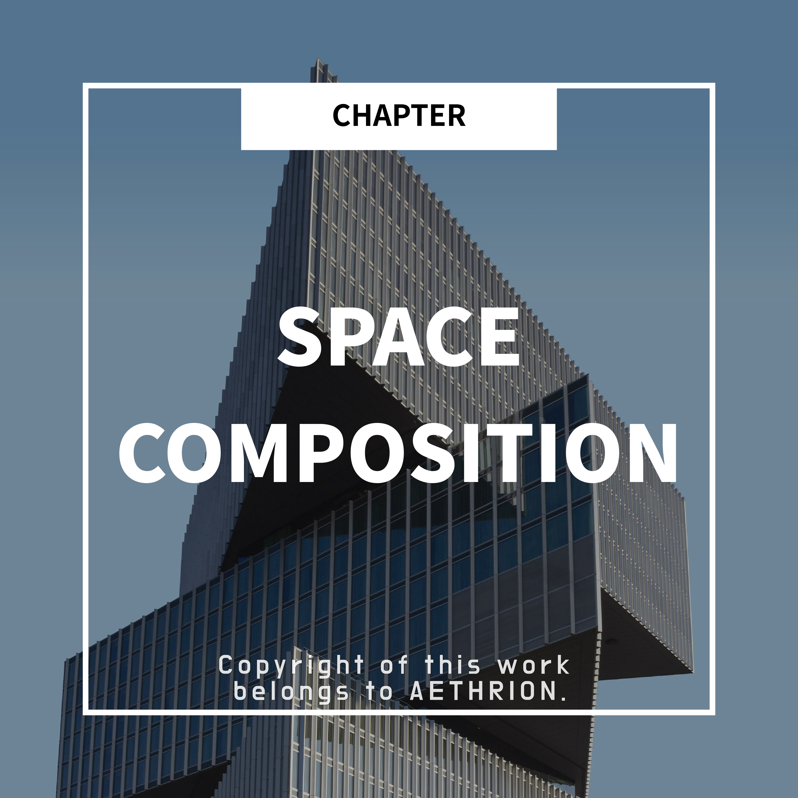

    

<h3 align="center">⚠️ Note</h3>

    &gt; The figures below are <strong>simplified reference values based on typical domestic apartment and office standards</strong>. 
    Actual design values may vary depending on use, location, and code updates.

<h1 align="center">How are the basic units of space formed?</h1>
<h3 align="center">― The real criteria considered when designing rooms, corridors, lobbies, and floor-to-ceiling height</h3>

We experience countless spaces every day.

Rooms at home, corridors, lobbies, and spaces with high or low ceilings.

Yet we often vaguely wonder,

<strong>“Why are these spaces this size?”</strong>

In architecture, spaces are not created by vague intuition.

Spaces are shaped on top of <strong>legally permitted minimum standards</strong>,

and are <strong>adjusted so people can actually use them comfortably</strong>.

<h2 align="center">1. Space is divided by “human behavior,” not just by area</h2>

The first question in design is always:

&gt; “What do people do in this space?”

<strong>-</strong> Sleep

<strong>-</strong> Walk

<strong>-</strong> Stop and wait

<strong>-</strong> Two or more people pass at the same time

Depending on these actions,

each space has a <strong>minimum required size</strong> and a <strong>size that feels comfortable in use</strong>.

<h2 align="center">2. Room</h2>

A room is a space where <strong>surprisingly few codes directly prescribe a minimum area</strong>.

Instead, daylighting, ventilation, and window standards are central.

<h3 align="center">✔️ Design sense for rooms</h3>

<strong>-</strong> <strong>Legal standards</strong>

● Whether daylighting and ventilation can be secured is more important than the room size itself

● Window area and placement often become the key criteria

<strong>-</strong> <strong>Dimensions commonly used in practice</strong>

● Minimum clearance next to the bed

● Door swing radius + passage width

● As a result, a width of <strong>about 2.7–3.0 m or more</strong>

● is perceived as a “room that doesn’t feel cramped”

👉 For rooms,

what matters more than “is it legally possible”

is <strong>“is it livable”</strong>.

<h2 align="center">3. Corridor</h2>

Corridors are where the gap between law and reality is most evident.

<h3 align="center">✔️ Corridor design standards</h3>

<strong>-</strong> <strong>Minimum width allowed by code</strong>

● Apartments/office standards → typically <strong>around 1.2 m</strong>

● The “minimum for one person to pass”

<strong>-</strong> <strong>Widths commonly used in practice</strong>

● <strong>Around 1.5 m</strong> → two people can pass comfortably

● <strong>1.8 m or more</strong> → feels comfortable in shared areas

👉 That’s why in design,

“legally possible” and “comfortable for people” are <strong>intentionally separated</strong>.

<h2 align="center">4. Lobby</h2>

Lobbies rarely have strict minimum-width rules like corridors.

Instead, the key is <strong>how many people use it at the same time</strong>.

<h3 align="center">✔️ Design sense for lobbies</h3>

<strong>-</strong> <strong>Legal perspective</strong>

● Focus on egress, entrance width, and accessibility routes

● Prioritize “can people move without congestion?”

<strong>-</strong> <strong>Practical perspective</strong>

● Secure at least <strong>2.5–3.0 m or more</strong> of clear space in front of entrances

● Plan so circulation doesn’t clog even with waiting people

● Value the <strong>ratio of width to depth</strong> over simple area

👉 A lobby is not just “a space that looks big,”

it is <strong>a space where people don’t get tangled</strong>.

<h2 align="center">5. Floor-to-ceiling height</h2>

Clear height has explicit <strong>minimum standards</strong> in the code.

But how it feels is a different issue.

<table align="center" width="100%">
    <tr>
        <td align="center" width="50%">
            
        </td>
        <td align="center" width="50%">
            
        </td>
    </tr>
</table>

<h3 align="center">✔️ Standards for clear height</h3>

<strong>-</strong> <strong>Legal standards</strong>

● Residential/office spaces → typically <strong>clear height about 2.3–2.4 m or more</strong>

● Based on usable height excluding structure and services

<strong>-</strong> <strong>Heights commonly used in practice</strong>

● Residential → comfortable clear height is <strong>around 2.4–2.5 m</strong>

● Lobby/shared areas → openness starts at <strong>3.0 m or more</strong>

👉 A small change in height can completely change the impression of a space.

<h2 align="center">6. Width and proportion</h2>

People don’t experience spaces in “meters.”

They experience the <strong>ratio of width to height</strong>.

<table align="center" width="100%">
    <tr>
        <td align="center" width="50%">
            
        </td>
        <td align="center" width="50%">
            
        </td>
    </tr>
</table>

<h3 align="center">✔️ What designers actually look at</h3>

<strong>-</strong> Narrow and tall → claustrophobia, instability

<strong>-</strong> Wide and low → stability, sometimes stuffy

<strong>-</strong> Same area, but proportions create totally different perceptions

👉 That’s why in design,

after meeting legal minimums,

we re-check <strong>how that proportion feels to people</strong>.

<h2 align="center">7. Summary</h2>

<table align="center">
    <tr>
        <th>Space</th>
        <th>Approx. legal minimum</th>
        <th>Common practical dimensions</th>
        <th>Why it’s used</th>
    </tr>
    <tr>
        <td><strong>Room</strong></td>
        <td>Daylighting/ventilation standards rather than direct area rules</td>
        <td>Width about <strong>2.7–3.0 m or more</strong></td>
        <td>Bed + circulation + door swing</td>
    </tr>
    <tr>
        <td><strong>Corridor</strong></td>
        <td>Width about <strong>1.2 m</strong></td>
        <td><strong>Around 1.5 m</strong> (comfortable) <strong>1.8 m or more</strong> (shared areas)</td>
        <td>Two people must pass face-to-face</td>
    </tr>
    <tr>
        <td><strong>Lobby</strong></td>
        <td>Mostly egress/entrance standards</td>
        <td><strong>2.5–3.0 m or more</strong> clearance at entrances</td>
        <td>Circulation + waiting should not conflict</td>
    </tr>
    <tr>
        <td><strong>Clear height (residential)</strong></td>
        <td>Clear height about <strong>2.3–2.4 m or more</strong></td>
        <td><strong>Around 2.4–2.5 m</strong></td>
        <td>Comfort without feeling low</td>
    </tr>
    <tr>
        <td><strong>Clear height (shared areas)</strong></td>
        <td>Minimums by use type</td>
        <td><strong>3.0 m or more</strong></td>
        <td>Sense of openness and hierarchy</td>
    </tr>
</table>

    &gt; ⚠️ This table provides general reference values only. 
    Actual applicable standards may vary by use, region, and code.

Architectural design doesn’t end with meeting code.

<strong>-</strong> Legally possible

<strong>-</strong> But uncomfortable in reality

Spaces like this are not good design.

Understanding the basic units of space means

<strong>reading how much the designer cared for people beyond the legal minimum</strong>.

