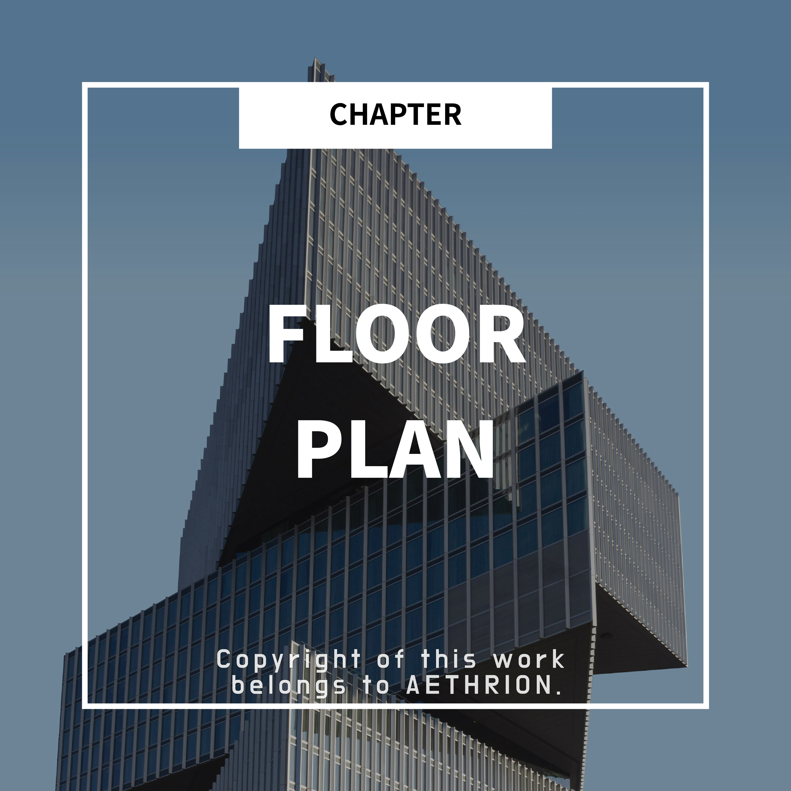

    

<h1 align="center">The basic sense for reading a floor plan</h1>
<h3 align="center">― Three points to read entrances, cores, and load-bearing walls</h3>

<h2 align="center">1. Entrance location</h2>

When looking at a plan, the very first thing to find

is not the room size but the <strong>entrance location</strong>.

The entrance is where people’s circulation begins.

<strong>●</strong> Where you enter

<strong>●</strong> What you see immediately upon entering

<strong>●</strong> How the space unfolds afterward

All of this flow is determined by the entrance location.

    

In the image,

you can recognize the entrance where it says ENTRANCE.

From there, you can imagine seeing the small garden and water feature inside the building at once.

<h3 align="center">✔️ How designers read entrances</h3>

<strong>●</strong> The entrance is <strong>the first scene that sets the impression</strong>

<strong>●</strong> A good plan doesn’t reveal every space the moment you enter

<strong>●</strong> The boundary between public and private zones is naturally defined at the entrance

👉 So when reading a plan,

start by checking <strong>“where do you enter?”</strong>.

<h2 align="center">2. Core (stairs & elevators)</h2>

After the entrance, the next thing you must see is the <strong>core</strong>.

The core includes stairs, elevators, and sometimes service shafts—

<strong>the structural heart of the building</strong>.

A shaft is a vertical void reserved for pipes and ducts.

For non-specialists, it’s easy to think of it this way:

&gt; The core is

&gt; the building’s spine and bloodstream.

    

Large buildings near Gwanghwamun, for example,

need a thick-walled central core like the image above

to remain structurally stable as they rise tall.

Once the core is placed, it cannot be moved freely.

<strong>So the entire plan is</strong>

<strong>always organized around the core.</strong>

<h3 align="center">✔️ What to check about the core in a plan</h3>

<strong>●</strong> Is the core biased to one side?

<strong>●</strong> Is it easy to access from multiple spaces?

<strong>●</strong> Does the core cut off any space too aggressively?

👉 When a plan feels cramped, the <strong>core location</strong> is often the reason.

<h2 align="center">3. Load-bearing walls vs. non-load-bearing walls</h2>

One of the most important concepts in understanding a plan is

<strong>not all walls are the same</strong>.

Architecturally, walls fall into two main types:

<strong>●</strong> Load-bearing walls

<strong>●</strong> Non-load-bearing walls

    

<h3 align="center">✔️ An easy way to understand the difference</h3>

<strong>●</strong> A wall that sounds solid when tapped is usually load-bearing.

<strong>●</strong> A hollow sound indicates a non-load-bearing wall.

<strong>●</strong> In the image above, the walls filled in black are load-bearing. They’re highlighted because distinguishing them is critical during construction.

<strong>Load-bearing walls</strong>

<strong>●</strong> Support the floors above

<strong>●</strong> Directly tied to building safety

<strong>●</strong> Cannot be removed or relocated freely

<strong>Non-load-bearing walls</strong>

<strong>●</strong> Divide space

<strong>●</strong> No structural role

<strong>●</strong> Can be changed relatively freely

👉 Plans often don’t change not because the designer is stubborn, but because <strong>the structure can’t be changed</strong>.

