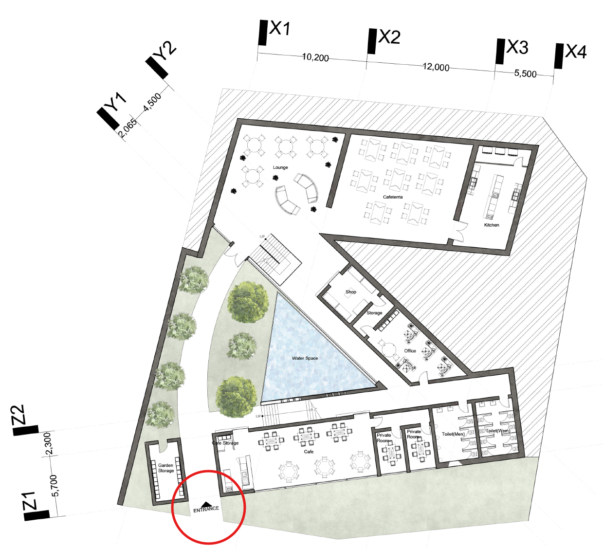
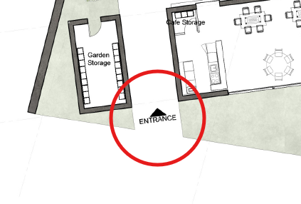

    

<h1 align="center">평면을 보는 최소한의 감각</h1>
<h3 align="center">― 출입구·코어·내력벽을 읽는 3가지 포인트</h3>

<h2 align="center">1. 출입구 위치</h2>

평면도를 볼 때 가장 먼저 찾아야 할 것은

방의 크기가 아니라 <strong>출입구 위치</strong>입니다.

출입구는 사람의 동선이 시작되는 지점입니다.

<strong>●</strong> 어디로 들어오는지

<strong>●</strong> 들어오자마자 무엇이 보이는지

<strong>●</strong> 이후 공간이 어떻게 퍼지는지

이 모든 흐름이 출입구 위치에서 결정됩니다.

    

    

이미지를 보시면

ENTRANCE라고 적혀있는 곳이 출입구라는 것을 인식할 수 있습니다.

출입구에서 들어오면 건물 내의 작은 정원과 수공간이 한 번에 보이는 장면을 짐작할 수 있습니다.

<h3 align="center">✔️ 설계에서 출입구를 볼 때의 관점</h3>

<strong>●</strong> 출입구는 <strong>공간의 인상을 결정하는 첫 장면</strong>

<strong>●</strong> 좋은 평면은 들어오자마자 모든 공간이 노출되지 않음

<strong>●</strong> 공용 공간과 사적 공간의 경계를 출입구에서 자연스럽게 나눔

👉 그래서 평면을 볼 때는

<strong>“어디서 들어오는가?”</strong>부터 확인해야 합니다.

<h2 align="center">2. 코어(계단·엘리베이터)</h2>

출입구 다음으로 반드시 봐야 할 것은 <strong>코어(Core)</strong>입니다.

코어는 계단, 엘리베이터, 경우에 따라 설비 샤프트까지 포함하는

<strong>건물의 중심 구조</strong>입니다.

샤프트란? → 공조시설에 필요한 파이프들이 수직으로 길게 배치되어있게 하기 위해

수직으로 빈공간을 만들어놓은 부분을 말합니다.

비전공자에게는 이렇게 이해하면 쉽습니다.

&gt; 코어는

&gt; 건물의 척추이자 혈관입니다.

    

광화문 근처에 있는 큰 빌딩과 같은 건물들은

위 이미지처럼 중앙에 두꺼운 벽을 지닌 코어를 두어야만

건물이 높게 올라갔을 때 구조적으로 안정적일 수 있습니다.

코어는 한 번 위치가 정해지면 마음대로 옮길 수 없습니다.

<strong>그래서 평면 전체는</strong>

<strong>항상 코어를 기준으로 조직됩니다.</strong>

<h3 align="center">✔️ 평면에서 코어를 볼 때 체크할 점</h3>

<strong>●</strong> 코어가 한쪽으로 치우쳐 있는지

<strong>●</strong> 여러 공간에서 접근하기 쉬운 위치인지

<strong>●</strong> 코어 때문에 특정 공간이 지나치게 잘리지는 않는지

👉 평면이 답답해 보일 때,<strong>코어 위치인 경우가 많습니다.</strong>

<h2 align="center">3. 하중을 받는 벽과 받지 않는 벽</h2>

평면을 이해하는 데서

가장 중요한 개념 중 하나는

<strong>모든 벽이 같은 벽이 아니라는 점</strong>입니다.

건축에서는 벽을 크게 두 가지로 나눕니다.

<strong>●</strong> 하중을 받는 벽 = 내력벽

<strong>●</strong> 하중을 받지 않는 벽 = 비내력벽

    

<h3 align="center">✔️ 두 벽의 차이, 이렇게 이해하면 쉽습니다</h3>

<strong>●</strong> 두드렸을 때 울림이 없는 벽은 하중을 받는 벽인 내력벽!

<strong>●</strong> 두드렸을 때 퉁퉁 소리가 나는 벽은 하중을 받지 않는 비내력벽!

<strong>●</strong> 위 이미지를 보시면 벽 내부에 까맣게 색을 칠해놓은 벽이 있습니다. 그 벽이 바로 하중을 받는 내력벽입니다! 건물을 짓는 과정에서 내력벽과 비내력벽을 정확히 구분해주어야 하기 때문에 색을 칠해줍니다.

<strong>하중을 받는 벽</strong>

<strong>●</strong> 위층과 구조를 지탱하는 역할

<strong>●</strong> 건물의 안전과 직결

<strong>●</strong> 함부로 철거하거나 이동할 수 없음

<strong>하중을 받지 않는 벽</strong>

<strong>●</strong> 공간을 나누는 역할

<strong>●</strong> 구조에는 영향이 없음

<strong>●</strong> 비교적 자유롭게 변경 가능

👉 평면이 바뀌지 않는 이유는 설계가 고집스러워서가 아니라,<strong>구조적으로 바꿀 수 없기 때문인 경우가 많습니다.