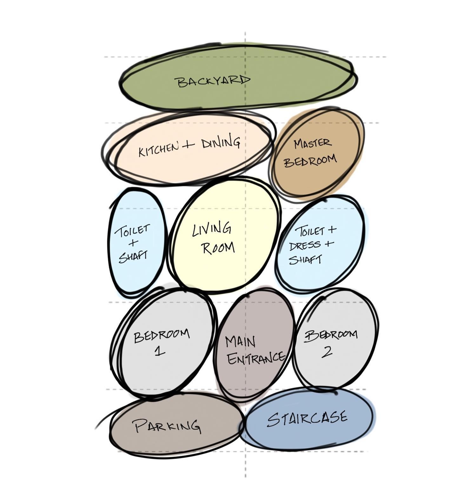

# What Is Architectural Planning?

Architectural planning is the early-stage, comprehensive process of planning and analysis carried out before a building is constructed. It involves holistically reviewing the site and surrounding context, as well as user needs, in order to define and refine the building’s objectives, scale, functions, and form. This stage provides the fundamental direction for the entire project lifecycle—design, construction, and operation—and it is a field that must be understood to create forms that meet their intended purpose by integrating considerations of function, aesthetics, safety, and efficiency.

---

# Elements of Architecture and Principles of Composition

Although there have been various theories about the three elements that constitute architecture, they are now commonly organized as the simultaneous satisfaction of: what it is for (function), doing so safely (structure), and doing so beautifully (aesthetics).

1. Function: Organizes complex programmatic needs arising from factors such as site conditions, layout, and floor planning, and composes spaces into an operable spatial structure.
2. Structure: Secures safety as the top priority, while maintaining balance and harmony so that function and aesthetics do not conflict on the basis of stability.
3. Aesthetics: Uses design elements such as points, lines, and planes, applying principles like harmony, contrast, and proportion to complete the quality of form and space.

## Key Components

1. Three attributes of color: hue, value (lightness), saturation (chroma)
2. Three attributes of circulation: load, frequency, speed
3. Circulation users: people, materials (logistics), vehicles, information

# Basic Process of Floor Plan Planning

There is usually no single fixed document that defines the floor planning process like a regulation. Instead, it is typically composed of methodologies commonly used in practice and education: space planning approaches, modules/grids (dimensional coordination), core/circulation efficiency, and environmental strategies (daylighting and ventilation). In practice, organizing the workflow in the sequence below helps produce a stable and coherent plan.

## 1. Zoning

The starting point of floor plan planning is to classify the character of spaces and clarify their relationships. First, spaces are categorized by attributes such as public/private, external-facing/internal, noisy/quiet, and clean/contaminated (service). Then, you determine which spaces should be close to each other and which should be separated. If this step is solid, circulation conflicts are reduced, and subsequent decisions—such as core placement and entrance planning—can be made much faster.

## 2. Bubble Diagram

(niraan.spaces, https://www.facebook.com/niraan.spaces/photos/a.100975755445978/112124330997787/)

If you draw a plan immediately before finalizing required spaces and areas, later changes in conditions can greatly expand the scope of revisions. For that reason, you first use a bubble diagram to establish spatial relationships (connections/separations/flow). In the next step, you develop a block plan by adding area and shape, and then translate it into a floor plan.

## 3. Core Planning

The core (stairs, elevators, shafts, restrooms, etc.) is not merely a bundle of building services; it is the center of planning that governs operational efficiency and life safety (egress). A change in core location triggers cascading changes to circulation, net usable area (leasing efficiency), the structural grid, and MEP shaft routing. Therefore, it is recommended to determine the core early and use it as an anchor point to stabilize the overall plan.

## 4. Grid and Bay Planning

The structural grid (reference lines) and bay width influence not only the flexibility of the plan, but also window/curtain wall modules, parking modules, MEP layouts, and furniture planning. If you propose repetitive units early in the planning phase and build cross-discipline agreement, adjustment costs later in the project can be reduced.

## 5. Basic Concept of Passive Design

Energy performance is largely determined by planning-stage decisions—such as site layout, orientation, window-to-wall ratio, shading, and spatial depth. Passive design is an approach that prioritizes securing baseline performance first through strategies such as daylighting, natural ventilation, solar control (shading), insulation, and airtightness. Reviewing passive strategies during the planning phase allows efficiency to be naturally integrated into the design rationale alongside function, aesthetics, and structure.

---

# Modulor / Modular

## 모듈이란?

A module refers to a general standard unit that serves as a reference in building design, structural planning, and construction, based on human life and movement. Introducing modules organizes the dimensional system, improves drawing consistency, and links directly to material standards and construction methods—helping secure both stability and efficiency in planning.

The originator of the module concept is Le Corbusier, and today’s idea of Modulor architecture derives from his methodology called Le Modulor, which defines a set of fundamental dimensions that feel comfortable when a person stretches their legs or spreads their arms. Le Corbusier identified the golden ratio based on human body scales and proportions, quantified it architecturally, and applied it in practice—such as when designing large-scale collective housing like apartment buildings.

(Flickr user eager licensed under CC BY-ND 2.0)

Below are four Modulor dimensions used by Le Corbusier as reference values:

- A: Base dimension 113 cm (navel height)
- B: Twice A, 226 cm (height with arm raised)
- C: 183 cm (overall height)
= D: 86 cm (height when leaning on the hand)

## Modular Construction

Today, the term “modular” is used more often in practice as a construction method rather than as Le Corbusier’s body-dimension theory. Modular construction is a type of prefabrication (pre-fab) in which box-shaped module units are manufactured and assembled in a factory—fully or partially including key structural components such as the frame—and then transported and installed on site to complete the building.

Because a large portion of the work is completed in a factory, modular construction is less affected by external conditions (such as weather) and can reduce on-site workload and labor input. In addition, while modules are being produced in the factory, site work such as foundations and infrastructure can proceed in parallel, which can shorten the overall construction period. With strengths in productivity and quality control, modular construction is being researched and adopted across a growing range of fields in line with the broader trend toward smart construction.

In summary, a module is a dimensional reference system used in design, while modular construction refers to a construction method (production system) based on factory fabrication and on-site assembly. The two concepts can be related, but they are not necessarily the same. In practice, clearly distinguishing whether a project has modularized its dimensional standards or is applying modular construction helps reduce confusion.

---

# Core

## What Is a Core?

A core is a cluster—typically located at the center (or to one side) of a building—combining vertical circulation, vertical building-services systems, and shared service spaces.

A core typically includes the following:

- Vertical circulation: stairs, elevators (lifts), escalators
- Vertical service shafts:
    EPS (electrical pipe shaft), PD (pipe duct), AD (air duct), TPS (telecommunications pipe room), AV (sprinkler piping passage)
- Shared services: restrooms, janitor’s closet, parts of electrical/mechanical rooms, fire-safety-related spaces, etc. (depending on building type/use)

As a rule, elevators, stairwells, and restrooms should be placed as close to one another as possible. Elevator lobbies should preferably be centralized, and spaces within the core should be aligned so they can remain in the same location on each floor.

## Roles of the Core

- Plan/layout: increases net usable area (reduces corridor space)
- Structural: improves safety (rational placement of seismic walls)
- MEP/services: concentrates building services (cost efficiency)

## Types of Cores

- Central core: The core is located at the center. Suitable for large floor plates, and especially appropriate for high-rise and supertall buildings. Offers high efficiency and enables the most economical planning for subdivided leasing buildings.

- Offset core: The core is shifted to one side to improve views, daylighting, and flexibility in floor plan layouts. Suitable for smaller typical floor areas; if the floor plate becomes large, additional egress facilities and service shafts beyond the main core may be required.

- Detached core: The core is separated from the main building. Spaces can be planned independently of the core, but ducts and piping become longer and fire-safety performance can be less favorable. If the floor area increases, a sub-core including egress facilities may be needed.

- Dual-end cores: The cores are split to both ends of the building. Suitable for dedicated offices requiring a single large space, and ideal for two-direction egress.

---

# Elevator Arrangement

Because elevators directly affect user travel experience, waiting time, core area, and floor-by-floor operational strategies, elevator planning is one of the first items to review when detailing the core plan. The following section briefly outlines elevator layout planning as a component of core design.

For elevator arrangement, a straight-line layout is typically used for up to four cars. For five to eight cars, an alcove layout is used, and beyond that, elevators are divided into separate groups (banks).

The table below summarizes elevator layout types:

| Type             | Cars per bank | Facing distance | Characteristics                                        |
| ---------------- | :-----------: | :-------------: | ------------------------------------------------------ |
| Linear (in-line) |    up to 4    |        –        | Arranged in a single line                              |
| Alcove           |      4–6      |    3.5–4.5 m    | No through-traffic circulation                         |
| Facing           |      4–8      |    3.5–4.5 m    | Through-traffic circulation                            |
| Mixed facing     |      4–8      |   6 m or more   | Facing layout split for low-rise and high-rise service |

# 참고 자료

- 김형돈, 2026 킴아카 건축계획(학), 킴아카출판사
- 코리아빌드, 모듈러 건축의 모든 것, https://koreabuild.co.kr/kintex/2021/03/05/modularconstruction/
- A+ PLATFORM, 모듈러 주택과 모듈러 이론, https://a-platform.co.kr/architect/home/story/index.php?mNum=&sNum=4&boardid=story&mode=view&idx=873