# Program-Specific Planning (Planning by Building Use)

Program-specific planning is not simply about arranging a building’s form; it is the process of translating how a facility will be operated into spatial organization. Even with the same gross area, different uses require different functional programs and area distributions (e.g., departmental areas in hospitals, or the reading-to-stack ratio in libraries), circulation systems (separating users, services, and logistics), environmental conditions (daylight, ventilation, noise), and performance requirements (energy and building services). Therefore, in use-specific design, it is not enough to compare forms alone—one must compare classification criteria, advantages and disadvantages, and key planning points to arrive at a sound plan.
This chapter focuses on commonly encountered building types and summarizes typical use-specific typologies (plans/sections/site planning/circulation/layout) and operational standards (area composition, systems, and service requirements).
---

# Multi-Family Housing

Multi-family housing refers to a residential group that is intentionally aggregated—rather than naturally formed—in order to increase land-use efficiency. Because multiple households share a single building and common areas, the key in comparing plan types is balancing daylight and ventilation, privacy, and the proportion of common area. Below, pros and cons are organized by aggregation type, plan type, and section typology.

## Classification by Aggregation Type

1) Apartment: Multi-family housing of five stories or more.
2) Row house: Housing of four stories or less with a gross floor area exceeding 660 m².
    - Enables efficient development of small sites, but environmental conditions (daylight, ventilation, etc.) can become uneven by unit.
    - Disadvantages include reduced privacy, poor daylight/ventilation, and monotonous outdoor spaces.
3) Multi-household housing (Dasaedae housing): Housing of four stories or less with a gross floor area of 660 m² or less.
    - Allows efficient use of small sites, but may suffer from uneven unit conditions and issues such as reduced privacy and poor daylight/ventilation.

## Classification by Plan Type

| Type                                  |          Daylight / Sunlight          |              Ventilation              | Noise control / Privacy | High-rise suitability / Economy |
| ------------------------------------- | :-----------------------------------: | :-----------------------------------: | :---------------------: | :-----------------------------: |
| Double-loaded corridor                |              Unfavorable              |              Unfavorable              |       Unfavorable       |            Favorable            |
| Single-loaded corridor (balcony type) | Unfavorable (if corridor is enclosed) | Unfavorable (if corridor is enclosed) |       Unfavorable       |            Favorable            |
| Stair-core type                       |               Favorable               |               Favorable               |        Favorable        |           Unfavorable           |
| Compact (centralized) type            |          Somewhat unfavorable         |          Somewhat unfavorable         |   Somewhat unfavorable  |            Favorable            |

## Classification by Section Typology

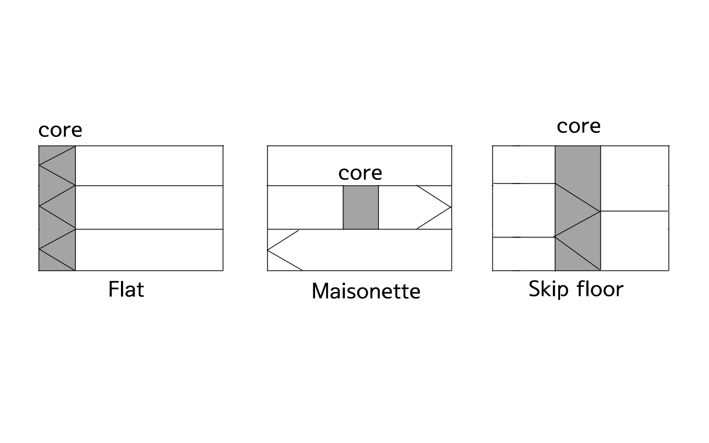

1) Flat type: A single dwelling unit is contained within one floor (single-level unit). Access is typically provided via a corridor or elevator on each floor. Structure and services are relatively simple, making it suitable for smaller projects, and it is also favorable for egress. However, if a corridor is used, larger unit sizes can lead to longer corridors, increasing common area and potentially reducing privacy.
2) Maisonette type: A dwelling unit spans two or more floors (multi-level unit). Depending on the number of private floors, it may be classified as duplex (two levels) or triplex (three levels). Advantages include a reduced common-area ratio and a higher net usable area ratio, and environmental conditions can be strong when units are configured without a shared hall. On the other hand, structure and building services become more complex, egress can be less favorable, and it tends to be less suitable for small units (under 50 m²).
3) Skip-floor type: Elevators connecting to corridors are provided every two to three floors, and units are staggered by half-levels, with upper and lower portions connected by internal stairs. This can reduce common area and increase net usable area, but may be disadvantageous for emergency evacuation.

---

# Single-Family Housing

For single-family housing, residents’ lifestyles and site conditions directly shape the plan. Accordingly, the basic criteria below focus on external conditions such as orientation, sunlight, and ventilation, as well as interior living circulation (entry/stairs/kitchen work triangle).

## Per-Capita Residential Area

Under Korean standards, the minimum occupied floor area per person is 10 m²/person, and the standard is 16.5 m²/person.
Another commonly cited benchmark is proposed by Chombart de Lauwe, which defines 8 m² as pathological (a level that negatively affects physical and mental health), 14 m² as a threshold (a level that imposes limitations on individual and family life), and 16 m² as standard.

## Site Planning

Site planning for single-family housing is fundamentally based on orientation, daylight, and ventilation, and a rational form is determined according to site shape and access conditions.

In many cases, sites are long rectangles oriented east–west, and a square form—or a slightly elongated form facing south—tends to be advantageous. As commonly known, a south-facing orientation is preferred; however, an optimal orientation angle is often cited as within 18° to the east or 16° to the west, with good daylight and ventilation, and ideally with strong views.

In interior planning, the relationships among major spaces directly affect convenience of daily living:

- Entry: depth of at least 0.9 m, width of at least 1.2 m
- Stairs: located near the entry, living room, dining area, bathroom, and toilet
- Kitchen work triangle: plan the refrigerator–sink–cooktop to form a work triangle, and organize counters and work surfaces so circulation does not conflict.

## Classification of Houses

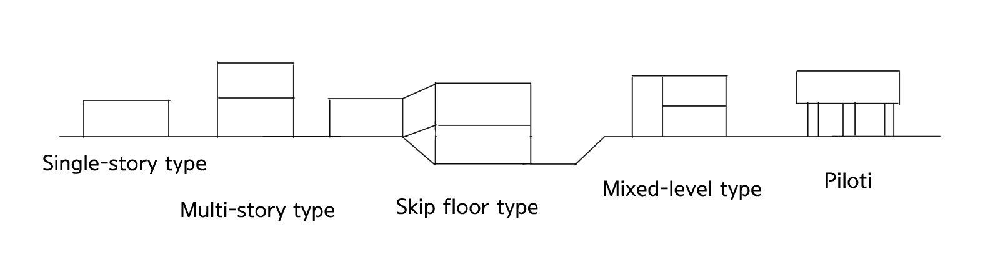

1) Single-story type: A one-story house.
2) Multi-story type: A house of two or more stories.
3) Skip-floor type: On sloped sites, floor levels are staggered by about a half-flight in section, so rooms facing the stair hall have offset sectional heights; the front becomes multi-story while the rear becomes single-story.
4) Mixed-level type: A type where part of the building is multi-story and part is single-story. Typically, the living room spans about two stories to increase height, while other rooms remain at one-story height.
5) Piloti type: The first floor is supported by columns or partial walls to create openness, with main rooms located on the second floor and above.

---

# Office

Office performance and comfort vary significantly depending on work styles and organizational structure. Below, office types are compared, and key planning factors—such as the core, floor height, and envelope—are summarized in relation to energy performance.

## Office Types

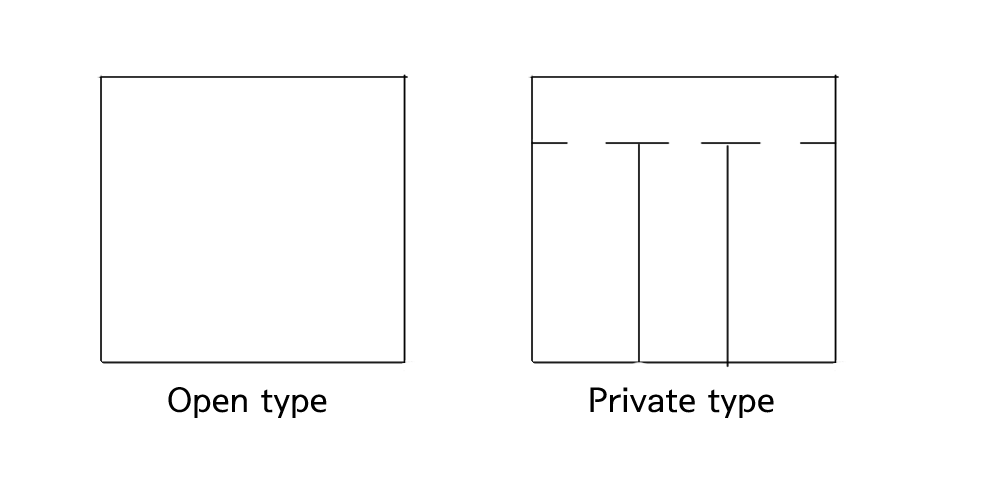

1) Private type: The office area is divided by partitions. Construction cost is relatively high, but it allows environmental control by room. However, daylight and environmental conditions may not be uniform depending on the distance from the windows (space depth).
2) Open type: Provided as one open space without partitions. It uses the total area efficiently and is relatively cost-effective, but offers less privacy. Areas with poor daylight may occur, so lighting design is needed; environmental conditions can be improved by adjusting space depth and form.
3) Office landscaping: A variation of open-plan offices, using plant boxes and vegetation instead of fixed partitions to define zones. It allows flexible, irregular layouts rather than rigid modular arrangements and can be advantageous for communication and space savings, but privacy can be difficult to secure.

## Office Energy-Saving Planning

- Plan to minimize the ratio of envelope area to building volume, or envelope area to gross floor area.
- For the same gross floor area, buildings with fewer stories are generally more advantageous in thermal performance.
- In some cases, dual-end cores or offset cores can be more favorable than a central core.
- Higher ceiling heights increase the conditioned volume and can lead to energy waste; even for large rooms, ceiling heights should be adjusted rationally within feasible limits.

---

# Schools

Schools are facilities where consistent classroom environmental quality and safe circulation are critical. Because daylight, ventilation, and emergency dispersal/egress conditions vary by site-planning type, the characteristics of representative layout types are compared below.

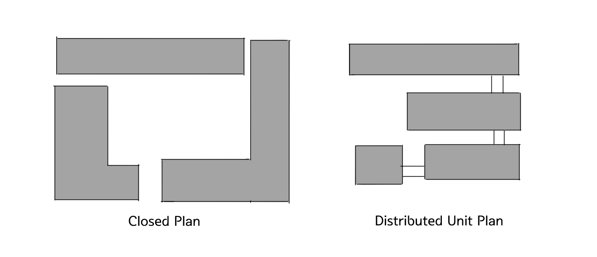

1) Closed plan: A typical form that secures the playground on the south side and begins construction from the north side of the site, developing from an L-shape into a courtyard/block form. Land-use efficiency is good, but it is disadvantageous in fire or emergency situations, and environmental conditions such as daylight and ventilation can become uneven.
2) Distributed unit plan: A variation of the finger plan (a parallel layout method in which daylight/ventilation/environmental conditions are relatively uniform, structural planning is simple, and multiple wings branch from a central point). Classroom daylight and ventilation tend to be relatively even. It is structurally straightforward and well-suited to standardized modules, but requires a larger site.

---

# Libraries

Libraries have clearly separated functions—reading, stacks, lending, and administration—and material flow and user circulation largely determine operational efficiency. The following summarizes a basic framework for space ratios and the characteristics of different circulation/checkout systems.

## Scale Planning (Area Composition Ratios)

- Reading and reference rooms: approx. 50%
- Stacks: 20%
- Lending/checkout area: 10%
- Director’s office and administration: 8%
- Services, corridors, stairs, and other: 12%

## Circulation / Checkout Systems

1) Semi-open stacks: Users select a book and request it; a librarian retrieves it for reading. Risk of damage or loss is lower, but librarian control/verification is involved and procedures can be complex.
2) Closed stacks: Users locate materials via the catalog, complete librarian procedures, and then read the book. Risk of damage/loss is low, but catalog checking can be inconvenient, processing time may be longer, and checkout/return operations can also take more time.
3) Open stacks (free access): Users can browse freely without checks. Convenient for users and reduces staff workload, but increases risk of loss or theft.
4) Controlled open stacks: Users select books in the stacks and then undergo librarian checking before reading. Users can view content before choosing, but procedures are more complex than in free open stacks.

---

# Exhibition Facilities

Exhibition facilities are designed to create the visitor experience, and visitor circulation routes and daylighting strategy are central to planning. The following summarizes museum types, circulation patterns, and daylighting approaches.

## Museum Types

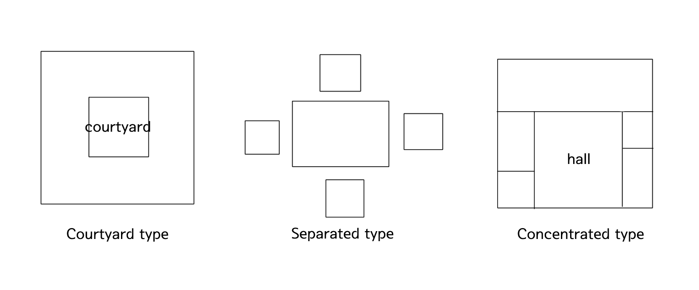

1) Courtyard type: A layout in which spaces surround a central courtyard.
2) Separated type: Multiple exhibition buildings form a complex around a plaza, making it easy to gather and disperse visitors.
3) Concentrated type: Exhibition spaces are concentrated in a single building, typically composed of a major large hall as the main focal space and smaller/medium galleries arranged around it.
4) Open type: A single open space in which partitions can be added as needed without fixed subdivision.

## Circulation Patterns

Exhibition circulation should guide visitors so that visual connections are maintained in multiple directions and the flow does not become blocked.

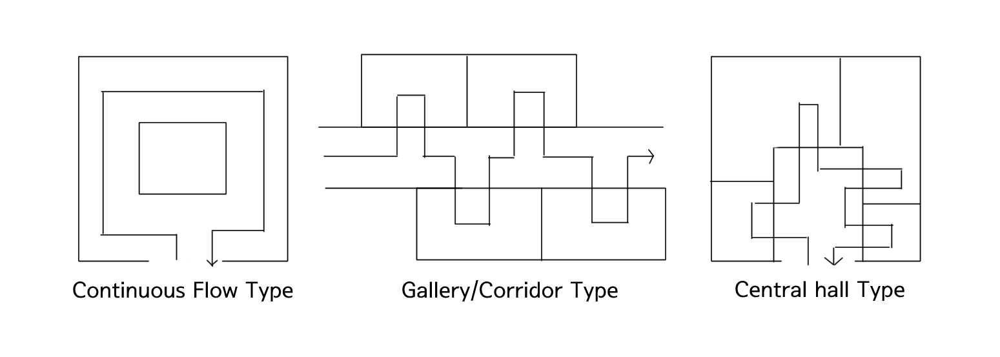

1) Continuous flow type: Suitable for small galleries. Simple and space-efficient, but if one room is closed, the entire route can be blocked.
2) Gallery/corridor type: Each room can be entered independently, and rooms can be closed separately when needed. Corridors may also be used as exhibition space.
3) Central hall type: A large central hall with galleries arranged around it. Suitable for sites with a high land-use ratio; if the hall is sufficiently large, circulation confusion is reduced, but future expansion may be limited.

## Daylighting Strategies

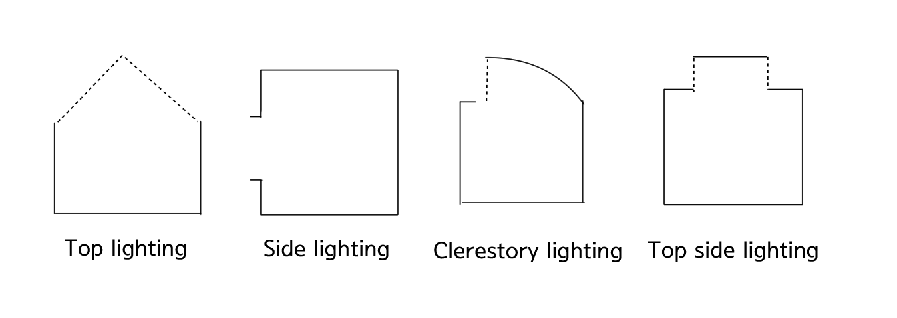

1) Top-light (central skylight) type: A skylight is planned at the center of the roof/ceiling. Illuminance is uniform, but it may be disadvantageous for views, ventilation, and solar heat control, so direct sunlight is controlled using louvers or double-layer systems.
2) Side-light type: Daylight enters from side windows. This can be unfavorable for exhibition rooms, so it typically requires combined measures such as diffusion, light-level control, and heat-blocking systems.
3) Clerestory-light type: Daylight enters from side openings near the ceiling (a hybrid between top-light and side-light).
4) Top-side light type: The skylight above the visitor zone is made translucent/opaque, and daylight openings are placed near the side walls. The visitor zone remains relatively dark while wall illuminance is brighter, which can be ideal; however, if the ceiling is high, light levels may weaken.
5) Special daylighting type: Light is introduced from above at an angled direction to primarily illuminate wall surfaces.

---

# Theaters

In theaters, the relationship between the stage and the audience defines the space, and audiovisual conditions determine performance. The following summarizes basic theater equipment, plan types, and planning criteria such as acoustics and sightlines.

## Stage Equipment

1) Sliding wagon stage: A device that changes stage sets by placing the stage on a wheeled wagon and sliding it along rails installed in the stage floor.
2) Revolving stage: Located beneath the stage floor and rotated to achieve special staging effects.
3) Floor trap: A device that allows performers to appear and exit at arbitrary points, enabling movement between the stage and trap room via stairs or ladders.
4) Lift stage: Raises or lowers part or all of the stage floor, used for performer entry/exit, moving scenery, and creating three-dimensional stage compositions.
5) Proscenium arch: Focuses the audience’s attention on the stage and masks areas outside the performance stage and backdrop from the audience’s view.
6) Gridiron: A steel grid floor installed beneath the stage ceiling. Scenery, lighting, and acoustic reflectors are suspended from it, and standards specify installation with about 1.8 m of clearance above the ceiling.

## Plan Types

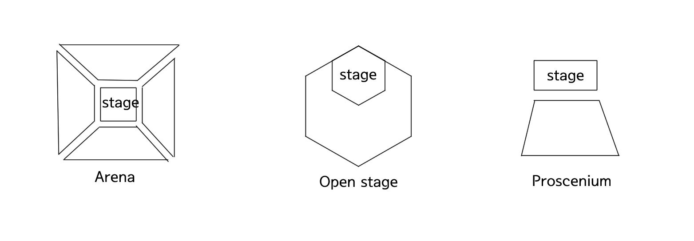

1) Arena (in-the-round): The audience surrounds the performers, accommodating the largest number of spectators at the closest distance. A key feature is the absence of a stage backdrop.
2) Open stage: A type that allows the audience to view performances at close range.
3) Proscenium: Performers face the audience primarily in one direction. It is advantageous for scenic backdrops and lighting effects, but a drawback is that it can be difficult for many seats to be close to the stage.
4) Flexible (transformable) type: A type in which the size, shape, arrangement, and relationships of the stage and seating can be changed as needed.

## Audiovisual Planning

- Acoustics: Use reflective materials on the stage side and absorptive materials at the rear.
- Seating: The effective viewing range is considered to be up to 60° to both the left and right from the center of the stage. Plan for a per-person seat width of 45–53 cm, and an occupied area of 0.6–0.7 m² per person.
- Sightlines (viewing distances):
    - Physiological limit (15 m): Distance at which detailed facial expressions and movements can be seen.
    - First acceptable limit (22 m): Distance that allows maximum seating while still enabling satisfactory viewing.
    - Second acceptable limit (35 m): Distance at which general body movements can be recognized.
    
---

# Department Stores

Department stores are facilities that intentionally guide customer movement in order to improve sales efficiency. Accordingly, the circulation system and the placement of vertical circulation are the core of floor-plan planning, and lighting design becomes a major factor that affects product visibility and the overall dwell experience.

## Showcase Layout Types

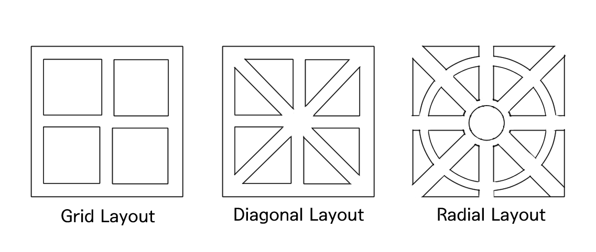

1) Grid layout: The simplest arrangement. It is easy to plan, economical, and can maximize sales-floor area. However, it can be difficult to flexibly adjust aisle widths as customer traffic patterns change.
2) Diagonal layout: The main aisles are laid out orthogonally, while secondary aisles branch off at about 45 degrees. It provides easy access to vertical circulation and allows relatively smooth movement even to the corners of the store.
3) Radial layout: Aisles are planned in a radial pattern to guide movement around a central point. It can create a strong identity for the central space, but flexibility for reconfiguring the sales floor depends on the specific plan. In general, it is difficult to apply.
4) Free-flow (curvilinear) layout: Aisles are organized freely according to customer flow direction. It can be effective for guiding circulation, but may make store reconfiguration and relocation difficult and reduce operational flexibility.

## Lighting Plan

Light Distribution (Upward/Downward Component)

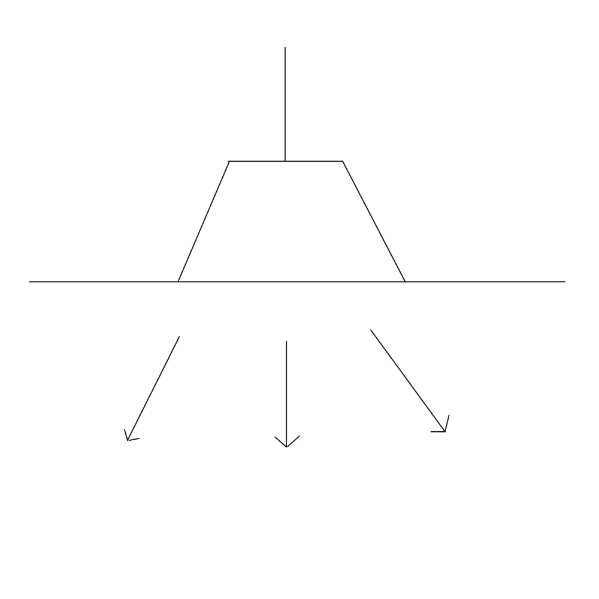 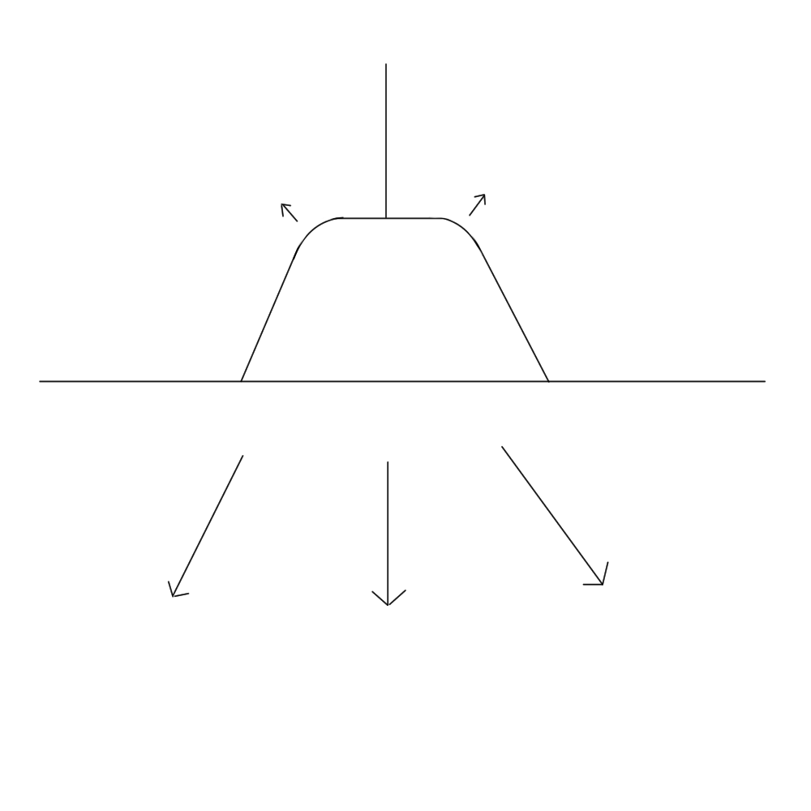 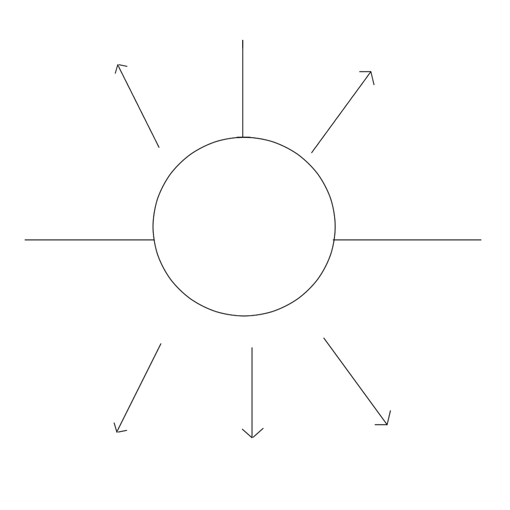 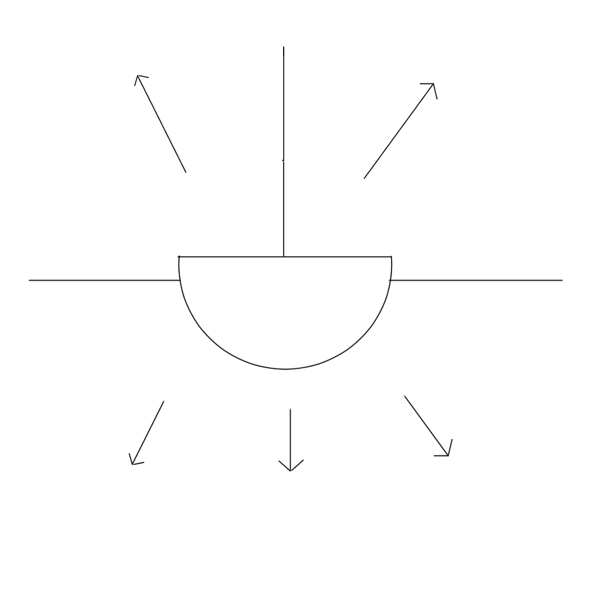 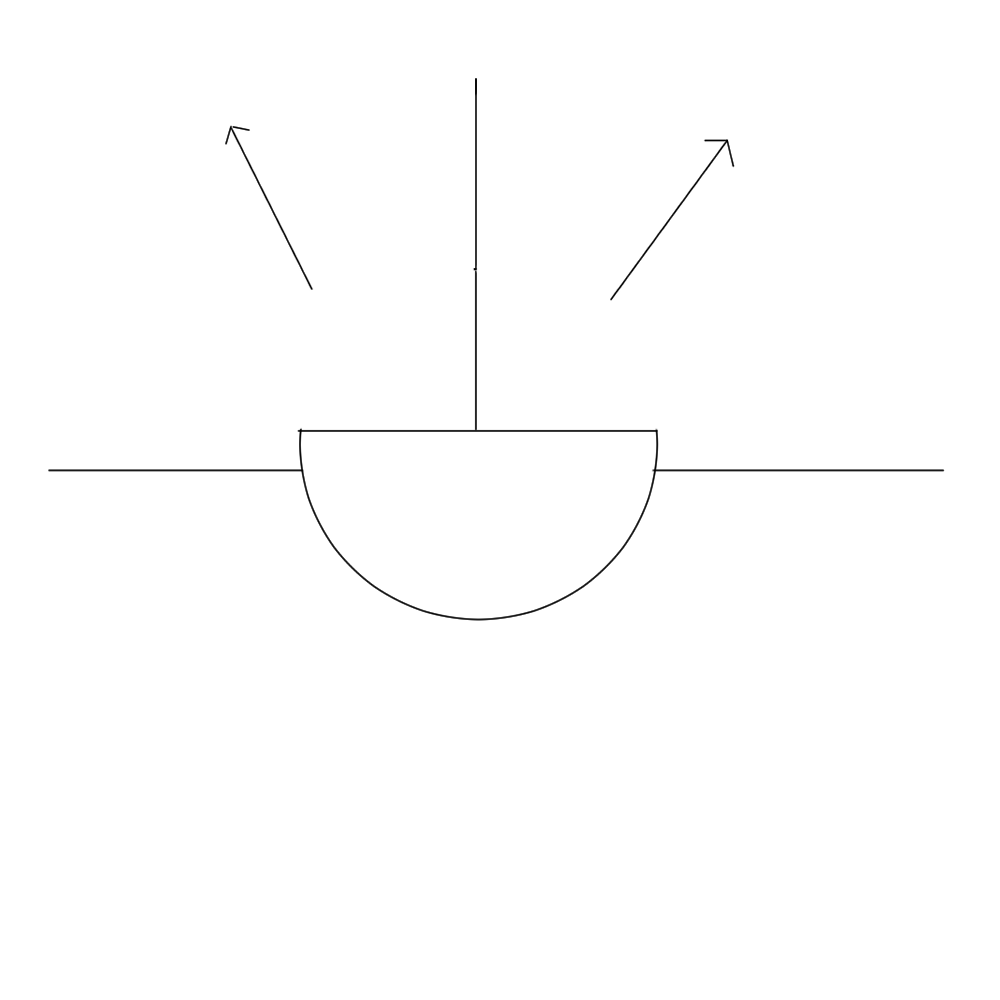

| Lighting type   |             Direct             |           Semi-direct          |         General diffuse        |          Semi-indirect         |            Indirect            |
| --------------- | :----------------------------: | :----------------------------: | :----------------------------: | :----------------------------: | :----------------------------: |
| Light direction | Upward 0–10%, Downward 100–90% | Upward 10–40%, Downward 90–60% | Upward 40–60%, Downward 60–40% | Upward 60–90%, Downward 40–10% | Upward 90–100%, Downward 10–0% |

1) Direct lighting: High lighting efficiency, but if illuminance becomes excessive it may cause glare or discomfort.
2) Localized (accent) lighting: Focuses light on specific areas or displays to emphasize products—similar to spot lighting.
3) Indirect lighting: Reflects light to diffuse it softly, with the advantage of reducing harsh shadows.
4) Semi-indirect lighting: One of the most commonly used approaches. Uses luminaires with louvers, etc., to reduce glare while maintaining sufficient brightness.

---

# Hospitals

Hospitals are high-complexity facilities where patients, medical staff, visitors, logistics, and sources of contamination all move simultaneously. Therefore, separated circulation and hygiene/safety standards are central to planning. Rather than covering excessive detail, this section focuses on department-by-department area composition by scale, along with basic criteria for spaces with strong building-services requirements such as operating rooms.

## Building Forms

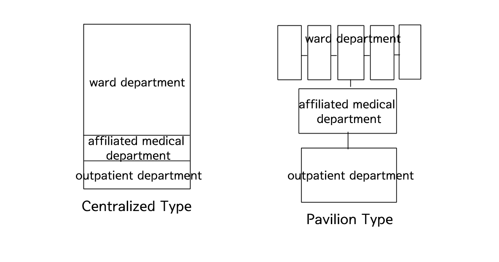

| Category                |             Pavilion type            |          Centralized type         |
| ----------------------- | :----------------------------------: | :--------------------------------: |
| Layout                  | Low-rise, dispersed (separate wings) | High-rise, vertically consolidated |
| Environmental condition |             More uniform             |            Less uniform            |
| Building services       |      Dispersed (higher MEP cost)     |             Centralized            |
| Ease of management      |            Less convenient           |           More convenient          |
| Typical application     |         Specialized hospitals        |        Large urban hospitals       |

+Comb-type: A form in which part of the building is extended and expanded to allow for growth and change.

## Hospital Composition and Scale

Ward/inpatient department: The most important functional area, typically about 30–40% of total gross floor area. Patient-room plans are commonly organized around nursing units. The proportion of wards varies by hospital type:
1) General hospital: about 1/3 of total GFA
2) Tuberculosis hospital: about 1/2 of total GFA
3) Psychiatric hospital: about 2/3 of total GFA

Diagnostic & treatment department: approximately 15–17%, with the ratio tending to increase as hospital size grows.
Outpatient department: approximately 10–14%.
Administration: approximately 8–10%.
Supply & service department: approximately 20–25%, concentrating operational functions such as logistics, waste, and linen.

* Operating Rooms (OR):
Operating rooms require extremely strict building-services conditions to prevent contamination and ensure patient safety. They typically include air-cleaning systems, operate with independent service systems for contamination control, and are commonly designed so that OR air is not recirculated.

Interior wall surfaces should be finished with non-porous materials, and the floor should be grounded. In addition, electrical outlets should be installed at a height of 1 m or more, and safety management provisions for respiratory equipment should be appropriately arranged. The operating room should secure a minimum size of 4.5 m × 4.5 m.

---

# Factories

In factories, the production method itself becomes the basis for spatial organization, and layout decisions determine both building form and building-services planning. The following summarizes layout types by production flow and basic principles for facility planning such as roof form and daylighting.

## Factory Layouts

- Layout: Refers to the arrangement and alignment of machines for production. In factory architecture, building placement is considered after reviewing this layout.

1) Product-oriented: All processes and equipment are arranged according to product flow. Suitable for continuous, high-volume mass production (e.g., cement or electronics plants), and relatively easy to balance production quantities.
2) Process-oriented: Similar-function equipment is grouped so that multiple product types can be produced. Suitable for made-to-order production or high-mix, low-volume production.
3) Fixed-position: Major materials or the assembly object remains in place while people or machines move to perform work. Suitable for production where products are large and quantities are small, such as ships or large structures.

## Facility Planning

- Roof Types

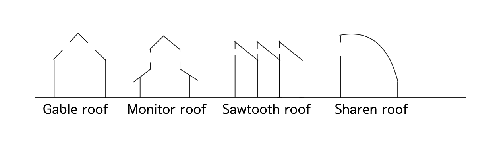

1) Gabled (ridge) type: The roof slopes down from the ridge, with skylights added on the same roof plane for daylighting. A drawback is that direct sunlight can enter to some extent.
2) Monitor roof type: A roof with a raised ridge structure, using clerestory windows or louvers on its long sides for daylighting and natural ventilation. It is advantageous for high-level exhaust (removing heat/contaminated air) in deep interior spaces such as factories. However, details such as rainwater handling, waterproofing, wind pressure, and air leakage (airtightness) must be carefully reviewed.
3) Sawtooth roof type: A repeating tooth roof profile designed to bring in relatively uniform daylight by orienting the glazing faces away from strong direct sun. Particularly advantageous for processes where uniform illuminance is critical, such as precision work or quality inspection. On the other hand, because the roof form becomes more complex, structural, waterproofing, and maintenance planning should be developed together.
4) Sharen type: A form connected to the concept of thin curved shell plates sharing structural loads. It can be advantageous for long spans and may help reduce interior columns. This can benefit factories that need simplified production lines or logistics circulation, but curved formwork, constructability, waterproofing details, and cost must be reviewed comprehensively.

- Daylighting Planning

Because factories involve frequent machine operation, windows are typically planned as large as possible. For sawtooth roofs, it is advantageous to orient wall glazing to the north to block direct sunlight. Depending on production characteristics, some facilities are planned as windowless factories that rely solely on artificial lighting.

---

# 참고 자료

- 김형돈, 2026 킴아카 건축계획(학), 킴아카출판사
- 군산대학교 건설교육사업단, 문창호, 건축계획(1)
- kephi Javatory, 건축계획, https://kephilab.tistory.com/
