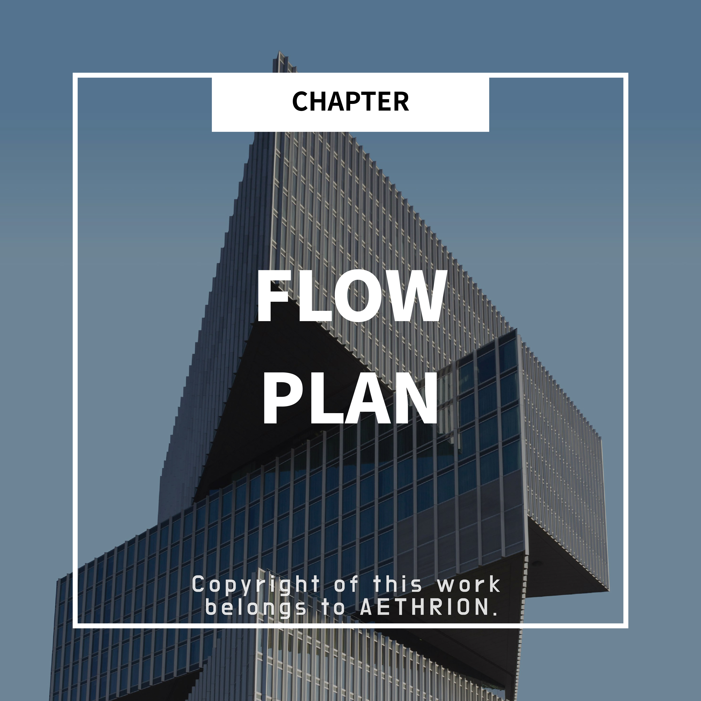
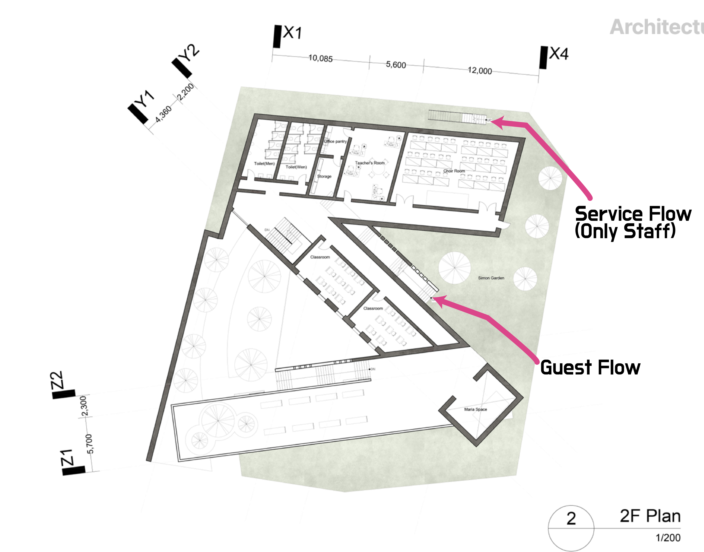

    

<h1 align="center">Circulation planning</h1>
<h3 align="center">― Understanding user, service, and egress circulation changes how you read a plan</h3>

When looking at a building plan,

you may feel “something is uncomfortable” or “the circulation is odd”

even more than the room layout or size.

In those cases, the problem is often not the size of the space,

but the way people move—its circulation.

Circulation is not always visible,

yet users move along it every day and experience the space through it.

That’s why circulation is one of the most basic and important concepts in plan design.

Knowing the characteristics of different circulation types greatly helps in understanding plans.

<h2 align="center">1. Circulation is not a “path,” but people’s movement</h2>

Many non-specialists think circulation

is just a visible “path” like a corridor.

But in architecture, circulation is a much broader concept.

Circulation means

<strong>who moves, for what purpose, and from where to where</strong>.

<strong>●</strong> The path from the entrance to the living room

<strong>●</strong> The flow from an office desk to a meeting room

<strong>●</strong> The route to exit the building safely in an emergency

All of these are circulation.

In short, circulation is not a line,

<strong>but a flow drawn by people’s behavior</strong>.

<h2 align="center">2. User circulation</h2>

User circulation is the everyday route of occupants and visitors—

<strong>the movement of people who use the building</strong>.

It largely determines convenience and first impressions.

	

<h3 align="center">✔️ What matters in user circulation</h3>

<strong>●</strong> Is the route from entrance to destination intuitive?

<strong>●</strong> Is there unnecessary detouring?

<strong>●</strong> Are private and public spaces naturally separated?

Good user circulation

lets people move naturally <strong>without having to think</strong>.

<h2 align="center">3. Service circulation: invisible but essential</h2>

Service circulation includes cleaning, maintenance, logistics, and staff movement—

<strong>not for users directly, but still essential</strong>.

This circulation should be unobtrusive and,

as much as possible, not overlap with user circulation.

	

<h3 align="center">✔️ Why service circulation matters</h3>

<strong>●</strong> Overlap with user circulation causes discomfort

<strong>●</strong> Reduces privacy and spatial quality

<strong>●</strong> Lowers operational efficiency

That’s why designers aim for

<strong>“circulation that works well without being seen.”</strong>

<h2 align="center">4. Egress circulation</h2>

Egress circulation is the route for escaping the building safely

during emergencies like fire or disasters.

Here, convenience is less important than <strong>clarity and intuitiveness</strong>.

	

	

<h3 align="center">✔️ Key points of egress circulation</h3>

<strong>●</strong> Must be understandable at a glance

<strong>●</strong> No dead ends

<strong>●</strong> Always available for use

Normally, people barely notice it,

but in emergencies it becomes <strong>the most important circulation</strong>.

<h3 align="center">✔️ Extra info!</h3>

<strong>●</strong> The maximum distance to an exterior-access stair must be within 30 m.

<h2 align="center">5. Good plans organize circulation naturally</h2>

In a good plan,

circulation is organized without forcing it.

<strong>●</strong> User circulation feels comfortable

<strong>●</strong> Service circulation stays hidden

<strong>●</strong> Egress circulation is clear

In such plans,

paths are readable even without signage,

and first-time visitors won’t get lost.

<h2 align="center">Closing</h2>

Circulation is not the most eye-catching element on drawings,

nor is it the most visible.

But users move along it every day and evaluate the space through it.

&gt; To say a circulation is good

&gt; means <strong>this space is taking care of me</strong>.

