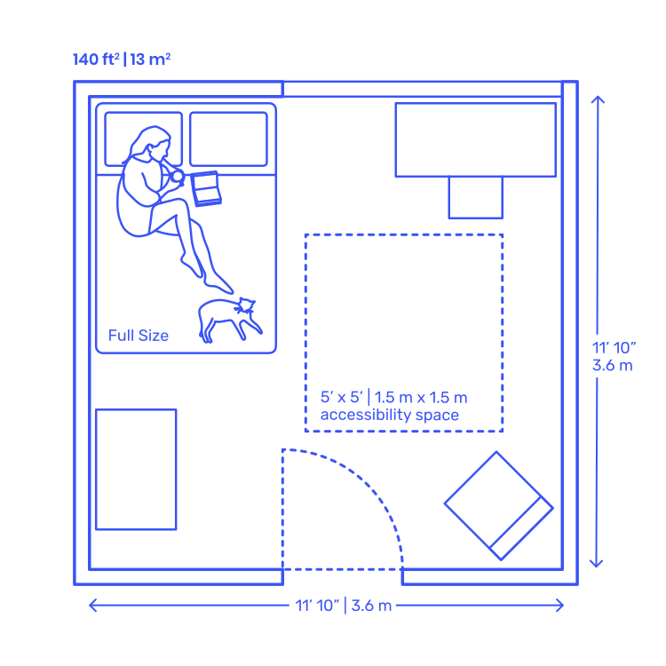
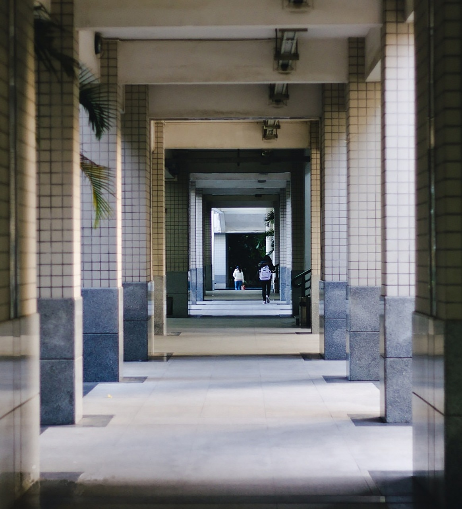
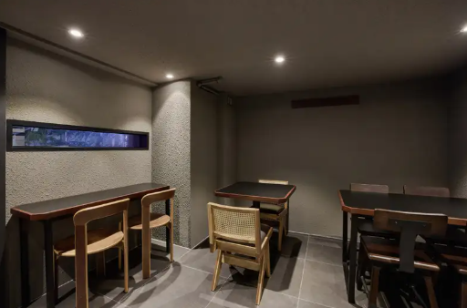
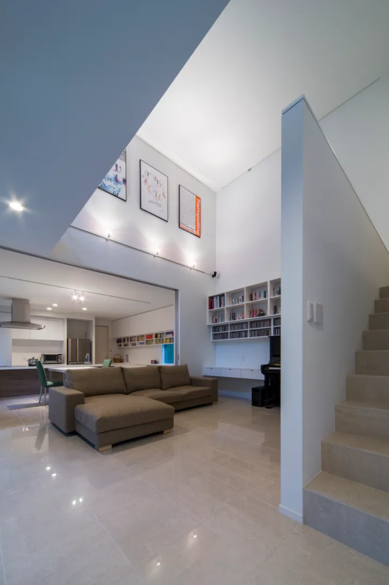
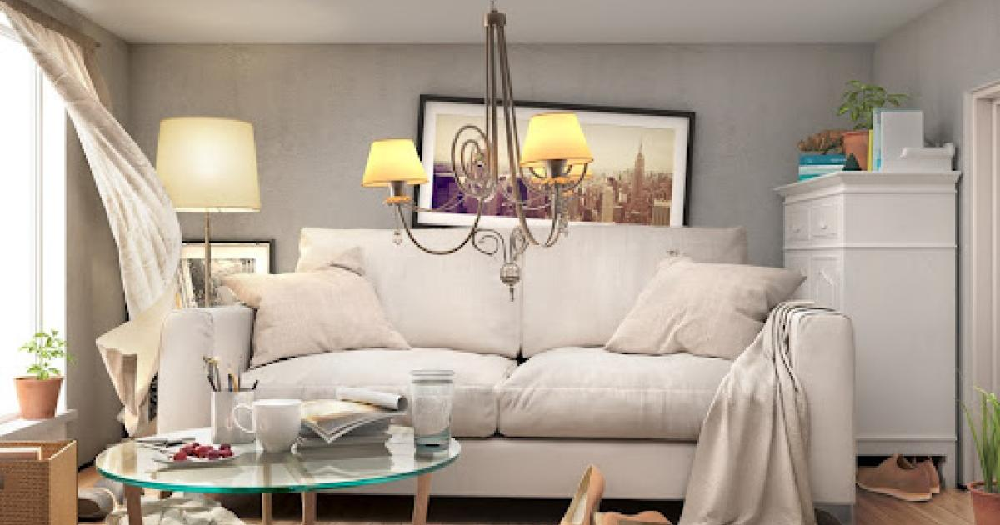
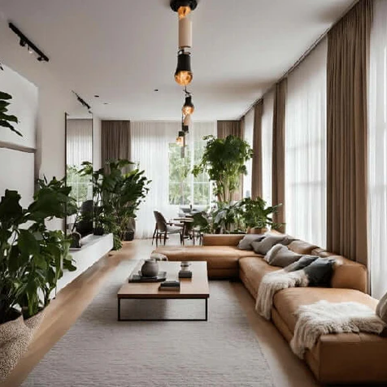

<h1 align="center">공간의 기본 단위</h1>

    

### ⚠️ 주의

> 아래 수치는 **국내 일반적인 공동주택·업무시설 기준을 단순화한 설명용 수치**입니다.
실제 설계에서는 용도·지역·법 개정에 따라 달라질 수 있습니다.
> 

# 공간의 기본 단위는 어떻게 만들어질까

### ― 방, 복도, 로비, 층고를 설계할 때 실제로 고려하는 기준들

우리는 매일 수많은 공간을 경험합니다.

집의 방, 복도, 건물의 로비, 층고가 높은 공간과 낮은 공간까지.

하지만 이 공간들이 **“왜 이 정도 크기일까?”**에 대해서는

막연하게 느끼는 경우가 많습니다.

건축에서 공간은 막연한 감각으로 만들어지지 않습니다.

공간은 **법적으로 허용되는 최소 기준** 위에서,

**사람이 실제로 불편하지 않도록 조정된 결과**입니다.

---

## 1. 공간은 ‘면적’이 아니라 ‘사람의 행동’으로 나뉩니다

설계에서 가장 먼저 나오는 질문은 이것입니다.

> “이 공간에서 사람은 무엇을 하나?”
> 
- 잠을 잔다
- 걷는다
- 멈춰서 기다린다
- 여러 사람이 동시에 지나간다

이 행동에 따라

공간마다 **최소한 필요한 크기**와 **실제로 쓰기 편한 크기**가 달라집니다.

---

## 2. 방: 법적으로는 자유롭지만, 설계는 그렇지 않습니다

방은 의외로 **‘최소 면적’을 직접 규정하는 법 조항이 많지 않은 공간**입니다.

대신 채광, 환기, 창 설치 기준이 중심이 됩니다.

### ✔️ 방 설계 시 기준 감각

- **법적 기준**
    - 방 크기 자체보다
        
        채광·환기 확보가 가능한지 여부가 중요
        
    - 창 면적, 창 위치가 기준이 되는 경우가 많음
- **실무에서 많이 쓰이는 치수 감각**
    - 침대 옆 최소 이동 여유 확보
    - 문 여닫힘 반경 + 통로 폭 확보
    - 결과적으로 **최소 2.7~3.0m 내외의 폭**이 있어야
        
        ‘답답하지 않은 방’으로 인식됨
        

👉 방은

“법적으로 만들 수 있느냐”보다

**“생활이 가능한가”가 더 중요한 공간**입니다.

---

## 3. 복도: 법적 기준과 체감 기준의 차이가 가장 큰 공간

복도는 설계에서 **법과 현실의 차이가 가장 극명하게 드러나는 공간**입니다.

### ✔️ 복도 설계 시 기준

- **법적으로 허용되는 최소 폭**
    - 공동주택·업무시설 기준
        
        → 보통 **약 1.2m 전후**
        
    - ‘한 사람이 통과할 수 있는 최소 기준’
- **실무에서 많이 사용하는 폭**
    - **1.5m 내외**
        
        → 두 사람이 마주 보고 무리 없이 통과
        
    - **1.8m 이상**
        
        → 공용부에서 쾌적하다고 느껴지는 폭
        

👉 그래서 설계에서는

“법적으로 가능”과 “사람이 편함”을 **의도적으로 구분**합니다.

---

## 4. 로비: 기준 치수보다 ‘사람 수’를 먼저 봅니다

로비는 복도처럼 딱 잘라진 최소 폭 규정이 있는 경우가 드뭅니다.

대신 **동시에 몇 명이 사용하는가**가 핵심입니다.

### ✔️ 로비 설계 시 기준 감각

- **법적 관점**
    - 피난, 출입구 폭, 장애인 동선 기준이 중심
    - ‘정체 없이 이동 가능한가’를 우선 검토
- **실무 감각**
    - 출입구 앞 최소 **2.5~3.0m 이상** 여유 확보
    - 대기 인원 발생 시에도 동선이 막히지 않도록 계획
    - 단순 면적보다 **폭과 깊이의 비율**을 중요하게 봄

👉 로비는

“넓어 보이는 공간”이 아니라

**사람이 엉키지 않는 공간**입니다.

---

## 5. 층고: 최소 기준은 있지만, 체감은 완전히 다릅니다

층고는 법에서도 명확한 **최소 기준**이 존재합니다.

하지만 체감은 전혀 다른 문제입니다.

    
    

### ✔️ 층고 설계 시 기준

- **법적 기준**
    - 주거·업무 공간
        
        → 보통 **유효층고 약 2.3~2.4m 이상**
        
    - 구조체, 설비를 제외한 실제 사용 높이가 기준
- **실무에서 많이 쓰이는 층고**
    - 주거 공간
        
        → 체감상 편안한 층고는 **2.4~2.5m 내외**
        
    - 로비·공용부
        
        → **3.0m 이상**에서 개방감 형성
        

👉 층고는

조금만 달라져도 공간의 인상이 완전히 바뀝니다.

---

## 6. 폭과 비율: 숫자는 같아도 느낌은 다릅니다

사람은 공간을 “몇 미터”로 느끼지 않습니다.

**폭과 높이의 비율**로 느낍니다.

    
    

### ✔️ 설계에서 실제로 보는 관점

- 좁고 높은 공간
    
    → 압박감, 불안정
    
- 넓고 낮은 공간
    
    → 안정감, 경우에 따라 답답함
    
- 같은 면적이라도
    
    비율에 따라 전혀 다른 공간으로 인식됨
    

👉 그래서 설계에서는

법적 최소 치수를 맞춘 뒤,

**그 비율이 사람에게 어떻게 느껴질지**를 다시 검토합니다.

---

## 7. 정리하며: 좋은 설계는 ‘법 + 사람’을 동시에 만족시킵니다

| 공간 | 법적으로 요구되는 최소 기준 (대략) | 실무에서 많이 쓰이는 치수 | 왜 이렇게 쓰일까 |
| --- | --- | --- | --- |
| **방** | 면적 직접 규정보다는 채광·환기 기준 중심 | 폭 약 **2.7~3.0m 이상** | 침대 + 사람 이동 + 문 여닫힘 동작 고려 |
| **복도** | 폭 약 **1.2m 전후** | **1.5m 내외** (쾌적)**1.8m 이상** (공용부) | 두 사람이 마주 보고 지나갈 수 있어야 함 |
| **로비** | 출입구·피난 기준 위주 | 출입구 전면 **2.5~3.0m 이상** 여유 | 이동 + 대기 동선이 겹치지 않도록 |
| **층고 (주거)** | 유효층고 약 **2.3~2.4m 이상** | **2.4~2.5m 내외** | 답답하지 않으면서 안정감 유지 |
| **층고 (공용부)** | 용도별 최소 기준 존재 | **3.0m 이상** | 개방감·공간 위계 형성 |

> ⚠️ 본 표는 이해를 돕기 위한 일반적인 기준이며, 
실제 적용 기준은 용도·지역·법규에 따라 달라질 수 있습니다.
> 

건축 설계는 법규를 맞추는 일로 끝나지 않습니다.

- 법적으로는 가능하지만
- 실제로는 불편한 공간

이런 공간은 좋은 설계라고 보기 어렵습니다.

공간의 기본 단위를 이해한다는 것은

**법이 요구하는 최소 기준 위에서, 사람을 얼마나 배려했는지를 읽어내는 일**입니다.