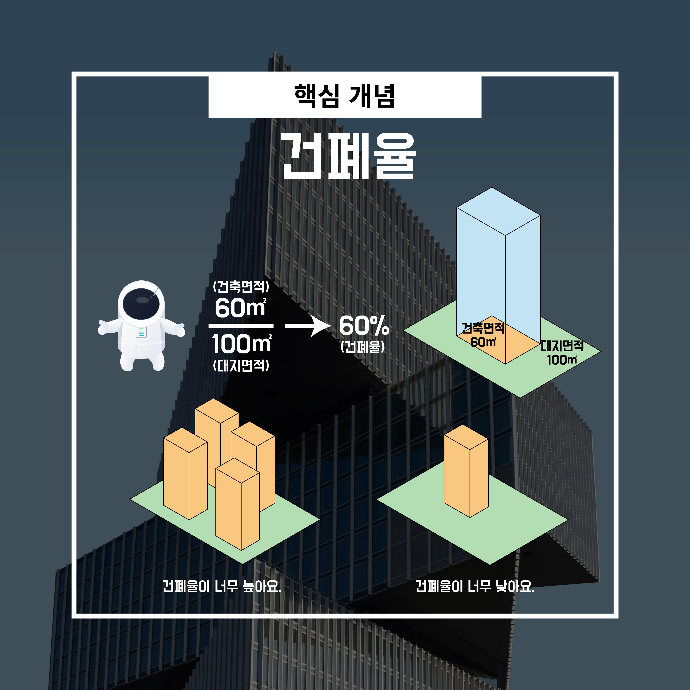
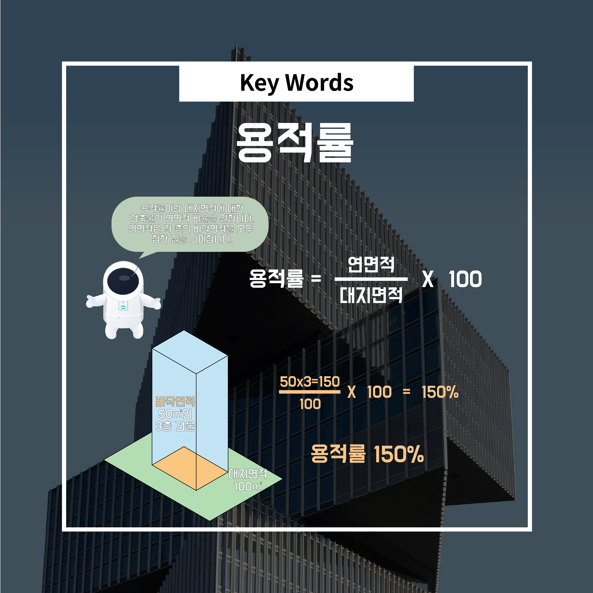

# 3. 건축법이 다루는 핵심 개념 5가지

건축 법규를 처음 접하면 가장 먼저 막히는 지점은 **낯선 용어**입니다.

건폐율, 용적률, 이격거리 같은 개념은 숫자와 함께 등장하기 때문에 더욱 어렵게 느껴집니다.

하지만 이 개념들은 **외워야 할 규칙**이 아니라

👉 **건축 행위를 관리하기 위한 최소한의 기준**으로 이해하는 것이 중요합니다.
---

## 핵심 개념 1️⃣ 대지

- 건축 법규는 **항상 ‘대지’에서 출발**합니다.
- 건물이 아무리 잘 설계되었더라도,
    
    **대지 조건이 맞지 않으면 건축 자체가 불가능**합니다.
    

### 왜 중요할까?

- 대지의 **면적, 형태, 도로와의 관계**는
    
    이후 모든 법규 판단의 기준이 됩니다.
    
- 즉, 건축은 **땅을 이해하는 것부터 시작하면 절반은 끝난 것**입니다.
---

## 핵심 개념 2️⃣ 건폐율

- **건폐율**이란
    
    👉 대지 면적 중 **건물이 바닥에서 차지하는 비율**입니다.
    

### 쉽게 말하면

- “이 땅 위에 **얼마만큼의 면적까지** 건물을 깔 수 있는가?”를 정하는 기준입니다
---

## 핵심 개념 3️⃣ 용적률

- **용적률**이란
    
    👉 건물의 **전체 연면적**이 대지 면적에 대해 가지는 비율입니다.
    

### 건폐율과의 차이

- **건폐율** → 땅을 얼마나 덮는가
- **용적률** → 위로 얼마나 쌓을 수 있는가

### 왜 필요할까?

- 한 필지에 **과도하게 밀집된 건물**이 들어서는 것을 막기 위한 장치입니다.
- 도시의 밀도와 스케일을 조절하는 핵심 기준입니다.
---
## 핵심 개념 4️⃣ 높이 제한 · 층수 제한

- 높이 제한이 ‘**미터(m)’ 단위**라면, 층수 제한은 말 그대로 **‘몇 층까지’ 쌓을 수 있는지**를 결정합니다.
- 모든 건물이 제한 없이 높아질 수 있다면
    
    도시 환경은 빠르게 악화됩니다.
    

### 대표적 사례

- 높이 제한 : ‘일조권 사선제한’입니다. 쉽게 말해, 내 건물이 옆집 마당이나 창가에 드리우는 그림자를 최소화하기 위해 건물의 윗부분을 깎아야 하는 규칙입니다.

### 이 기준의 역할

- 도시의 **스카이라인 관리**
- 주거 환경의 **채광·조망·개방감 유지**
- 주변 지역과의 **스케일 조정**

👉 단순히 “막는 규정”이 아니라

**도시 전체의 질을 유지하기 위한 장치**입니다.
---
## 핵심 개념 5️⃣ 이격거리 · 채광 · 일조

- **이격거리 :** 건물을 대지 경계선이나 옆 건물로부터 일정 거리 이상 띄우는 것을 말합니다.
- **채광 :** 말 그대로 햇빛이 실내로 들어오는 것을 의미하며, 건축법에서는 거실이나 방처럼 사람이 오래 머무는 공간에 일정한 창문 면적을 요구합니다.
- **일조 :** 앞서 설명한 ‘높이제한’의 근본적인 이유입니다. 남에게 피해를 주지 않으면서 햇빛을 받을 권리입니다.
- 이 기준들은 **건축주보다 주변 이웃을 보호**하기 위한 성격이 강합니다.
- 이격거리, 채광, 일조권 내용들은 건축법과 그 하위 법령인 건축법 시행령에 명시되어 있습니다.

### 포함되는 개념

- 건물 간 **거리 확보**
- 햇빛과 바람이 **차단되지 않도록 관리**
- 주거 공간의 **최소한의 쾌적성 보장**

### 핵심 포인트

- 건축은 개인의 재산이지만
    
    **도시 환경은 모두의 것이기 때문**입니다.
