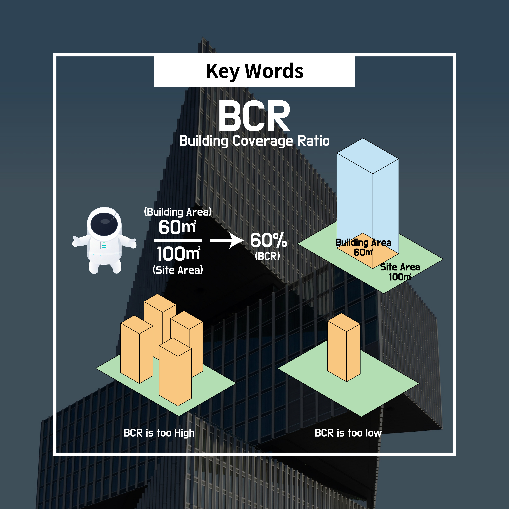
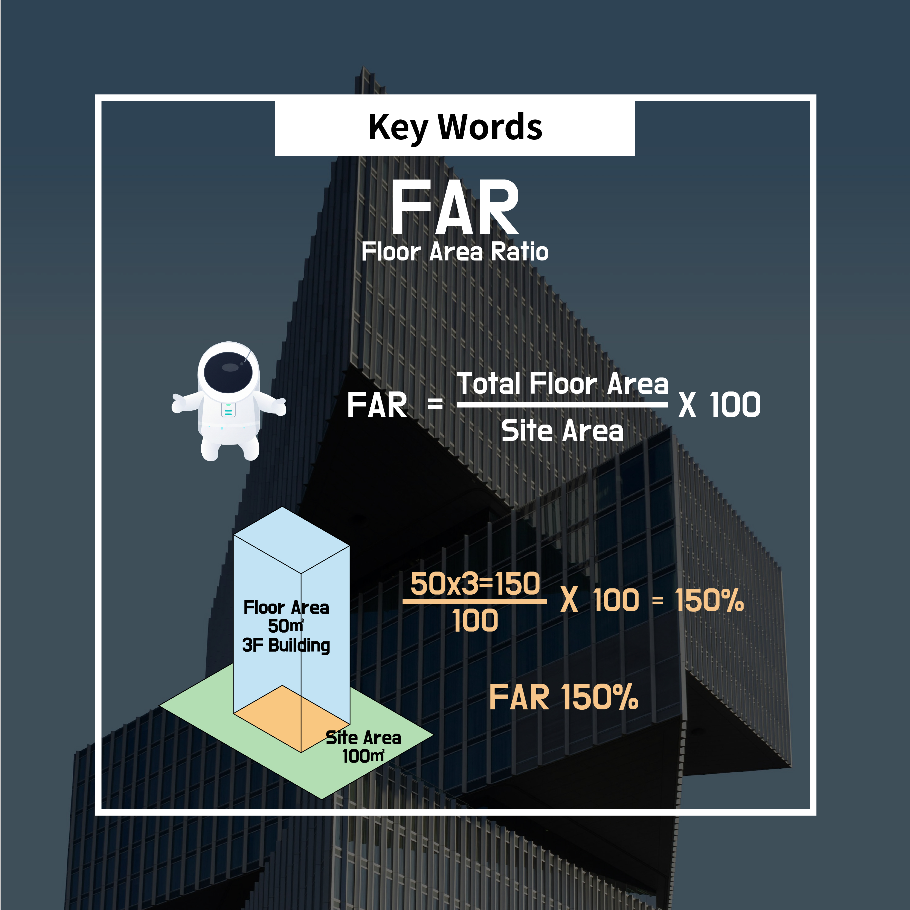

# 3. Five key concepts covered by the Building Act

When you first encounter building regulations, the biggest roadblock is **unfamiliar terms**.

Concepts like building coverage ratio, floor area ratio, and setback distances feel even harder because they come with numbers.

But these concepts are not **rules to memorize**;

👉 it’s important to understand them as **minimum standards for managing building activity**.

---

## Key concept 1️⃣ Site (Lot)

- Building regulations **always start from the “site.”**
- No matter how well a building is designed,
    
	**if the site conditions don’t match, construction itself becomes impossible**.

### Why is it important?

- The site’s **area, shape, and relationship to roads**
    
	become the basis for all later regulatory judgments.
    
- In other words, if you start by understanding the land,
    
	**you’re already halfway done**.

---

## Key concept 2️⃣ Building coverage ratio

- **Building coverage ratio** means
    
	👉 the **percentage of the site area occupied by the building footprint**.

### Put simply

- It is the standard that decides **“how much of this land can be covered by a building.”**
---

## Key concept 3️⃣ Floor area ratio

- **Floor area ratio** means
    
	👉 the ratio of the building’s **total gross floor area** to the site area.

### Difference from building coverage ratio

- **Building coverage ratio** → how much of the land you cover
- **Floor area ratio** → how much you can stack upward

### Why is it needed?

- It prevents **overly dense buildings** on a single lot.
- It is a key standard for controlling the density and scale of the city.
---
## Key concept 4️⃣ Height limit · Floor count limit

- If the height limit is in **meters (m)**, the floor limit decides **how many floors can be stacked**.
- If all buildings could rise without limits,
    
	the urban environment would quickly deteriorate.

### Typical example

- Height limit: the **daylight plane restriction**. Simply put, it is a rule that requires cutting back the upper part of a building to minimize the shadow it casts on a neighbor’s yard or window.

### The role of this standard

- Managing the city’s **skyline**
- Maintaining **daylight, views, and openness** in residential environments
- Adjusting **scale** with surrounding areas

👉 It is not merely a “blocking rule,”

but **a mechanism to preserve the overall quality of the city**.

---

## Key concept 5️⃣ Setbacks · Daylighting · Sunlight

- **Setback distance:** keeping the building a certain distance away from the site boundary or neighboring buildings.
- **Daylighting:** letting sunlight into interiors; the Building Act requires a minimum window area for spaces where people stay long, like living rooms or bedrooms.
- **Sunlight access:** the fundamental reason for the “height limit” described above. It is the right to receive sunlight without harming others.
- These standards strongly aim to **protect neighbors rather than the building owner**.
- Setback distance, daylighting, and sunlight rights are specified in the Building Act and its subordinate decree (the Enforcement Decree of the Building Act).

### Included concepts

- Securing **distance between buildings**
- Managing so that **sunlight and wind are not blocked**
- Guaranteeing **minimum comfort** in residential spaces

### Key point

- Architecture is private property, but
    
	**the urban environment belongs to everyone**.
