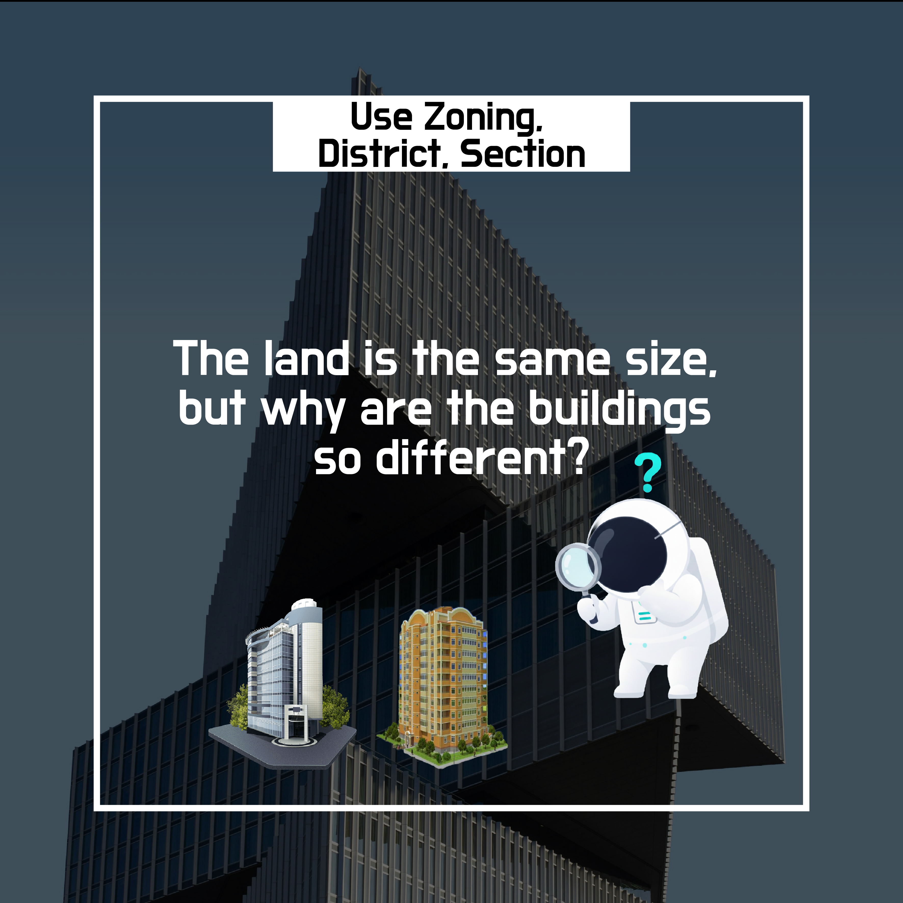
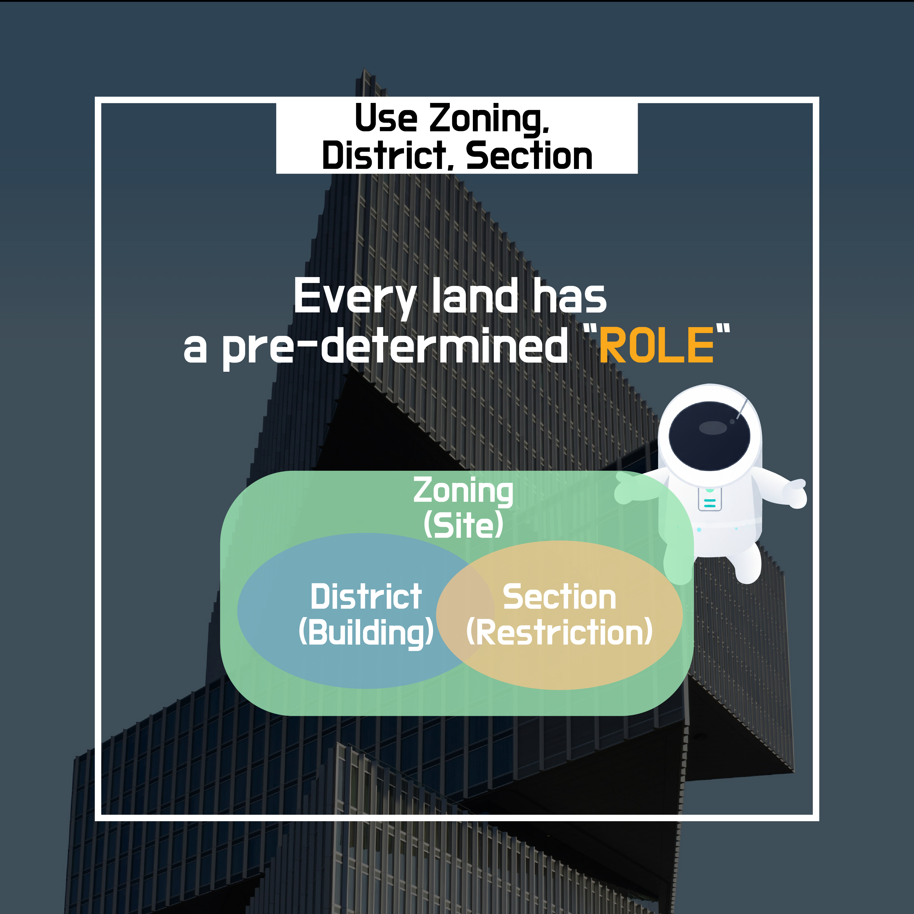

# 4. Use zones, districts, and areas—why so complicated?

When you walk around a city, you often see **very different buildings on land of similar size**.

In some places there are apartments, in others shops, and in others factories.

This difference is not due to chance or personal preference.

👉 It’s because **each piece of land has a pre-defined “use purpose.”**

Cities do not grow randomly.

If residential, commercial, and industrial facilities were mixed with no standards, the following problems would occur.

- **Noise · safety issues** from factories next to housing
- **Traffic congestion** from over-concentrated commercial facilities
- Decline in the **quality of the living environment**

To prevent this, cities

👉 **classify and manage land use in advance**.

This system is the starting point of the **use zone system**.

---

## 4-1 What is a use zone?

- A **use zone** is
    
	👉 a standard that determines **“what type of building fits this land.”**

Representative categories include:

- **Residential zones**
- **Commercial zones**
- **Industrial zones**

Each zone is set with different **allowed building types, scale, and density**.

---

## 4-2 How do differences by zone appear?

### Residential zones

- Protecting the residential environment is the priority
- Building height and floor area ratio are **relatively strict**
- The goal is a quiet and stable living environment

### Commercial zones

- Centered on economic activity
- **High-density buildings are allowed**
- Planned with concentration of people and functions in mind

👉 In other words, **even with the same land area, completely different architecture becomes possible depending on the use zone**.

---

## 4-3 Then what are “districts” and “areas”?

Here, the concepts of **district** and **area** are added.

These are applied when management with only use zones is insufficient,

👉 as **more detailed control mechanisms**.

### The role of districts · areas

- Protecting historic landscapes
- Restricting or encouraging development
- Strengthening specific functions (commercial, tourism, pedestrian, etc.)

In other words,

- **Use zones** → determine the broad character
- **Districts · areas** → add detailed conditions

Cities are not just collections of land;

👉 they are spaces layered with people’s lives, safety, and memories.

So rather than regulating everything at once,

- first divide by use zones
- and if needed, adjust again with districts · areas.

---

## 4-4 In summary

- Architecture starts with the question,
    
	**“What can be built on this land?”**
    
- The answer to this question is not the designer’s will or the owner’s desire,
    
	👉 but **the pre-assigned use of the land**.

**The moment you understand use zones · districts · areas**,

you can naturally explain

why completely different buildings are created on the same land.

---
