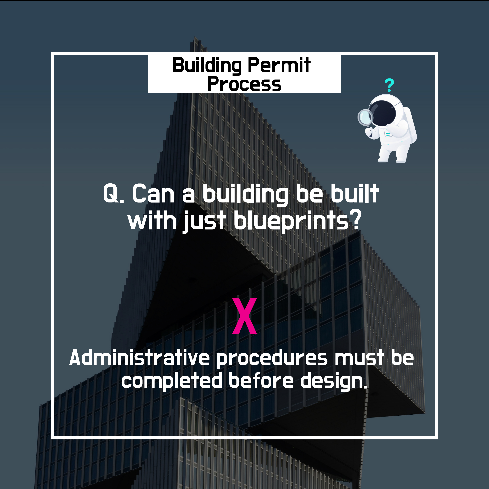
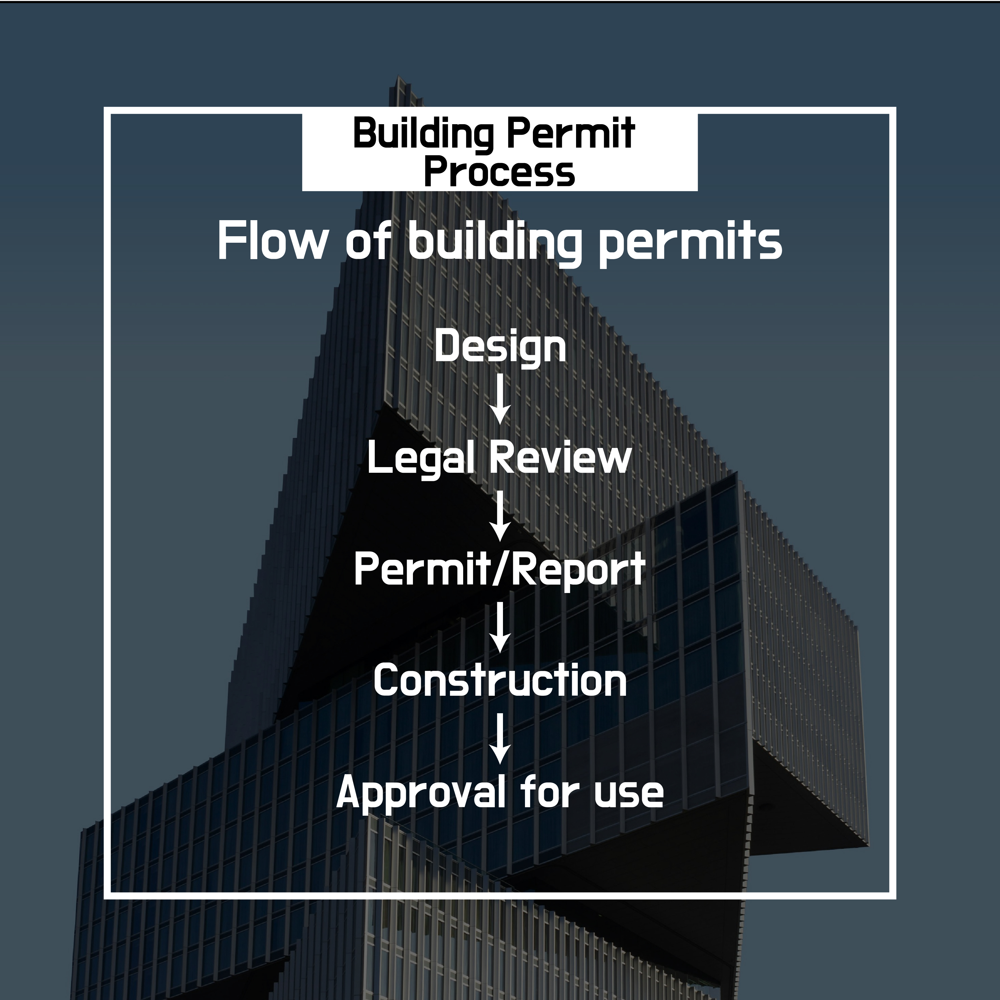

# 5. The building permit process actually goes like this.

## 5-1 Why can’t we start construction right after design?

It may seem that once drawings are complete, construction can start immediately.

But in reality, **most building activities must go through administrative procedures before construction**.

This whole process is generally called

👉 the **“building permit process.”**

---

## 5-2 Is the permit just a formality?

Many people think of a building permit as

**“a process of submitting a few documents and getting a stamp.”**

But the permit is

👉 **the most important stage where building regulations are actually applied and reviewed.**

The following criteria we saw earlier

are all checked together at this stage.

- Use zones · districts · areas
- Building coverage ratio and floor area ratio
- Building height and number of floors
- Setback distances
- Sunlight · daylighting standards

In other words,

**it is the final verification of whether the design is legally valid.**

---

## 5-3 Basic flow of the permit process

The building permit process generally follows this order.

1. **Building plan and design**
2. **Review of compliance with relevant regulations**
3. **Permit or notification**
4. **Start of construction**
5. **Completion of construction**
6. **Use approval**
7. **Building can be used**

👉 Without this flow,

even if the building is completed, **it cannot be used legally.**

---

## 5-4 What’s the difference between “permit” and “notification”?

One of the most frequent concepts in the permit process is

👉 **the difference between “permit” and “notification.”**

### Permit

- The administrative authority **reviews the design in advance**
- **Approves** after checking compliance with regulations
- Applied to relatively large or impactful buildings

### Notification

- When **legal standards are clearly satisfied**
- **Procedures proceed by document submission only**
- Applied to relatively simple construction

👉 Depending on the **building’s size, use, and location**,

the applicable method changes.

---

## 5-5 Why does design often change during the permit process?

Design changes during the permit process are very common.

This does not mean the design was wrong.

- Results of regulatory review
- Relationship with the surrounding environment
- Administrative judgment

Through these,

👉 **a determination is made that adjustments are needed.**

If problems are not fixed at this stage,

- Construction suspension
- Permit cancellation
- Refusal of use approval

can lead to **even bigger problems**.

---

## 5-6 In summary

- A building permit is
    
	not just an administrative procedure.
    
- **It is the process that confirms whether a building can be legally built.**
- An individual’s design and plan
    
	enter **the rules of the city and society** through this process.
    

👉 That’s why understanding the building permit

**is the most important starting point for understanding the entire body of building regulations.**
