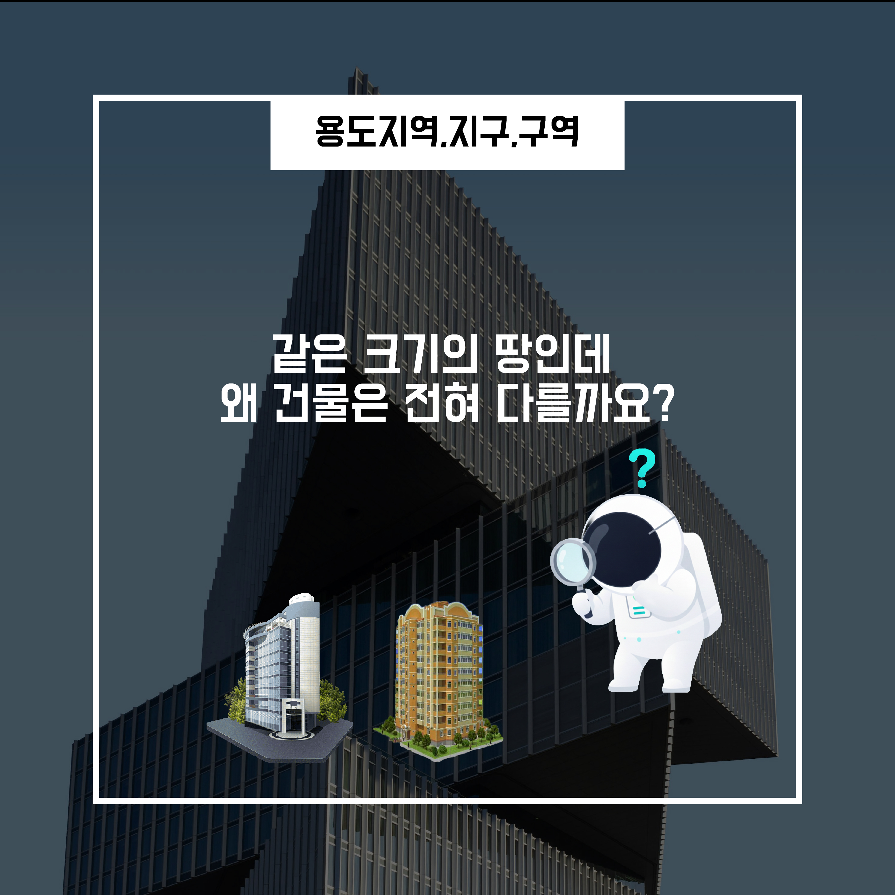
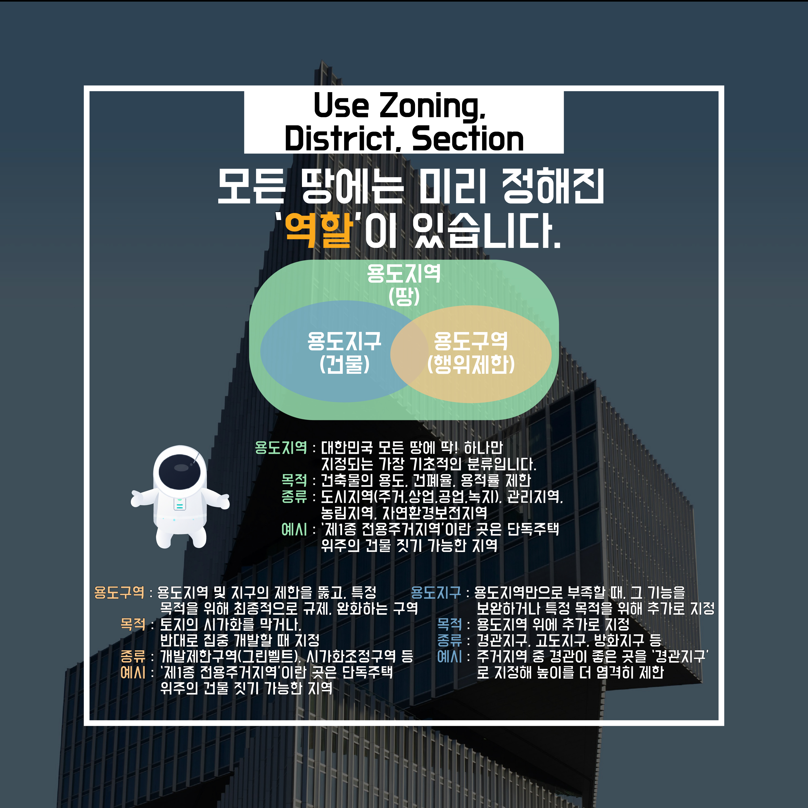

<h1 align="center">4. 용도지역,지구,구역, 왜 이렇게 복잡할까?</h1>

도시를 걷다 보면 <strong>비슷한 크기의 땅인데도 전혀 다른 건물</strong>이 들어서 있는 모습을 자주 보게 됩니다.

어떤 곳에는 아파트가, 어떤 곳에는 상가가, 또 어떤 곳에는 공장이 자리 잡고 있습니다.

이 차이는 우연이나 개인의 선택 때문이 아닙니다.

👉 <strong>땅마다 미리 정해진 ‘사용 목적’이 다르기 때문</strong>입니다.

도시는 무작위로 성장하지 않습니다.

만약 주거 공간, 상업 시설, 산업 시설이 아무 기준 없이 섞인다면 다음과 같은 문제가 발생합니다.

<strong>-</strong> 주거지 옆 공장으로 인한 <strong>소음·안전 문제</strong>

<strong>-</strong> 상업 시설 과밀로 인한 <strong>교통 혼잡</strong>

<strong>-</strong> 생활 환경의 <strong>질적 저하</strong>

이를 방지하기 위해 도시는

👉 <strong>땅의 사용 목적을 미리 구분해 관리</strong>합니다.

이 제도가 바로 <strong>용도지역 제도의 출발점</strong>입니다.

<h2 align="center">4-1 용도지역이란 무엇인가?</h2>

<strong>-</strong> <strong>용도지역</strong>은

👉 “이 땅에는 어떤 성격의 건축물이 어울리는가?”를 정해 놓은 기준입니다.

대표적인 구분은 다음과 같습니다.

<strong>-</strong> <strong>주거지역</strong>

<strong>-</strong> <strong>상업지역</strong>

<strong>-</strong> <strong>공업지역</strong>

각 지역마다 <strong>허용되는 건축물의 종류, 규모, 밀도</strong>가 다르게 설정되어 있습니다.

<h2 align="center">4-2 지역별 차이는 어떻게 나타날까?</h2>
<h3 align="center">주거지역</h3>

<strong>-</strong> 주거 환경 보호가 우선

<strong>-</strong> 건물 높이, 용적률이 <strong>상대적으로 엄격</strong>

<strong>-</strong> 조용하고 안정적인 생활 공간 유지가 목적

<h3 align="center">상업지역</h3>

<strong>-</strong> 경제 활동 중심

<strong>-</strong> <strong>높은 밀도의 건축 허용</strong>

<strong>-</strong> 사람과 기능의 집중을 전제로 계획됨

👉 즉, <strong>같은 면적의 땅이라도 용도지역에 따라 전혀 다른 건축이 가능</strong>해집니다.

<h2 align="center">4-3 그렇다면 ‘지구’와 ‘구역’은 무엇일까?</h2>

여기에 <strong>지구</strong>와 <strong>구역</strong>이라는 개념이 추가됩니다.

이는 용도지역만으로는 관리가 부족할 때 적용되는

👉 <strong>보다 세부적인 관리 장치</strong>입니다.

<h3 align="center">지구·구역의 역할</h3>

<strong>-</strong> 역사적 경관 보호

<strong>-</strong> 개발 제한 또는 유도

<strong>-</strong> 특정 기능 강화 (상업, 관광, 보행 등)

즉,

<strong>-</strong> <strong>용도지역</strong> → 큰 틀의 성격 결정

<strong>-</strong> <strong>지구·구역</strong> → 세밀한 조건 추가

도시는 단순한 땅의 집합이 아니라

👉 <strong>사람의 생활, 안전, 기억이 겹쳐진 공간</strong>이기 때문입니다.

그래서 한 번에 규정하지 않고,

<strong>-</strong> 1차로 용도지역을 나누고

<strong>-</strong> 필요하면 지구·구역으로 다시 조정합니다.

<h2 align="center">4-4 정리하면</h2>

<strong>-</strong> 건축은 <strong>“이 땅에 무엇을 지을 수 있는가?”</strong>라는 질문에서 시작합니다.

<strong>-</strong> 이 질문의 답은 설계자의 의지나 건축주의 욕심이 아니라

👉 <strong>땅에 미리 부여된 용도</strong>가 결정합니다.

<strong>용도지역·지구·구역을 이해하는 순간</strong>,

같은 땅에서 왜 전혀 다른 건물이 만들어지는지

자연스럽게 설명할 수 있게 됩니다.

