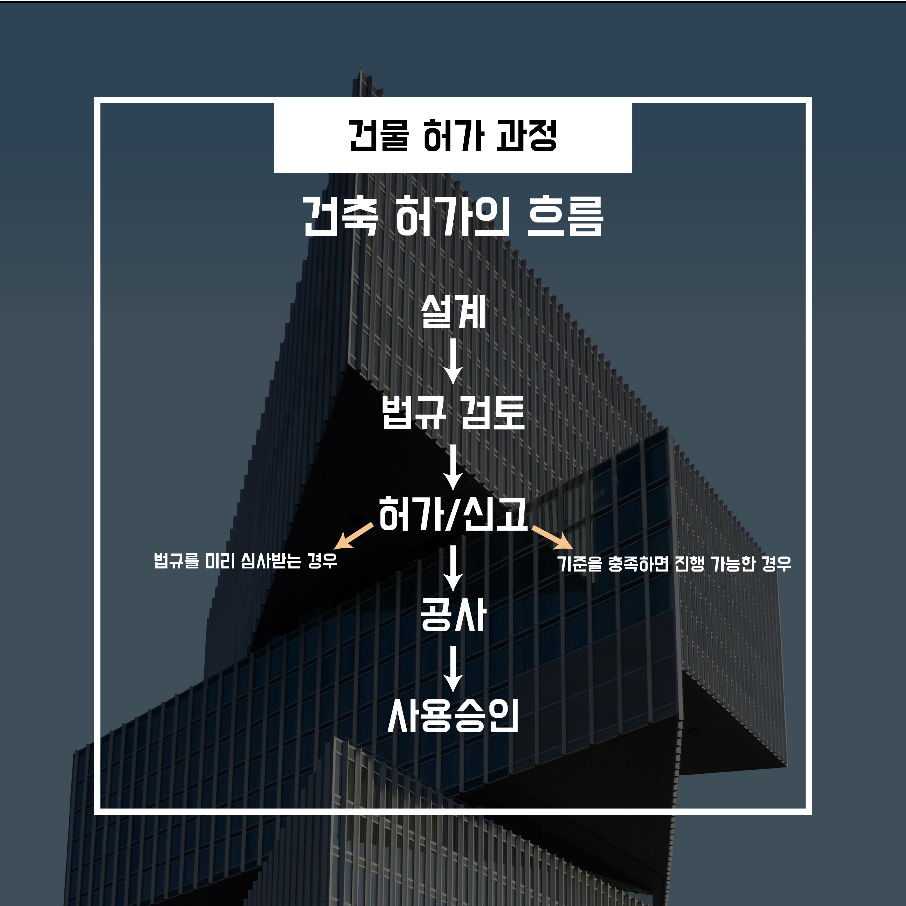

<h1 align="center">5. 건축 허가 절차는 실제로 다음과 같습니다.</h1>

<h2 align="center">5-1 왜 설계가 끝나도 바로 공사를 못 할까?</h2>

건축은 설계도면만 완성되면 곧바로 공사를 시작할 수 있을 것처럼 보입니다.

하지만 실제로는 <strong>대부분의 건축 행위가 공사 전에 반드시 행정 절차를 거쳐야</strong> 합니다.

이 과정을 통틀어 일반적으로

👉 <strong>‘건축 허가 과정’</strong>이라고 부릅니다.

<h2 align="center">5-2 건축 허가는 단순한 형식일까?</h2>

많은 사람들이 건축 허가를

<strong>“서류 몇 장 내고 도장받는 절차”</strong> 정도로 생각합니다.

하지만 허가는

👉 <strong>건축 법규가 실제로 적용되고 검토되는 가장 중요한 단계</strong>입니다.

앞서 살펴본 다음 기준들이

모두 이 단계에서 한 번에 확인됩니다.

<strong>-</strong> 용도지역·지구·구역

<strong>-</strong> 건폐율과 용적률

<strong>-</strong> 건물 높이와 층수

<strong>-</strong> 이격거리

<strong>-</strong> 일조·채광 기준

즉,

<strong>설계가 법적으로 성립하는지 최종 검증하는 단계</strong>입니다.

<h2 align="center">5-3 건축 허가 과정의 기본 흐름</h2>

건축 허가 과정은 대체로 다음과 같은 순서를 따릅니다.

<strong>-</strong> <strong>건축 계획 및 설계</strong>

<strong>-</strong> <strong>관련 법규 충족 여부 검토</strong>

<strong>-</strong> <strong>허가 또는 신고</strong>

<strong>-</strong> <strong>공사 착수</strong>

<strong>-</strong> <strong>공사 완료</strong>

<strong>-</strong> <strong>사용승인</strong>

<strong>-</strong> <strong>건물 사용 가능</strong>

👉 이 흐름을 거치지 않으면

건물은 완성되더라도 <strong>법적으로 사용할 수 없습니다.</strong>

<h2 align="center">5-4 ‘허가’와 ‘신고’는 무엇이 다를까?</h2>

허가 과정에서 가장 자주 등장하는 개념이

👉 <strong>‘허가’와 ‘신고’의 차이</strong>입니다.

<h3 align="center">허가</h3>

<strong>-</strong> 행정기관이 <strong>사전에 설계 내용을 심사</strong>

<strong>-</strong> 법규 적합 여부를 검토한 뒤 <strong>승인</strong>

<strong>-</strong> 비교적 규모가 크거나 영향이 큰 건축물에 적용

<h3 align="center">신고</h3>

<strong>-</strong> 법에서 정한 기준을 <strong>명확히 충족하는 경우</strong>

<strong>-</strong> <strong>서류 제출만으로 절차 진행</strong>

<strong>-</strong> 상대적으로 단순한 건축에 적용

👉 <strong>건물의 규모, 용도, 위치</strong>에 따라

어떤 방식이 적용되는지가 달라집니다.

<h2 align="center">5-5 왜 허가 과정에서 설계가 자주 바뀔까?</h2>

허가 과정 중 설계 변경이 발생하는 경우는 매우 흔합니다.

이는 설계가 잘못되었기 때문이 아닙니다.

<strong>-</strong> 법규 검토 결과

<strong>-</strong> 주변 환경과의 관계

<strong>-</strong> 행정적 판단

등을 통해

👉 <strong>조정이 필요하다는 판단이 내려지기 때문</strong>입니다.

이 단계에서 문제를 수정하지 않으면,

<strong>-</strong> 공사 중단

<strong>-</strong> 허가 취소

<strong>-</strong> 사용승인 거부

와 같은 <strong>더 큰 문제</strong>로 이어질 수 있습니다.

<h2 align="center">5-6 정리하면</h2>

<strong>-</strong> 건축 허가는 단순한 행정 절차가 아닙니다.

<strong>-</strong> <strong>건물이 법적으로 지어질 수 있는지 확인하는 과정</strong>입니다.

<strong>-</strong> 개인의 설계와 계획은 이 과정을 통해 <strong>도시와 사회의 규칙 안으로 들어옵니다.</strong>

👉 그래서 건축 허가를 이해하는 것은

<strong>건축 법규 전체를 이해하는 가장 중요한 출발점</strong>이 됩니다.

