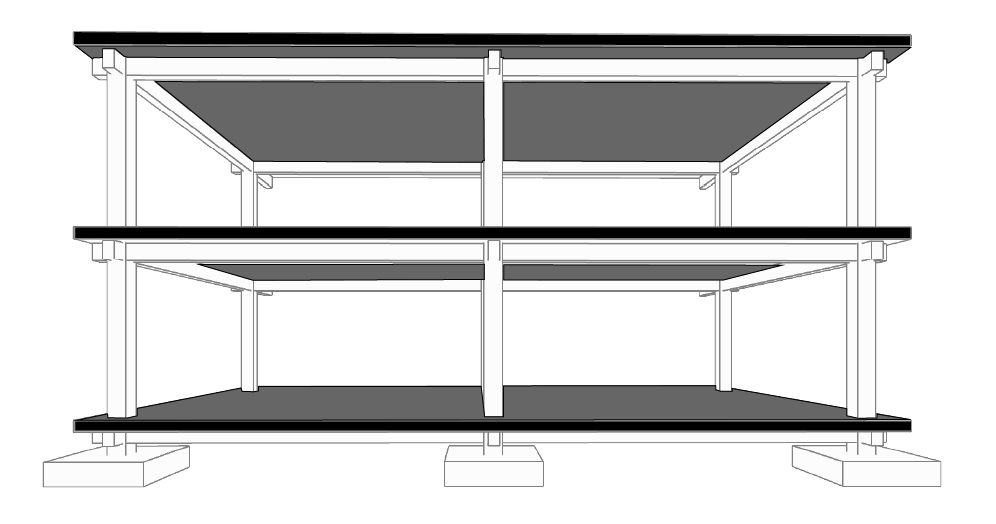
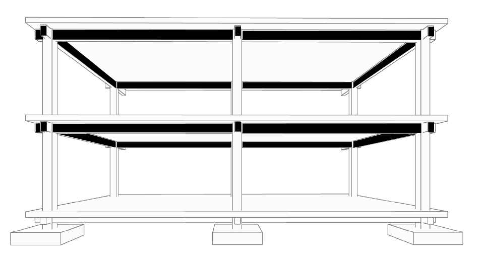
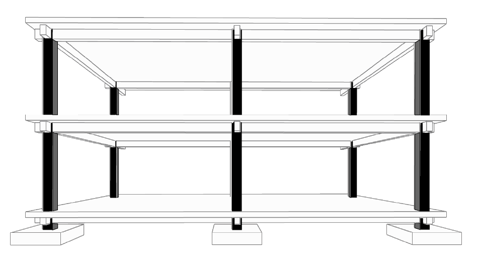

# 🏗️ Structural System & Data Topology

> **Document Info**
> * **분류 (Category):** 건축 / 구조 시스템 (Architecture / Structural System)
> * **타겟 시스템 (Target System):** 구조 해석, HVAC 용량 산정, MEP 라우팅, CFD
> * **최종 업데이트 (Last Updated):** 2026-02-02
> * **핵심 키워드 (Keywords):** `고정하중(Dead Load)`, `열관성(Thermal Inertia)`, `물리적 한계선(Hard Constraint)`, `공간 기준점(Anchor Points)`

---

# 하중의 종류와 흐름

 

| **고정하중 (Dead Load)** | **활하중 (Live Load)** | **환경하중 (Environmental Load)** |
| :---: | :---: | :---: |
| **슬래브, 보, 기둥, 마감재의 무게** | **사람, 가구, 장비, 차량 등** | **풍하중, 적설하중, 지진하중** |
| □ 구조 두께 = 열용량(Thermal Mass) □ 에너지 시뮬레이션 영향 | □ 인원 밀도 = 내부발열(Internal Gain) □ HVAC 용량 산정 직결 | 건물의 높이 · 형태 · 지역에 따라 다름 |

  

### 1. 슬래브 (Slab)

 

콘크리트 슬래브의 <strong>두께와 밀도</strong>는 건물의 열관성을 결정합니다.

콘크리트가 열을 충분히 머금어주지 못하면, 시뮬레이션 상에서 
<strong>피크 부하(Peak Load)</strong>가 비정상적으로 높게 산출됩니다.

 

> <strong>*피크 부하(Peak Load):</strong> 냉난방 설비 용량을 결정하는 '가장 덥거나 추운 순간의 최대 에너지 요구량'

  

### 2. 보 (Beam)

 

기둥과 기둥을 연결해 슬래브를 받치는 <strong>수평 뼈대</strong>입니다. 
하중을 전달하며 건물의 처짐을 막아주는 역할을 합니다.

 

하지만 해석 관점에서는, 설비 덕트와 배관 경로를 결정하는 
<strong>'물리적 한계선(Hard Constraint)'</strong>입니다.

 

보의 깊이(Depth)를 무시하고 모델링하면 현실에서는 <strong>시공 불가능한</strong> 
설비 경로가 생성되며, CFD 해석에서는 기류의 흐름을 끊는 <strong>장애물</strong>이 됩니다.

  

### 3. 기둥 (Column)

 

가변적인 공간 속 '불변의 데이터 좌표'입니다.

 

인테리어 벽체는 운영 중에 바뀔 수 있지만, 
기둥은 건물의 수명이 다할 때까지 고정된 <strong>공간의 기준점(Anchor)</strong>입니다.

 

에너지 존을 나누거나, 디지털 트윈 센서를 배치할 때 
절대 변하지 않는 참조 좌표가 됩니다. 
기둥을 기준으로 구획하지 않은 존은 추후 리모델링 시 데이터 정합성이 깨집니다.

