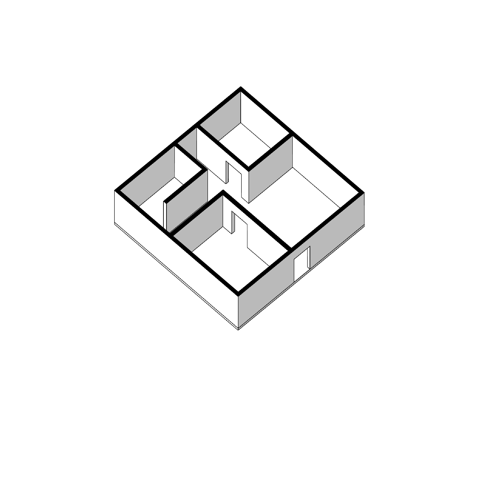
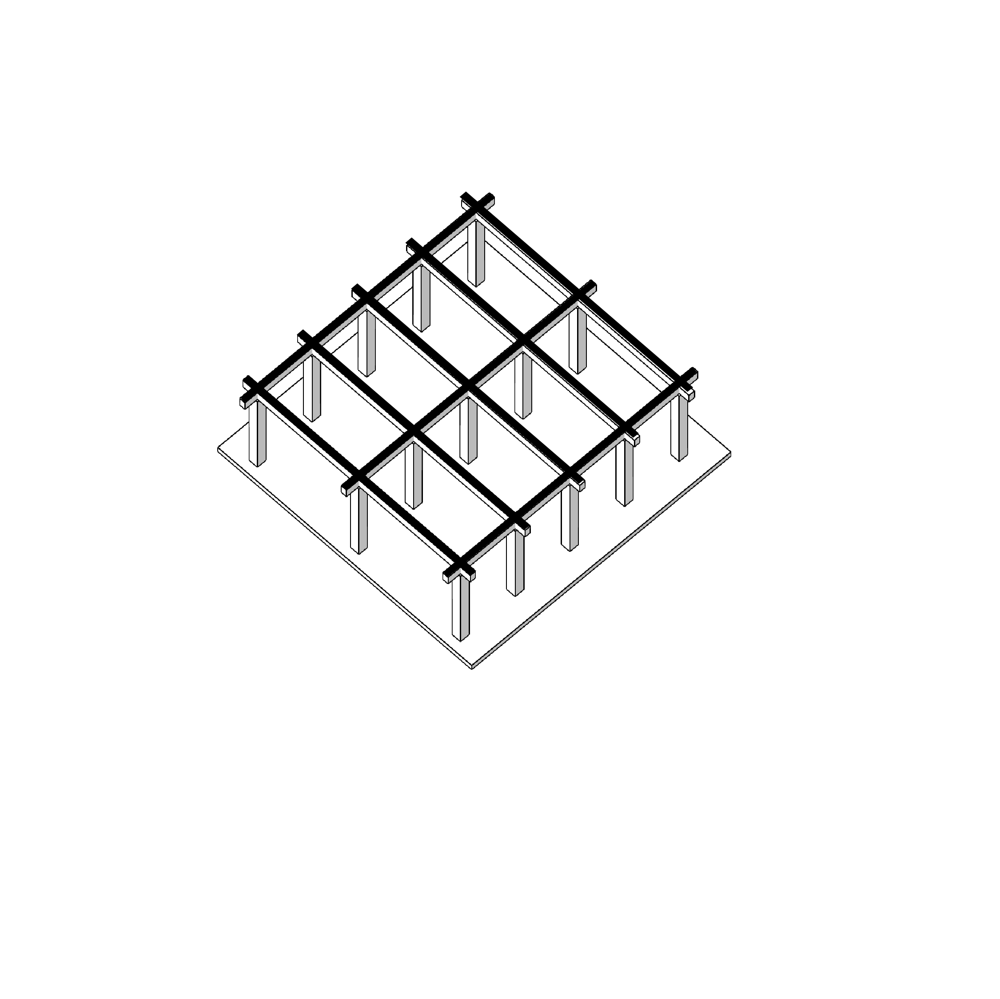
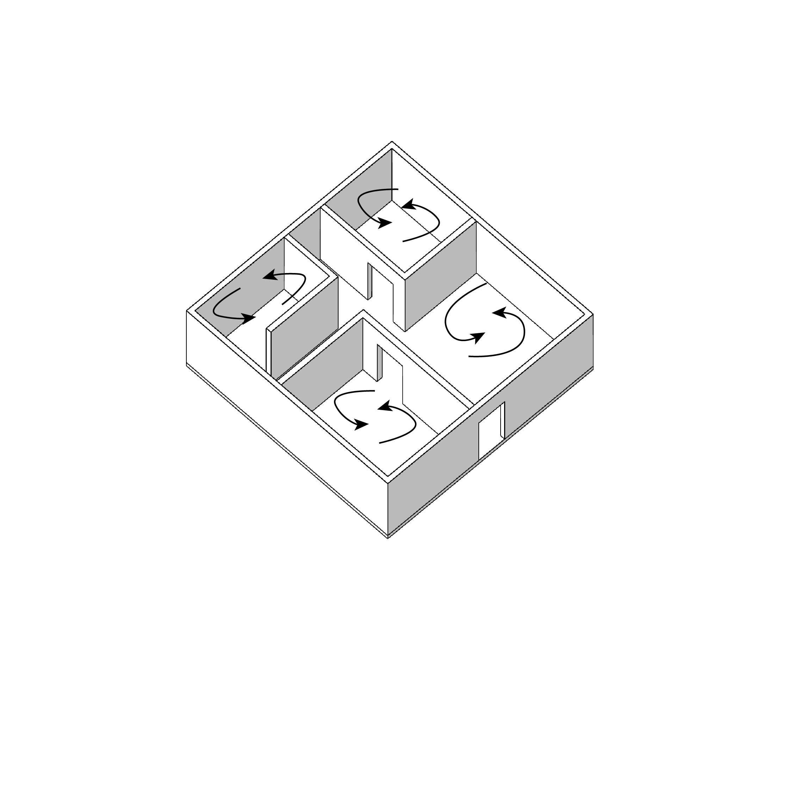
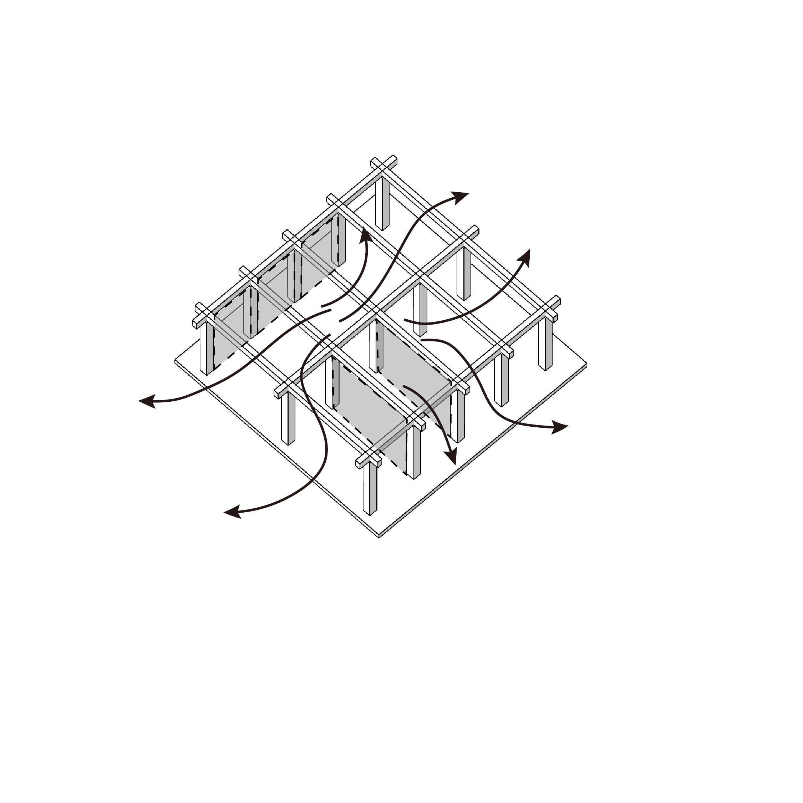
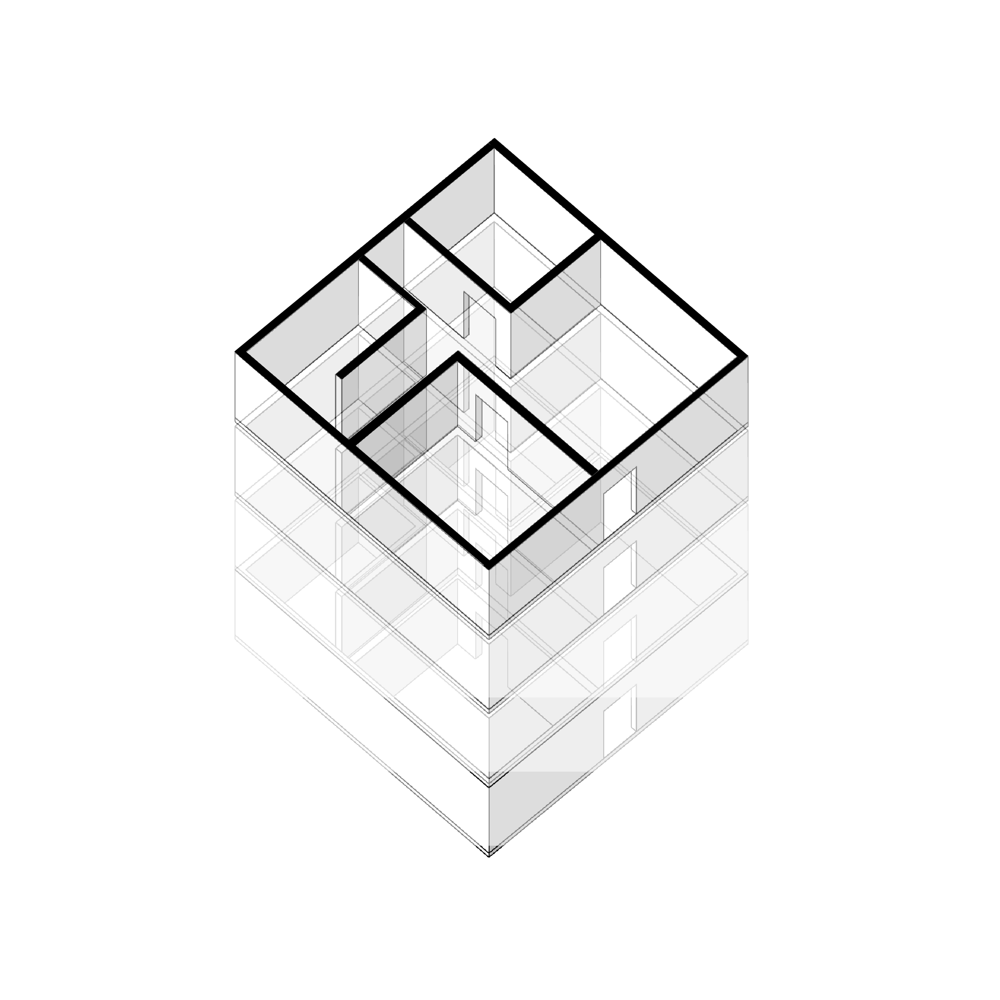
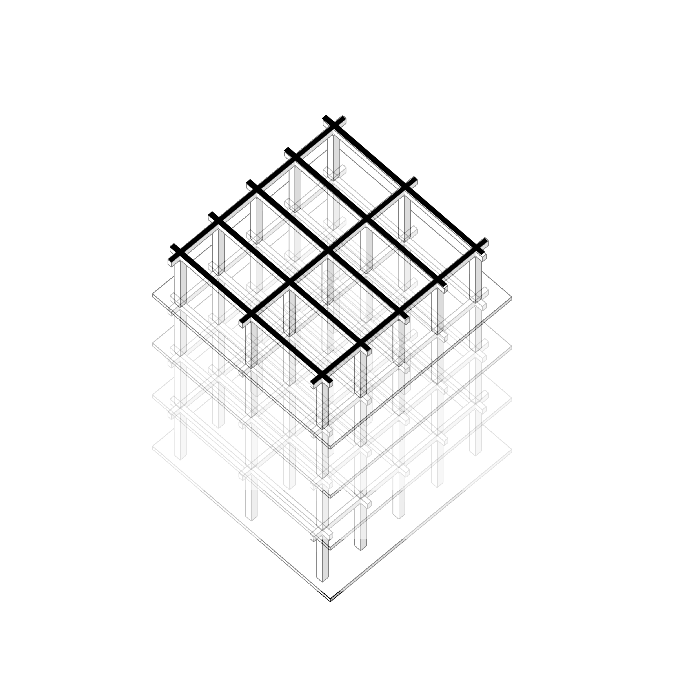

# 🏗️ Structural System & Data Topology

> **Document Info**
> * **분류 (Category):** 건축 / 구조 시스템 (Architecture / Structural System)
> * **타겟 시스템 (Target System):** 에너지 해석, 기류 해석 (CFD), BIM 데이터 관리
> * **최종 업데이트 (Last Updated):** 2026-02-02
> * **핵심 키워드 (Keywords):** `벽식 vs 라멘`, `물리적 제약 조건(Physical Constraint)`, `열교(Thermal Bridge)`, `데이터 위계(Data Hierarchy)`

---

# 02 Structural System & Data Topology

### 벽식 구조와 라멘 구조: 시뮬레이션 경계 조건과 데이터 위계의 차이

---

 

디지털 트윈 구축 단계에서 구조 형식(Structural System)을 파악하는 것은 단순한 형상 모델링 이상의 의미를 가집니다.

구조 형식은 <strong>에너지 해석의 열교(Thermal Bridge) 라인</strong>, <strong>기류 해석의 유체 흐름 장애물</strong>, 그리고 <strong>BIM 데이터의 수정 가능 범위</strong>를 결정짓는 가장 상위의 <strong>물리적 제약 조건(Physical Constraint)</strong>이기 때문입니다.

 

| <strong>1. 벽식 구조 (Wall Structure)</strong> | <strong>2. 라멘 구조 (Rahmen Structure)</strong> |
| :--- | :--- |
| <strong>선형 구속 (Linear Constraint)</strong> 닫힌 데이터 셀 (Closed Cell) | <strong>점형 구속 (Point Constraint)</strong> 가변적 필드 (Flexible Field) |
| <strong>[정의]</strong> 수직 하중을 지지하는 <strong>내력벽(Bearing Wall)</strong>이 공간을 구획하는 동시에 구조체의 역할을 수행합니다. | <strong>[정의]</strong> 기둥(Column)과 보(Beam)가 결합하여 3차원 프레임을 형성하며, 벽체는 하중을 받지 않는 <strong>비내력벽</strong>입니다. |
|  |  |
| <strong>[해석적 관점] 해석적 닫힘</strong>  <li><strong>에너지 해석 (Energy)</strong>: 외벽과 내벽이 만나는 모든 모서리가 <strong>선형 열교(Linear Thermal Bridge)</strong>가 됩니다.</li> <li><strong>기류 해석 (Airflow)</strong>: 내력벽에 의해 기류가 차단되어, <strong>Room 단위의 독립 격자</strong> 구획이 강제됩니다.</li> | <strong>[해석적 관점] 해석적 열림</strong>  <li><strong>에너지 해석 (Energy)</strong>: 구조와 외피가 분리되어 <strong>개구부(Window)와 커튼월</strong>의 물성치가 핵심 변수가 됩니다.</li> <li><strong>기류 해석 (Airflow)</strong>: 거대한 <strong>오픈 플랜(Open Plan)</strong>으로 해석되며, 기둥은 유체 흐름을 가르는 <strong>장애물(Obstacle)</strong>로 작용합니다.</li> |
|  |  |
| <strong>[데이터] 정적 공간 (Static Zone)</strong>  <li>BIM 벽체 속성 = <strong>`Structural`</strong> (고정)</li><li>공간(Room) 경계가 영구 고정되므로, 운영 단계 데이터 모델의 유연성이 낮습니다.</li> | <strong>[데이터] 동적 레이어 (Dynamic Layer)</strong>  <li>BIM 벽체 속성 = <strong>`Architectural`</strong> (가변)</li><li>센서 데이터는 변하지 않는 <strong>기둥(Anchor)</strong>에 맵핑되며, 벽체 정보는 언제든 수정 가능합니다.</li> |
|  |  |
| 💡 <strong>Insight</strong> 데이터 모델링 최소 단위: <strong>고정된 방 (Room)</strong> | 💡 <strong>Insight</strong> 데이터 모델링 최소 단위: <strong>좌표 그리드 (Grid)</strong> |
| 
 <h3>🔻 Summary: Wall</h3>
 | 
 <h3>Summary: Rahmen 🔻</h3>
 |
| 
<b>[제약 조건]</b> Linear Constraint (선형)
 | 
<b>[제약 조건]</b> Point Constraint (점형)
 |
| 
<b>[BIM 위계]</b> Wall = Structure (삭제 불가)
 | 
<b>[BIM 위계]</b> Wall = Architecture (삭제 가능)
 |
| 
<b>[에너지 해석]</b> 열교(Bridge) 관리 핵심
 | 
<b>[에너지 해석]</b> 외피(Skin) 성능 핵심
 |
| 
<b>[기류 해석]</b> Compartment (구획된 공간)
 | 
<b>[기류 해석]</b> Open Field (개방형 공간)
 |

  

### Conclusion

 

건물의 구조 형식을 이해하는 것은 <strong>데이터가 담길 그릇의 형태</strong>를 이해하는 것과 같습니다.

성능 해석 모델과 디지털 트윈을 구축할 때, 대상 건물의 구조 형식에 맞춰 
<strong>데이터의 위계(Hierarchy)</strong>를 올바르게 설정하시기 바랍니다.

