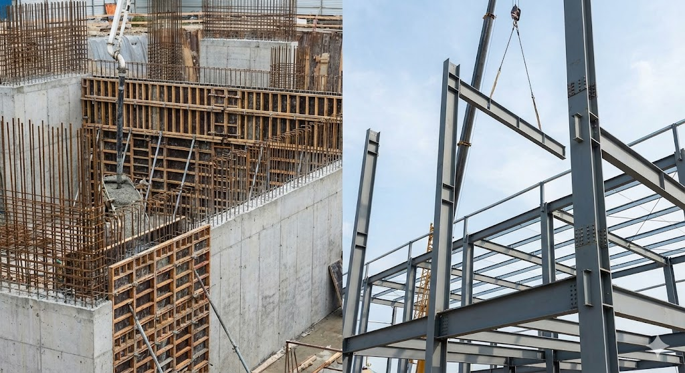

# 🏗️ Material Properties & Simulation Response

> **Document Info**
> * **Category:** Architecture / Structural System
> * **Target System:** Energy Simulation, HVAC Control, MEP Routing, CFD
> * **Last Updated:** 2026-02-02
> * **Keywords:** `RC vs Steel`, `Thermal Mass`, `Time Lag`, `MEP Integration`

---

# 03 Material Properties & Simulation Response

### RC vs. Steel: Differences in Thermal Behavior and MEP Integration

---

 

The choice of structural material goes beyond simple construction methods; it determines the **Bio-rhythm of the building**.

This chapter defines the **physical characteristics** of the two most representative structural systems and analyzes their differences from the perspectives of **Energy Simulation** and **MEP (Mechanical, Electrical, Plumbing) Integration**.

 

## 1. Structural Concept
**Monolithic Wet Construction vs. Prefabricated Dry Construction**

  

  

| Category | **Reinforced Concrete (RC)** | **Steel Structure** |
| :--- | :--- | :--- |
| **Composition** | **Composite** Concrete (Compression) + Rebar (Tension) | **Homogeneous** High-strength Steel (H-Beam, etc.) |
| **Construction** | **Wet Process** On-site casting into forms & Curing | **Dry Process** Factory fabrication & On-site assembly (Bolt/Weld) |
| **Physical Feature** | **Massive & Continuous** Thick, heavy, and continuous members | **Slender & Discrete** Thin, long, and independent members |

> **Insight**
>
> * **RC**: A **'Mass'** created on-site → Retains a significant amount of heat.
> * **Steel**: A **'Frame'** assembled from parts → Sensitive to heat, contains void spaces.

 
 

---

 

## 2. Thermodynamic Response
**Time Lag vs. Quick Response**

  

 

The building's 'Mass' makes a decisive difference in how it handles heat.

> **RC (Concrete)**: `Heavy Mass`
> Concrete's massive thermal storage capacity absorbs rapid changes in outdoor temperature, playing a role in **delaying peak loads (Time Lag)**.

> **Steel**: `Light Mass`
> Low heat capacity causes outdoor loads to transfer immediately to the indoors. Therefore, insulation performance and **agile control of mechanical systems** are essential.

| Category | **Reinforced Concrete (RC)** | **Steel Structure** |
| :--- | :--- | :--- |
| **Response Speed** | **Slow (Buffer)** | **Fast (Sensitive)** |
| **Simulation** | Load shifting via Thermal Mass effect | Dependence on Envelope Insulation (U-value) |
| **Operation Strategy** | Pre-heating/Pre-cooling Scheduling | Real-time High-efficiency Control |

 
 

---

 

## 3. MEP Integration
**Embedded Constraints vs. Open Flexibility**

  

 

The shape of the structure determines the **'Physical Routing Path'** for HVAC systems.

* **RC Structure**: Thick beams make pipe penetration difficult. Without **Sleeve Planning** prior to construction, modifications are impossible.
* **Steel Structure**: Long spans and thin members make space allocation easy. It is advantageous for **Computational Fluid Dynamics (CFD)** analysis in large spaces.

| Category | **Reinforced Concrete (RC)** | **Steel Structure** |
| :--- | :--- | :--- |
| **Space Flexibility** | **Low Flexibility** | **High Flexibility** |
| **MEP Routing** | Pre-planned Sleeves Essential | Open Web / Duct Penetration Easy |
| **CFD Aspect** | Potential Ceiling Height Constraints | Good for Large Space/Natural Ventilation |

 
 

---

### Conclusion: Simulation Strategy

Depending on the material properties, the **Time Step** and **Space** settings in the simulation must be adjusted.

| **Keyword** | **System** | **Action Item** |
| :---: | :---: | :--- |
| **Stability** | `RC Structure` | Optimize operation using **Thermal Mass** (Pre-heating/Cooling) |
| **Agility** | `Steel Structure` | Apply high-performance control logic utilizing **Void Space** |

